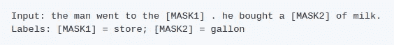
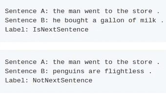
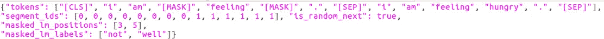

# 微调 Bert 语言模型以获得更好的文本分类结果

> 原文：<https://medium.com/analytics-vidhya/fine-tuning-bert-language-model-to-get-better-results-on-text-classification-3dac5e3c348e?source=collection_archive---------0----------------------->

如果你在这里，你可能听说过伯特。在我们继续之前，让我简单介绍一下伯特。

> BERT(来自转换器的双向编码器表示)是一种基于转换器的学习语言表示的方法。它是一个双向转换器预训练模型，使用两个任务的组合开发，即:**掩蔽语言建模目标**和**下一句预测**在大型语料库上。

它已经在各种 NLP 任务上取得了最先进的结果。我们可以使用 BERT 学习的语言表示来完成我们的任务，例如文本分类等等，以获得我们问题的最新结果。

*注意:我们不会深入技术细节，但如果有人对阅读关于变形金刚的文章感兴趣，* [*这篇*](http://jalammar.github.io/illustrated-transformer/) *博客会非常有帮助。*

我们将看到如何使用 Bert 的语言模型来完成文本分类任务。HuggingFace 的 Pytorch 变形金刚让这变得非常容易。通过 Pytorch-transformers，我们可以使用 Bert 的预训练语言模型进行序列分类。我们还可以微调 Bert 的预训练语言模型以适应我们的任务，然后使用该模型获得一些改进。

在本教程中，我将展示如何微调 Bert 的语言模型，然后如何使用微调的语言模型进行序列分类。我们还将把结果与直接使用预先训练的 Bert 模型进行比较。我们将使用 PyTorch-transformers 和电影评论的数据在 Google Colab 上完成所有这些工作。所有代码都可以在下面的共享 Github 资源库中找到。

# 入门指南

完整代码的实现和解释可在[本](https://github.com/Shivampanwar/Bert-text-classification)回购中找到。

我们经常有大量的未标记数据集，只有少量的已标记数据集。如果我们需要获得准确的分类，我们可以使用在大语料库上训练的预训练模型来获得不错的结果。通常，我们使用在大型语料库上训练的预训练语言模型来获得嵌入，然后主要在其上添加一层或两层神经网络来适应我们手头的任务。这种方法非常有效，直到训练语言模型的数据与我们的数据相似。

如果我们的数据不同于用于预训练的数据，结果将不会令人满意。例如，如果我们有印地语和英语语言的混合数据，并且我们使用在维基百科上训练的预训练模型，这将导致不好的结果。在这种情况下，我们也需要微调我们的语言模型。

正如杰瑞米·霍华德和塞巴斯蒂安·鲁德在[文本分类通用语言模型微调](https://arxiv.org/abs/1801.06146)中所示，微调语言模型可以提高性能。我们通常修改语言模型的最后几层来适应我们的数据。这已经由 Fast.ai 在[微调 FastAI 语言模型](https://docs.fast.ai/text.html#Fine-tuning-a-language-model)中完成并解释。他们已经为 ULMFit 做了大量的工作。我们可以对伯特采用同样的方法。

## 电影评论数据集

让我们收集数据。为了我们的目的，我们将使用 https://www.kaggle.com/c/word2vec-nlp-tutorial/data 的 T4 数据。

该数据集包含 25000 个具有带标签的电影评论的训练示例和 25000 个不带标签的测试示例。我们将在总共有 50000 条评论的组合训练和测试数据上微调我们的语言模型。

本教程将分三步进行:

1 —第一步是在训练和测试数据集上微调我们的语言模型。然后，我们将对训练数据集进行 80:20 分割。

2 —第二步是直接使用预先训练的 Bert 语言模型，在 80%的数据上训练该模型，然后在 20%的数据上进行测试。

3 —第三步与第二步相同，唯一的区别是我们这次将使用微调的语言模型。

# 微调语言模型

我们将使用 PyTorch-transformers 来微调预训练的 Bert 语言模型。它写得很好，有据可查。我们将使用[这个](https://github.com/huggingface/pytorch-transformers/tree/master/examples/lm_finetuning)进行微调。

如上所述，它使用屏蔽语言建模和下一句预测来获得正确的嵌入。在掩蔽语言建模中，它在训练期间掩蔽或隐藏某些单词，并试图预测它们，同时它还试图预测两个句子是否相邻。

**遮罩建模任务**

**下一句预测任务**

对于相同的任务，即掩码建模和下一句预测，Bert 要求训练数据采用特定的格式。这种格式是使用[pregenerate _ training _ data . py](https://github.com/huggingface/pytorch-transformers/blob/master/examples/lm_finetuning/pregenerate_training_data.py)制作的

这个脚本需要一个单一的文件作为输入，由未标记的文本组成，每行一句话，文档之间有一个空行。分割句子的原因是 BERT 训练的一部分涉及下一个句子目标，其中模型必须预测两个文本序列是否是来自同一文档的连续文本。

运行这个脚本将创建一个名为 training 的新目录，其中包含所需格式的训练数据。如果你想在训练前了解 Bert 期望的数据是如何产生的，一定要看看这个目录中的数据格式。训练数据如下所示。

【Bert 所需格式的数据

我们现在将运行 finetune_on_pregenerated.p 来获取微调后的语言模型。至此，我们的**语言模型已经创建完毕。**

微调模型包含五个文件。 **vocab.txt** 文件的全部词汇。 **config.json** '包含你的模型的配置。我们的模型已保存到。“bin”文件。下面是相同的截图。

**微调语言模型**

我们现在将使用这种微调的语言模型和预训练的语言模型，上面有简单的神经网络层，并将比较结果。

# 使用 Bert 模型进行分类

我们的任务是序列分类，我们将使用[这个](https://huggingface.co/pytorch-transformers/model_doc/bert.html#bertforsequenceclassification)来达到我们的目的。这要求我们的句子分别以' **cls'** 和' **sep'** 开始和结束。

我们将首先以这种格式重新格式化我们的评论或文本栏。这样做是因为 Bert 在下一句预测任务中使用了**‘sep’**。然后，我们将使用**bertokenizer**来标记 Bert 格式的文本数据。对于给定的标记或单词，如果在 Bert 的词汇表中找到该标记，tokenizer 将保持该单词不变，否则它将在 Bert 的词汇表中找到小的子单词。我们现在将根据 Bert 的词汇表将令牌转换为单词 id。我们还需要填充序列，使它们具有固定的长度。对于给定的标记化文本，我们还需要区分它是标记还是填充的一部分。这是使用**警示面具完成的。**

现在，我们将把我们的训练数据分成 80:20。我们将在 80%的数据上训练我们的模型，并在 20%的数据上进行测试。Rest 只是简单地按照一个常规的 Pytorch 方法制作数据加载器并训练模型。所有这些都已经在知识库中做了大量的解释。通过使用预先训练的模型，我们在我们的测试数据上获得了接近 90.7 的准确度。对于本教程的最后一步，我们使用了微调的语言模型，并保持所有其他可控参数不变，如学习速率、时期等。在这种情况下，在测试数据上观察到的准确度是 90.9。

这在精确度上是一个微不足道的改进。我们可以看到，有了语言模型，分数提高了 0.15%。看，我们的数据是用英语写的评论，这与训练 Bert 的任务非常相似。如果您的数据与 Bert 预先训练的数据相对不同，您会看到一个显著的结果。例如，如果客户和客户之间有大量使用他们母语的数据，那么这种方法可能会更好。

# 包扎

我们看到了如何微调我们的语言模型。我们还看到了如何使用 PyTorch-transformers 来使用 Bert 进行序列分类。我们还看到了如何使用微调语言模型进行序列分类。

## Github 代码链接

 [## shivampanwar/Bert-文本-分类

### 此时您不能执行该操作。您已使用另一个标签页或窗口登录。您已在另一个选项卡中注销，或者…

github.com](https://github.com/Shivampanwar/Bert-text-classification/blob/master/bert_language_model_with_sequence_classification.ipynb) 

# 参考

 [## 使用 PyTorch 的 BERT 微调教程

### 在本教程中，我将向你展示如何使用 BERT 和 huggingface PyTorch 库来快速有效地…

mccormickml.com](https://mccormickml.com/2019/07/22/BERT-fine-tuning/)  [## 谷歌研究/bert

### 这是几个新模型的发布，是预处理代码改进的结果。在…

github.com](https://github.com/google-research/bert)