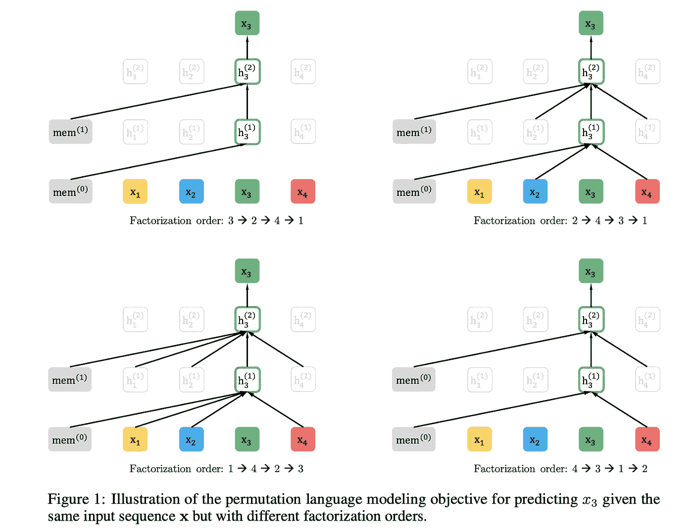
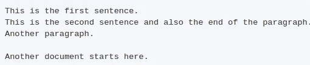

# 微调 XLNet 语言模型以获得更好的文本分类结果

> 原文：<https://medium.com/analytics-vidhya/fine-tuning-xlnet-language-model-to-get-better-results-on-text-classification-8dfb96eb49ab?source=collection_archive---------11----------------------->

如果你在这里，你可能听说过 XLNet。在我们继续之前，让我简单介绍一下 XLNet

**XLNet** *是一种使用广义自回归预训练方法学习语言表示的*方法。它的目标是学习语言模型。已经使用置换语言建模目标在大型语料库上对其进行了训练。

在各种 NLP 任务上已经超过了 BERT。在我的[上一篇文章](/analytics-vidhya/fine-tuning-bert-language-model-to-get-better-results-on-text-classification-3dac5e3c348e)中，我展示了如何微调 BERT 模型以获得更好的准确性。下面我将列出 BERT 和 XLNet 的一些基本区别，然后我们将深入 XLNet 的实现。

XLNet 的架构与 BERT 非常相似。主要区别在于他们的培养目标。BERT 屏蔽数据，并尝试使用双向上下文预测屏蔽的数据，而 XLNet 使用置换目标。顾名思义，在其最简单的形式中，它生成一个句子中所有单词的排列，并试图最大化序列的可能性。

置换语言模型(来自 XLNet 论文)

它已经在各种 NLP 任务上取得了最先进的结果。我们可以使用 XLNet 学习的语言表示来完成我们的任务，例如文本分类等等，以获得关于我们问题的最先进的结果。

*注意:我们不会进入技术细节，但如果有人有兴趣阅读关于变形金刚和 XLNet，* [*这个*](http://jalammar.github.io/illustrated-transformer/) *博客会非常有帮助。*

我们将看到如何使用 XLNet 的语言模型来完成文本分类任务。拥抱脸的变形金刚让这变得非常容易。通过 transformers，我们可以使用 XLNet 预训练语言模型进行序列分类。我们还可以微调/重新训练 XLNet 的预训练语言模型，以适应我们的任务，然后使用该模型获得一些改进。

在本教程中，我将展示如何从检查点重新训练/微调 XLNet 的语言模型，然后如何使用微调后的语言模型进行序列分类。我们将使用 Tensorflow 对模型进行微调。然后，我们将使用我最喜欢的名为 Transformers 的库之一，将微调后的 TensorFlow 模型转换为 Pytorch 模型。然后我们会用变形金刚库做序列分类。我们还将把结果与直接使用预先训练的 XLNet 模型进行比较。这是一个非常实用的强化教程。我用两个 Jupyter 笔记本在 Google Colab 上做了这个。首先，我展示了如何从检查点重新训练您的模型，然后使用 Transformers-cli 将重新训练的模型转换为 Pytorch 模型。在第二个笔记本中，我已经展示了如何使用预训练模型进行序列分类。我们还将比较微调和预训练模型之间的结果。所有代码都可以在下面的共享 Github 资源库中找到。

# 入门指南

整个代码的实现和解释可以在[这个](https://github.com/Shivampanwar/Bert-text-classification) repo 中找到。

我们经常有大量未标记的数据集，只有少量标记的数据集。如果我们需要获得准确的分类，我们可以使用在大语料库上训练的预训练模型来获得不错的结果。通常，我们使用在大型语料库上训练的预训练语言模型来获得嵌入，然后主要在其上添加一层或两层神经网络来适应我们手头的任务。这种方法非常有效，直到训练语言模型的数据与我们的数据相似。

如果我们的数据不同于用于预训练的数据，结果将不会令人满意。例如，如果我们有印地语和英语语言的混合数据，并且我们使用在维基百科上训练的预训练模型，这将导致不好的结果。在这种情况下，我们也需要微调我们的语言模型。

我们可以从给定的检查点重新训练我们的语言模型，或者可以再次训练它。两者都在这个库中展示过。

# 电影评论数据集

让我们收集数据。我们将使用 https://www.kaggle.com/c/word2vec-nlp-tutorial/data[的](https://www.kaggle.com/c/word2vec-nlp-tutorial/data)数据来达到我们的目的。

该数据集包含 25000 个具有带标签的电影评论的训练示例和 25000 个不带标签的测试示例。我们将在总共有 50000 条评论的组合训练和测试数据上微调我们的语言模型。

本教程将分三步进行:

1 —第一步是在组合的训练和测试数据集上微调我们的语言模型。然后，我们将对训练数据集进行 80:20 分割。这个已经在[**Xlnet-fine tuning . ipynb**](https://github.com/Shivampanwar/Bert-text-classification/blob/master/XLNet/Xlnet-finetuning.ipynb)中做了。

2-第二步将使用直接预训练的 XLNet 语言模型，并在 80%的数据上训练该模型，然后在 20%的数据上测试。

3 —第三步与第二步相同，唯一的区别是我们这次将使用微调的语言模型。

第二步和第三步已经在[**xlnet _ experiments . ipynb**](https://github.com/Shivampanwar/Bert-text-classification/blob/master/XLNet/xlnet_experimentation.ipynb)**中做了。**

# 从检查点重新训练语言模型

我们将使用[这个](https://github.com/zihangdai/xlnet)库来重新训练我们的语言模型。我们将首先结合我们的训练和测试数据。我们的组合数据需要写在一个。' txt '文件。该文件需要遵循以下条件:

*   每行都是一个句子。
*   空行表示文档结束。

txt 文件所需的格式

在此之后，我们将需要谷歌的 SentencePieceModel 来标记数据。我们将在上面创建的 txt 文件上训练这个句子片断模型。它修饰了我们的句子。

在训练完我们的句子片段模型后，我们将使用 [data_utils.py](https://github.com/zihangdai/xlnet/blob/master/data_utils.py) 文件将我们的数据转换成 TFrecords 格式。然后我们可以将这些数据输入到我们的模型中。我们将使用 [train_gpu.py](https://github.com/zihangdai/xlnet/blob/master/train_gpu.py) 来训练我们的最终模型。我从检查点模型重新训练了这个模型。检查点是不必要的，如果检查点不存在，那么我们将从头开始预训练我们的新模型。检查点模型是基于 XLNet 的。

在对我们的模型进行微调之后，我使用 transformer-CLI 将这个模型转换成 Pytorch 模型。

完成所有这些需要很多天，并且解决了许多 Github 问题。

# 使用 XLNet 模型进行分类

所有的预处理和代码已经显示在[XLNet-experimental . ipynb](https://github.com/Shivampanwar/Bert-text-classification/blob/master/XLNet/xlnet_experimentation.ipynb)中。我已经试着让这变得尽可能的合理可行。我使用了预训练和微调的语言模型，并试图比较它们的结果。

使用预训练的 XLNet 给出大约 88%的准确度，而使用微调的 XLNet 模型给出大约 87.4%的准确度。使用微调的语言模型有一个可以忽略的下降。其中一个原因可能是我们的数据集与 XLNet 被训练的数据集非常相似。如果我们可以在不同的数据集上尝试，比如印地语-英语混合语言数据集，那么它可以获得显著的改进。

# 包扎

我们看到了如何从给定的检查点重新训练我们的语言模型。我们还看到了如何使用 PyTorch-transformers 来使用 xlnet 进行序列分类。希望你会喜欢它。

# Github 代码链接

 [## shivampanwar/Bert-文本-分类

### 这展示了如何微调 Bert 语言模型并使用 PyTorch-transformers 进行文本分类。这包含…

github.com](https://github.com/Shivampanwar/Bert-text-classification) 

# 参考

 [## 使用 PyTorch 的 XLNet 微调教程

### 在本教程中，我将向您展示如何使用…

mccormickml.com](https://mccormickml.com/2019/09/19/XLNet-fine-tuning/)  [## 紫行代/xlnet

### XLNet 是一种新的无监督语言表示学习方法，它基于一种新的广义置换语言…

github.com](https://github.com/zihangdai/xlnet)  [## 拥抱脸/变形金刚

### 用于 TensorFlow 2.0 和 PyTorch 的最先进的自然语言处理🤗变形金刚(以前称为…

github.com](https://github.com/huggingface/transformers)