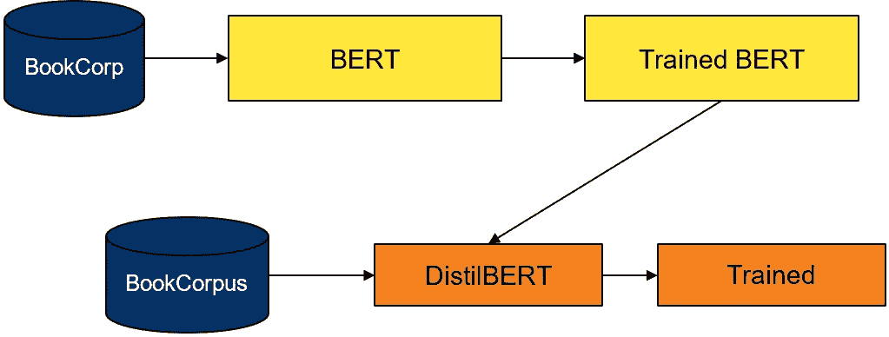

# 用于多标签文本分类任务的微调提取器

> 原文：<https://medium.com/analytics-vidhya/finetune-distilbert-for-multi-label-text-classsification-task-994eb448f94c?source=collection_archive---------5----------------------->

来源—[https://developer . NVIDIA . com/blog/efficient-Bert-finding-your-optimal-model-with-multi metric-Bayesian-optimization-part-1/](https://developer.nvidia.com/blog/efficient-bert-finding-your-optimal-model-with-multimetric-bayesian-optimization-part-1/)

在我的上一篇博文中， [*如何在文本分类任务*](/analytics-vidhya/how-to-fine-tune-bert-on-text-classification-task-723f82786f61)*上微调 bert，我曾经解释过微调 ***BERT*** 用于一个**多类**文本分类任务。在这篇文章中，我将解释如何微调 ***DistilBERT*** 用于**多标签**文本分类任务。我也做了一个 GitHub repo，包含完整的代码，解释如下。您可以访问以下链接…*