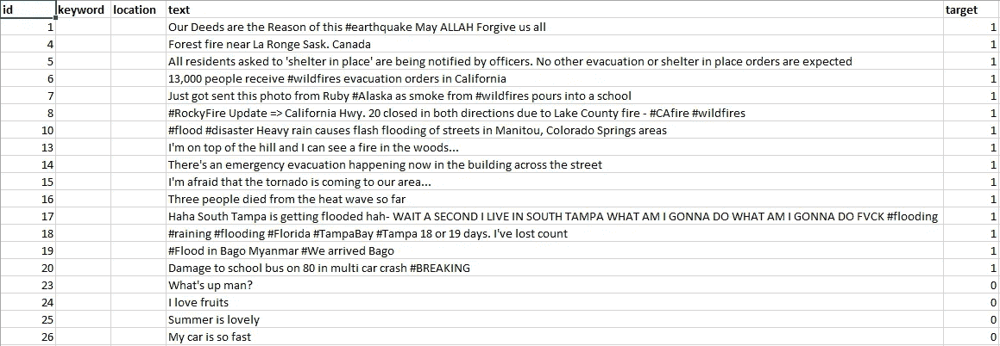
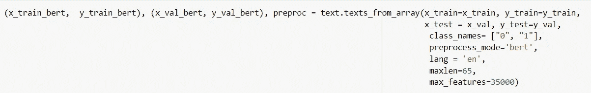
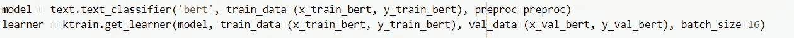
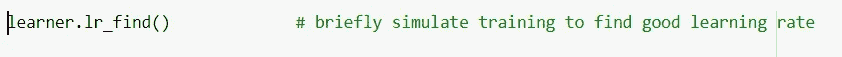
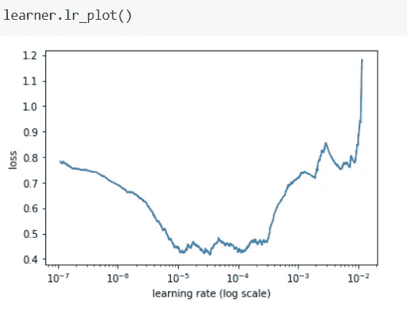
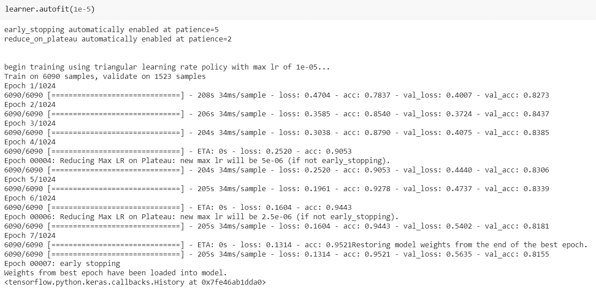
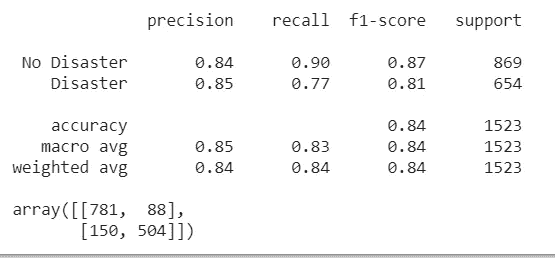
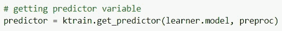
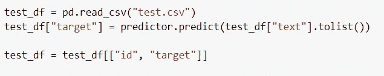
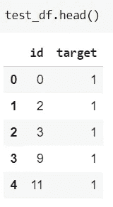

# 使用 ktrain 对灾难推文分类进行微调

> 原文：<https://medium.com/analytics-vidhya/finetuning-bert-using-ktrain-for-disaster-tweets-classification-18f64a50910b?source=collection_archive---------5----------------------->

# 问题陈述

推特已经成为紧急时刻的重要沟通渠道。智能手机的普及使人们能够实时宣布他们正在观察的紧急情况。正因为如此，越来越多的机构对有计划地监控 Twitter 感兴趣(即救灾组织和新闻机构)。然而，识别这样的推文一直是一项艰巨的任务，因为推文的语言结构模糊不清，因此并不总是清楚个人的话是否实际上在宣布一场灾难。例如，如果一个人发推文:

> "从好的方面来看，昨晚的天空是**闪亮的**"


这个人在这里明确地使用了“**闪亮的**”这个词，但它是隐喻性的。对于一个人来说，更容易理解它，特别是如果有一些视觉帮助的话。然而，对于机器来说，这并不总是清楚的。

Kaggle 举办了一场名为**真实与否**的挑战，其目的是使用最初由 figure-figure 公司创建的灾难推文的 Twitter 数据，将谈论真实灾难的推文与隐喻性谈论灾难的推文进行分类。

# 方法

BERT ( [来自变形金刚](https://arxiv.org/abs/1810.04805)的双向编码器表示)是谷歌开发的深度学习模型。自从它被 Google 开源以来，它已经被许多研究人员和行业采用，并应用于解决许多 NLP 任务。该模型已经能够在它所应用的大多数问题上实现最先进的性能。

[*ktrain*](https://github.com/amaiya/ktrain) 是深度学习库 [TensorFlow Keras](https://www.tensorflow.org/guide/keras/overview) (以及其他库)的轻量级包装器，用于帮助构建、训练和部署神经网络和其他机器学习模型。受 ML 框架扩展如 *fastai* 和 *ludwig* 的启发，它旨在使深度学习和人工智能更容易获得，更容易应用于新人和有经验的从业者。

*ktrain* 为在自然语言处理领域应用许多预先训练好的深度学习架构提供支持，BERT 就是其中之一。为了解决这个问题，我们将使用由 *ktrain* 提供的预训练 BERT 的实现，并对其进行微调，以分类灾难推文是否真实。

# 解决办法

数据集由三个文件组成:

1.  train.csv
2.  test.csv
3.  sample_submission.csv

文件 train.csv 的结构如下:



*   `id` -每条推文的唯一标识符
*   `text` -推文的文本
*   `location` -发送推文的位置(可能为空)
*   `keyword` -推文中的特定关键词(可能为空)
*   `target` -仅在 train.csv 中，这表示一条推文是否是关于真实的灾难(`1`)或不是(`0`)

我们只对**文本**和**目标**栏感兴趣，并将使用它们对推文进行分类。

## 步骤 1:安装 ktrain

```
!pip3 install ktrain
```

## 步骤 2:导入模块并读取培训文件

```
import ktrain
from ktrain import text
import pandas as pd
from sklearn.model_selection import train_test_split
```

我们将读取训练文件，并对**目标**列执行分层拆分，并将 20%的数据定义为验证集。

```
train_df = pd.read_csv("train.csv")random_seed = 12342x_train, x_val, y_train, y_val = train_test_split(train_df['text'], train_df['target'], shuffle=True, test_size = 0.2, random_state=random_seed, stratify=train_df['target'])
```

## 步骤 3:将数据转换为 BERT 的要素

*ktrain* 提供了一个非常方便的功能，可以直接将文本数据转换成模型所需的特征。所有的文本预处理步骤都不需要手动执行，将由库本身负责。因为我们将从 pandas 系列对象中读取数据，所以我们将使用函数`texts_from_array`。



该函数自动下载预先训练好的 BERT 及其词汇。因为对于伯特来说，文本必须以特定的方式进行预处理，所以我们必须将`preprocess_mode` 指定为“**伯特**”。

## 步骤 3:将 Bert 加载到学习者对象中



第一个函数`text_classifier`用随机初始化的最终**密集层**加载预训练的 BERT 模型。值得一提的是，虽然最终的**密集层**是随机初始化的，但在训练过程中不会只有一个被更新。因为我们没有冻结任何层，并且模型的所有层都是可训练的，所以模型的所有层的权重将在反向传播期间更新。

第二个函数`get_learner`创建一个带有训练和验证数据的学习器对象，可用于微调分类器。`get_learner`的最后一个参数是**批量**。我们使用 16 个小批量。

## 步骤 4:训练(微调 BERT 分类器)



为了训练模型，我们将首先找到最适合我们问题的最佳学习率。 *ktrain* 提供了一个非常好的方法，名为`lr_find`，它以不同的学习速率训练模型，并绘制出模型随着学习速率增加的损失。

可以通过调用以下方法来观察学习率图:



我们可以观察到，当学习率为 1e-5 时，分类器提供最小的损失。

我们现在将使用`autofit`方法训练模型。该方法训练分类器并自动选择最佳表现的分类器，防止模型的欠拟合和过拟合。



我们能够实现 **84%** 的验证准确性，并且每个预测类都有很好的 F-1 分数。由于我们使用了`autofit`方法，我们确信我们的模型已经训练好，现在可以根据测试数据给出预测了。

## 步骤 5:根据测试数据进行预测



预测变量是通过在`get_predictor`方法中传递**模型**和 **preproc** 对象获得的。然后，该预测器可用于直接对测试数据进行预测。



## 步骤 6:在 Kaggle 上上传测试数据预测

最后一步是在 Kaggle 上上传预测，并检查我们的分数。


我们能够在测试集上达到 83.4%的准确率。相当令人印象深刻！！

完整的代码可以从我的 [Github](https://github.com/hamiz-ahmed/Machine-Learning-Notebooks/blob/master/disaster_tweets_classification_using_BERT.ipynb) 账号获得。

# 结论

我们使用了 *ktrain* 的特性来解决 Kaggle 挑战——不管是真是假。我们发现使用 *ktrain 在任何问题域中实现像 BERT 这样的复杂模型是多么容易。*最终，我们能够实现 83%左右的测试准确率。

# 丰富

伯特的一个主要问题是它需要很长时间的训练。为了迎合这一点，可以应用 BERT 的一个较轻的变体，如 [distilBERT](https://arxiv.org/abs/1910.01108) ，可以试用它来解决这个问题。此外，为了减少训练时间，可以冻结除最后一层之外的所有层的权重。然而，这种方法的性能还需要测试。

此外，人们还可以尝试不同的具有预训练单词嵌入的深度神经架构，并测试它们在这个问题上的性能。

# 参考文献和致谢

*   *ktrain* github 回购—[https://github.com/amaiya/ktrain](https://github.com/amaiya/ktrain)
*   用于语言理解的深度双向转换器的 BERT 预训练—【https://arxiv.org/abs/1810.04805 
*   卡格尔是真的还是假的？灾难推文 NLP—[https://www.kaggle.com/c/nlp-getting-started/overview](https://www.kaggle.com/c/nlp-getting-started/overview)
*   本项目 Github 笔记本—[https://github . com/hamiz-Ahmed/Machine-Learning-Notebooks/blob/master/disaster _ tweets _ classification . ipynb](https://github.com/hamiz-ahmed/Machine-Learning-Notebooks/blob/master/disaster_tweets_classification.ipynb)