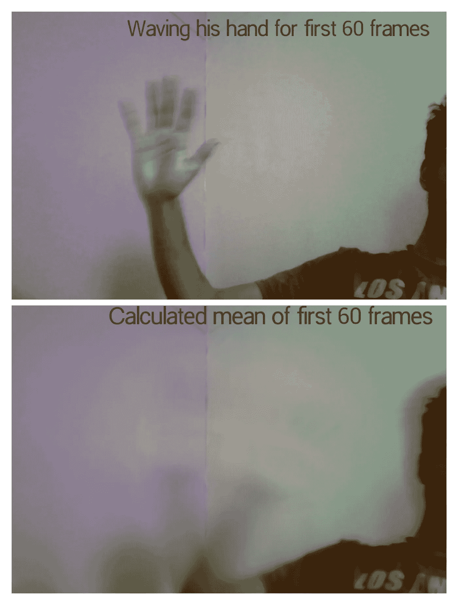

# 使用 Opencv python 的手检测和手指计数人工智能

> 原文：<https://medium.com/analytics-vidhya/finger-count-ai-using-opencv-python-b9090eb68928?source=collection_archive---------3----------------------->

## [**里面的艾**](https://medium.com/towards-data-science/inside-ai/home)

## 我如何从头开始构建实时手指计数模型

# 简介:

嘿你！如果你是 ***计算机视觉*** 的新生家庭成员，想要进化和了解一些很酷的 opencv 工具和东西。在本文中，我们将从零开始，使用 python 对 opencv 的手指计数项目进行全面的理解和实现。

> 该项目的代码可以在我的 [Github](https://github.com/Adk2001tech/OpenCV-/blob/master/finger_count.py) 找到
> 
> opencv python 的基础也可以在我的 [Github](https://github.com/Adk2001tech/OpenCV-) 获得

为了更好地理解，我将这个过程分解为以下几个步骤:

**步骤 1** :设置平均值。感兴趣区域的背景值。

**步骤 2** :对输入 ROI 的手应用模糊和阈值处理，以找到轮廓。

**第三步**:使用被称为*凸包*的技术沿着多边形的顶点( *x，y* )抓取多边形。

**第四步**:用数学方法计算举起的手指的数量。稍后我会解释数学相关的东西。

第五步:把所有的东西放在一起，建造我们的项目

# **第一步**:

在计算机视觉项目中，我们更关心我们感兴趣的图像或视频中的对象。背景不应该制造噪音或分散我们的机器给出错误和意想不到的结果。在这个项目中，我们只关心我们的手进入投资回报率。为了分割出我们的手，我们将把除了我们的手以外的所有像素都变成 0(零)。这可以通过服用 abs 来实现。我们计算的平均值的差异。当前帧/图像的背景图像。

在上面的代码中，我们首先使用***cv2 . select ROI(image)****w*抓取单个帧来选择我们的 ROI，它返回我们的 ROI 的 *x，y，宽度，高度*。然后，对于接下来的 60 帧，我们将*的每个像素修改回*以成为每个帧的加权平均值。这可以使用***cv2 . accumulate weighted()，*** 来完成，它采用的参数有*当前帧、背景帧(后退)、学习速率。*

# 第二部分:

这部分处理图像预处理。由于我们的手现在被分割，我们应该应用模糊和阈值。这样做，我们现在可以很容易地找到手的边界。

在得到背景图像( *back* 之后，我们必须应用***cv2 . convertscaleabs()***它一般会缩放，计算绝对值，并将结果转换为 8 位。然后将背景图像( *back* )和当前帧转换成灰度图像。取灰度图像的绝对差值。使用***cv2 . threshold(****image，min_thresh，max_thresh，method_of_thresholding* 应用阈值处理。 ***)。*** 现在我们的形象被提督得其外部轮廓。它返回轮廓(边界的点(坐标)列表)，它们的层次结构。取那些覆盖最大面积的点的列表(可能是我们手段的边界坐标)。我正在创建一个 *img 的副本，你将在下一步得到它(这只是为了*可视化的目的。 *)*

# 第三部分:

凸包通过连接帧中大多数外部点周围的点来绘制多边形。首先，我们将计算最极端的点(顶部、底部、左侧和右侧)。然后我们可以计算它们的交点，那一定是我们手的中心。接下来，我们将计算距离计算中心最远的点的距离。然后使用该距离的某个比例(取决于手与手的比例),我们创建一个圆。圆圈外的任何一点，离底部足够远，都应该伸出手指。要了解这背后的更多数学知识，请查看[和](https://books.google.co.in/books?id=vkNfw8SsU3oC&pg=PA707&lpg=PA707&dq=counting+finger+with+a+circle+of+radii+from+center+of+hand+to+exterme+finger+point&source=bl&ots=2Jfk-6ipz5&sig=ACfU3U1nLEbtKG5Ql0AY9sC5OJsJ3uT8eQ&hl=en&sa=X&ved=2ahUKEwjMoJW90MzpAhUBOSsKHfZfB1UQ6AEwAHoECAkQAQ#v=onepage&q=counting%20finger%20with%20a%20circle%20of%20radii%20from%20center%20of%20hand%20to%20exterme%20finger%20point&f=false)。

在这段代码中，首先调用一个函数***cv2 . convex hull(contour)***和将其赋给一个变量名*conv _ 赫尔。*然后我们抓住最极端的点(*上、下、左、右*)。这只是一个简单的坐标几何。借助此点，抓住手中心( *cx，cy* )。现在我们可以估计半径的值( *radi* )。然后创建与所有零值像素的 *img* 形状相同的 *circular_roi* 。在上面画一个我们想要的半径的圆。然后在 *img2* 和 c*circular _ ROI*之间做***bitwise _ and()***运算，存储为 *mask* 。

# 第四部分:

现在是数数的时候了。为此，我们首先再次抓取*蒙版*图像的轮廓，找到边界框的坐标，并在每个框上应用一些条件，以计数它是手指或手腕还是其他东西的轮廓。

如上图。我们捕捉轮廓。做了一个名为*的圆周变量。*然后，我们对轮廓*找到的每个边界框/矩形进行循环。*计算其方向( *m_x，m_y，m_w，m_h* )，然后对其应用两个条件。即*out _ 腕力 _ 范围*和*极限 _pts。*我们希望确保轮廓区域不在手部底部，如果此人在 *ROI* 中有很多手臂，我们可能会在底部得到一些轮廓点，但对我们没有用处。我们可以通过简单的数学来避免这种情况。我们可以说离手中心很远的盒子一定是我们手臂的轮廓，我们可以忽略它。因此，中心以上 25%的有界框是手指凸起的一部分。我们可以确定的第二个条件是沿着轮廓的点数不超过圆形 *ROI* 周长的 25%。这是因为机器可以计算中心以上的某些点，但不能计算手指的点。这可能是因为一些噪声，一些外部轮廓可能会弹出。所以我们为此定义了一些限制( *limit_pts* )。

# 第五部分:

是时候把我们到目前为止所学的东西结合起来了。

在上面的代码中，我们抓取第一帧来选择我们的 *ROI* 。有了我们的 *ROI* 之后，我们计算加权平均值。前 60 帧，然后在每次迭代中获取背景图像和当前帧的绝对差值，同时从网络摄像头读取，并将其分配给新变量( *img* )。取灰度阈值 *img* 。稍后，我们通过先找到轮廓，使用*转换外壳*功能找到多边形的极值点(坐标)。跟踪这些点的交点，我们得到手的中心点。在阈值图像和具有某些半径的圆的 *circular_roi* 之间应用 *bitwise_and()* 运算。如果手的尺寸小，半径就小，反之亦然。再次抓取轮廓框，并应用条件来计算举起的手指。出于可视化目的，我们在 *cap* 对象正在读取的帧上标记所选 *ROI* 的矩形。我们还展示了*遮罩*和*加权*图像，以重新检查我们的逻辑和代码是否正常工作。

最终输出应该是这样的。希望你喜欢这个项目。

