# Firebase 和 DialogFlow 与 React Native 使之变得简单(第 3 部分)

> 原文：<https://medium.com/analytics-vidhya/firebase-and-dialogflow-with-react-native-made-easy-part-3-5bc42793b164?source=collection_archive---------8----------------------->

## 如何在 react 本地应用程序中使用 DialogFlow 实现


使用 React Native 的对话流

你好，了不起的开发者们！欢迎回到“轻松使用 React Native 的 DialogFlow 和 Firebase”系列教程的最后一部分。如果你错过了最后两部分，我强烈建议你先从 [*这里*](/@ritikjain1272/firebase-and-dialogflow-with-react-native-made-easy-301891afc4fb) 看看。

因此，在本教程中，我们将制作一个个人储蓄跟踪应用程序。我们将制作一个聊天机器人，通过它我们可以增加或减少储蓄，只需告诉聊天机器人说“增加 500 到储蓄”或“从储蓄中删除 200”。我们也可以让聊天机器人告诉我们当前的储蓄余额。我知道这个想法很简单，但是对于我们学习的目的来说，这就足够了。

我们将使用 Firebase 来存储节省数据和 DialogFlow 实现，以便在添加/删除余额时从给聊天机器人的消息中获取节省的金额，然后相应地从 Firebase 添加/删除余额。所以让我们开始吧。

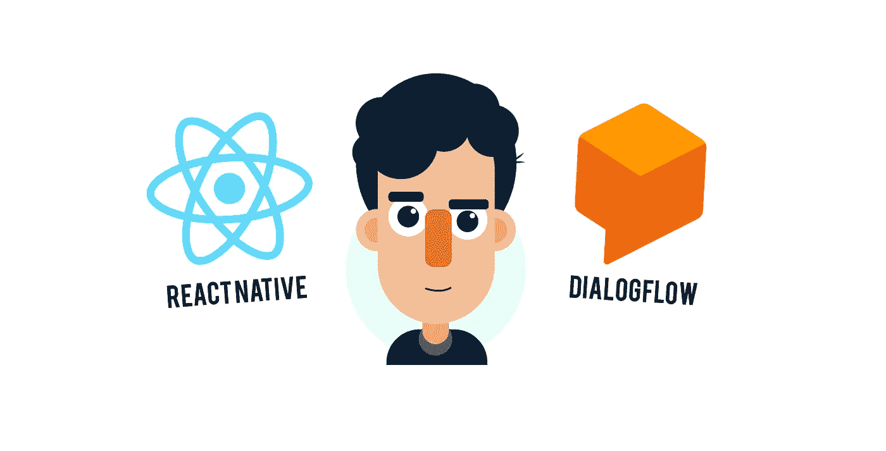

首先，我们需要在 DialogFlow 上做一个帐户。所以去 [*的官方网站 DialogFlow*](https://dialogflow.com/) 用你的谷歌账号注册吧。登录后，您会看到如下窗口:

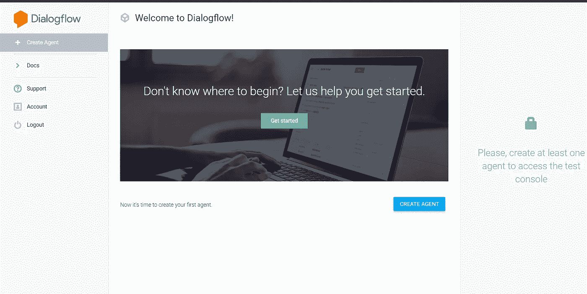

这里我们将创建一个对话流意图。但首先什么是“意图”？**意图**是用户可以通过使用 Dialogflow 控制台中定义的术语之一来调用的特定操作。例如，如果用户问“今天天气如何？”因此，intent 将尝试识别该语句，并根据为该特定 intent 的操作预定义的内容调用操作。这里调用的动作可以像“今天天气晴朗”。

因此，对于我们的应用程序，我们将定义三个意图。第一个目的是为了当前的余额。第二个目的是**增加节约**。第三个意图是**从储蓄中移除余额**。

但是在创建一个意图之前，我们需要创建一个包含我们所有三个意图的代理。所以点击**创建代理。**我给代理取名为“ChatApp ”,但你可以选择任何名字。点击**创建**按钮。

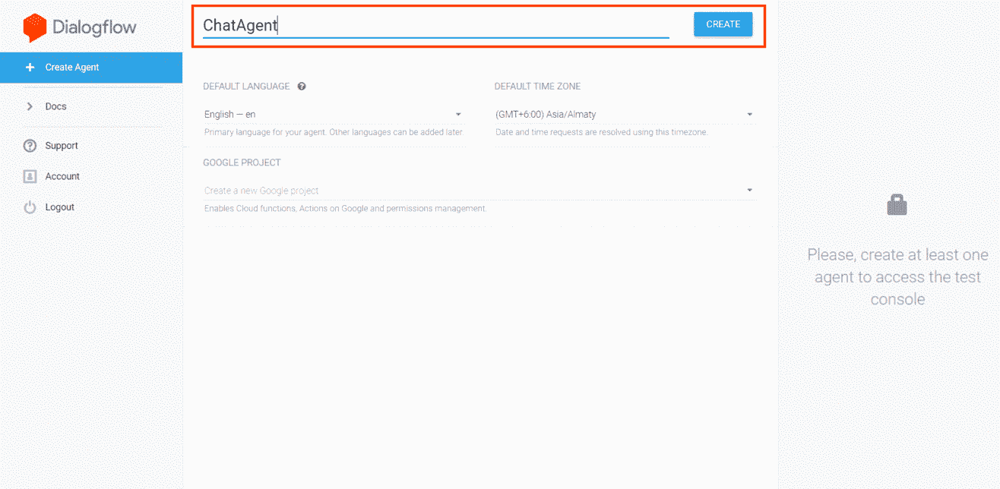

我们的第一个经纪人

因此，我们的第一个代理被创建。现在我们将创建一个意图。因此，在 DialogFlow 的侧面导航菜单中，单击 intents，然后单击**创建意图**按钮**。**

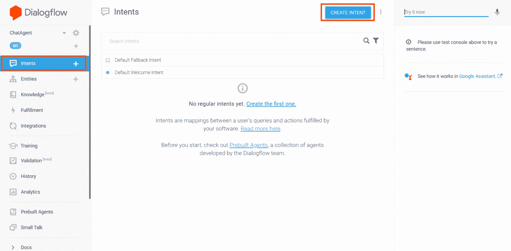

创建意图

我们将创建的第一个意图是显示我们当前的储蓄余额。我们将把这个意图命名为**‘read savings’**:

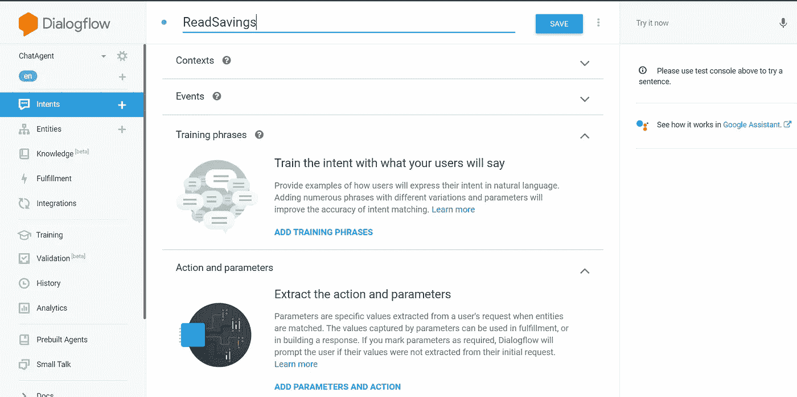

目的

点击**保存**按钮，瞧，我们的第一个意图产生了。现在，我们需要给我们的意图一些 T **雨短语**。训练阶段基本上是用户可能对我们的聊天机器人说的话，以显示当前的节省。例如，用户可能会问“我当前的存款余额是多少？”。所以点击**添加训练短语**并添加一些短语:

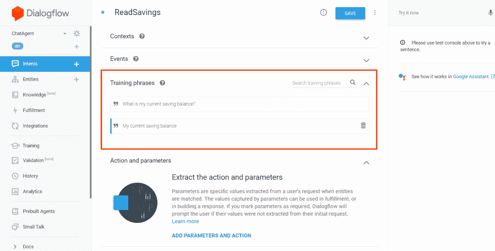

DialogFlow 将基于用户可能对我们的代理说的给定训练短语创建更多可能的短语。这就是预先训练好的 Dialogflow 的 NLP 模型的威力。

所以我们首先创建了一个代理，然后我们的意图。现在，当 intent 发现用户要求当前余额时，它必须调用一个动作。当前余额数据将从 Firebase 中获取。但是，为了通过我们的代理从 Firebase 读取数据，我们需要启用 webhook，以便允许在 Firebase 上进行读写操作。因此，只需向下滚动，在履行副标题下，单击**为此目的启用 webhook 调用。**

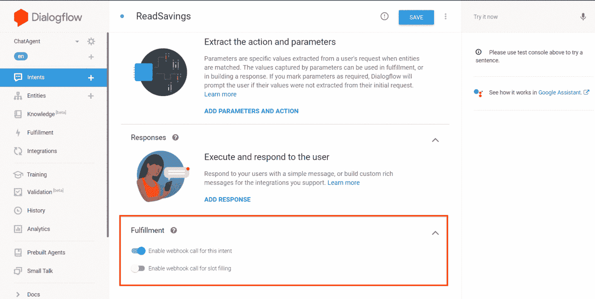

启用 Webhook

现在，为了从我们的数据库中读取节省，我们将使用**dialog flow fulfillment**，这将基本上向我们的 webhook 服务发送一个请求，在我们的示例中，该服务将是 **Firebase** 以从中获取和更改数据**。**因此，从侧面导航栏转到履行。

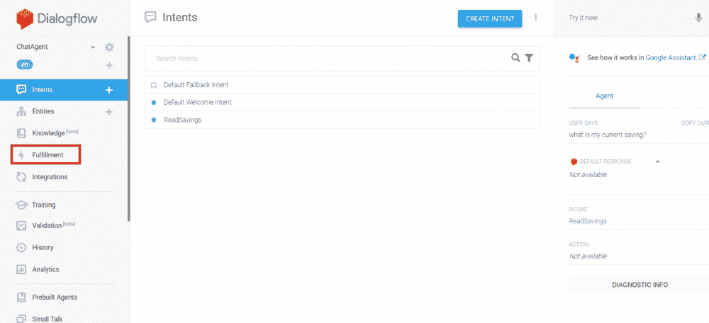

在 fulfillment 下，您将看到一个内嵌编辑器(默认情况下禁用)。启用它。我们在这个编辑器中编写代码，向 webhook 客户端发送请求。

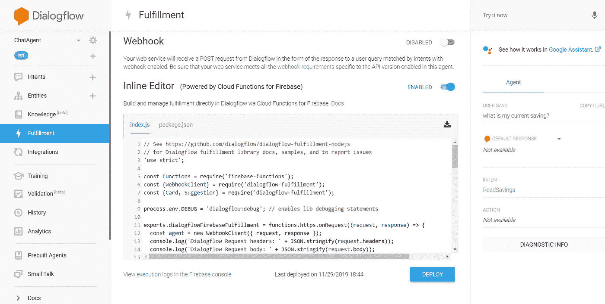

因此，在行内编辑器中删除所有内容，并编写以下代码:

```
'use strict';

const functions = require('firebase-functions');
const admin = require('firebase-admin');
const {WebhookClient} = require('dialogflow-fulfillment');
const {Card, Suggestion} = require('dialogflow-fulfillment');

admin.initializeApp({
 credential: admin.credential.applicationDefault(),
   databaseURL:'ws://**your_project_name**.firebaseio.com/' 
**// In the databaseURL give your own firebase url**
});process.env.DEBUG = 'dialogflow:debug'; // enables lib debugging statements

exports.dialogflowFirebaseFulfillment = functions.https.onRequest((request, response) => {
  const agent = new WebhookClient({ request, response });
  console.log('Dialogflow Request headers: ' + JSON.stringify(request.headers));
  console.log('Dialogflow Request body: ' + JSON.stringify(request.body));

  function welcome(agent) {
    agent.add(`Welcome to my agent!`);
  }

  function fallback(agent) {
    agent.add(`I didn't understand`);
    agent.add(`I'm sorry, can you try again?`);
  }

  function ReadSavings(agent){
  return admin.database().ref('**firbase-project-name**').once('value', snapshot => {
     const value = snapshot.val().notes;
        if(value !== null){
         agent.add(`Your current saving balance is ${value}`);
        }
      else{
       agent.add("Oops! It seems that no value has been returned from the database");
      }
    });
  }

  // Run the proper function handler based on the matched Dialogflow intent name
  let intentMap = new Map();
  intentMap.set('Default Welcome Intent', welcome);
  intentMap.set('Default Fallback Intent', fallback);
  intentMap.set('ReadSavings', ReadSavings);
  agent.handleRequest(intentMap);
});
```

所以这似乎是一个相当复杂的权利。我们来分解一下。因此，基于用户对我们的聊天机器人说的话，代理将其执行的动作归类为以下意图之一——首先是**回退意图**,当它无法识别用户打算做什么时。第二个是**欢迎意图**，其中对话流理解用户正在说问候词，如“嗨”或“你好”。所以，在这种情况下，我们的聊天机器人回复给用户问候。所以后退和欢迎是 firebase 的默认意图。我们创建的第三个意图是 **ReadSavings** ，它将向 firebase 发送一个请求，从其中读取数据，然后显示给用户。所以你可以看到，我们有三个功能来执行一个动作。

在前几行代码中，我们导入了 firebase 依赖项和 Dialogflow 依赖项，因为我们要在 firebase 上发出请求。然后是默认的后退和欢迎动作。

然后，我们定义了要在读取保存意图中执行的操作。所以基本上我们需要在 ReadSaving 意图下从数据库中获取数据。为此，我们使用了 firebase 预定义的函数。需要注意的一点是，您需要添加 firebase 项目名称，以便代理知道它必须在上面代码中提到的 **"databaseURL"** 中向哪个项目发出请求。你可以转到 firebase 的数据库选项卡，在那里选择“实时数据库”。例如:

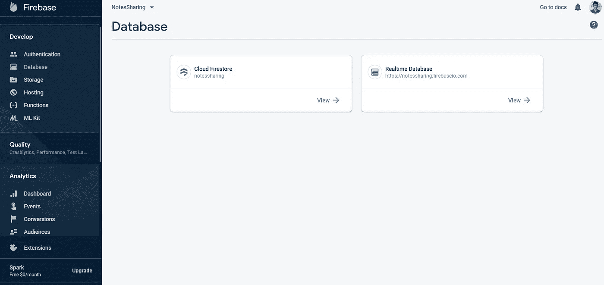

一旦代理捕获了值，它就像上面代码中的 agent.add 方法中提到的那样用 balance 来回复用户。让我们看看它是如何工作的。但在此之前，我们需要首先对 react 本机应用程序进行更改，添加一些 Dialogflow 的配置。为了添加配置，我们需要下载 Dialogflow 提供的 JSON 文件。

所以首先去设置(你的项目名称旁边的齿轮)。在设置中，点击**服务账号**旁边的链接。它会将你重定向到谷歌云平台。

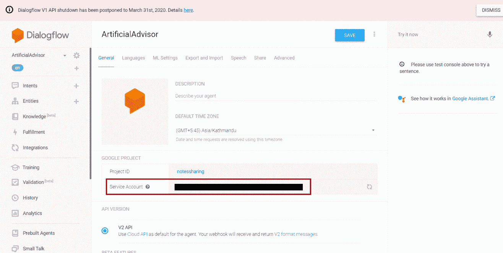

找到你的项目链接，点击 ACtions 下的三点图标，点击' **create key'** ，下载 **JSON 格式的文件**。这个文件包含我们项目的配置文件。

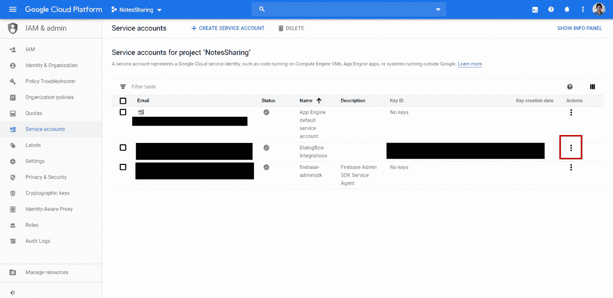

创建一个. env 文件，并像这样导出 JSON 数据的配置:

```
export const dialogflowConfig = {"type": "service_account",
"project_id": "your project id here",
"private_key_id": "your project key id here",
"private_key": "YOUR PRIVATE KEY",
"client_email": "your client_email here",
"client_id": "your client_id here",
"auth_uri": "your auth_uri here",
"token_uri": "your token_uri here",
"auth_provider_x509_cert_url":"Your auth_provider_x509_cert_url here",
"client_x509_cert_url": " your client_x509_cert_url here"
}
```

此外，我们需要为 react-native 安装 DialogFlow 依赖项。所以打开你的终端，写下:

```
npm install --save react-native-dialogflow
```

现在，在 Home.js 文件中添加以下代码。首先，添加以下导入。

```
import { Dialogflow_V2 } from 'react-native-dialogflow';
import { dialogflowConfig } from './env'; // env file that we created earlier
```

现在我们将加载我们的配置文件。所以我们将使用 componentDidMount 函数。在函数中写入以下代码行:

```
componentDidMount() {
Dialogflow_V2.setConfiguration(
dialogflowConfig.client_email,
dialogflowConfig.private_key,
Dialogflow_V2.LANG_ENGLISH_US,
dialogflowConfig.project_id
);}
```

现在，在我们之前创建的 onSend 函数中，我们将向 Dialogflow 发送用户消息，并接收来自 Dialogflow 的响应，然后将它显示给用户。为此:

```
onSend(messages = []) {
this.setState(previousState => ({
messages: GiftedChat.append(previousState.messages, messages)
}));let new_message = messages[0].text; //Latest msg entered by user*// This function sends message to the DialogFlow agent.*Dialogflow_V2.requestQuery(
message,
result => this.DialogFlowAgentResponse(result),
error => console.log(error)
);}// Response from Dialogflow
DialogFlowAgentResponse(result) {
let text = result.queryResult.fulfillmentMessages[0].text.text[0];
this.reply(text); //
}*// This function will display the response*
reply(text) {
let msg = {
_id: this.state.messages.length + 1,
text,
createdAt: new Date(),
user: BOT_USER
};this.setState(currentState => ({
messages: GiftedChat.append(currentState.messages, [msg])
}));}
```

这相当于获取用户查询来读取数据库，然后显示给用户。我们去看看。

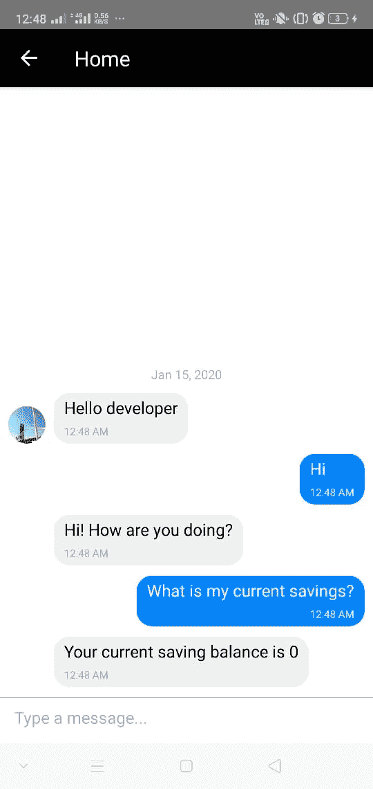

相当牛逼！啊？

现在，为了添加和删除节省，我只需要定义两个函数，看起来有点像(例如，添加节省) :

```
function AddSavings(agent){
   const text = agent.parameters.text;
    let total_savings;

    return admin.database().ref('notes').once('value', snapshot => {
     var current_savings = snapshot.val().notes;
        total_savings = parseInt(current_savings) + parseInt(text);
         admin.database().ref('notes').set({
          notes: total_savings,
     });
    });
  }
```

我认为，为了很好地掌握内容，你应该在此基础上建立一些东西。所以我把 AddSavings 和 RemoveSavings 留给你们。你需要做一点研究，如何从用户身上获取价值，并传递给代理商。但我想这很容易做到，完成任务后，你也会有一种成就感，这种成就感真的会推动我们在生活中前进。

这就是我的三部分系列教程“React-native with dialog flow easy”的结尾。我希望你喜欢它。如果你有任何疑问，请在评论中提问，如果你想看这个项目，我有这个项目的 Github 链接，我也实现了费用的可视化图表。

> [https://github.com/Rits1272/ArtificialAdvisor](https://github.com/Rits1272/ArtificialAdvisor)

最后，如果你的代码崩溃了，不要担心，就像一个可怜的程序员说的:

> 只要有代码，就会有 bug。关键是你需要在 bug 找到你之前从 bug 中找到有用的代码(我想这就是我；) )

以最重要的**分号**、**Adios 结束这篇文章；**