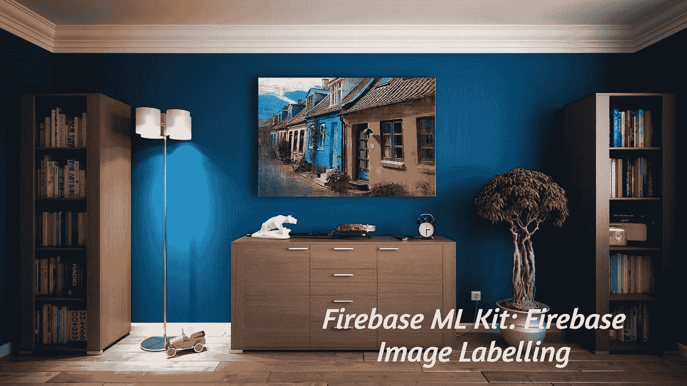

# Firebase 图像标记:提取对象，并使用 Firebase Cloud API ML 模型对其进行标记。

> 原文：<https://medium.com/analytics-vidhya/firebase-image-labelling-extract-objects-and-label-it-using-firebase-cloud-api-ml-model-f2817f3b529a?source=collection_archive---------24----------------------->

礼貌: [Pixabay](https://www.pexels.com/@pixabay)

在这篇博客中，我们将使用 Firebase ML kit 讨论 Android 中基于云的图像标记。我之前解释了如何从图像中提取对象，并使用设备上的 ML 工具包模型进行分类。图像标记可以被认为是对象检测的扩展版本。唯一的区别是，它不是在设备上发生的，而是依赖于 Firebase 的云 API 来标记图像中的对象。

只是强调一下，要使用 Firebase 云 API，你必须将你的 Firebase 项目转换为 blaze plan。它每月给你大约 1000 次免费点击，如果你想在生产应用程序上实现它，请查看适合你的使用的定价计划。

要使用 ML 试剂盒进行图像标记，请遵循以下步骤

1.  获取项目的云火焰计划。
2.  拍摄照片并转换成 firebase vision 图像，如下文博客所示。
3.  创建一个 *cloudImageLabeller* 探测器，并将图像传递给探测器。
4.  在 success 方法中检索图像的细节。

## 获取项目的云火焰计划。

Firebase 中可用的计划

一旦该项目转化为 blaze 计划

## 拍摄照片并转换成 Firebase vision 图像，如下文博客所示。

 [## Firebase 对象检测和标记:从图像或视频中检测对象并进行分类。

### firebase 给开发者的下一个有用的特性是对象检测。这个 API 的实现…

medium.com](/@sreedev.r5/firebase-object-detection-and-labelling-detect-objects-and-categorize-from-images-or-videos-8fc34f5ad578) 

要获取相机图像，请使用返回到 onActivityResult 的位图启动相机。以上链接的第一部分解释了如何使用默认意图生成相机图像。

## 创建一个 *cloudImageLabeller* 探测器，并将图像传递给探测器。

从生成的相机位图中创建一个 firebase vision 图像，该 firebase vision 图像应传递给云图像检测器。初始化检测器时，检测器应为 cloudImageLabeler 类型。ML kit 检测器不会将默认位图作为输入，因此创建 firebase vision 图像是不可避免的。

## 在 success 方法中检索图像的细节。

一旦云 API 检测到图像中的所有标签，标签列表将返回给 *onSuccessListener* 。

云图像标签器与设备上的物体检测非常不同。使用云 API 有自己的优势。除了分类和只知道物体的类别之外；还可以使用云 API 来检索名称、置信度和实体 id。在您的项目中激活 blaze 帐户也是强制性的，否则，它将最终得到一个错误。

这就是如何将图像标签集成到您的应用程序中，最后，请查看此[链接](https://developers.google.com/knowledge-graph/)以探索和了解更多关于云 API 中可用标签的信息。

你可以在 Github 这里找到整个项目 [***。这是一个公共回购，其中有许多演示项目。你可以使用***](https://github.com/Sreedev/androidappsamples/tree/master/firebaseIntegrations)***[***GitZip***](http://kinolien.github.io/gitzip/)从这个 repo 中下载一个具体的项目。将此 [***链接***](https://github.com/Sreedev/androidappsamples/tree/master/firebaseIntegrations)*粘贴在[***GitZip***](http://kinolien.github.io/gitzip/)中就可以了。****

> **跟我上* [*推特*](https://twitter.com/Sreedevr5) *和* [*中*](/@sreedev.r5) *。随意投稿*[***Repo—AndroidAppSamples***](https://github.com/Sreedev/androidappsamples)***。*** *让我们一起成长💚**