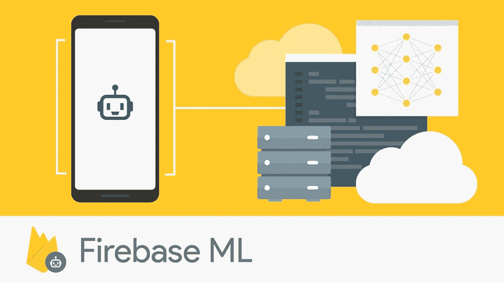
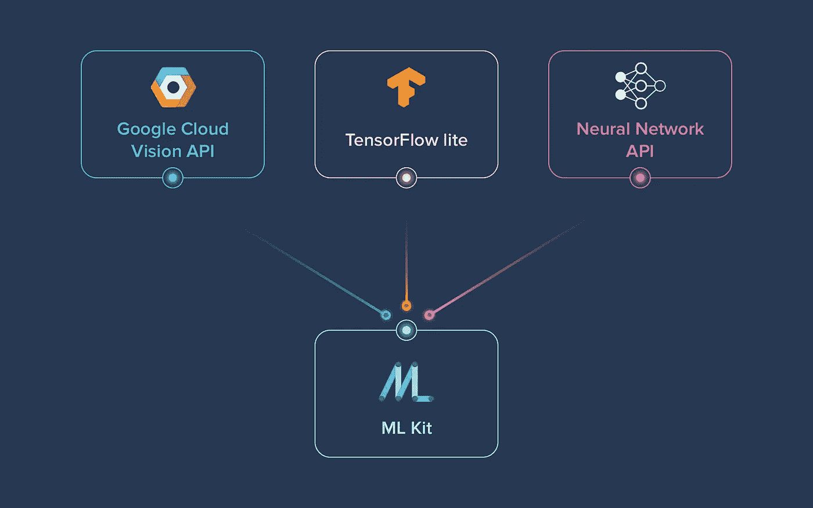
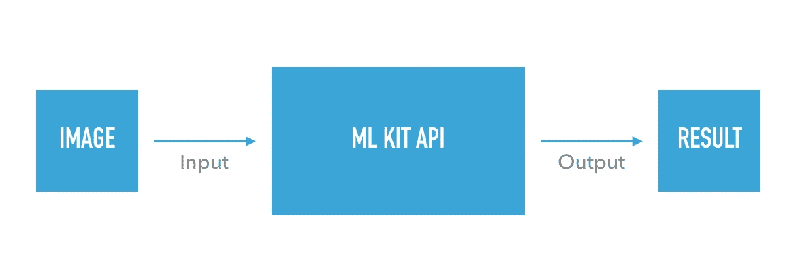

# Firebase 机器学习

> 原文：<https://medium.com/analytics-vidhya/firebase-machine-learning-3b835f40b16f?source=collection_archive---------19----------------------->

图片来自 fireabse.google.com

在两年前的谷歌 I/O 2018 之前，谷歌已经在 Firebase 中引入了新功能。他们将 Firebase ML Kit 作为测试版介绍给移动开发者，这样他们就可以在他们的应用中使用 ML Kit 来解决现实世界中的问题。在这篇文章中，我希望分享一些关于 Firebase ML 套件的惊人特性。让我们开始吧。

图片来自 gifsec.com

Firebase ML Kit 由 Google ML technologies 制作，如 [Google Cloud Vision API](https://cloud.google.com/vision/?authuser=0) 、 [TensorFlow Lite](https://www.tensorflow.org/mobile/tflite/?authuser=0) 和 [Android 神经网络 API](https://developer.android.com/ndk/guides/neuralnetworks/?authuser=0) 。他们将所有的技术整合到一个 SDK 中。

ML 试剂盒的处理在设备上进行。这使得它更快，并解锁实时用例，如处理相机输入。它也可以在离线时工作，并可用于处理需要保留在设备上的图像和文本。结合最好的机器学习模型和先进的处理管道，并通过易于使用的 API 提供这些，以在应用程序中实现强大的用例。

你是机器学习的初学者吗**？**没关系。您可以在几行代码中包含您需要的功能。不需要有关于模型或神经网络的大量知识。如果你是机器学习方面的专家，你可以使用 **TensorFlow Lite 为你的应用程序创建定制模型。**

# Firebase ML 套件功能

首先，这是一个测试版的 Firebase ML 套件。此 API 可能会以向后不兼容的方式进行更改，并且不受任何 SLA 或弃用策略的约束。

*   **托管和部署定制模型**

使用自己的 TensorFlow Lite 模型进行设备上的推理。把模型部署到消防基地。Firebase 将动态地为您的用户提供最新版本的模型，允许您定期更新他们，而不必向用户推送新版本的应用程序。

*   **自动训练模型**

借助 Firebase ML 和 AutoML Vision Edge，您可以轻松训练自己的 TensorFlow Lite 图像标签模型，您可以在应用程序中使用这些模型来识别照片中的概念。上传训练数据(您自己的图像和标签)，AutoML Vision Edge 将使用它们在云中训练一个定制模型。

*   **生产就绪，适用于常见用例**

Firebase ML 附带了一组现成的 API，用于常见的移动用例:识别文本、标记图像和识别地标。只需将数据传入 Firebase ML 库，它就会为您提供所需的信息。这些 API 利用谷歌云平台的机器学习技术的力量，为您提供最高水平的准确性。

*   **云与设备上的对比**

Firebase ML 的 API 既可以在云中工作，也可以在设备上工作。文本识别、图像标记和地标识别 API 在云中执行推理。与可比较的设备上模型相比，这些模型具有更多的计算能力和可用内存，因此，可以比设备上模型更准确和精确地进行推断。

# ML 套件内部

图片来自 firebase.google.com

目前 ML 工具包已经为开发者提供了 10 个 API。

*   **文本识别**:从图像中识别并提取文本
*   **:识别物体、地点、活动、动物种类、产品等。**
*   ****面部检测**:检测面部和面部标志，现在是面部轮廓**
*   ****物体检测与跟踪** ( *新功能*):对现场摄像机和静态图像中的物体进行检测、跟踪和分类**
*   ****设备上翻译** ( *新功能*):将文本从一种语言翻译成另一种语言**
*   ****AutoML Vision Edge** ( *新功能* ) :训练并发布自己的图像分类模型**
*   ****条形码扫描**:扫描并处理条形码**
*   ****语言 ID** :检测文本的语言**
*   ****智能回复**:根据之前的消息生成文本回复**
*   ****地标识别**:识别图像中的热门地标**

**这些都是针对 Android 和 iOS 设备的预训练模型。**

****

**图片来自 giphy.com**

# **实施步骤**

****

**将 Firebase ML 工具包集成到您的项目中有 3 个基本步骤**

*   ****集成 SDK** :**

**使用 Gradle 或 CocoaPods **快速包含 SDK。****

*   ****准备输入数据:****

**如果您正在使用视觉功能，请从相机中捕捉图像并生成必要的元数据，如图像旋转，或者提示用户从他们的图库中选择一张照片。**

*   ****将 ML 模型应用于您的数据****

**将 ML 模型应用于您的数据，您可以根据您使用的特征，生成诸如检测到的面部的情绪状态或图像中识别的对象和概念等见解。**

**原来如此…！**

# **最后**

**希望这篇文章能帮助你了解一些 Firebase 机器学习的基础知识。在接下来的文章中，我们将讨论如何在现实世界中应用 ML 工具包。如果你需要任何帮助，请在 [GitHub、](https://github.com/piumsudhara) [、LinkedIn](https://www.linkedin.com/in/pium-sudhara-karunasena-41554458/) 或 [Twitter](https://twitter.com/piumsudhara) 上关注我。**

**就这些，谢谢大家..！别忘了留下👏✌️ **使用火焰基地🔥快乐的 Coding✌️❤️****

****