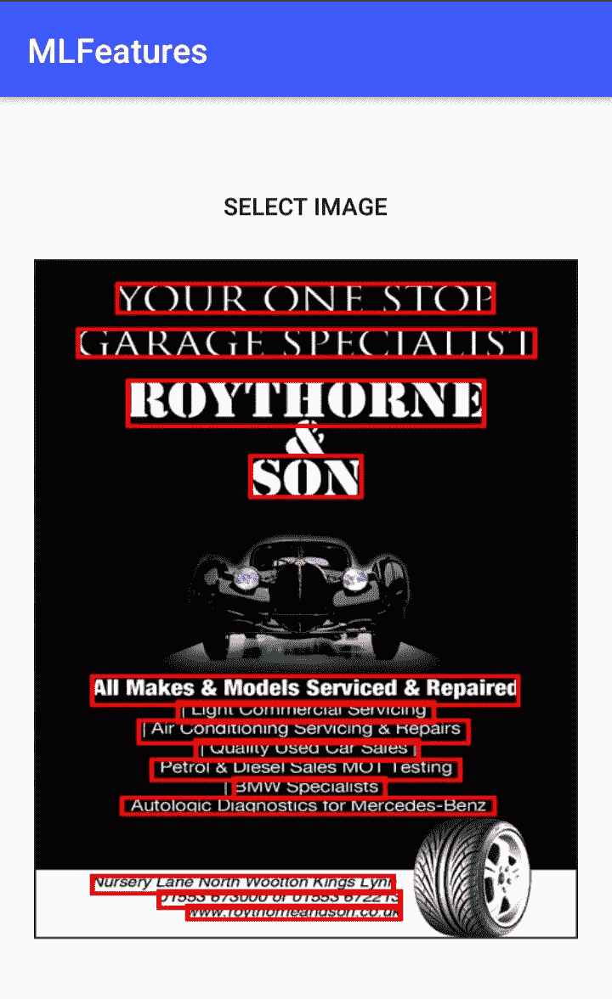
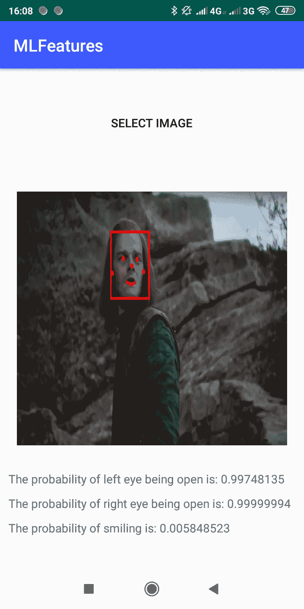
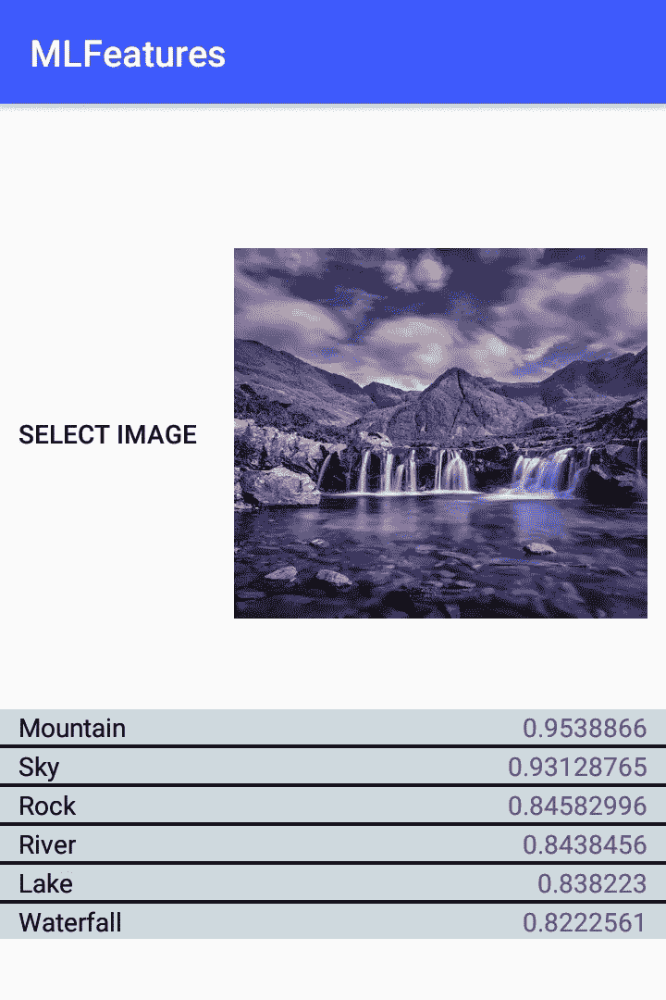

# Firebase ML- Kit，快速概述

> 原文：<https://medium.com/analytics-vidhya/firebase-ml-kit-a-quick-overview-eba352583927?source=collection_archive---------14----------------------->

所以在学习了如何在 Firebase 上存储、检索和操作数据或媒体之后，你可能会想你还能做什么？一件显而易见的事情是，您可以使用 Firebase 轻松控制身份验证。在学习了这类东西大约 4 个月后，并在该设计上设计了相当多的应用程序，我开始探索一些其他的 Firebase 特性，最明显的一个是 **ML- kit** 。


> *ML Kit 可以让你为你的应用程序带来强大的机器学习功能，无论是针对 Android 还是 iOS，无论你是一名经验丰富的机器学习开发者还是刚刚入门。*

ML 工具包提供了许多容易定义的 ML 模型(我们将在本文中讨论)，此外，您可以定义自己的模型，Firebase 可以托管这些模型。ML Kit 提供了设备上和云 API，所有这些都在一个通用而简单的界面中，用于常见的移动用例:识别文本、检测人脸、扫描条形码、标记图像和识别地标。所有这些功能都可以通过几行代码实现。

现在，我们将了解所有这些功能的基本概述，以及如何快速将其应用到您的 android 应用中。但首先你需要给你的 android 应用添加 Firebase，如果你不知道怎么做，那么参考[这个](https://firebase.google.com/docs/android/setup)。此外，在注册应用程序时，请务必提供 SHA1。你可以通过在你的 android studio 中生成一份签名报告来快速完成这项工作，或者只需按照这些[指令](https://www.truiton.com/2015/04/obtaining-sha1-fingerprint-android-keystore/)进行操作。

## 1 .**文本识别-**


文本识别用于从图像中提取文本。换句话说，它可以用来检测任何基于拉丁语的语言中的文本。**图像可以是位图、byteBuffer 或 byte[]。在本文中，我将坚持使用位图图像作为所有引用。**

首先在应用级 build.gradle 中添加以下依赖项

```
implementation 'com.google.firebase:firebase-ml-vision:24.0.1'
```

首先，我们将讨论几个在实现其他功能时有用的基本术语。

所以首先我们从图像的位图开始。然后我们初始化一个 **FirebaseVisionImage** 对象，在构造函数中传递图像的位图。 **FirebaseVisionImage** 表示一个图像对象，可以用于设备上和云 API 检测器。现在我们使用**FirebaseVisionTextRecognizer**来处理图像，这是一种设备上或云文本识别器，可以识别图像中的文本。我们在**FirebaseVisionTextRecognizer**上调用 process Image，它将 **firebaseVisionImage** 作为参数。然后我们使用一个 **onSuccess** 监听器来检查检测何时完成，这是因为 **processImage** 是异步的。如果成功，我们可以访问一个 **FirebaseVisionText** 对象，它包含在图像中找到的文本。下面是必要的代码片段。

```
**val bitmap = MediaStore.Images.Media.getBitmap(this.contentResolver, contentURI)
val** firebaseVisionImage = FirebaseVisionImage.fromBitmap(bitmap)
**val** textRecognizer = FirebaseVision.getInstance().*onDeviceTextRecognizer* textRecognizer.processImage(firebaseVisionImage)
    .addOnSuccessListener**{
        //If successful an object of FirebaseVisionText will be    //returned which contains all the text found in the image.**
    **}** .addOnFailureListener**{  }**
```

完成之后，我们可以处理**firebasevisiontext**对象来提取其中的文本。 **FirebaseVisionText** 有两个属性

1.  getText():返回图像中识别的所有文本的单个字符串。
2.  getTextBlocks():返回一个类型为 **FirebaseVisionText** 的列表。**文本块**，图像中识别的文本块，即一组或一段文本。我们可以在文本块中使用一个 **getText()** 方法来获取该块中的所有文本。我们还有一个名为 **getLines()** 的方法，它返回一个对象类型列表 **FirebaseVisionText** 。**行，**即文本块中的一行文本。与 block 类似， **FirebaseVisionText** 。**行**包含一个 **getText** ()方法，它返回一行中的所有文本，以及 **getElements** ()方法，它基本上返回一行中所有单词的列表。

下面是参考资料中链接的 codelab 中的一段代码，它解释了如何从 text block 对象中提取文本。

```
private void processTextRecognitionResult(FirebaseVisionText texts) {
        List<FirebaseVisionText.TextBlock> blocks = texts.getTextBlocks();
        if (blocks.size() == 0) {
            Toast.makeText(this,"No text", Toast.LENGTH_SHORT).show()
            return;
        }
        for (int i = 0; i < blocks.size(); i++) {
            List<FirebaseVisionText.Line> lines = blocks.get(i).getLines();
            for (int j = 0; j < lines.size(); j++) {
                List<FirebaseVisionText.Element> elements = lines.get(j).getElements();
                for (int k = 0; k < elements.size(); k++) {
                    //We can now print the words or highlight it.
                }
            }
        }
    }
```

就这样，你已经成功地在你的 android 应用程序中实现了文本识别。以下是您必须查阅的资源列表

(一)[由仁人发射](https://www.youtube.com/watch?v=_qrI1JUCMjI)

(ii) [这里的](https://gist.github.com/Kartik2301/b34c6b27643298484316d6245bc3a7dd)是一个 github 要点，来自我为了实现上述功能而创建的一个简单的 android 应用。此外，我还提供了上述应用程序的[链接](https://github.com/Kartik2301/ML-Kit-)，您可以导入并运行该链接以获得更好的理解，该应用程序非常简单，不包含高端用户界面，它只有足够的代码来实现核心功能

(三) [Codelab](https://codelabs.developers.google.com/codelabs/mlkit-android/index.html#5)



## 2.人脸检测

使用 ML Kit 的人脸检测 API，您可以检测图像中的人脸，识别关键的面部特征，并获得检测到的人脸的轮廓。因为 ML Kit 可以实时执行人脸检测，所以您可以在视频聊天或游戏等响应玩家表情的应用程序中使用它。


首先，我们需要一个图像(在我们的例子中是位图格式)..首先，在应用级 build.gradle 中添加以下依赖项

```
implementation 'com.google.firebase:firebase-ml-vision:24.0.1'
implementation 'com.google.firebase:firebase-ml-vision-face-model:19.0.0'
```

首先如上所述创建 **FirebaseVisionImage** 对象，并在构造函数中传递图像的位图。为了处理图像，我们创建了一个对象**firebasevisionfaceedetector。然后我们调用**firebasevisionfaceedetector**对象上的 detection 方法，将图像位图作为参数传递。然后，我们使用一个 **onSuccess** 监听器来检查检测何时完成，这是因为 **detectInImage** 是异步的。如果面部识别操作成功，一列 **FirebaseVisionFace** 对象将被传递给成功监听器。每个 **FirebaseVisionFace** 对象代表在图像中检测到的一张脸。对于每个面部，您可以获得其在输入图像中的边界坐标，以及您配置面部检测器查找的任何其他信息。下面是一些代码片段。**

```
**val bitmap = MediaStore.Images.Media.getBitmap(this.contentResolver, contentURI)
val** firebaseVisionImage = FirebaseVisionImage.fromBitmap(bitmap)
**val** faceDetector = FirebaseVision.getInstance().*visionFaceDetector* faceDetector.detectInImage(firebaseVisionImage)
    .addOnSuccessListener**{
        //do something**
    **}** .addOnFailureListener**{

    }**
```

每个 **FirebaseVisionFace** 对象提供了几个组件的坐标，如左眼、右眼、鼻梁、左右耳等。这些组件被称为地标。此外，该对象还返回一些事件的概率或置信度，如人在微笑，左眼睁开，右眼睁开。您可以访问任何地标，例如:

```
**for**(face **in** faces!!){
**val** rightEye = face.getLandmark(FirebaseVisionFaceLandmark.*RIGHT_EYE*)!!
**val** smilingProbability = face.*smilingProbability* **val** left_eye_open_probability = face.*leftEyeOpenProbability* **val** right_eye_open_probability = face.*rightEyeOpenProbability
}*
```

在将人脸检测应用于图像之前，如果您想要更改人脸检测器的任何默认设置，请使用**firebasevisionfaceteditoroptions**对象指定这些设置。举个例子，

```
**// High-accuracy landmark detection and face classification** val highAccuracyOpts = FirebaseVisionFaceDetectorOptions.Builder()
        .setPerformanceMode(FirebaseVisionFaceDetectorOptions.ACCURATE)
        .setLandmarkMode(FirebaseVisionFaceDetectorOptions.ALL_LANDMARKS)
        .setClassificationMode(FirebaseVisionFaceDetectorOptions.ALL_CLASSIFICATIONS)
        .build()

**// Real-time contour detection of multiple faces** val realTimeOpts = FirebaseVisionFaceDetectorOptions.Builder()
        .setContourMode(FirebaseVisionFaceDetectorOptions.ALL_CONTOURS)
        .build()
```

在这种情况下，当我们定义自定义选项时，我们可以如下初始化**firebasevisionfaceedetector**

```
**val** faceDetector = FirebaseVision.getInstance().getVisionFaceDetector(highAccuracyOpts)
```

就是这样，有了这么多代码你就可以实现核心功能了。



这里有一个应用程序的截图样本，因为 **FirebaseVisionFaceDetector，**提供了一个 **FirebaseVisionFaces** 的列表，因此我们也可以使用包含多人的照片。

资源:

(一)[正式文件](https://firebase.google.com/docs/ml-kit/android/detect-faces)

(二) [Github 要点](https://gist.github.com/Kartik2301/1856b4439b8723aba583598184f13995)，[链接](https://github.com/Kartik2301/ML-Kit-)到项目

## 3.扫描条形码

> 借助 ML Kit 的条形码扫描 API，您可以读取使用大多数标准条形码格式编码的数据。条形码扫描在设备上进行，不需要网络连接。
> 
> 条形码是一种将信息从现实世界传递到你的应用程序的便捷方式。特别是，当使用 2D 格式(如 QR 码)时，您可以对结构化数据(如联系信息或 WiFi 网络凭据)进行编码。因为 ML Kit 可以自动识别和解析这些数据，所以当用户扫描条形码时，您的应用程序可以智能地做出响应。


条形码扫描相对简单，首先添加所需的依赖项

```
implementation 'com.google.firebase:firebase-ml-vision:24.0.1'
implementation 'com.google.firebase:firebase-ml-vision-barcode-model:16.0.1'
```

现在像往常一样创建一个 **FirebaseVisionImage** 的对象，并在构造函数中传递图像的位图。现在，为了处理图像中的条形码，我们首先创建一个对象**FirebaseVisionBarcodeDetector，**，然后我们可以在这个对象上调用 **detectInImage()** ，并将 **FirebaseVisionImage** 的对象作为参数传递。然后，我们使用一个 **onSuccess** 监听器来检查检测何时完成，这是因为**检测图像**是异步的。下面是所需的代码片段。

```
**val bitmap = MediaStore.Images.Media.getBitmap(this.contentResolver, contentURI)
val** firebaseVisionImage = FirebaseVisionImage.fromBitmap(bitmap)
**val** barcodeDetector = FirebaseVision.getInstance().*visionBarcodeDetector* barcodeDetector.detectInImage(firebaseVisionImage)
    .addOnSuccessListener**{
        //Do something**
    **}** .addOnFailureListener**{

    }**
```

如果条形码识别操作成功，一列 **FirebaseVisionBarcode** 对象将被传递给成功监听器。每个 **FirebaseVisionBarcode** 对象代表一个在图像中检测到的条形码。对于每个条形码，您可以获得它在输入图像中的边界坐标，以及由条形码编码的原始数据。此外，如果条形码检测器能够确定条形码编码的数据类型，您可以获得包含解析数据的对象。

我们可以如下处理数据

```
**for**(barcode **in** barcodes!!){
    canvas.drawRect(barcode.*boundingBox*!!,rectPaint)
    **val** valueType = barcode.*valueType* **when**(valueType){
        FirebaseVisionBarcode.*TYPE_WIFI* -> {
            **val** ssid = barcode.*wifi*!!.*ssid* **val** password = barcode.*wifi*!!.*password* **val** type = barcode.*wifi*!!.*encryptionType*
        }
        FirebaseVisionBarcode.*TYPE_URL* -> {
            **val** title = barcode.*url*!!.*title* **val** url = barcode.*url*!!.*url*
        **}** }
    }
}
```

我们还可以获得包含在原始格式的条形码中的全部信息，如下所示，

```
**val** barcode_raw = barcode.*rawValue*
```

资源:

(一)[正式文件](https://firebase.google.com/docs/ml-kit/android/read-barcodes)

(二) [Github 要点](https://gist.github.com/Kartik2301/48d6b5a1d8bef9d9a92d123a8a9b098a)，[链接](https://github.com/Kartik2301/ML-Kit-)到项目

## 4.标记图像

> 图像标签让您深入了解图像的内容。当您使用 API 时，您会得到一个已识别实体的列表:人、事物、地点、活动等等。找到的每个标签都有一个分数，表明 ML 模型对其相关性的信心。


ML- Kit 提供了基于 onDevice 和 cloude 的图像标签 API。onDevice API 不需要互联网，速度非常快。另一方面，基于云的 API 需要互联网，并且比 onDevice API 包含更多的标签，因此更加精确。

让我们讨论 onDevice API，首先添加以下依赖项

```
implementation 'com.google.firebase:firebase-ml-vision:24.0.1'
implementation 'com.google.firebase:firebase-ml-vision-image-label-model:19.0.0'
```

延续长久以来的传统，你首先需要获得图像的位图，并将其传递给 **FirebaseVisionImage** 对象的构造函数。现在，为了给图像加标签，我们首先创建一个对象 **FirebaseVisionImageLabeler，**，然后我们可以对这个对象执行 **processImage()** ，并将对象 **FirebaseVisionImage** 作为参数传递。然后我们使用一个 **onSuccess** 监听器来检查检测何时完成，这是因为 **processImage()** 是异步的。下面是所需的代码片段。

```
**val bitmap = MediaStore.Images.Media.getBitmap(this.contentResolver, contentURI)
val** firebaseVisionImage = FirebaseVisionImage.fromBitmap(bitmap)
**val** options = FirebaseVisionOnDeviceImageLabelerOptions.Builder()
    .setConfidenceThreshold(0.7F)
    .build()
**val** labelDetector = FirebaseVision.getInstance().getOnDeviceImageLabeler(options)
labelDetector.processImage(firebaseVisionImage)
    .addOnSuccessListener**{
       //Do something**
    **}** .addOnFailureListener**{
    }**
```

在这里，你可以看到我们已经用**firebasevisiondeviceimagelabeleoptions object**定制了一些设置。比如说—

```
 val options = FirebaseVisionOnDeviceImageLabelerOptions.Builder()
     .setConfidenceThreshold(0.7f)
     .build()
```

如果标记成功，将返回一个列表**FirebaseVisionImageLabel**，该列表中的每个对象包含 2 个组件标签名和置信度值(浮点型)。以下是显示数据提取的片段:

```
**private fun** labelImage(labels: List<FirebaseVisionImageLabel>?, image: Bitmap?){
    **for**(label **in** labels!!){
        **val name =** label.*text
        val confidence =* label.*confidence*
   }
}
```

现在，您可以将所有标签存储在一个 ArrayList 中，并使用 ListView 和适配器显示它，就像我在示例应用程序中所做的那样。



资源:

正式文件

(二) [Github Gist](https://gist.github.com/Kartik2301/c9efbf8123a05383c2f65959cf43a2f3) ，[链接](https://github.com/Kartik2301/ML-Kit-)到项目

## 5.地标识别

> 使用 ML Kit 的地标识别 API，您可以识别图像中众所周知的地标。当您将一个图像传递给这个 API 时，您将获得其中识别的地标，以及每个地标的地理坐标和该地标所在的图像区域。


在我们开始之前，您必须知道该 API 是基于云的，onDevice 版本不可用，因此该功能很可能在免费计划中不可用，即 Firebase 中的 Spark 计划，它在 Flame 计划或 Blaze 计划等付费计划中可用。请参考此处的了解 firebase 的定价。因此，即使你做了所有正确的事情，但仍然没有看到任何产出，也不要灰心，这可能是由于这个原因。所有其他功能都包含在免费星火计划中。

从添加依赖项开始

```
implementation 'com.google.firebase:firebase-ml-vision:24.0.1'
```

现在你知道是怎么回事了，

创建一个 **FirebaseVisionImage** 的对象，并在构造函数中传递图像的位图。现在为了处理图像，我们首先创建一个对象**firebasevisioncloudlandmark detector，**，然后我们可以在这个对象上调用 **detectInImage()** 方法，并将 **FirebaseVisionImage** 的对象作为参数传递。然后我们使用一个 **onSuccess** 监听器来检查检测何时完成，这是因为**detection image**是异步的。下面是所需的代码片段-

```
**val bitmap = MediaStore.Images.Media.getBitmap(this.contentResolver, contentURI)
val** firebaseVisionImage = FirebaseVisionImage.fromBitmap(bitmap)
**val** landmarkDetector = FirebaseVision.getInstance().*visionCloudLandmarkDetector* landmarkDetector.detectInImage(firebaseVisionImage)
    .addOnSuccessListener**{
       //Do something
** **}** .addOnFailureListener **{ 

    }**
```

如果地标识别操作成功，一列**FirebaseVisionCloudLandmark**对象将被传递给成功监听器。每个**FirebaseVisionCloudLandmark**对象代表在图像中检测到的地标。对于每个地标，您可以获得其名称、地理坐标、边界多边形和相关的置信度得分。以下是提取地标数据的示例

```
for (landmark in firebaseVisionCloudLandmarks) {

    val bounds = landmark.boundingBox
    val landmarkName = landmark.landmark
    val entityId = landmark.entityId
    val confidence = landmark.confidence

    for (loc in landmark.locations) {
        val latitude = loc.latitude
        val longitude = loc.longitude
    }
}
```

我没有任何截图可以附上，因为像你们中的许多人一样，我使用基本免费计划，但正如你所看到的，它的实现基本上是相同的。

资源

(一)[正式文件](https://firebase.google.com/docs/ml-kit/android/recognize-landmarks)

好了，我们现在完成了，唷！这很长，但我希望它不难理解。因此，我们基本上讨论了 Firebase 提供的默认 ML 模型可以实现的所有功能，随着您学习或继续学习神经网络和其他概念，您将获得设计自己的模型的技能，Firebase 有能力托管它们。在我离开之前，还有一点很重要，在本文中，我们一直使用设备图库(或文件存储)中的可用图像，但是我们也可以配置这些功能来处理移动摄像机拍摄的实时图片，这是因为我们在此讨论的所有 firebase 探测器都是实时工作的。

**感谢阅读**

希望你喜欢这篇文章。

**关于我:**我是来自 IIIT 阿拉哈巴德的大二 Android 开发人员 Kartik Nema