# 深度学习或迁移学习的第一次潜水:空中仙人掌识别

> 原文：<https://medium.com/analytics-vidhya/first-dive-in-deep-learning-or-transfer-learning-aerial-cactus-identification-e8a809a89dc8?source=collection_archive---------7----------------------->

## 确定图像是否包含柱状仙人掌。


表格数据已经够多了，现在是时候处理图像数据了。像往常一样，我在 Kaggle 上探索过去的一些比赛，但是等等，它们中的大多数主要与图像数据有关。这个怎么解决？答案很简单——我必须掌握深度学习的基础知识！

首先，我从 Kaggle 提供的课程开始，你可以在这里 *获得 [*。经过一番头脑风暴后，我准备好了我的第一个任务！但是它必须是简单和基本的，因为我还是一个新手，然后我遇到了这个数据集。*](https://www.kaggle.com/learn/deep-learning)*

空中仙人掌识别数据集由 17500 幅图像组成，其中一个标签描述了图像中是否有仙人掌。那么我们还在等什么，让我们开始编码吧！

# 导入相关库

```
import cv2
import pandas as pd
import numpy as np
import matplotlib.pyplot as plt
import os
from tqdm import tqdm, tqdm_notebook
from keras.models import Sequential
from keras.layers import Activation, Dropout, Flatten, Dense
from keras.applications import VGG16
from keras.optimizers import Adam
```

如果你现在不理解一些术语，不要担心，到本文结束时，我会确保每个主题都被涵盖。

## 让我们加载数据

```
train_df = pd.read_csv('../input/aerial-cactus-
identification/train.csv')
```

好了，我们已经将数据加载到我们的数据帧中，让我们看看 train_df 的结构。

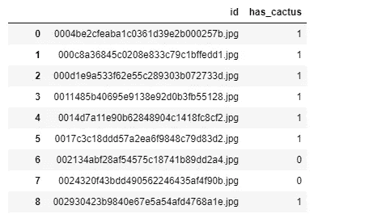

这不是我们所期望的，对吗？我们想看一些视觉效果。

为什么没有他们，这里是代码:

```
im = cv2.imread("../input/aerial-cactus-identification/train/train/01e30c0ba6e91343a12d2126fcafc0dd.jpg")
plt.imshow(im)
```

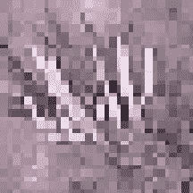

我知道这是图像非常模糊，但不得不调整它的大小显示。

# 有趣的部分开始了！

我们已经将数据加载到变量中，现在我们必须创建一个 **CNN(卷积神经网络)**，听起来很复杂，但相信这将是一件轻而易举的事情，一旦你得到它，就像我一样。

让我们把 CNN 这个词分成两部分:卷积和神经网络


就是这样！只要看一下图像，你就会明白了。对于像我这样理解稍慢的人来说，这里有一个解释:我们正在做的是将整个 5X5 矩阵乘以一个 3X3 矩阵，并将其转换到另一个比上一层维度更低的层中，这样循环下去！这在大型矩阵中非常有用。

现在到了我们后面的部分，神经网络，这就是:


太好了。这只不过是一次又一次地应用卷积，或者用更专业的术语来说，就像一个堆栈一样在其他层之上添加一层，并在不同的节点之间构建一个网络。

既然我们对 CNN 这个术语有些熟悉，那我们还等什么呢？让我们创建一个吧！但是你知道吗，我要给你们所有人发奖金。如果除了我们自己制作一个新模型之外，我们还使用一个已经为一个非常大的数据集训练过的“预训练”模型，那会怎么样！

这是我在学习深度学习或 DL 时发现的一个妙处，如果你是一个懒惰的生物(像我一样)，不喜欢到处乱搞，不喜欢在实际制作新模型时遇到麻烦，而是为了自己的目的多少使用别人的模型，这是正确的地方，这个概念被命名为**“迁移学习”**

我将向您介绍迁移学习的概念，同时编写代码，您会喜欢它的，所以让我们开始编写代码吧！

```
vgg16_net = VGG16(weights='imagenet', 
                  include_top=False, 
                  input_shape=(32, 32, 3))
```

如前所述，我们的预训练模型的名称是 VGG16(听起来像一个电影名称！)它实际上是一个由 16 层组成的网络。这是它的结构

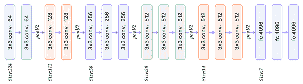

与其手动编码，不如使用一个，对吗？

但是，如果这个模型是为了其他目的而创建的，我的意思是，我们希望这个模型能够分类一张图片中是否有仙人掌，但是我们甚至不知道这个模型是做什么的。为了解决这个问题，我们可以做的是 ***将这个预先训练好的模型转移并连接*** 到我们自制的模型上，这就是为什么它被称为迁移学习！

## 我们的预训练模型的语法:

所以在上面提到的代码中，有 3 个参数(权重、包含、输入形状)。所以让我们按顺序来说清楚:

**权重:**它基本上是一个祝福或诅咒，我的意思是它有点像一个偏差值，它将输入乘以某个数字，并将其传递给下一层，因此如果节点比自然情况下更有价值，它的权重就会更高。
**include_top = False:** 如上述理论中所述，我们将在新模型中串联出预训练模型，为此，我们需要移除它的(vgg16)顶层，该层本应预测输出。明白这一点对你来说很重要，所以这里有一个视频 [*链接*](https://www.youtube.com/watch?v=mPFq5KMxKVw) *。* **input _ shape:***你只要通过命令 img.shape 就可以知道这一点*

## *前进方向:*

```
*vgg16_net.trainable = True
model = Sequential()     #Starting Point
model.add(vgg16_net)
model.add(Flatten())
model.add(Dense(256))
model.add(Activation('relu'))
model.add(Dropout(0.5))
model.add(Dense(1))
model.add(Activation('sigmoid'))*
```

*这么多新术语，我们一个一个来理解吧。总的来说，这就是我所说的串联，让我们从“起点”开始，我们已经创建了一个将成为 Sequential()对象的模型，Sequential 只是帮助我们像三明治一样堆叠尽可能多的层！*

# *我们模型的层次*

*现在我们已经准备好了我们的模型，让我们开始添加一些层:
**第一层:**我们的预处理模型
**第二层:** Flatten()，这到底是什么意思？*

*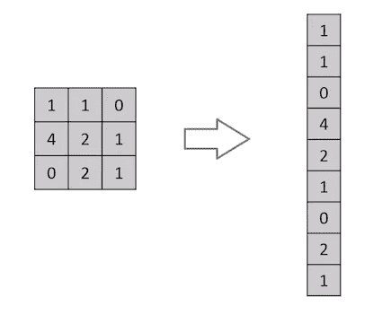*

*扁平化()简单地说，对于那些还在这里苦苦挣扎的人来说是官方的定义:*

***Flatten** 是将汇集的要素地图转换为传递给完全连接图层的单个列的函数。Dense 将全连接层添加到**神经网络**中。*

***第三层:**密集(256)，一个**密集**层代表一个矩阵向量乘法，换句话说，它实际上意味着在训练过程中，可能会发生矩阵中以前的值不准确，因此可能需要改变它，这个过程也被称为**‘反向传播’。**语法的含义将生成 256 个节点的输出。*

***第三层(激活功能):***

***激活函数的工作:**具体来说，这些函数对输入( **X** )与其对应的权重( **W** )的乘积求和，并对其应用激活函数 **f(x)** 以获得该层的输出，并将其作为输入馈送给下一层。*

*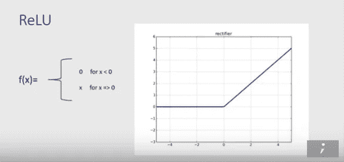*

***什么是 Relu？***

*Relu or(整流线性单元( **ReLU** ))被广泛用于从我们的模型中移除所有受到负面影响的节点。从图中可以看出，如果权重小于 0，则返回 0，正如我们在上面的理论中所读到的，所有输入都乘以其权重，如果权重为 0，则表示输入没有意义。*

***第四层(辍学):***

*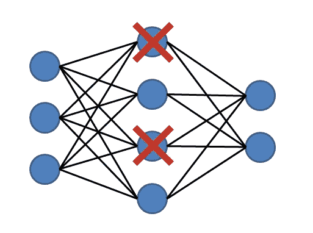*

*如图所示，这是一种通过在训练过程中丢弃一些随机节点来减少过拟合和改善正则化的技术。*

***Drop(0.2)** 表示当前层将从先前添加的层中随机删除 20%的节点。*

***第四层:**我不会深入到这一层，因为已经提到了密集层的工作，简而言之，这一层将给出输出单个节点，该节点将有我们的答案，现在答案的形式将由我们的**激活函数或 sigmoid 决定。***

***第四层(激活功能):***

*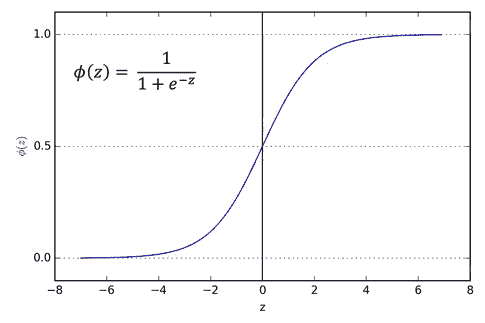*

*按照惯例，除了图解以外，还有 sigmoid 函数的典型例子。然而，一个更简单和实用的方法是，它会简单地给出你输出的可能性。*

*恭喜你，你已经到达了所有层的终点。现在你对所有的层、激活函数、预训练模型或迁移学习都有了一个基本的概念(这对一个初学者来说是相当多的事情，你真棒！).*

# *编译我们的模型*

```
*model.compile(loss='binary_crossentropy',
              optimizer=Adam(lr=1e-5), 
              metrics=['accuracy'])*
```

*我们准备**编译**我们的模型。这将创建一个 Python 对象来构建 CNN。这是通过基于我们正在使用的 Keras 后端以正确的格式构建计算图来实现的。*

*编译函数由 3 个参数组成(损失、优化器和指标)。*

***损失:**顾名思义，这个函数表示我们的算法与实际解的接近程度，如果预测与实际结果偏离太多，损失函数将会产生一个非常大的数字。二进制交叉熵特别用于二进制分类，我们的主要任务是预测是/否。*

*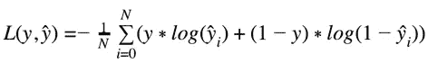*

*二元交叉熵数学。ŷ是预测值，y 是我们的实际值。*

***优化器:**优化函数主要用于最小化或最大化损失函数，也称为 **E(x)。**这里我们使用了 Adam( **自适应矩估计**)。 **Adam** 在实践中表现良好，并且与其他自适应学习方法算法相比毫不逊色，因为它收敛速度非常快，并且模型的学习速度非常快和高效。为了更好的理解，我参考了这个 [*链接*](https://towardsdatascience.com/types-of-optimization-algorithms-used-in-neural-networks-and-ways-to-optimize-gradient-95ae5d39529f) 。*

# *让我们继续:*

*现在我们已经创建了模型，让我们来训练它。在此之前，我们需要将**标签**与**特征**分开，换句话说就是图像与它们的标签。这是代码*

```
*X_tr = []
Y_tr = []
imges = train_df['id'].values
for img_id in tqdm_notebook(imges):
    X_tr.append(cv2.imread(train_dir + img_id))    
    Y_tr.append(train_df[train_df['id'] == img_id]['has_cactus'].values[0]) #Cooking our food!
X_tr = np.asarray(X_tr)
X_tr = X_tr.astype('float32')
X_tr /= 255
Y_tr = np.asarray(Y_tr)*
```

*哇哦。这么多胡言乱语。让我们一步一步来理解。*

*从起点理解，我们所做的是在一个名为“imges”的列表中获得所有图像名称的列表。这是输出*

*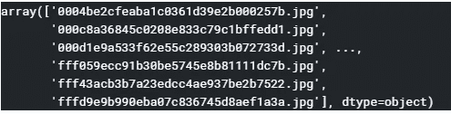*

*模型不能只靠图像名训练对吧？*

*我们需要检索图像，我们该怎么做呢？我们可以简单地遍历名为 imges 的列表。*

*你可能已经注意到了一个新术语叫做***‘tqdm _ notebook’。*** 它的主要功能是给出一个漂亮的进度条，指示进程完成了多少，就像这样:*

*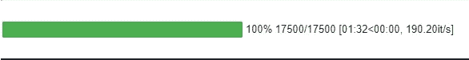*

*我们在迭代中所做的事情非常简单，只是将我们的图像目录与图像的名称连接起来，并通过 cv2.imread()函数存储和读取它。还有，在 Y_tr 中存储值或者标签(不管一个图片有没有 cactus)。*

*现在，我们已经为我们的模型收集了生食，只是我们的模型喜欢熟食，所以让我们烹饪它，使它可以为我们的模型食用。开始了。*

*首先，我们需要将图像转换成数组，为此，我们使用了 np.asarray()功能。吃完后，我们来吃正餐吧。我的意思是，我们不能只给我们的模型一个随机数列表，我们需要预处理它。*

*为此，我们将列表中的元素转换为浮点类型，并除以 255，因为所有像素的范围都在 0-255 之间，所以我们将对列表进行标准化，并准备好接受**服务**！！*

# *培训阶段开始:*

```
*batch_size = 32
nb_epoch = 10
model.fit(X_tr, Y_tr,
              batch_size=batch_size,
              epochs=nb_epoch,
              validation_split=0.1,
              shuffle=True,
              verbose=2)*
```

*虽然这是一个单一的命令，但在训练模型时有许多事情需要理解和记住。想象一下我们的大脑每秒钟是如何平稳高效地工作的(不是我的，:D，只是开玩笑！).让我们开始了解这种美。*

*要理解什么是 **batch_size** 和 **epoch，**只要记住它们之间的一个关系就可以了。因此，一个时期的数量就是我们的全部数据将通过网络的次数(正向处理和反向传播也是如此)。自然，这将占用我们大量的 CPU 或者 GPU 资源。为此，我们使用 batch_size 将数据分成几批，然后进一步传递。*

*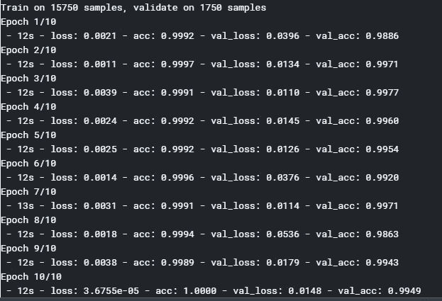*

*训练结束了，我们也获得了相当好的精确度，我希望我们没有过度适应！*

# *测试阶段，而不是最终阶段！*

*所以我们终于到了这篇文章的结尾。我希望你已经理解了我们到目前为止所做的每一步。在这一阶段，我们将重复我们对训练数据集进行预处理的过程(还记得生食和熟食吗？)*

```
*X_tst = []
Test_imgs = []
for img_id in tqdm_notebook(os.listdir(test_dir)):
    X_tst.append(cv2.imread(test_dir + img_id))     
    Test_imgs.append(img_id)
X_tst = np.asarray(X_tst)
X_tst = X_tst.astype('float32')
X_tst /= 255*
```

*我们开始吧:*

```
*test_predictions = model.predict(X_tst)*
```

*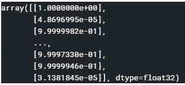*

*这是我们得到的预测，但根据竞争，我们需要有一个二元分类。*

*不用担心，我们可以映射它的值，用预测值小于 0.75 的 0 和预测值大于 0 的 1 替换所有的值！*

```
*sub_df = pd.DataFrame(test_predictions, columns=['has_cactus'])
sub_df['has_cactus'] = sub_df['has_cactus'].apply(lambda x: 1 if x > 0.75 else 0)*
```

*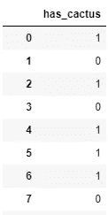*

*更好对吗？现在，最后一步是用图像名称替换 id，并提交它来检查我们的结果！*

```
*#Preprocessing stuff for valid submission in kaggle
sub_df['id'] = ''
cols = sub_df.columns.tolist()
cols = cols[-1:] + cols[:-1]
sub_df=sub_df[cols]
for i, img in enumerate(Test_imgs):
    sub_df.set_value(i,'id',img)
sub_df.head()*
```

*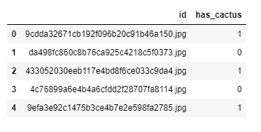*

*交叉手指，让我们检查结果！*

```
*sub_df.to_csv('submission.csv',index=False)*
```

*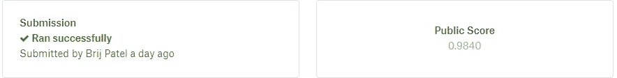*

*不过还不错！*

*好了，现在就这样，我希望你理解了这段代码的每一行。也感谢 Kaggle 上一些令人敬畏的内核和笔记本为学习者提供指导。像往常一样，我总是乐于接受建议和改进。*