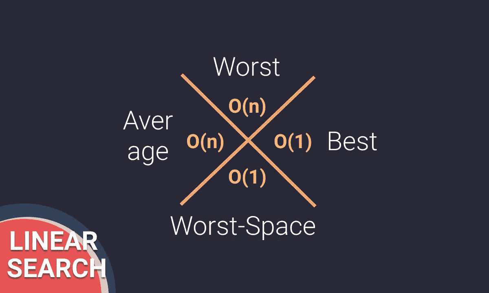
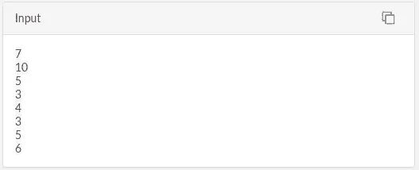
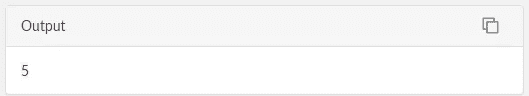
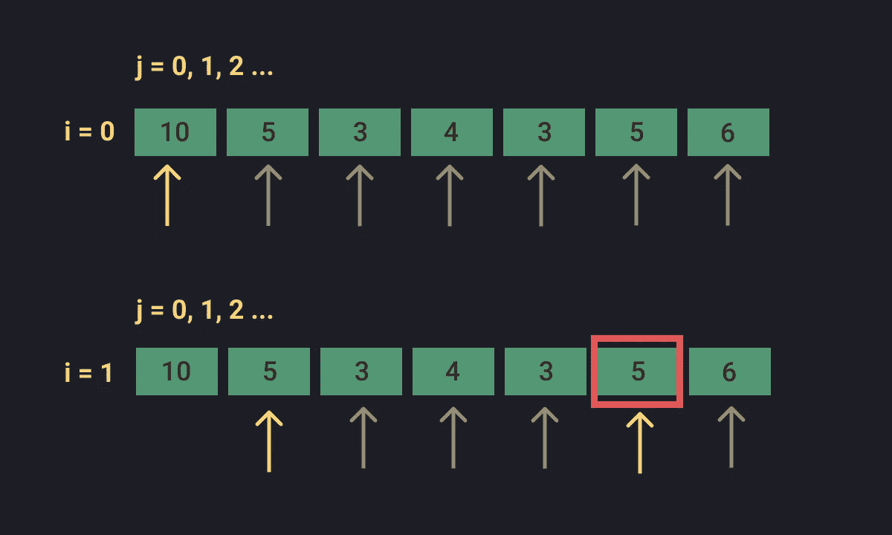
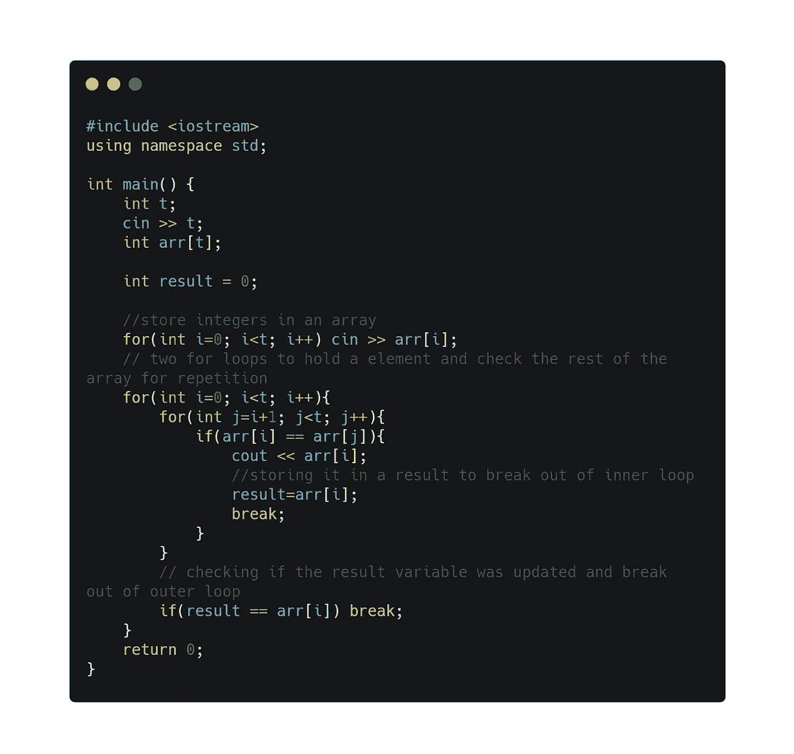

# 第一个重复元素| Easy | Techgig

> 原文：<https://medium.com/analytics-vidhya/first-repeating-element-easy-techgig-67afae27b15d?source=collection_archive---------21----------------------->

# C++解决方案

第**个重复元素**是在**算法**部分下的**线性搜索**问题下的问题。

线性搜索或顺序搜索是一种在列表中查找元素的方法。该算法的工作原理是依次选择和检查每个数字，直到匹配为止。线性搜索以最差的线性时间运行，并且最多进行 n 次比较，其中 n 是列表的长度。如果每个元素被搜索的可能性相等，那么顺序搜索的平均情况是(n+1)/2 次比较，但是如果每个元素的搜索概率不同，则平均情况会受到影响。线性搜索的复杂性如下:

基本线性搜索算法有以下步骤:

给定一个列表 *L* on *n* 元素，值为 *L0…Ln-1，*和目标值 T，，查找列表 *L.* 中目标 *T* 的索引

1.  将 *i* 设置为 0。
2.  如果*李* = *T* ，搜索成功终止；返程岛
3.  将 *i* 增加 1。
4.  如果 *i < n* ，转到步骤 2。否则，搜索不成功地终止。

[问题](https://www.techgig.com/practice/question/first-repeating-element/eDBYMWVpV0wxTFkzK09aQjdhUmx5UkdXMEI1WHdnT3VXUnV1WGZZTm1CUVpaajBVazRiTkdKZklRbHBEOGM3eA==/1)陈述了给定一个整数数组，找出其中的第一个重复元素。我们需要找到出现不止一次且第一次出现的索引最小的数字。

**输入格式**

以整数数组作为参数的函数

**约束**

1 < N < 10⁵

1 < a[i] < 10⁵

**输出格式**

您需要从函数中返回第一个重复元素。

**样本测试案例 1**

**输出**

**时间限制(X):** 每次输入 1.00 秒。

**内存限制:** 512 MB

**源限制:** 100 KB

下面的代码建议使用两个 for 循环，第一个循环保存一个值，第二个循环遍历元素的其余部分。

线性搜索技术让初学者更容易理解，但是有一些方法可以优化这些代码。你能为这个问题找到一个优化的代码吗？

感谢您的阅读，祝您有愉快的一天。