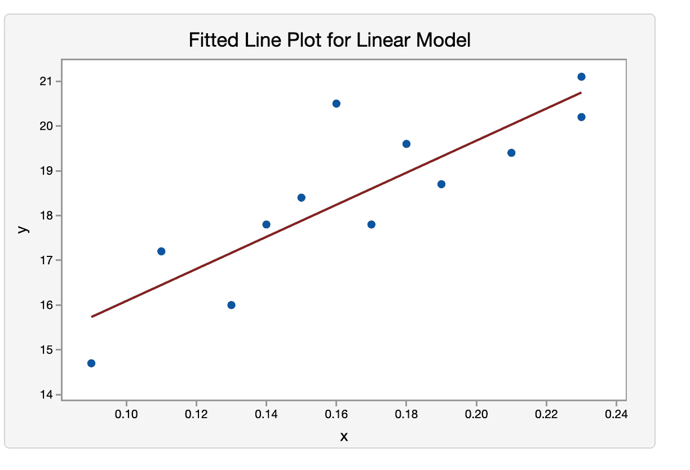
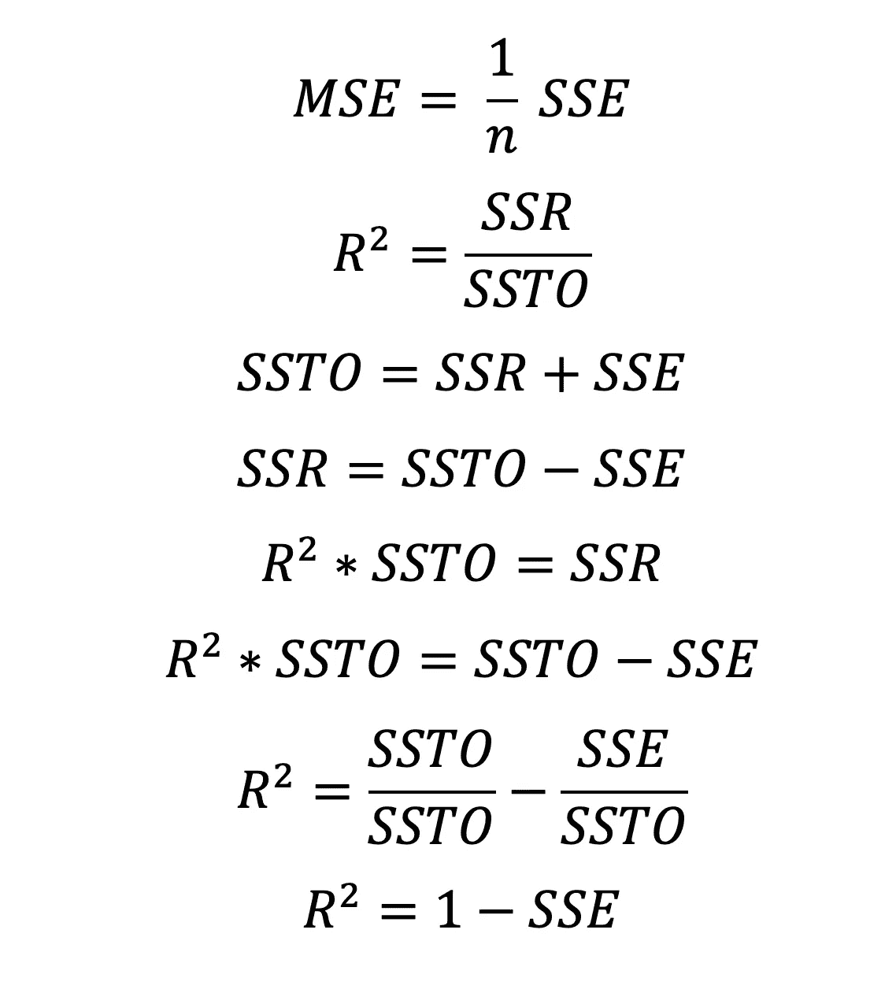

# 第一个统计模型:选择正确的成分并正确解释分数

> 原文：<https://medium.com/analytics-vidhya/first-statistical-model-choosing-the-right-ingredients-dabc1a0cdcbf?source=collection_archive---------23----------------------->

我不喜欢烘焙。一，因为我爸妈用烤箱存放锅碗瓢盆。第二，因为每次测量和计时都必须精确。起初，统计建模对我来说听起来就像烘焙。你必须一丝不苟地清理数据(准确称量每种成分)，彻底探索数据(适当混合面粉和液体，但不要过度混合)，并在模型的性能低于标准(过度烘烤)时重复这一整个过程？再来一遍)。但是统计建模比烘焙要好，因为如果你的模型没有达到你的期望，你不必废弃它，你可以在它的基础上构建。另一方面，烘焙，要么全有，要么全无。我可能不是面包师，但我建立了第一个线性回归模型来预测爱荷华州埃姆斯的房价。事实证明，统计建模比烤核仁巧克力饼有趣多了。

所以我格外小心地着手我的第一个统计模型。我用的方法是线性回归。与其他统计模型相比，线性回归相当简单且易于解释；这是一个参数模型，我们假设有一些有限的参数集。在线性回归模型中，参数是斜率或 beta。

Minitab 中生成的最佳拟合线

在上图中，你可以看到我可以画一条最适合所有点的线。这条线被称为最佳拟合线。然而，这条线永远不会完美地拟合所有的点。所有的统计模型都会有误差，但它们足够正确。这些误差对于评估模型并告知数据科学家模型的表现至关重要:模型是过拟合、欠拟合还是刚好合适。有许多类型的错误被用作模型度量，今天我将讨论其中的两种。

# **均方误差(MSE)**

均方误差是误差平方和(SSE)或残差平方和(RSS)的平均值。这尤其重要，因为它告诉我们模型残差的方差。MSE 越低，模型越好。然而，正如我之前提到的，度量给了我们一个如何评估模型的想法。通常通过模型的可变性来评估模型，即所选的 x 变量考虑了 y 值的多少变化。也就是说，y 值的总可变性(SSTO)是模型解释的可变性(SSR)加上无法解释的可变性(RSS)。MSE 是无法解释的变异性的平均值。

特别是，MSE 与模型过拟合和欠拟合的关系如下图所示:

偏差-方差权衡和均方误差

在训练模型时，我们将数据分成两组:训练和测试。使用训练数据拟合该模型，并根据测试数据评估该模型。这是为了使用测试数据复制现实生活中的未知值，以确保模型不会使用已知数据过度拟合。换句话说，模型暴露于训练数据，并且它可能进行调整以最小化训练数据的误差，但是进行了太多的调整以至于对新数据没有用。这类似于定制你的西装或裙子，因为衣服只适合你的身体，而不适合其他人。在统计建模中，数据科学家不希望定制训练数据，因为模型需要足够灵活，以便预测新数据。

上图概述了统计建模中最重要的概念:偏差-方差权衡。方差越小，偏差越大。最好的模型是在两者之间找到最佳平衡点的模型。x 轴表示模型的灵活性级别。线性回归是一个相对不灵活的模型。y 轴是 MSE。随着训练 MSE 的减少，测试 MSE 最初呈指数减少，但随着模型用偏差换取更多方差，测试 MSE 呈指数增加。当模型的均方误差高时，模型遭受太多的偏差，而测试均方误差高于训练均方误差，模型遭受太多的方差。

多低才算够低，多高才算不可接受？没有绝对的答案，因为模型中的误差都与感兴趣的值和单位相关。例如，如果我预测一个人的年龄，得到 3-4 年的误差可能并不可怕。但如果我要预测一个学生的平均绩点，误差达到 3-4 分意味着这个模型表现极差。

# 稀有

r 是**决定系数**。r 被解释为目标值变化的百分比，该百分比由所选 x 变量的变化来解释。**需要注意的是，这并不等同于说 x 变量和 y 值之间有因果关系。**它仅仅指出在 x 变量和 y 值之间有一个 ***关联*** 。

R 的计算与 MSE 相关，因为它是模型解释的可变性除以(SSR)y 值的总可变性(SSTO)。请记住，y 值的总可变性是已解释可变性(SSTO)和未解释可变性(RSS 或 SSE)的总和。做了一些代数之后，你会发现均方差和 R 是如何相关的。

决定系数和均方误差在代数上的关系。

在我自己的模型中，我确保没有遗漏任何值，并且正确地对每个名义类别进行了分类。将数据中的所有变量可视化，这样我就可以选择与房屋销售价格有最明显线性关系的变量。在第一轮数据清理和探索性数据分析结束时，我的模型获得了 0.87 的 R 值。

r 分数被解释为埃姆斯房价方差的 87%在所有选择的变量中得到解释。为了改进我的模型，我必须重申数据清理和探索性分析。在此之前，我取了 y 值的自然对数，这减少了房价的方差，极大地改进了我的模型。当数据分布严重倾斜时，对数转换特别有用。

在 log 转换之后，我挑选出了更多的 x 变量，并生成了一些新的变量(这被称为特征工程)。例如，我给房价中值低于整体中值的社区赋值，给房价中值高于 75%的社区赋值。我的模型的均方根和大约是 23，500。随着我尝试更多的迭代，最小化错误的回报边际正在减少。知道你可能得到更低的错误分数是很难停止的，但是记住偏差-方差权衡也很重要。我不想给我的模型增加更多的方差，所以我对 23，500 美元的 RMSE 和 0.92 的 R 值感到满意。这意味着我的未被所选 x 变量解释的房屋价格误差的均方根和是 23，500 美元。而房价变化的 92%是由所选 x 变量的变化来解释的。