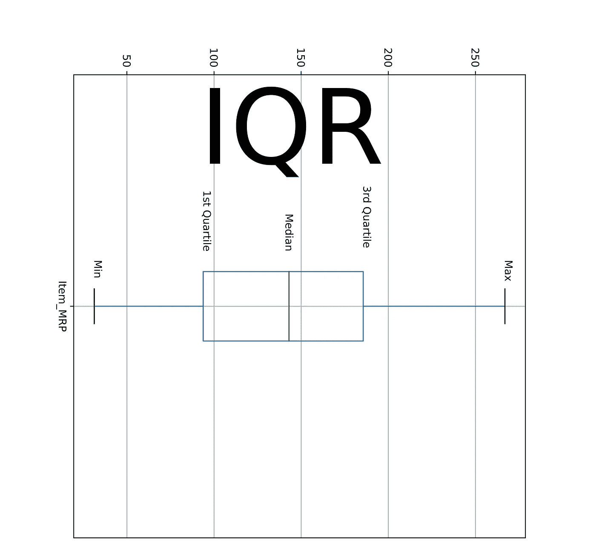
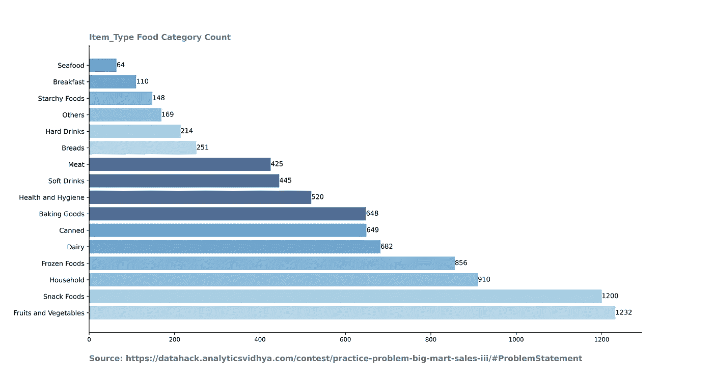
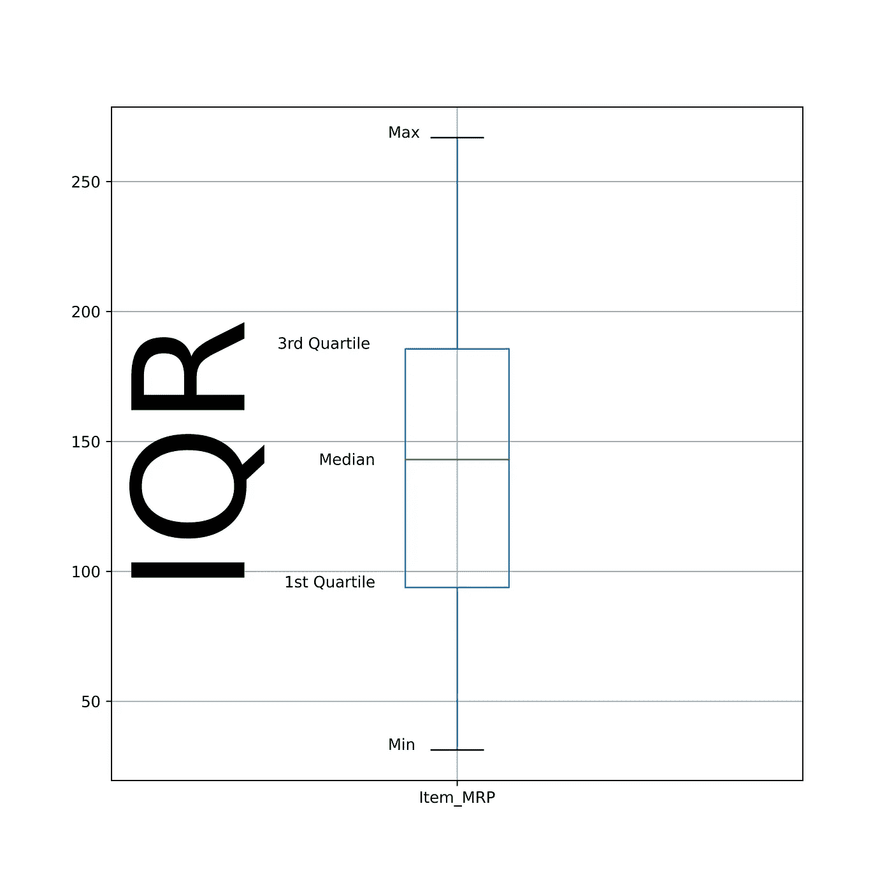

# EDA 的第一步:描述性统计分析

> 原文：<https://medium.com/analytics-vidhya/first-step-in-eda-descriptive-statistics-analysis-f49ca309da15?source=collection_archive---------5----------------------->

## 使用中心数据点的度量和离散度**的度量在数据、数据发现、数据清理中寻找模式。**



作者图片

数据科学项目的第一步是总结、描述和可视化数据。尝试了解数据的不同方面及其属性。**最好的模型是由那些理解他们的数据的人创造的。**

使用描述性统计探索数据的特征及其属性。从描述性统计中获得的见解和数字摘要有助于您更好地理解或更有效地处理数据，以完成机器学习任务。

> 描述性统计是数据分析中的默认过程。没有描述性统计分析，探索性数据分析(EDA)是不完整的。

因此，在本文中，我将使用描述性统计来解释数据集的属性。

分为两部分:**中心数据点的度量和离散度的度量。**

在开始分析之前，我们需要完成数据收集和清理过程。

# **数据收集和数据清理**

我们将从[这里](https://datahack.analyticsvidhya.com/contest/practice-problem-big-mart-sales-iii/#ProblemStatement)收集数据。我只会用测试数据进行分析。您可以结合测试和训练数据进行分析。下面是列车数据的数据清理过程的代码。

## 从代码中删除

*   列 Item_Weight 和 Outlet_Size 具有空值。这些是选项:

1.  删除包含空值的行
2.  删除包含空值的列
3.  或者替换空值。

*   当数据的行数以百万计或者值的计数很小时，前两个选项是可行的。因此，我将选择第三个选项来解决空值问题。
*   首先，找到 Item_Identifier 和它们对应的 Item_Weight。然后用相应 item_identifier 的已知 Item_Weight 替换 Item_weight 中的 missing/null。
*   我们知道，商店中商品的可见性可以接近零，但不是零。因此，我们将 0 视为空值，并对 Item_Visibility 执行上述步骤。
*   Outlet_Size 在我们的分析和模型预测中并不重要。所以，我要放弃这个专栏。
*   将 Item_fat_content 列中的 LF 和 reg 替换为低脂和普通脂肪。
*   计算商店的年龄，将这些值保存在 Outlet_years 列中，并删除 Outlet_Establishment_year 列。

先说数据的描述性统计分析。

# **测量中心数据点**

使用平均值、中值和众数寻找数值和分类数据的中心被称为中心数据点的**测量。通过平均值、中值和众数计算列数据的中心值是不同的。**

好了，让我们使用 python 计算数据集属性的平均值、中值、计数和众数。

## **计数**

计数不能直接帮助找到数据集属性的中心。但它用于均值、中值和众数计算。

我们计算每一类分类变量的总数。它还计算数字列数据的总数。

**从法典中取走。**

*   循环遍历分类列，以绘制类别及其计数。



作者图片

**分析输出。**

*   这些计数帮助您发现数据是否平衡。从这个图表中，我可以说水果和蔬菜类的数量远远多于海鲜类。
*   我们也可以假设水果和蔬菜类的销售额远远超过海鲜类。

## **的意思是**

该列中出现的值的总和除以该列的总行数称为平均值。它也被称为平均值。

使用 **train.mean()** 计算训练数据集数值列的平均值。

这是训练数据集分类列的代码。

```
print(train[[‘Item_Outlet_Sales’,’Outlet_Type’]].groupby([‘Outlet_Type’]).agg({‘Item_Outlet_Sales’:’mean’}))
```

**输出的分析**

*   商店的平均年龄是 15 岁。
*   平均网点销售额 2100。
*   Outlet_Type 的超市类型 3 类别比杂货店类别有更多的销售。
*   我们也可以假设超市类别比杂货店类别更受欢迎。

## **中位数**

属性的中心值称为中值。我们如何计算中值？首先，按升序或降序对列数据进行排序。然后找出总行数，然后除以 2。

该输出值是该列的中值。

***中值将数据点分为两部分。这意味着 50%的数据点高于中位数，50%低于中位数。***

通常，相同数据的中值和平均值是不同的。

**中位数不受离群值的影响。由于异常值，平均值和中间值之间的差异增大。**

使用 **train.median()** 计算训练数据集数值列的平均值。

这是训练数据集分类列的代码。

```
print(train[[‘Item_Outlet_Sales’,’Outlet_Type’]].groupby([‘Outlet_Type’]).agg({‘Item_Outlet_Sales’:’median’}))
```

**输出分析**

*   大部分观测值与平均值观测值相同。
*   平均值和中间值的差异是由异常值引起的。您还可以观察到分类变量的这种差异。

## **模式**

众数是一列中计数最大数据点。每列只有一个平均值和中间值。但是，属性可以有多个模式值。

使用 **train.mode()** 计算训练数据集数值列的平均值。

这是训练数据集分类列的代码。

```
print(train[[‘Item_Outlet_Sales’, ‘Outlet_Type’, ‘Outlet_Identifier’, ‘Item_Identifier’]].groupby([‘Outlet_Type’]).agg(lambda x:x.value_counts().index[0]))
```

**输出分析**

*   Outlet_Type 的模式值为超市类型 1。超市类型 1 类别最畅销商品或模式值为 FDZ15。
*   Item_Identifier FDH50 是 Outlet_Type 类别中销售最多的产品。

# **分散度的度量**

离差的度量解释了数据集中属性值的差异程度。它也被称为传播的量度。从这个统计数据中，你会知道数据是如何以及为什么从一个点传播到另一个点的。

这些是离差度量下的统计数据。

*   范围
*   百分位数或四分位数
*   标准偏差
*   差异
*   歪斜

## **范围**

列中最大值和最小值之间的差值称为范围。

下面是计算范围的代码。

```
for i in num_col:
    print(f”Column: {i} 
            Max_Value: {max(train[i])} 
            Min_Value: {min(train[i])} 
            Range: {round(max(train[i]) — min(train[i]),2)}”)
```

您还可以计算分类列的范围。下面是一个代码，用于找出每个插座类别中的最小值和最大值。

**输出分析**

*   Item_MRP 和 Item_Outlet_sales 的范围较高，可能需要转换。
*   在超市类型 3 类别下，Item_MRP 有很大的变化。

**百分位数或四分位数**

我们可以通过计算几个百分点的总和来描述列值的分布。中位数也称为数据的第 50 个百分位数。

这是一个不同的百分比。

*   最小值等于第 0 个百分点。
*   最大值等于第 100 个百分点。
*   第一个四分位数等于第 25 个百分位数。
*   第三个四分位数等于第 75 个百分位数。

下面是计算四分位数的代码。

**第三个四分位数和第一个四分位数之间的差异也称为四分位数间(IQR)。此外，IQR 的数据点最多。**



作者图片

## **标准偏差**

标准偏差值告诉我们所有数据点偏离平均值的程度。标准差会受到异常值的影响，因为它使用平均值进行计算。

下面是计算标准偏差的代码。

```
for i in num_col:
    print(i , round(train[i].std(),2))
```

熊猫也有一个快捷方式来计算所有上述统计值。

**Train.describe()**

## **差异**

方差是标准差的平方。在异常值的情况下，方差值变得很大并且很明显。因此，它也会受到异常值的影响。

下面是计算方差的代码

```
for i in num_col:
    print(i , round(train[i].var(),2))
```

**分析输出。**

*   由于异常值，Item_MRP 和 Item_Outlet_sales 列具有较高的方差。

## **偏斜度**

理想情况下，数据的分布应该呈高斯型(钟形曲线)。但实际上，数据形状是偏斜的或不对称的。这就是所谓的数据偏斜。

可以通过 **train.skew()计算训练数据的偏斜度。**偏斜值可以是负(左)偏斜或正(右)偏斜。它的值应该接近零。

# **结论**

当我们对数据集执行探索性数据分析时，这些是我们需要的统计数据。你需要注意这些统计产生的值，并问为什么这个数字。这些统计数据帮助我们确定数据转换的属性，并从进一步的处理中删除变量。

Pandas 库有非常好的功能，可以帮助你在一行代码中获得描述性统计值。