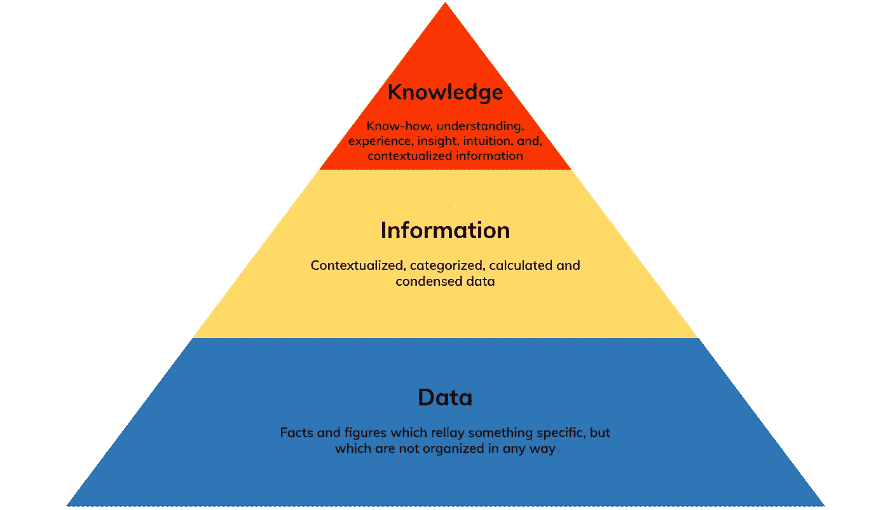
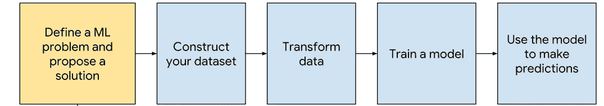
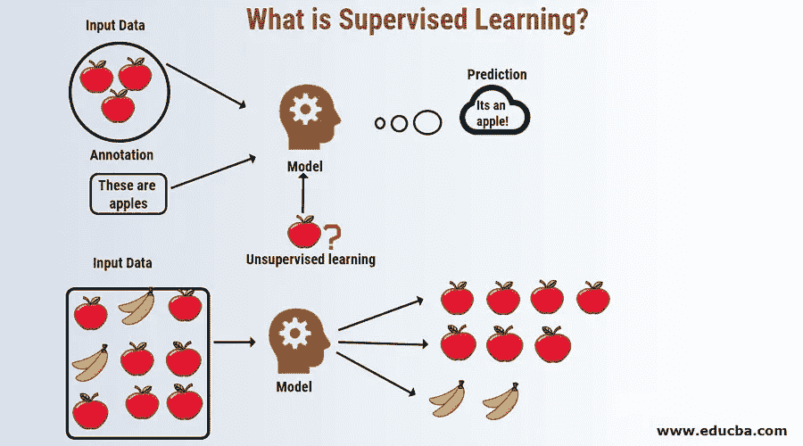
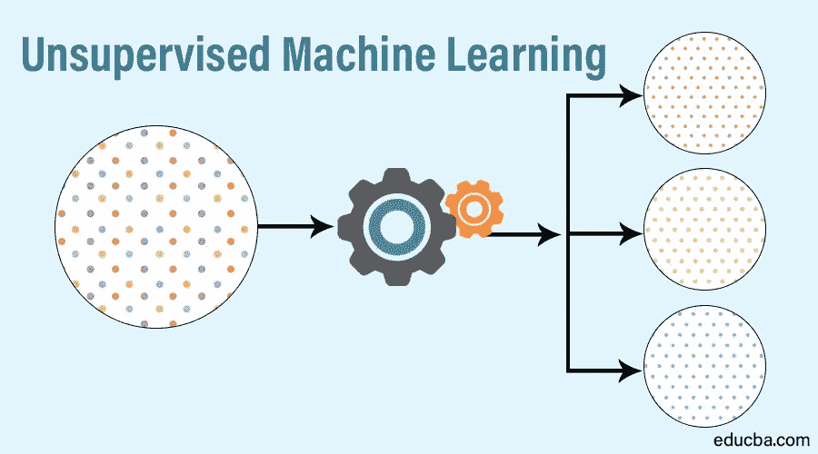
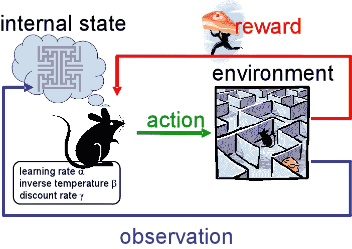

# 机器学习的第一步

> 原文：<https://medium.com/analytics-vidhya/first-step-in-machine-learning-3232338aa8f8?source=collection_archive---------13----------------------->

> 机器学习是我们身边最有影响力、最迷人、最强大的技术之一。

让我们从应该熟悉的三个基本单词开始:

1.  **数据**
2.  **信息**
3.  **知识**

图片提供:[http://www.knowledge-management-tools.net](http://www.knowledge-management-tools.net)

W 什么是机器学习？

我们意识到我们周围有大量的数据可用，从[*insta gram*](https://www.instagram.com/)*上的照片到 [*spotify*](https://www.spotify.com/in/) 上的歌曲。该*数据*随着时间不断增加，如果该数据被组织为*信息*，那么通过分析该可用数据可以做很多事情来预测某些值/模式。*

*机器学习作为一种工具帮助我们将信息转化为知识。机器学习技术用于自动发现复杂数据中的隐藏模式，这些模式可用于预测未来事件并执行各种复杂的决策和预测。*

> *机器学习在日常生活中的应用非常广泛。*

**

*人脸检测*

**

*推荐系统*

# *示例:*

*   ***人脸检测:**智能手机在拍照或自行解锁时检测人脸。*
*   ***欺诈检测**:银行使用机器学习实时检测欺诈交易。*
*   ***时间序列分析** : ML 用于预测股票市场价格。*
*   ***推荐:**社交媒体平台(像 [*【脸书】*](https://www.facebook.com/)[*LinkedIn*](https://in.linkedin.com/)等)推荐我们的朋友。像 [*亚马逊*](https://www.amazon.in/)&[*Flipkart*](https://www.flipkart.com/)*这样的电子商务网站会根据我们的浏览历史推荐美国的产品。**

# ****定义流程****

**一般来说，*机器学习*可以通过以下步骤用于解决现实生活中的问题:**

****步骤 1** :定义一个 ML 问题&提出解决方案。**

****第二步**:构建数据集。**

****第三步**:转换数据**

****第四步**:训练模特**

**第五步:使用模型进行预测**

****

**ML 如何工作**

> **因此，我们可以将机器学习定义为训练一个称为*模型*的软件的过程，以便做出有助于预测未来行动/活动的有用预测。**

# **学习的类型**

**我们有 3 大类:**

1.  **监督学习**
2.  **无监督学习**
3.  **强化学习**

**有监督的学习**

**这里的目标是学习一组输入和输出之间的映射。我们需要将特征和它们相应的标签放入一个算法中(这个过程被称为*训练*)，在算法中它确定特征&和它们相应的标签之间的关系。**

> **示例:假设我们将“天气预报”作为输入，将“海滩游客数量”作为输出。在这里，我们的目标是学习描述温度和访客数量之间关系的映射。**

****

**监督学习**

**U 非监督学习**

**这里，目标是识别数据中有意义的模式。该模型没有提示如何对每条数据进行分类&它必须推断出自己的分类规则。**

> **例:将不同颜色的硬币分成不同的堆。这里，没有提供关于类别的先验信息，因此模型将基于硬币的“颜色”属性给出不同的聚类。**

****

**无监督学习**

**强化学习**

**在这里，机器被训练做出特定的决定。它被暴露在一个环境中，在这个环境中，它不断地使用试错法来训练自己。机器从过去的经验中学习，并试图捕捉尽可能好的知识来做出准确的决策。**

> **示例:最短路径问题**

****

**强化学习**

# **各种 ML 问题的例子**

*   ****分类**:从 N 个标签中挑选 1 个。**

**例如:猫、狗、房子或熊)**

*   ****回归**:它是一种统计工具，用于确定因变量与一系列其他变化变量(称为自变量)之间的关系强度。**

***例*:降雨量(自变量)和作物产量(因变量)。我们用一个变量来预测另一个变量值。**

*   ****聚类**:相似实体的分组。**

***示例*:文档分析(将文档组织成不同的主题)**

*   ****关联规则学习**:推断数据中可能的关联模式。**

***示例*:如果您购买牙膏，您购买牙刷的可能性有多大。**

> **现在，一个问题可能会在我们脑海中挥之不去，这难道不类似于自动化吗？要回答这个问题，让我们看看两者之间的区别。**

## **机器学习和自动化有什么不同？**

**让我们举一个电子邮件的例子来理解它。自动化我们邮箱中的流程需要我们定义规则。这些规则每次都以相同的方式起作用。另一方面，机器学习帮助机器通过过去的数据/经验进行学习，并相应地改变它们的决策/性能。我们邮箱中的垃圾邮件检测是由机器学习驱动的。因此，它会随着时间不断发展。**

**因此，我们可以说，这两者之间的唯一关系是，ML 使我们能够更好地自动化。**

# **工具？**

**有几种工具和语言被用于机器学习。工具的选择可能因人而异，因为这取决于我们的需求和运营规模。下面列出了几种最广泛使用的方法:**

**语言**

*   **[R](https://www.r-project.org/about.html)**
*   **[巨蟒](https://www.python.org/)**
*   **朱莉娅**
*   **[Scala](https://www.scala-lang.org/)**

**数据库**

*   **[SQL](https://en.wikipedia.org/wiki/SQL)**
*   **[甲骨文](https://www.oracle.com/database/)**
*   **[Hadoop](https://hadoop.apache.org/)**

**V 可视化工具**

*   **[画面](https://www.tableau.com/)**
*   **[QlikView](https://www.qlik.com/us/products/qlikview)**

> **本人亲自用 python &编写代码，使用 [Jupyter](https://jupyter.org/) 、 [Spyder](https://www.spyder-ide.org/) 、 [Google Colab](https://colab.research.google.com/) 进行练习和开发。**

# ****资源:****

**要开始你的*机器学习*之旅，你可以参考 [ML 备忘单](https://drive.google.com/file/d/1QtAhf0Y0fzg4dUeF8ppILBPNDbrKeMDh/view?usp=drivesdk)。**

**链接:[https://drive . Google . com/file/d/1 qtahf 0 y0 fzg 4 duef 8 ppilbpndbrkemdh/view？usp=drivesdk](https://drive.google.com/file/d/1QtAhf0Y0fzg4dUeF8ppILBPNDbrKeMDh/view?usp=drivesdk)**