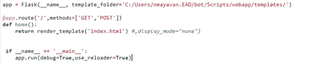

# 迈向 AI 的第一步。

> 原文：<https://medium.com/analytics-vidhya/first-step-towards-ai-aff672cf2110?source=collection_archive---------18----------------------->

图片由 Akila Balasundaram 提供

**构建聊天机器人(基于自然语言处理)应用**

问 **关于聊天机器人/对话代理的一点看法:**

它们是能够以书面或口头形式模仿人类反应的软件应用程序。聊天机器人也可以根据其业务目的用同义词来称呼，如聊天机器人、机器人、互动代理、互动助手、人工对话实体。

企业家为什么会转向为他们的业务实现聊天机器人？

答案直截了当，不像你的网站或应用程序，聊天机器人不仅仅局限于被动的用户体验，而是提供高度互动的营销活动。

此外，聊天机器人全年 365 天全天候可用，并且能够同时处理 N 个用户。这些品质超越了人类的限制，同时能够模仿人类的互动*。(资料来源:marutitech.com，Investopedia.com)。*

不多拖了，直接说重点吧。聊天机器人有两种类型，

1)基于规则的聊天机器人

2)基于人工智能的聊天机器人

**基于规则的聊天机器人:**基于规则的聊天机器人根据提供给它们的一组命令/规则进行交互。他们使用动态搜索来回答问题，并且不能在代码之外进行交互。

**基于人工智能的聊天机器人:**这些聊天机器人使用自然语言处理来回答你的问题，通过从问题和答案的历史中学习，它们的效率随着时间的推移而提高。

在这篇文章中，我们将看到使用 python 和 flask 创建一个基于 NLP 的聊天机器人应用程序的过程。

**要求:**

*   Python 3.6
*   瓶
*   需要安装的库有:

1)NLTK

2)烧瓶

3)泡菜

4) Joblib

5) Json

6) Tflearn

7)张量流

8)数字

*   您选择的 IDE(确保在中编写功能。py 文件，因为 flask 不能与。ipynb 文件)

让我们将这个过程大致分为两个部分，

1)创建执行 AI 操作的 python 文件。

2)创建一个 HTML 文件来与用户交互。

在开始之前，请确保您已经创建了一个虚拟环境，并安装了上一节中提到的所有依赖项。(我们计划安装依赖项，并在单独的环境中创建应用程序，以便任何其他版本的 python 或其他库(如果已安装)不会干扰我们的代码和它应该工作的方式。)

烧瓶上的 rief ing:

Flask 是一个基于 web 的微框架。它之所以被称为微框架，是因为与它的对应物不同，它只提供了实现 HTTP 端点所必需的一组特性。数据科学家更喜欢使用 flask 进行应用程序开发，因为它是轻量级的，只需要很少的代码就可以将 python 函数转换成 HTTP 端点。

假设读者事先了解用于数据分析和构建机器学习模型的库和函数。从现在开始，我将解释专门用于 web 应用程序创建的元素或功能。

使用“virtualenv”命令创建一个新环境，并安装所有依赖项。为应用程序创建一个新文件夹，在我的例子中，我创建了一个文件夹“web-app”(在 <virtual environment="" name="">/scripts 中)，在其中我创建了名为 model，templates 的子文件夹。</virtual>

***第 1 部分:创建包含要实现的功能的 python 文件。***

*render _template:* 用于渲染模板(即 HTML 文件)，而不是从函数返回硬编码文本。你需要做的就是创建一个基本的 HTML 文件，并把它放在模板文件夹下。

*请求:*来自 html 页面(来自用户浏览器)的用户输入作为请求对象发送到 web 服务器

这个模型的输入文件是一个名为“intents”的 json 文件，它存储了用户输入模式和适当响应的列表(以字典的形式)。通过使用这个文件，我已经，

*   将标记化(将较大的文本分割成较小的行)和词干化处理(将单词中的词形变化减少到其词根形式，例如单词“dogs”减少到其词根单词“dog”)应用到用户响应的模式，并将其保存到“单词”中，将标签保存到“标签”中。
*   Training 包含词干单词的数字等价物，因为我们所有的机器学习算法都可以很好地处理数字，而不是字符串。对于这个过程，我们使用**“单词包**”算法。
*   输出——像模型的输入一样，我创建了一个列表，它将表示我们的数据中标签数量的长度。列表中的每个位置将代表一个唯一的标签。

例如，假设排序的标签是[“问候”、“再见”]，假设在问候标签下有 3 个响应，在再见标签下有 2 个响应。所以我总共有一个 5 个元素的列表[x，y，z，c，a]

x，y-标记问候，z，c，a-标记再见。

x，y 将表示为[1，0] 1 表示问候，0 表示再见

z，c，a 将表示为[0，1] 0 表示问候，1 表示再见

输出= [[1，0]、[1，0]、[0，1]、[0，1]、[0，1]]

*   保存的单词、标签和带有值的训练密钥对被生成为 pickle 文件( **data.pkl** )。我们将把这个 pickle 文件直接用于我们的应用程序。

*   我已经使用 tflearn 库训练了我们的数据，并保存了这个模型。我们将在应用程序中使用这个保存的模型。将这个模型放在子文件夹“模型”下。

完成后，我们将首先编写一个基本的 flask 应用程序，然后继续为其添加功能。

在上面的代码片段中，我们使用 decorator @app.route('/')将 home 函数注册为端点。

GET 和 POST 是使用 HTTP 协议执行从客户端到 web 服务器的请求的方法。GET 携带附加到 URL 字符串的请求，而 POST 在请求体中携带参数。

在 home 函数中，我们已经简单地呈现了一个 HTML 文件，所以我们的下一步是创建一个可以使用该函数呈现的基本 HTML 文件。

我猜人们对这个 HTML 文件中使用的大多数标签都很熟悉，但是我将继续解释几个重要的标签。

我们已经使用了，

标签:定义一个容器或者 HTML 页面的一个部分，这样当我们将一个样式应用到一个部分时，它将应用到包含在其中的所有元素。

标签:是一个文本编辑控件，允许用户输入自由格式的文本。

让我们将这个 HTML 文件放在应用程序所在的模板文件夹下，并尝试运行应用程序。

要运行应用程序:

只需导航到应用程序所在的路径，并输入命令 python <application_name>。巴拉圭</application_name>

**Tada！！当从应用程序调用时，下面是我们的渲染 HTML 文件。**

到目前为止，我们已经创建了一个运行并与服务器通信的基本应用程序。下一步是将核心功能添加到这个框架中，以实现我们的 python bot 应用程序。

回到起点，那是我们的 py 文件，我们将把 intents.json 文件作为数据加载。

这是为了让机器人选择适当的响应，一旦它处理了来自用户的输入字符串并给它分配了一个标签。

我们还将定义单词包算法，它用于处理用户输入。

使用@app.route('/chat '，methods=['GET'])定义另一个函数 chat 并建立另一个端点

注意，我们用 request.args.get('msg ')给 inp(输入变量)赋值，其中 **msg** 是我们之前在 HTML 文件中定义的<**textarea**>**name**。

现在我们已经完成了 app.py 文件，让我们继续看 HTML 文件并建立连接。

在 HTML 页面的头部添加下面一行代码。

****

放置在

**它有什么作用？**

jQuery 接受了许多需要多行 JavaScript 代码才能完成的常见任务，并将它们封装成只需一行代码就能调用的方法，如 ajax、CSS 操作、HTML 事件方法等。(*来源 w3schools.com*)

编辑 HTML 代码，例如将动作和方法添加到表单标记中

**form id = " chat-box " class = " chat-box " action = " { { URL _ for(' chat ')} } " method = " post ">**

**<textarea id = " input text " name = " msg " placeholder = "在此键入内容与我聊天。"> < /textarea >**

**</表格>**

方法的 URL 生成端点聊天的 URL，操作方法将用户数据(msg)传递给聊天方法。

下一步是以聊天格式显示用户输入和来自 bot 的响应。我们将使用一个 java 脚本函数“getBotReply”来建立这一点。确保这段代码放在标签中。

代码非常简单明了，但是我将解释我们如何从应用程序获得预测的机器人响应。

如您所见，$ get 函数访问我们在 python 中创建的端点“/Chat”，并将我们的模型返回的数据存储到 botHTML 中。

确保将该脚本放在标签的结尾之前。经过一些样式化和调整后，我们得到了一个基于 NLP 的全功能 python 聊天机器人应用程序。

耶！！！我们已经使用 NLP 和 Flask 构建了我们的第一个 AI 应用程序。看看我们的申请。

C **结论:**

一旦应用程序准备就绪，您就可以通过创建一个帐户来部署 Heroku(这将是以后的话题)。

因此，我们通过开发一个使用 NLP 与用户聊天的 python 机器人，向人工智能迈出了第一步。多酷啊！我真的很高兴能和你们一起学习，我真诚地希望你们也一样。我将非常感谢关于这篇文章的反馈和建设性的批评。如果你有任何问题，请随时通过 LinkedIn 联系我

G **IT HUB 链接:万一你想看看我的代码。**

[https://github . com/AkilaBalasundaram/Medium/tree/web app/web app](https://github.com/AkilaBalasundaram/Medium/tree/webapp/Webapp)