# Excel 用户使用 Pandas 的第一步

> 原文：<https://medium.com/analytics-vidhya/first-steps-in-pandas-for-excel-users-40eed0b390a4?source=collection_archive---------16----------------------->

如果你用的是自己的电脑，你必须[安装](https://pandas.pydata.org/pandas-docs/stable/install.html)做`pip install pandas`(假设你用的是`pip`)。

Pandas 的主要数据结构 DataFrame 是一个二维(*)对象，类似于我们的 Excel 表格。在这节课中，我们将分析两者之间的相似性。

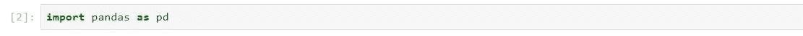

我们将从阅读本课的 Excel 文件开始。

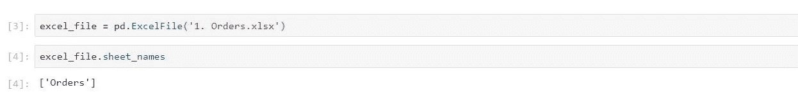

# 将`Orders`表读入数据帧

```
>>df = excel_file.parse('Orders')
```

变量`df`包含一个熊猫`DataFrame`，它包含了我们 excel 文件中`Orders`表的所有信息。

数据框架类似于 Excel 表格:

```
>>df.head(10)
```

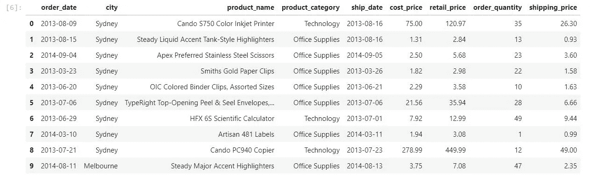

主要的区别在于，当我们处理数据帧时，我们并不总是有数据的视觉参考。我们知道它在内存中，我们知道每一列包含什么，但是我们没有整个数据帧的视图。这样做的原因是 Pandas 被设计为处理数百万行数据。

# 大局

处理大量数据可能会有问题。因此，我们不总是直接查看数据表，而是喜欢关注大图:*我的数据帧包含什么？*。正如您之前看到的，方法`.head()`和`.tail()`对于了解我们正在处理的数据非常有用:

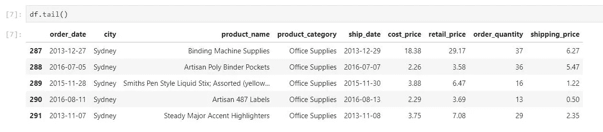

但是我们也可以使用一些其他的方法或属性来补充这个引用。例如，我们可以检查数据帧的`shape`，以了解我们的数据是如何构造的:

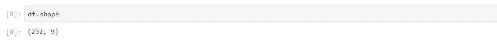

在这种情况下，`shape`告诉您这个数据帧包含`292`行/记录和`11`列。我们还可以查看我们的列的详细信息

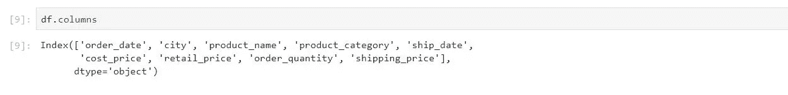

> ***重要:*** *注意*`*shape*`*`*columns*`*被调用时没有括号:只是* `*df.shape*` *。那是因为它是一个*属性*而不是一个*方法*。**

*我们还使用一些方法来汇总所有数据，从而提供更全面的信息。其中之一是`.describe()`，我们在讨论列类型时还会看到`.info()`:*

*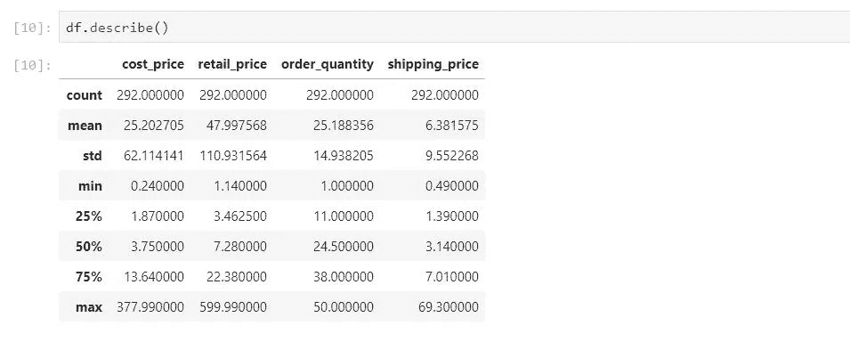*

*如您所见，`.describe()`提供了所有“数字”列的汇总，包括`count`(有多少行)和一些其他的统计方法:`mean`、`std`等。*

**

# *列选择*

*要“放大”您的数据框架，并选择特定的列，我们使用的语法是:*

*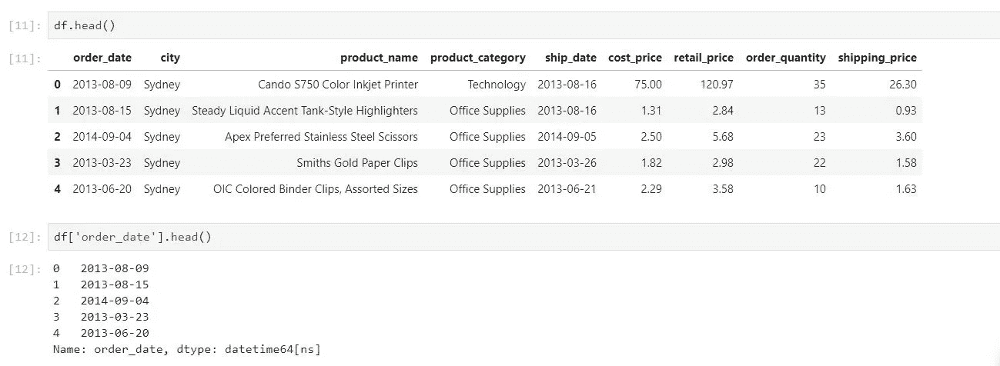**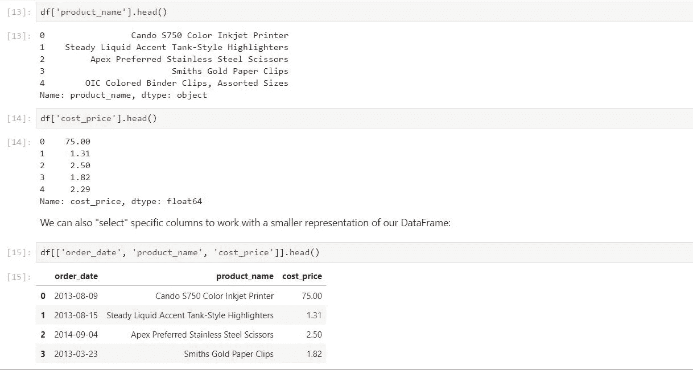**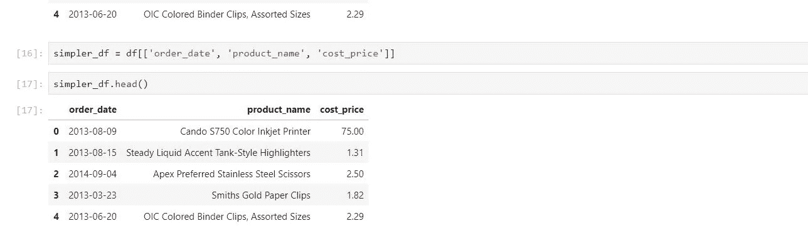***

# *列类型*

*熊猫数据帧中的每一列都有特定的类型。这是**非常重要的**。该列有一个**固定的**，预定义的类型，这意味着我们不能在同一个列中混合类型。这与 Excel 不同，在 Excel 中，我们为列设置一个“格式化”类型，但是我们可以存储任何我们想要的值。*

*我们可以使用`.info()`方法来查看每一列的数据类型:*

*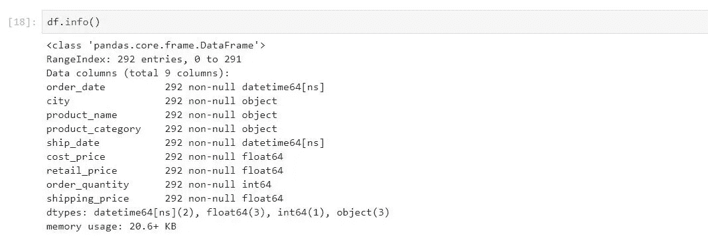*

# *熊猫中的列类型*

*Excel 中只有三种数据类型:*

*   *数字(数字、货币、会计、日期)*
*   *文本*
*   *公式*

*Pandas 中的数据类型被称为 **dtypes** ，主要有:*

*   ***int** 和 **float** :针对整数和浮点数*
*   ***日期时间**和**时间增量**:特定于日期和偏移量*
*   ***对象**:就是`strings`，它们是用来存储文本的，但是熊猫称它们为`object` s。*
*   ***布尔值**:特定于真/假值*

*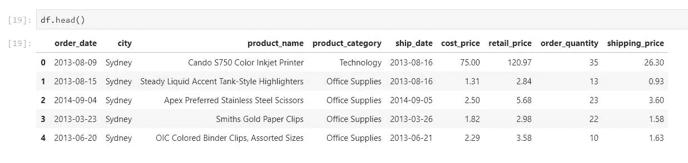*

# *编号:`int`和`float`*

*这些是数字列，支持所有常规算术运算。在我们当前的订单数据框架中，这些是数字列:*

*   *`order_quantity` : int*
*   *`cost_price`:浮动*
*   *`retail_price`:浮动*
*   *`shipping_price`:浮动*

*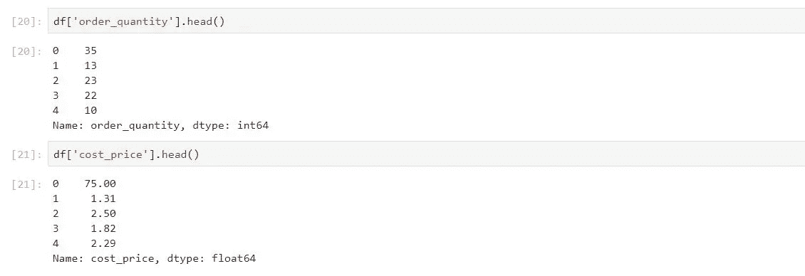*

*还记得我们使用`.describe()`方法时，只包含了数字列。*

## *数值运算和方法*

*数字列支持多种操作(我们将在下一节中看到)以及一些非常有用的方法，例如:*

*`**mean**` **:该列的平均值***

```
*>df['cost_price'].mean()25.202705479452057*
```

*`**std**` **:列的标准偏差***

```
*>>df['cost_price'].std()62.11414058290448*
```

*和其他一些人。但是我们甚至可以在列本身中运行一个`.describe`:*

```
*>>df['cost_price'].describe()count    292.000000
mean      25.202705
std       62.114141
min        0.240000
25%        1.870000
50%        3.750000
75%       13.640000
max      377.990000
Name: cost_price, dtype: float64*
```

## *算术运算*

*数字列允许我们用它们执行常规的算术运算。例如:*

```
*>>df['cost_price'].head()0    75.00
1     1.31
2     2.50
3     1.82
4     2.29
Name: cost_price, dtype: float64*
```

*我们可以增加 10%的价值:*

```
*>>df['cost_price'].head() * 1.100    82.500
1     1.441
2     2.750
3     2.002
4     2.519
Name: cost_price, dtype: float64*
```

*请注意，前面的操作没有更新底层数据帧，它只是显示了一个结果。我们再来看看`cost_price`:*

```
*>>df['cost_price'].head()0    75.00
1     1.31
2     2.50
3     1.82
4     2.29
Name: cost_price, dtype: float64*
```

*如果你想覆盖一列的内容，你必须设置它的*等于*那个值:*

```
*>>df['cost_price'] = df['cost_price'] * 1.08*
```

*现在变化是永久性的:*

```
*>>df['cost_price'].head()*
```

*我们也可以写:*

```
*# df['cost_price'] *= 1.08*
```

*我们也可以在数据框架中创建新的列。我们通过设置列*的值等于*某个值来实现。例如，我将创建只包含值`-1`的列`Dummy Column`。*

*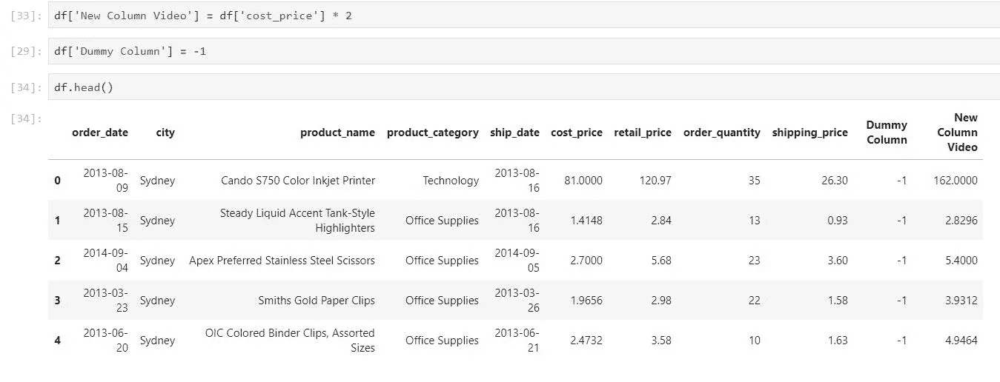*

*我可以使用`del`关键字删除该列:*

*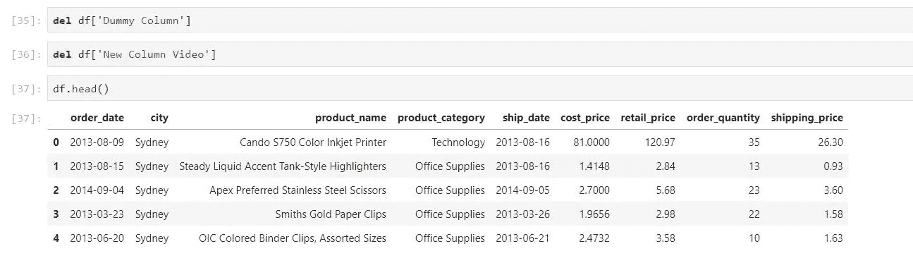*

*让我们看一个新列的更有用的例子。假设我们想要计算一个新的列`total_price`，它是使用下面的公式计算的:*

*total _ price = retail _ price∫order _ quantity+shipping _ price total _ price = retail _ price∫order _ quantity+shipping _ price*

*做这件事的方法很简单:*

*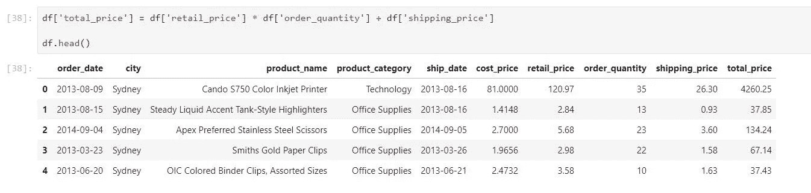*

# *日期时间(和时间增量)*

*订单数据框架中的以下各列属于`datetime`类型，也称为时间戳:*

*   *`order_date`*
*   *`ship_date`*

*我们将通过检查`order_date`和`ship_date`之间的天数来计算`shipping_delay`:*

```
*df['ship_date'].head()0   2013-08-16
1   2013-08-16
2   2014-09-05
3   2013-03-26
4   2013-06-21
Name: ship_date, dtype: datetime64[ns]*
```

*Datetime 列也支持算术运算，结果是 *timedeltas* (或 *offsets* )。例如:*

*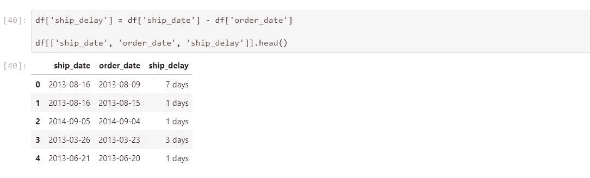*

*`7 days`是一个“相对时间”，或一个*时间增量*(一个`timedelta`)。我们还可以将时间增量与我们的列结合使用:*

*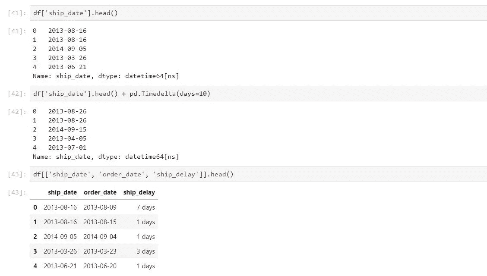*

# *字符串(类型`object`*

*任何类型的文本(长、短、包含或不包含特殊字符)在数据帧中都是类型`object`。尽管在 Python 中我们只知道它们是字符串。以下列为字符串:*

*   *`city`*
*   *`product_name`*
*   *`product_category`*

*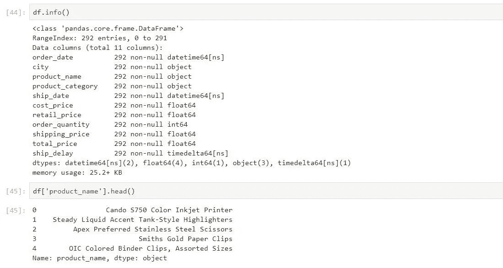*

*字符串支持某些操作，例如，简单的连接:*

*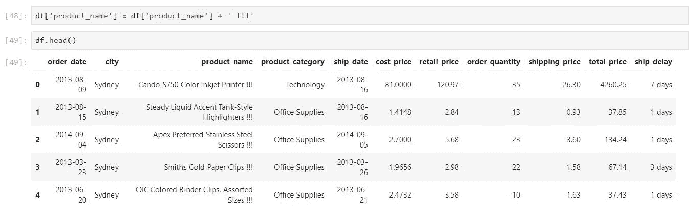*

*使用`.str`属性，我们可以执行更高级的操作:*

*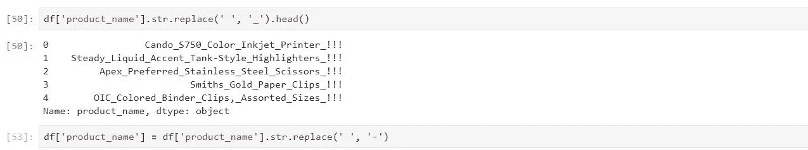**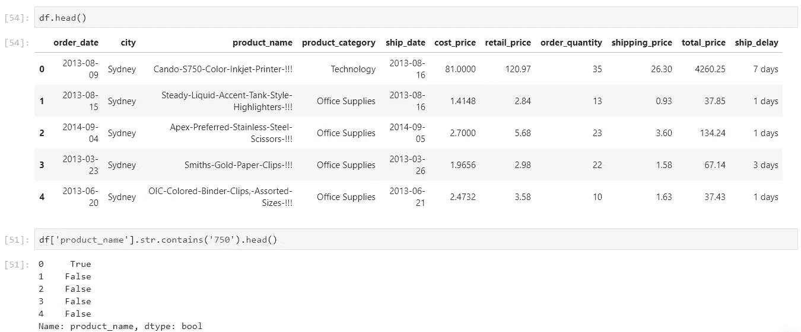*