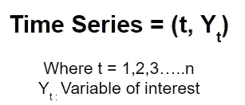
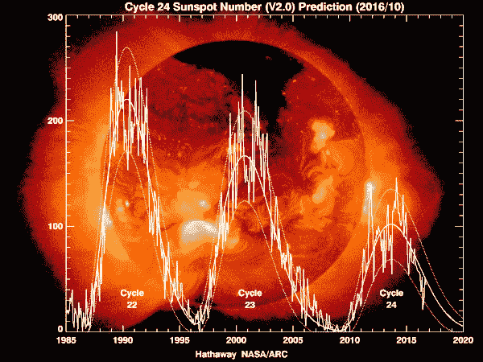
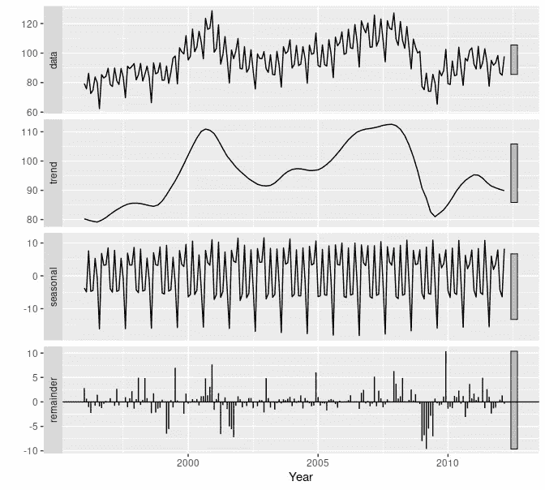
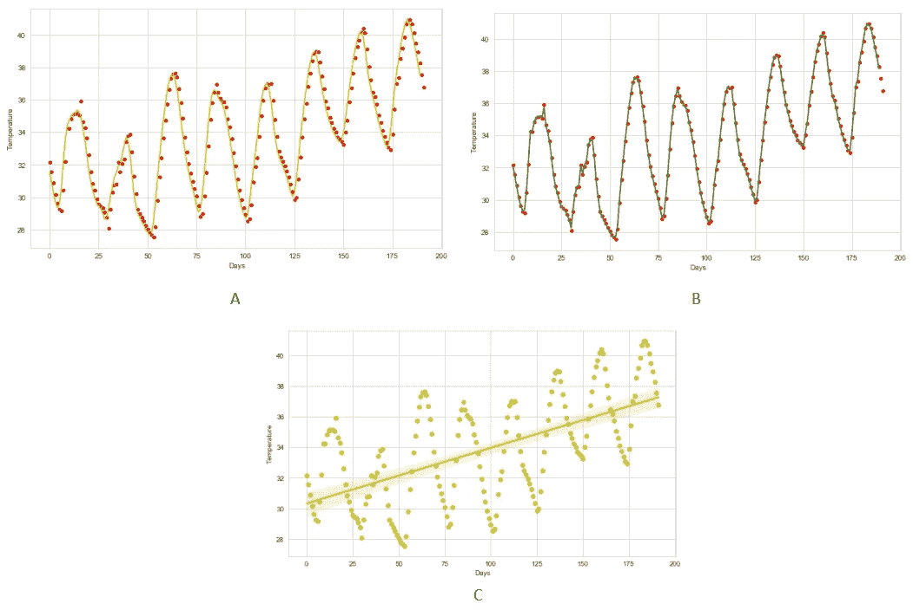
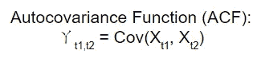

# 时间序列分析的第一步

> 原文：<https://medium.com/analytics-vidhya/first-steps-in-time-series-analysis-23410f5d5254?source=collection_archive---------9----------------------->

## 输入法系列(TS)被认为是数据科学领域中鲜为人知的技能之一。这篇文章是 ts 中概念的入门文章，还会有更多内容。

由[柯蒂斯·麦克牛顿](https://unsplash.com/@curtismacnewton?utm_source=unsplash&utm_medium=referral&utm_content=creditCopyText)在 [Unsplash](https://unsplash.com/s/photos/time?utm_source=unsplash&utm_medium=referral&utm_content=creditCopyText) 上拍摄的照片

从我们知道数据包含趋势并且我们可以从中提取知识的时候起，我们就开始收集数据。在某些情况下，我们试图从时间不太长的数据中得出趋势。因此，我们没有发现任何与时间有关的趋势。

但是现在，经过几十年的数据收集，我们至少可以发现一些与时间相关的模式，这被称为**时间序列分析**。

# 什么是时间序列？

一段时间内连续记录的一系列观察值，即与时间戳一起记录的观察值的集合，称为时间序列。

## 表现

时间序列的表示

感兴趣的变量可以是单变量，即单个变量，或者是多变量，即变量的集合。

## 最古老的时间序列

**太阳周期**或**太阳磁活动周期**是太阳活动的一个近 11 年的周期性变化，根据太阳表面观测到的太阳黑子数量的变化来测量，因此大约有 400 年的历史。这些观测数据从 17 世纪就开始收集了。

来源:[维基百科](https://en.wikipedia.org/wiki/Solar_cycle)

# 时间序列中的主要特征

时间序列有四个主要的特征

1.  **时间趋势分量:**
    它是一个时间序列的长期的、平滑的特征称为时间趋势分量。
2.  **季节变化分量:**
    一个时间序列在一年内趋于每年重复的变化模式称为季节分量。
3.  **长期周期性变化:**
    一个时间序列在一年以上的周期内的涨落称为长期周期性变化。
4.  **不规则变化:**
    它是一个时间序列的随机随机分量。

前三个趋势被称为**确定性成分**，因此可以通过常规方法确定，而不规则成分被称为**随机成分**，我们需要对其进行估计或拟合模型。

我们使用各种技术，如**统计假设测试方法**来测试组件的存在和重要组件的估计。

# 时间序列的分解

我们使用各种方法将时间序列分解成时间趋势、季节趋势和随机趋势。分解看起来像:

时间序列的分解；来源:otexts.com/

## 趋势分解:

我们使用像简单移动平均线这样的技术来平滑时间序列并获得时间趋势。对于更复杂和先进的时间序列，我们可以使用加权移动平均或指数移动平均的扩展。

我们还可以使用最小二乘法拟合将时间趋势概化为一条直线，或者使用更复杂的函数，如二次或三次函数来拟合数据。

a:简单移动平均，B:加权移动平均，C:最小二乘拟合

## 季节性分解:

季节性成分的估计取决于趋势是否存在。在趋势存在的情况下，我们首先估计趋势(缓慢或快速变化)，然后从去趋势的时间序列中提取季节性因素。

# 平稳的形式

## 流程规范:

为了完整地描述一个随机过程，我们必须指定所有的有限维分布，即任意有限时间点的随机变量的联合分布。

一种更简单的方法是只指定基本随机过程的矩，即时间序列的均值和方差。

## 自动协方差函数:

因为组成系统的随机变量通常不是独立的。它们是随时间顺序观察的。因此，我们还必须指定它们的协方差来提取时间相关结构。

自动协方差函数

## 平稳性

它被定义为一个时间序列在一段时间内的统计平衡。有两种类型的平稳性

1.  **严格平稳性**
    任意随机变量集合的联合分布函数不随位置移动而变化。既没有均值的系统性变化，也没有可变性。分析和建模要求时间序列是平稳的。
2.  **弱平稳性或协方差平稳性**
    其中均值和自协方差函数不依赖于参考的时间点。

# 总结

这是对时间序列的一个很好的概述。它的组成部分是什么？什么类型的分析是可能的？并简要介绍了 400 年前的时间序列。

本文给出了更多的理论理解，而不是分析时间序列的数学工具。因此，我想再发表几篇关于时间序列的理论理解及其背后有趣的数学的文章。