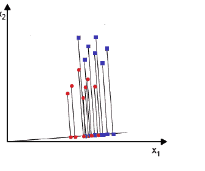
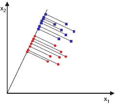
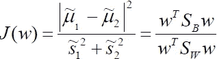
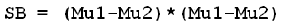
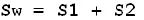
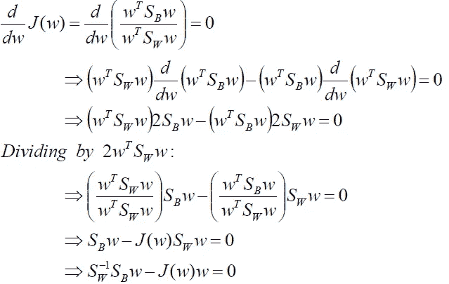
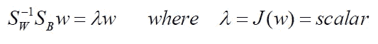
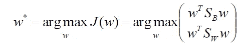

# 费希尔线性判别分析(LDA)

> 原文：<https://medium.com/analytics-vidhya/fisher-linear-discriminant-analysis-lda-fe3554800e06?source=collection_archive---------8----------------------->

LDA 的目的是降低数据的维数。

**为什么是 LDA 而不是 PCA？**

**原因**:主成分分析有助于找到方差最大的方向，我们将数据投射到这个方向上。

让我们来看一个数据集，它有两个类标签 y=1 和 y =-1，这两个类平行放置并且非常靠近，当它们被投影用于分类时，这会导致一种可怕的情况(两个标签混淆)。

所以我们可能会丢失有用的信息。为了保存尽可能多的类别歧视数据，我们实现了 LDA。

好吧！让我们深入探讨一下这个概念…

**LDA 的目标**:

为投影寻找一个向量，这样类别之间将有最大的可分性。

通过将样本投影到直线上，我们得到一个标量“y”

以上两个阶层并没有分开多少。所以我们找到了另一个给出最大间距的向量。

通过将样本投影到直线上，我们得到一个标量“y”

因此，最佳投影向量可以通过最大化函数 J(w)来获得。

线性判别分析的目标函数

J(w)是通过类内散布矩阵的度量标准化的类均值之间的差异的度量。

**J(w)的分子测量投影平均值之间的距离，即 Between_ Class_Scatter_Matrix。**

Mu1 和 Mu2 是样本类的平均值

**J(w)的分母测量类内可变性的总和，即类内散布矩阵。**

S1 和 S2 是样本类的协方差

我们将 J(w)求导到零以获得最大值，

求解上述方程得到以下特征值(λ)。

我们计算特征向量(投影向量)的特征值。

给出投影向量方向的线性判别式

**其他作品包括…**

 [## 谷歌网页排名和马尔可夫链

### 无论何时你在谷歌上查询，你都会得到基于网页排名的网页。页面排名…

medium.com](/analytics-vidhya/google-page-rank-and-markov-chains-d65717b98f9c)  [## 使用自举(数学直觉)的置信区间

### 计算均值、中值、方差和标准差的置信区间。自举是一种…

medium.com](/@ravi_ernesto/confidence-interval-using-bootstrapping-mathematical-intuition-3f39969c4f72)