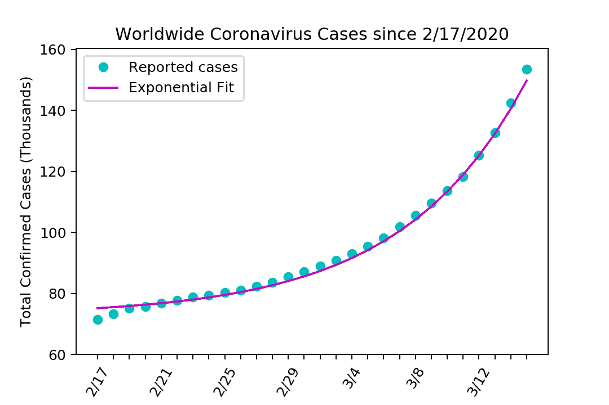
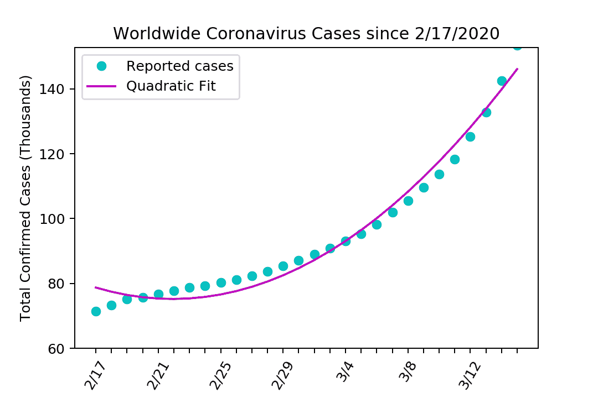
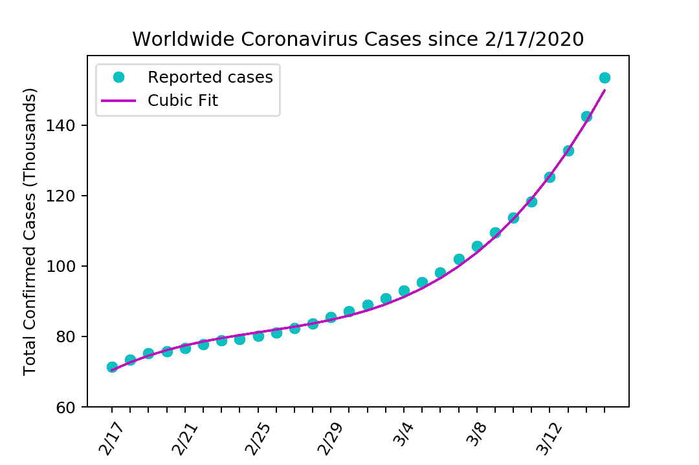
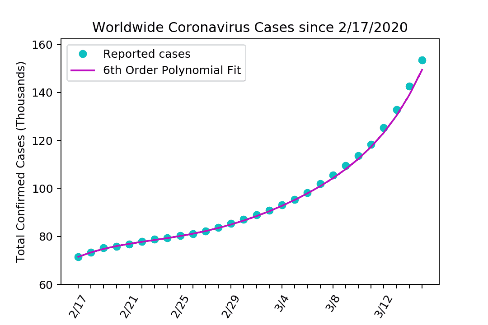
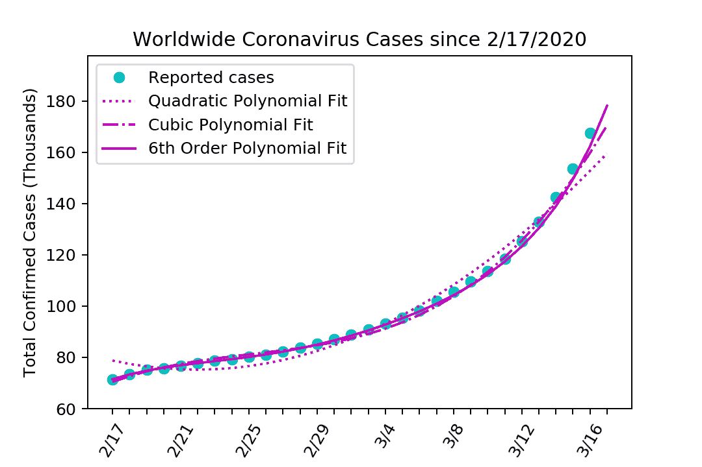
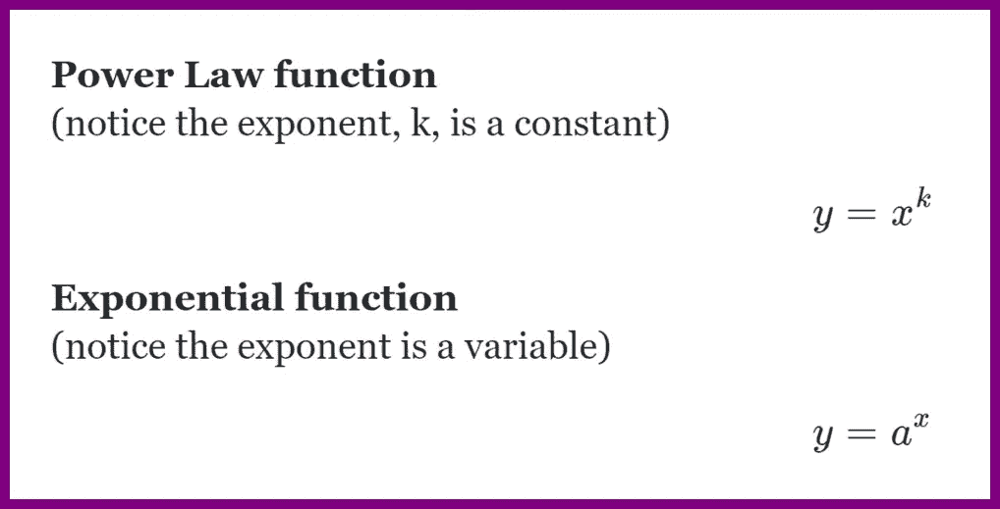
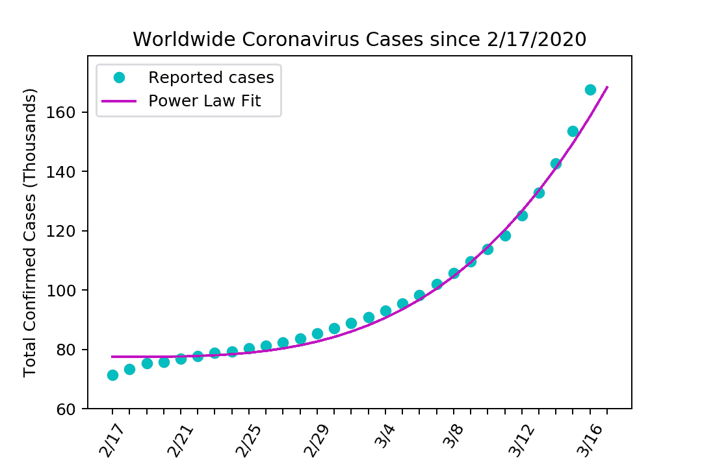

# 用 Python、SciPy 和 Matplotlib 拟合和可视化流行病增长

> 原文：<https://medium.com/analytics-vidhya/fitting-and-visualizing-epidemic-growth-with-python-scipy-and-matplotlib-4ac11d06a513?source=collection_archive---------18----------------------->

*SciPy* ，一个用于科学计算和技术计算的 Python 库，可以用来拟合任意函数到现实世界的数据点。利用 *SciPy* 、 *NumPy、*和 *Matplotlib* ，我用几个简单的增长模型拟合了现实世界中冠状病毒的感染人数。

## 简单指数增长

术语“指数增长”通常用于描述快速增长的数字。我将指数模型定义为:

```
def exp_growth(t, a, c, d):
    return a*numpy.exp(c*t)+d
```

其中 a、c 和 d 是被修改以优化模型拟合的模型参数，t 表示经过的时间。我用 *matplotlib* 和 *imageio* 绘制了拟合模型，以预测未来增长:



## 多项式增长

接下来，我创建了二阶、三阶和六阶多项式模型。它们配有*编号*并绘制如下:



二次、三次和六次多项式拟合



二次、三次和六次多项式适合单个图

显然，6 阶模型最准确地拟合了历史数据。合乎逻辑的是，模型能够更准确地对数据建模；这一特性可以用泰勒展开式来验证。使用高阶多项式拟合时，注意[龙格现象](https://en.wikipedia.org/wiki/Runge%27s_phenomenon)很重要。

## 幂律增长

在幂律关系中，一个量作为另一个量的幂而变化。我对冠状病毒数据拟合了以下幂函数:

```
def power_growth(t, a, b, c):
    return a*t**b + c
```



幂函数与指数函数简化形式的比较。在我的程序中，我添加了额外的常量作为函数参数。

我制作的模型没有一个是为疾病传播建模而优化的。然而，它们可以说明冠状病毒在世界各地增长的基本性质。

我分析的数据由世界卫生组织(T21)提供。数据最后更新于 2020 年 3 月 18 日。