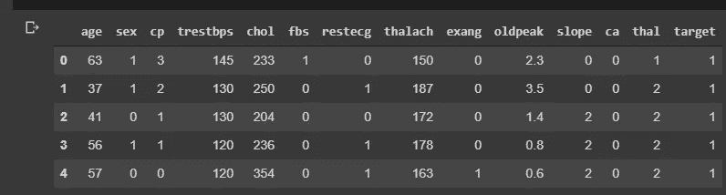
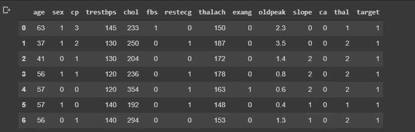
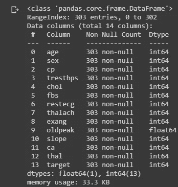
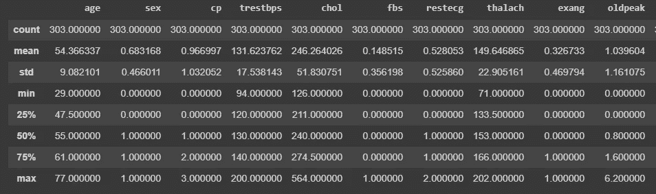

# 你应该使用的熊猫的五个基本功能

> 原文：<https://medium.com/analytics-vidhya/five-basic-pandas-functions-you-should-be-using-fe66877ca751?source=collection_archive---------29----------------------->

## 图书馆熊猫使我们的生活更容易

如果你想成为一名数据科学家，学习使用 Python 处理数据是个不错的主意。然而，仅仅学习 Python 并不能让你成为一个多产的专业人士，你需要学习一些库来帮助你处理数据并以一种快速简单的方式提供见解，其中之一就是 Pandas。

*首先，熊猫是什么？*

《功夫熊猫》

它不是上图中的那只熊猫。**是一款快速、强大、灵活且易于使用的开源数据分析和操纵工具，构建在*[*Python*](https://www.python.org)*语言之上。**

*现在我们已经知道我们在谈论什么，让我们开始编码和解释。*

**

**在这篇文章中，我们将使用数据集* [*医疗保健:心脏病发作可能性数据集*](https://storage.googleapis.com/kaggle-data-sets/737503%2F1278636%2Fbundle%2Farchive.zip?GoogleAccessId=gcp-kaggle-com@kaggle-161607.iam.gserviceaccount.com&Expires=1594480967&Signature=qH8HD%2FWTSt8lmq0%2FfE5gQm%2F5tq1k1f6FSxDAc8LmJ2SRO3BPNdtVg3%2ByWpYrG2edLAATLfCMFsdJLXjzrsOrzZ3Zgpf%2FKJOv5dNq6HcdaFK1MfP0pSN7fGPzR902UMPoSDEzuDwjVenPnrZtXBknEXNybCpMB9W5o2QjO1AzvYiZ7jcNPUiBF5JL8R3mzasnPFXQpGYGgqu320GcBHmUwVsR8Gr83xY5MT7oTRlMhVEaFAt7kVf%2BonVdL8mfJ%2BusgJR4hfWwzdmNbbQonOiB9Q95y5V8haGRKlnydsvV6yXPXoMzZQoarM%2BeBtQzNfIbAIufJ5VRdTEL5QfNyIb%2Bhw%3D%3D) *来自 Kaggle，ka ggle 是寻找数据集和参加比赛的最佳网站之一，因此这是另一篇文章的主题。**

**

# *导入库*

*最后让我们开始编码，我们需要做的第一件事是导入熊猫库，我忘了说我们将把熊猫库命名为 pd，因为这是一个很好的实践。*

*`**import pandas as pd**`*

# *打开文件*

**现在我们要用第一个函数打开文件，为此我们要用* `***read_csv()***` *的方法，因为我们的文件是 cvs 格式的。我们还有*`***read_excel()***`*`*read_json()*`*等方法。***

**`**df = pd.read_csv('heart.csv')**`**

# **数据可视化**

***文件打开后，我们可以使用第二个函数来可视化数据集的许多行，为了做到这一点，我们需要方法* `*head()*` *默认情况下，它显示前五行。我们可以在括号内输入数字，指定要显示多少行，如下:***

**`df.head()`**

****

**`df.head(7)`**

****

# **显示信息**

***我们还可以使用* `*info()*` *功能查看我们数据的一些特征。该函数显示一些有用的信息，如总列数、总行数、数据类型以及每列中非空数据的数量。***

**`df.info()`**

****

# **描述数据**

***另一个分析数据的有用功能是* `*describe()*` *。这个函数帮助你看到一些基本的统计细节，如百分位数，平均值和标准偏差。***

**`df.describe()`**

****

# **拆分数据**

**最后但同样重要的是，我们有函数 value_counts()。它用于获取包含唯一值计数的序列，当您需要将一些序列(如性别)拆分为男性和女性以查看每个组的总数时，这很有用。**

**`df[“sex”].value_counts()`**

****

# **现在，你的熊猫之旅开始了！**

**我希望你现在确信 Pandas 库对于探索性数据分析是有用的。是时候获取一些数据了。**

**如果你想了解更多关于熊猫图书馆以及如何进行探索性的数据分析，看看这篇[帖子](/@luispaulobezerra3/exploratory-data-analysis-eda-brazilian-houses-to-rent-587d78fd1ec9)。**