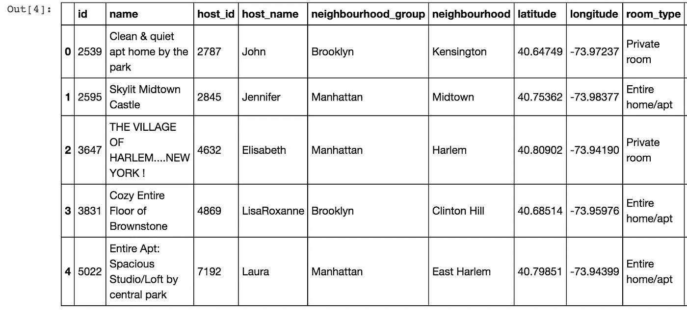
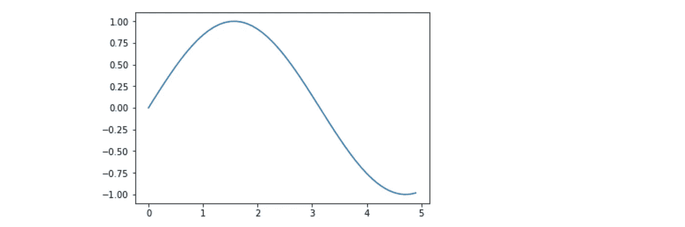
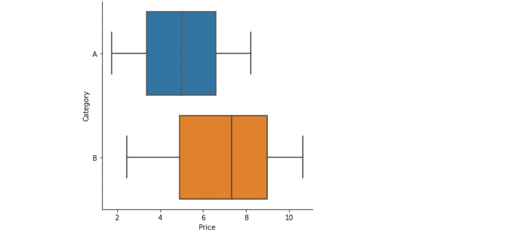

# 数据科学初学者必须知道的五个 Python 包

> 原文：<https://medium.com/analytics-vidhya/five-packages-that-a-total-beginner-in-data-science-must-know-5738efcc63dd?source=collection_archive---------31----------------------->

帮助我进行数据分析的五个 Python 包


如果您是数据科学研究的初学者，本文将帮助您了解一些数据科学中常用的 python 包。所以它肯定不会深入每个包。我将列出我在数据分析中使用的五种方法。

1.  [NumPy](https://numpy.org/devdocs/user/quickstart.html) :方便数组中的数据管理，并对其进行快速操作。

让我们导入 NumPy 并验证它的文档:

np？返回 numpy 的内置文档，因此它列出了在数据分析中使用 NumPy 的一些优点:

```
NumPy
 1\. An array object of arbitrary homogeneous items
 2\. Fast mathematical operations over arrays
 3\. Linear Algebra, Fourier Transforms, Random Number Generation
```

让我们看一个例子:

这个例子使用 numpy 来获得一个列表的平均值。

2. [Pandas](https://pandas.pydata.org/pandas-docs/stable/index.html) :它构建在 NumPy 之上，我首先使用它来读取我分析中的数据集，所以我将导入并读取一个文件，如下所示:

所以我用了。read_csv 函数读取一个 csv 文件在这种情况下，有许多类型的文件你可以使用熊猫来读取。请查看[熊猫指南](https://pandas.pydata.org/pandas-docs/stable/user_guide/io.html)以获取更多信息。

现在让我们看看做 pd 带来了哪些关于熊猫的文档？在您的 IPython 终端中。

在这里，我将只列出我认为比较重要的几个项目:

```
- Robust IO tools for loading data from flat files (CSV and delimited), Excel files, databases, and saving/loading data from the ultrafast HDF5 format.- Time series-specific functionality: date range generation and frequency conversion, moving window statistics, moving window linear regressions, date shifting and lagging, etc.- Powerful, flexible group by functionality to perform split-apply-combine operations on data sets, for both aggregating and transforming data.- Easy handling of missing data in floating point as well as non-floating point data.- Size mutability: columns can be inserted and deleted from DataFrame and higher dimensional objects.- Intelligent label-based slicing, fancy indexing, and subsetting of large data sets.- Intuitive merging and joining data sets.
```

因此，它还允许我以数据框格式获取数据，这是一种由行和列组成的结构。当我阅读这种格式的数据时，我可以快速浏览一下。请参见下面的示例:

在第 8 行，df.shape 它将返回您的数据框形状，这意味着您的数据框的行数和列数。在第 11 行，它将显示数据的前 5 行，如下所示。



3.Matplotlib :这个包用于数据可视化，它将使你能够绘制你的数据。

让我们验证此包的文档:

```
- matplotlib.pyplot is a state-based interface to matplotlib. It provides a MATLAB-like way of plotting.- pyplot is mainly intended for interactive plots and simple cases of programmatic plot generation.
```

让我们从文档中获取一个示例。

它将绘制 0 到 5 之间的数字的正弦值。所以它会画出下图。



4. [seaborn](https://seaborn.pydata.org/) :这也是一个基于 [matplotlib](https://matplotlib.org/) 的包，所以它用于数据可视化，它为您的数据生成更丰富的图形，我主要在我有分类变量时使用 Seaborn，所以让我们使用 Seaborn 包绘制一些数据。

它将绘制使用类型创建的数据框



5.Scikit-Learn :这是一个帮助我们在数据中应用机器学习算法的包，它有一系列的技术，你可以用来分类、回归、聚类等等。

请参见文档中的示例。

参考资料:

[](https://numpy.org/devdocs/user/quickstart.html) [## 快速入门教程- NumPy v1.19.dev0 手册

### 在阅读本教程之前，你应该了解一点 Python。如果你想刷新你的记忆，看看…

numpy.org](https://numpy.org/devdocs/user/quickstart.html) [](https://pandas.pydata.org/) [## 熊猫

### pandas 是一个快速、强大、灵活且易于使用的开源数据分析和操作工具，构建于…

pandas.pydata.org](https://pandas.pydata.org/)  [## 熊猫。DataFrame.shape - pandas 1.0.3 文档

### 编辑描述

pandas.pydata.org](https://pandas.pydata.org/pandas-docs/stable/reference/api/pandas.DataFrame.shape.html) [](https://matplotlib.org/) [## Matplotlib: Python 绘图- Matplotlib 3.2.1 文档

### Matplotlib 是一个全面的库，用于在 Python 中创建静态、动画和交互式可视化…

matplotlib.org](https://matplotlib.org/) [](https://seaborn.pydata.org/) [## seaborn:统计数据可视化- seaborn 0.10.0 文档

### Seaborn 是一个基于 matplotlib 的 Python 数据可视化库。它为绘图提供了一个高级接口…

seaborn.pydata.org](https://seaborn.pydata.org/) [](https://scikit-learn.org/stable/) [## sci kit-学习

### “我们使用 scikit-learn 来支持前沿基础研究[...]" "我认为这是我设计过的最棒的 ML 套装…

scikit-learn.org](https://scikit-learn.org/stable/)