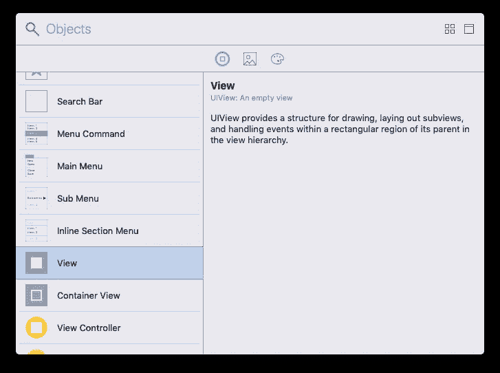

# 创建象棋应用程序的五个步骤 2/5

> 原文：<https://medium.com/analytics-vidhya/five-steps-to-create-a-chess-app-2-5-22eb0e0d6d9c?source=collection_archive---------11----------------------->

## 步骤 2:在 Main.storyboard 的屏幕上添加一个视图

在第一步中，我们创建了一个空的象棋应用程序，没有改变 Xcode 提供给我们的任何东西。在这一步中，我们将在白色“屏幕”上添加一个视图，这实际上是另一个视图。

单击左侧导航面板上的“Main.storyboard”。然后从右下方开始，将模板更改为“查看方式:iPad Pro 9.7”。

查看方式:iPad Pro 9.7 英寸

让我们改变背景颜色为黄色。如果右面板是隐藏的，单击右上方的图标显示右面板。

我们需要正确的面板来改变背景颜色

在“背景”字段中选择黄色。然后单击右上角的“+”按钮，在系统库中找到一个视图。

点击右上角的“+”按钮

当弹出“对象”对话框时，向下滚动找到“视图”。将其拖放到我们的黄色视图或画布上。

将“视图”拖放到黄色区域

我们得到一个白色的矩形，我们最终将在这个视图上绘制棋盘。由于国际象棋棋盘有 8x8 个方块，我们把它的宽度和高度配置为 640x640，让我们的生活稍微轻松一点，每个方块的大小为 80x80。单击右上角附近的标尺图标。

单击右上角附近的标尺图标

它显示了我们的白色小矩形的当前几何数据，即左上角锚坐标是(264，448)和宽度 240，高度 128。

我们的白色视图目前尺寸为 240x128

我们可以在“宽度”和“高度”字段中输入 640。然后把它拖回到黄色屏幕的中央，大概。

大致居中的 640x640 的白色视图，我们的画布后来画棋盘

运行应用程序在 iPad 模拟器上检查。

iPad 模拟器上大约居中的 640x640 白色视图

[第一步:创建一个空应用](/@zhijunsheng/five-steps-to-create-a-chess-app-1-5-a5c96bc99241?source=friends_link&sk=707d73067918e809e45fcb10921b1dc6)

[第二步:把一个视图放到屏幕上](/@zhijunsheng/five-steps-to-create-a-chess-app-2-5-22eb0e0d6d9c?source=friends_link&sk=d8c4d711ede8e0dc910c6b35ed21145d)

[第三步:画棋盘](/@zhijunsheng/five-steps-to-create-a-chess-app-3-5-77a4f73f459b?source=friends_link&sk=8f4572ecb12460b2e3f584e1a5a31d7e)

[第四步:绘制棋子](/@zhijunsheng/five-steps-to-create-a-chess-app-4-5-8bcb38f0c652?source=friends_link&sk=c9a974ec64e138d37fb6859ababd1a06)

[第五步:移动棋子](/@zhijunsheng/five-steps-to-create-a-chess-app-5-5-761af7719a2e?source=friends_link&sk=9099609bcefef2be067e11d42ef8e0a6)