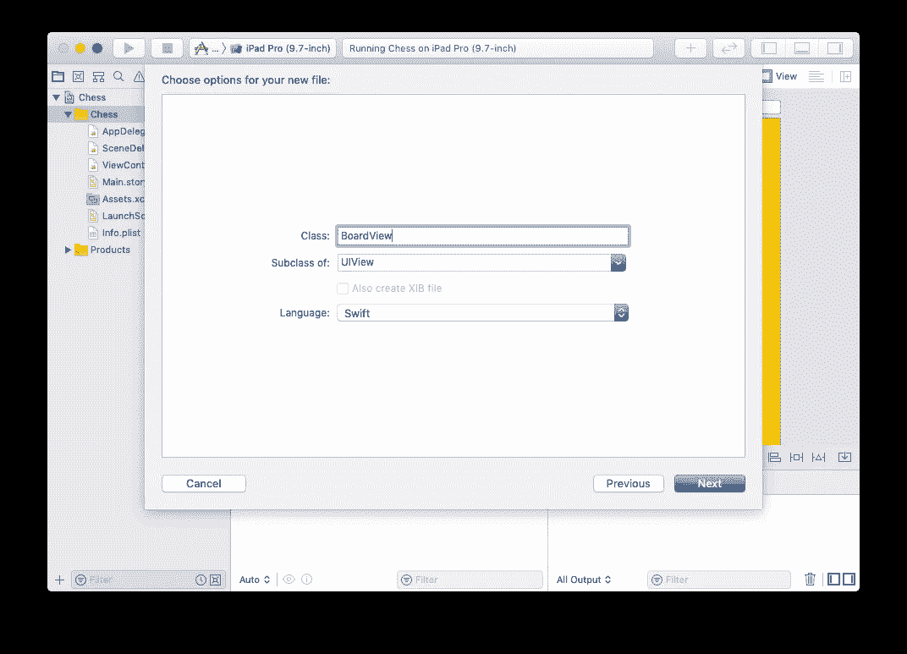

# 创建象棋应用程序的五个步骤 3/5

> 原文：<https://medium.com/analytics-vidhya/five-steps-to-create-a-chess-app-3-5-77a4f73f459b?source=collection_archive---------8----------------------->


## 第三步:画棋盘

步骤 1 创建应用程序，步骤 2 在屏幕上显示视图。现在我们来画 8×8 的棋盘。我们需要创建一个文件来存放我们的代码。

单击左侧导航面板上的“Chess”文件夹，它会变成蓝色。右键单击显示菜单。


右键单击带有“象棋”的蓝色行

选择“新建文件…”创建一个新文件。


点击“新建文件…”

在“iOS”下选择“Cocoa Touch Class”。然后单击“下一步”按钮继续。


点击“下一步”按钮创建新的班级

将我们的新班级命名为“BoardView”。确保它是 UIView 的子类。



UIView 的子类

接受默认位置，然后单击“创建”按钮。


单击“创建”按钮创建我们的新类文件

新的类文件是 BoardView.swift。现在我们需要将画布(Main.storyboard 中的白色视图)的类设置为 BoardView。单击左侧导航面板上的“Main.storyboard”。


单击左侧导航面板上的“Main.storyboard”以显示 Main.storyboard

选择白色视图后，在右上角附近找到类似信用卡的图标。单击它，这样我们可以将类从 UIView 更改为我们自己的 BoardView。


从下拉菜单中选择“BoardView”

在左侧窗格中，我们可以看到“视图”变成了“控制板视图”。单击顶部栏上从右数第三个图标，以显示隐藏的左侧导航面板。


单击右上角附近的图标以显示导航面板

返回 BoarView.swift 输入如下所示的源代码。执行入口点是 Xcode 提供的函数“draw”。我们创建了 3 个函数来完成绘制 64 个正方形的工作。抱歉硬编码值 80，是每个方块的边。还记得我们在将白色画布视图添加到黄色大视图时，故意将电路板尺寸设置为 640x640 吗？


BoardView.swift 的完整代码

启动应用程序查看我们华丽的董事会观点。


8×8 方格棋盘

这是 BoardView 的文本版本，方便您使用。

```
import UIKitclass BoardView: UIView { override func draw(_ rect: CGRect) {
        drawBoard()
    } func drawBoard() {
        drawTwoRowsAt(y: 0 * 80)
        drawTwoRowsAt(y: 2 * 80)
        drawTwoRowsAt(y: 4 * 80)
        drawTwoRowsAt(y: 6 * 80)
    }

    func drawTwoRowsAt(y: CGFloat) {
        drawSquareAt(x: 1 * 80, y: y)
        drawSquareAt(x: 3 * 80, y: y)
        drawSquareAt(x: 5 * 80, y: y)
        drawSquareAt(x: 7 * 80, y: y)

        drawSquareAt(x: 0 * 80, y: y + 80)
        drawSquareAt(x: 2 * 80, y: y + 80)
        drawSquareAt(x: 4 * 80, y: y + 80)
        drawSquareAt(x: 6 * 80, y: y + 80)
    }

    func drawSquareAt(x: CGFloat, y: CGFloat) {
        let path = UIBezierPath(rect: CGRect(x: x, y: y, width: 80, height: 80))
        UIColor.lightGray.setFill()
        path.fill()
    }
}
```

[第一步:创建一个空应用](/@zhijunsheng/five-steps-to-create-a-chess-app-1-5-a5c96bc99241?source=friends_link&sk=707d73067918e809e45fcb10921b1dc6)

[第二步:把一个视图放到屏幕上](/@zhijunsheng/five-steps-to-create-a-chess-app-2-5-22eb0e0d6d9c?source=friends_link&sk=d8c4d711ede8e0dc910c6b35ed21145d)

[第三步:画棋盘](/@zhijunsheng/five-steps-to-create-a-chess-app-3-5-77a4f73f459b?source=friends_link&sk=8f4572ecb12460b2e3f584e1a5a31d7e)

[第四步:绘制棋子](/@zhijunsheng/five-steps-to-create-a-chess-app-4-5-8bcb38f0c652?source=friends_link&sk=c9a974ec64e138d37fb6859ababd1a06)

[第五步:移动棋子](/@zhijunsheng/five-steps-to-create-a-chess-app-5-5-761af7719a2e?source=friends_link&sk=9099609bcefef2be067e11d42ef8e0a6)