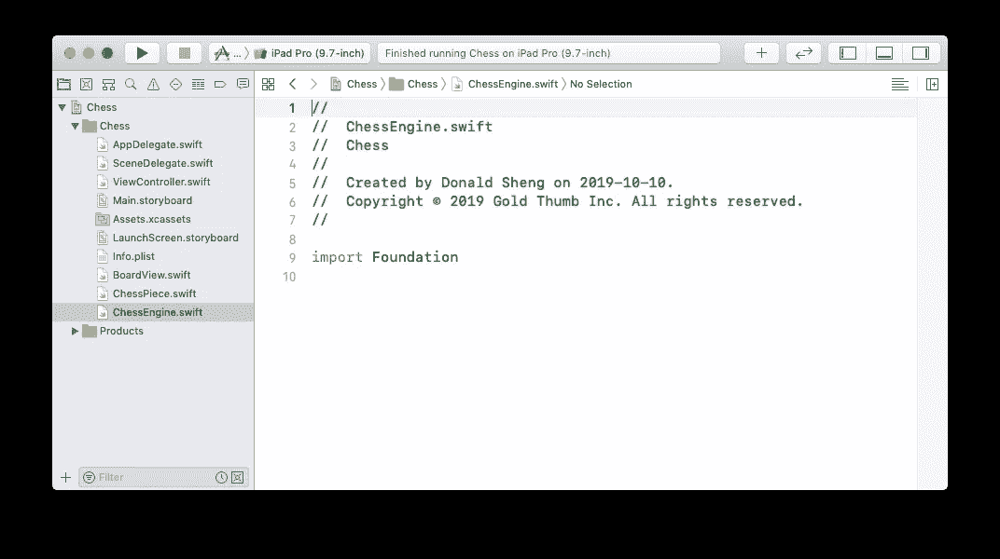

# 创建象棋应用程序的五个步骤 4/5

> 原文：<https://medium.com/analytics-vidhya/five-steps-to-create-a-chess-app-4-5-8bcb38f0c652?source=collection_archive---------6----------------------->


## 第四步:在板上画图

前 3 个步骤的总结:

第一步:从头开始创建象棋应用程序

步骤 2:为我们的棋盘添加一个视图

第三步:画出 8×8 的棋盘

我们需要 12 张图片，6 张白色和 6 张黑色，来代表船上的 32 张图片。尝试搜索您喜欢的任何图像，并将其下载到例如“下载”文件夹中。本教程中使用的图像文件可以在[这里](https://github.com/zhijunsheng/chess-ios/tree/master/chess/Assets.xcassets)找到。


12 张图片，随时可用

返回 Xcode，在左侧导航面板上点击“Assets.xcassets”。我们将所有 12 张图片拖放到“AppIcon”下的白色大区域。


单击左侧导航面板上的“Assets.xcassets”

您可以一个接一个地拖移片段，或者选择全部并一起拖移它们。


在取景器中选择所有 12 幅图像

完成后，这些片段在 Xcode 中看起来如下。我们将使用每个图像的名称来创建 UIImage 对象。例如，黑人主教图像的名称是“主教-黑人”，区分大小写。


每个图像都有一个名称，例如“Biship-black”

是时候写一些代码了。我们将创建一个表示片段的结构。右键单击左侧导航面板上的黄色“Chess”文件夹，然后选择“新建文件…”。选择“iOS”下的“Swift 文件”。然后单击“下一步”按钮继续。


我们将创建一个 Swift 文件

输入非常有创意的名字“ChessPiece ”,点击“创建”按钮。


点击“创建”按钮，创建文件 ChessPiece.swift

这是它创建时的样子。


创建时，ChessPiece.swift 几乎是空的

我们需要两个整数“col”和“row”来表示逻辑棋盘上一个棋子的位置。每幅作品还保留一个字段“imageName”作为自己的图像名称，例如“Bishop-black”。当我们使用“Set”来包含 ChessPiece 类型的对象时，需要“Hashable”。

```
import Foundationstruct ChessPiece: Hashable {
    let col: Int
    let row: Int
    let imageName: String
}
```


struct ChessPiece 有 3 个属性或字段

继续为我们的游戏引擎创建另一个结构，它将包含所有的部分。如果你听说过 MVC 设计模式，这就是 M，意思是模型。


在文件夹“Chess”下创建另一个 swift 文件

键入“ChessEngine”并单击“创建”按钮继续。


点击“创建”按钮，创建文件 ChessEngine.swift

ChessEngine.swift 已创建，但仍为空。



在 ChessPiece.swift 之后，我们创建了 ChessEngine.swift

ChessEngine 有一套作品。我们创建一个方便的函数，将所有 32 个初始片段插入到属性“片段”中。


创建属性“棋子”和函数“初始化游戏”

以下是 ChessEngine.swift 的完整代码:

```
import Foundationstruct ChessEngine {
    var pieces = Set<ChessPiece>()

    mutating func initializeGame() {
        pieces.removeAll()

        // ...
    }
}
```

将下面的代码放在上面的“// …”处。

```
pieces.insert(ChessPiece(col: 0, row: 0, imageName: "Rook-black"))
pieces.insert(ChessPiece(col: 7, row: 0, imageName: "Rook-black"))
pieces.insert(ChessPiece(col: 0, row: 7, imageName: "Rook-white"))
pieces.insert(ChessPiece(col: 7, row: 7, imageName: "Rook-white"))pieces.insert(ChessPiece(col: 1, row: 0, imageName: "Knight-black"))
pieces.insert(ChessPiece(col: 6, row: 0, imageName: "Knight-black"))
pieces.insert(ChessPiece(col: 1, row: 7, imageName: "Knight-white"))
pieces.insert(ChessPiece(col: 6, row: 7, imageName: "Knight-white"))pieces.insert(ChessPiece(col: 2, row: 0, imageName: "Bishop-black"))
pieces.insert(ChessPiece(col: 5, row: 0, imageName: "Bishop-black"))
pieces.insert(ChessPiece(col: 2, row: 7, imageName: "Bishop-white"))
pieces.insert(ChessPiece(col: 5, row: 7, imageName: "Bishop-white"))pieces.insert(ChessPiece(col: 3, row: 0, imageName: "Queen-black"))
pieces.insert(ChessPiece(col: 3, row: 7, imageName: "Queen-white"))pieces.insert(ChessPiece(col: 4, row: 0, imageName: "King-black"))
pieces.insert(ChessPiece(col: 4, row: 7, imageName: "King-white"))pieces.insert(ChessPiece(col: 0, row: 1, imageName: "Pawn-black"))
pieces.insert(ChessPiece(col: 1, row: 1, imageName: "Pawn-black"))
pieces.insert(ChessPiece(col: 2, row: 1, imageName: "Pawn-black"))
pieces.insert(ChessPiece(col: 3, row: 1, imageName: "Pawn-black"))
pieces.insert(ChessPiece(col: 4, row: 1, imageName: "Pawn-black"))
pieces.insert(ChessPiece(col: 5, row: 1, imageName: "Pawn-black"))
pieces.insert(ChessPiece(col: 6, row: 1, imageName: "Pawn-black"))
pieces.insert(ChessPiece(col: 7, row: 1, imageName: "Pawn-black"))pieces.insert(ChessPiece(col: 0, row: 6, imageName: "Pawn-white"))
pieces.insert(ChessPiece(col: 1, row: 6, imageName: "Pawn-white"))
pieces.insert(ChessPiece(col: 2, row: 6, imageName: "Pawn-white"))
pieces.insert(ChessPiece(col: 3, row: 6, imageName: "Pawn-white"))
pieces.insert(ChessPiece(col: 4, row: 6, imageName: "Pawn-white"))
pieces.insert(ChessPiece(col: 5, row: 6, imageName: "Pawn-white"))
pieces.insert(ChessPiece(col: 6, row: 6, imageName: "Pawn-white"))
pieces.insert(ChessPiece(col: 7, row: 6, imageName: "Pawn-white"))
```

让我们继续在 ViewController.swift 中添加 2 行代码。要创建 ChessEngine 的实例，请在“override func viewDidLoad() {”上方添加以下代码。

```
var chessEngine = ChessEngine()
```

并在“super.viewDidLoad()”下添加以下代码来初始化我们的国际象棋游戏，即，将所有 32 个棋子部署到位。

```
chessEngine.initializeGame()
```

现在我们到了这项任务中最棘手和最有趣的部分。我们需要在屏幕元素和代码之间建立联系。在我们的例子中，这意味着 ctrl 从白板视图拖动到 ViewController.swift 文件中的某个地方。在左侧导航面板上，首先单击 ViewController.swift，然后按住“option”键并单击 Main.storyboard

单击右侧的白板视图将其选中。按住 control 键，开始从 board view 拖动到“override func viewDidLoad() {”上方的空白区域。当你放开鼠标，会弹出一个对话框。


拖动完成后会弹出一个对话框

将该连接命名为“boardView”。然后点击“连接”按钮隐藏对话框。


输入“boardView”并点击“连接”按钮

Xcode 插入以下代码行。变量“boardView”代表屏幕上的白色视图。

```
@IBOutlet weak var boardView: BoardView!
```


Xcode 插入 boardView 类型的变量 BoardView！

现在让我们回到文件 BoardView.swift，为 pieces drawing 添加代码。我们创建一个实例变量块类型集合<chesspiece>。把它想象成 chessen engine 中的 shadow pieces 盒子，它是 chessen engine 中定义的变量 pieces。我们还创建了一个函数来绘制所有的部分。</chesspiece>


在 BoardView.swift 中编写代码

BoardView.swift 中的完整代码如下。

```
import UIKitclass BoardView: UIView {
    var pieces = Set<ChessPiece>() override func draw(_ rect: CGRect) {
        drawBoard()
        drawPieces()
    }

    func drawPieces() {
        for piece in pieces {
            let pieceImage = UIImage(named: piece.imageName)
            pieceImage?.draw(in: CGRect(x: piece.col * 80, y: piece.row * 80, width: 80, height: 80))
        }
    } func drawBoard() {
        drawTwoRowsAt(y: 0 * 80)
        drawTwoRowsAt(y: 2 * 80)
        drawTwoRowsAt(y: 4 * 80)
        drawTwoRowsAt(y: 6 * 80)
    }

    func drawTwoRowsAt(y: CGFloat) {
        drawSquareAt(x: 1 * 80, y: y)
        drawSquareAt(x: 3 * 80, y: y)
        drawSquareAt(x: 5 * 80, y: y)
        drawSquareAt(x: 7 * 80, y: y)

        drawSquareAt(x: 0 * 80, y: y + 80)
        drawSquareAt(x: 2 * 80, y: y + 80)
        drawSquareAt(x: 4 * 80, y: y + 80)
        drawSquareAt(x: 6 * 80, y: y + 80)
    }

    func drawSquareAt(x: CGFloat, y: CGFloat) {
        let path = UIBezierPath(rect: CGRect(x: x, y: y, width: 80, height: 80))
        UIColor.lightGray.setFill()
        path.fill()
    }
}
```

返回文件 ViewController.swift 添加 2 行代码。第 21 行从 chessEngine 中的主块(框)更新 boardView 中的阴影块(框)。第 22 行告诉系统重新绘制屏幕上的所有内容。


在 chessEngine 中初始化 32 个片段后，添加 2 行以重新呈现 UI

下面是 ViewController.swift 的完整代码。

```
import UIKitclass ViewController: UIViewController {

    var chessEngine = ChessEngine() @IBOutlet weak var boardView: BoardView!

    override func viewDidLoad() {
        super.viewDidLoad()

        chessEngine.initializeGame()
        boardView.pieces = chessEngine.pieces
        boardView.setNeedsDisplay()
    }
}
```

运行应用程序来欣赏这些可爱的作品。


最初棋盘上有 32 枚棋子

[第一步:创建一个空应用](/@zhijunsheng/five-steps-to-create-a-chess-app-1-5-a5c96bc99241?source=friends_link&sk=707d73067918e809e45fcb10921b1dc6)

[第二步:把一个视图放到屏幕上](/@zhijunsheng/five-steps-to-create-a-chess-app-2-5-22eb0e0d6d9c?source=friends_link&sk=d8c4d711ede8e0dc910c6b35ed21145d)

[第三步:画棋盘](/@zhijunsheng/five-steps-to-create-a-chess-app-3-5-77a4f73f459b?source=friends_link&sk=8f4572ecb12460b2e3f584e1a5a31d7e)

[第四步:绘制棋子](/@zhijunsheng/five-steps-to-create-a-chess-app-4-5-8bcb38f0c652?source=friends_link&sk=c9a974ec64e138d37fb6859ababd1a06)

[第五步:移动棋子](/@zhijunsheng/five-steps-to-create-a-chess-app-5-5-761af7719a2e?source=friends_link&sk=9099609bcefef2be067e11d42ef8e0a6)