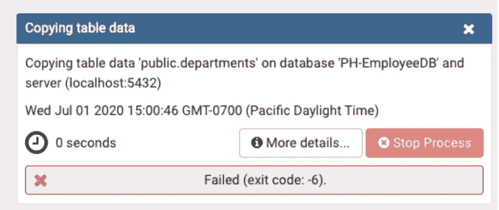
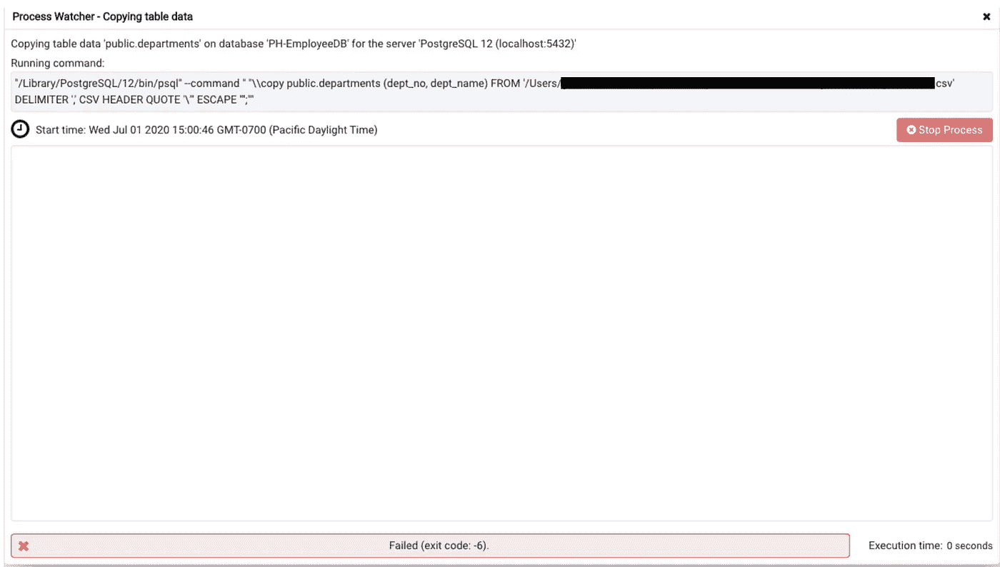

# 修复“pgAdmin CSV 导入”失败(退出代码:-6)错误(macOS)

> 原文：<https://medium.com/analytics-vidhya/fix-for-pgadmin-csv-import-failed-exit-code-6-error-macos-821df07c07de?source=collection_archive---------6----------------------->

这个神秘的错误采用“失败(退出代码:-6)”的形式。导入 csv 文件时通常会弹出:



如果您点击更多详细信息…，您会收到另一条神秘的消息:



更多细节..出错信息

`"/Library/Postgres/12/bin/psql" — command" "\\copy public.table_name (col1, col2) FROM '/path/to/file.csv' DELIMITER ',' CSV HEADER QUOTE "\" ESCAPE ","`

# 修复

截至撰写本文时，根本原因是 Postgres 默认附带的过时的 pgAdmin 版本。按照以下步骤更新至最新版本:

1.  关闭 pgAdmin(如果正在运行)
2.  从[https://www.pgadmin.org/download/pgadmin-4-macos/](https://www.pgadmin.org/download/pgadmin-4-macos/)下载最新的 pgAdmin `.dmg`文件并打开。
3.  将您的**应用程序**文件夹中现有的`pgAdmin 4`替换为从。上面的 dmg 文件。(您可以通过在**应用程序**文件夹中拖放来完成此操作)
4.  运行 pgAdmin 并尝试再次导入 CSV 文件。

这应该可以解决此时出现的任何错误。

## 还是出错吗？

但是，如果仍然出现错误，则可能是您的文件权限有问题。因此，请更改您尝试导入的 csv 文件的文件权限:

```
chmod 777 /path/to/file.csv
```

注意:将文件权限更改为 777 可能是危险的，所以使用它作为权宜之计来使程序工作。建议稍后将权限更改为更具限制性，例如将其更改为`666, 766, 776`之一，并查看程序是否仍在运行(较低=更安全)。

希望这有所帮助！