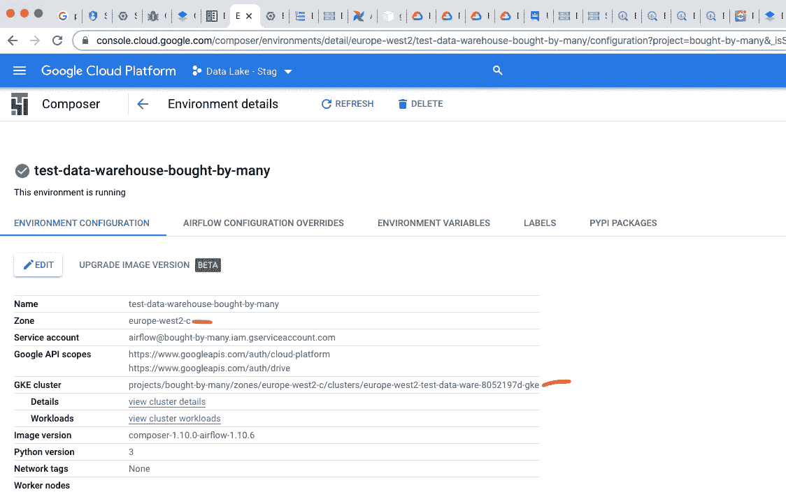
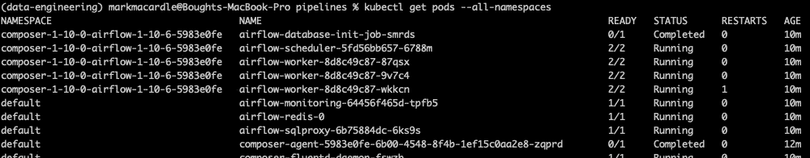

# 高效调试 Google Cloud Composer PyPi 包安装问题

> 原文：<https://medium.com/analytics-vidhya/fix-pypi-package-installation-issues-on-cloud-composer-6a01d9a85790?source=collection_archive---------4----------------------->

Cloud Composer 是 Google 为 Apache Airflow 提供的托管服务。它的环境预装了许多软件包，但是版本可能会过期。您可以更新这些软件包并安装您需要的其他软件包。

但是，您可能会在软件包依赖关系中遇到冲突，这会阻止新软件包的更新或安装。此外，Google 经常更新新环境下可用的 Composer/Airflow 图像，因此如果您遇到冲突，您可能需要在每次更新图像版本时解决一组新的冲突。

尤其令人痛苦的是，Composer 可能需要 20-40 分钟来应用您的更新并抛出错误，这使得尝试任何解决方案都是一个非常缓慢的过程。

下面描述了如何在本地重新创建 Composer 环境中安装的内容，并使用 pipenv 包管理器来解决相互冲突的依赖关系。这允许快速测试和修改。最后可以将需要的更改上传到 Composer。

# 1.连接到集群工作器并执行 pip 冻结

从此处采取的步骤。从 Composer 的环境配置选项卡中获取集群和区域。



```
$ gcloud container clusters get-credentials projects/bought-by-many/zones/europe-west2-c/clusters/europe-west2-test-data-ware-8052197d-gke --zone europe-west2-c
```

打印出所有名称空间:

```
$ kubectl get pods --all-namespaces
```



从名称空间列获取一个`composer-*`行的名称，从名称列获取一个`airflow-worker-*`行的名称。

```
$ kubectl exec -itn composer-1-10-0-airflow-1-10-6-5983e0fe airflow-worker-8d8c49c87-9v7c4 -- /bin/bash
```

连接到一个工人:

```
$ kubectl exec -itn composer-1-10-0-airflow-1-10-6-5983e0fe airflow-worker-8d8c49c87-9v7c4 -- /bin/bash
```

然后在连接时打印出要求:

```
airflow@airflow-worker-8d8c49c87-9v7c4:~$ pip freeze
```

将输出复制/粘贴到一个名为`original_req.txt`的文本文件中。稍后会用它来比较变化。

在 pip 冻结输出中，我得到了以下几行

```
# Editable install with no version control (apache-airflow===1.10.6-composer) 
-e /usr/local/lib/airflow
```

并手动将其更改为:

```
apache-airflow==1.10.6 
```

# 2.创建新的 pipenv 环境

将`original_req.txt`文件放入一个新文件夹，并使用

```
$ pipenv install -r path/to/requirements.txt 
```

# 3.添加您的包并解决冲突

在 pip 文件中添加您需要的额外的包，并更新需要它的预安装包的版本号。

在这里使用`my-package= “*”`或`my-package= “>=1.2.0”`有助于更容易地解决冲突。

试试`pipenv lock`。如果标记了冲突，如下例所示，请记下导致问题的包。`grpc-google-iam-v1`在下面的案例中。

```
...
[pipenv.exceptions.ResolutionFailure]: Warning: Your dependencies could not be resolved. You likely have a mismatch in your sub-dependencies.First try clearing your dependency cache with $ pipenv lock --clear, then try the original command again.Alternatively, you can use $ pipenv install --skip-lock to bypass this mechanism, then run $ pipenv graph to inspect the situation.Hint: try $ pipenv lock --pre if it is a pre-release dependency.ERROR: ERROR: Could not find a version that matches **grpc-google-iam-v1**<0.12dev,<0.13dev,>=0.11.4,>=0.12.3Tried: 0.9.0, 0.10.0, 0.10.1, 0.11.1, 0.11.3, 0.11.4, 0.12.0, 0.12.1, 0.12.2, 0.12.3 ...
```

使用`pipenv install —-skip-lock`允许软件包被安装。

然后使用`pipenv graph > graph.txt`输出依赖列表。

在`graph.txt`文件中搜索发布包(例如`grpc-google-iam-v1`)。寻找使用它的包，这些包具有导致冲突的依赖关系。

对于那些包，在 pipfile 中更新它们的版本或者把它改成`xyz = “*”`。

再次尝试`pipenv lock`并重复该过程。最终，pipenv 安装应该没有错误。

# 4.创建一个 requirements.txt，包含所有已更改的和附加的包

用`pipenv run pip freeze > new_req.txt`输出新的需求。

将其与`original_req.txt`文件进行比较，并将所有更改的行放入一个新的`diffed.txt`文件。下面的 bash 命令会自动完成这项工作。命令的`tr`部分使所有内容都变成小写，因为这是上传列表到 Composer 时需要的。

```
$ diff original_req.txt new_req.txt | grep ">" | cut -c 3- | tr A-Z a-z > diffed.txt
```

这些修改可以上传到 Composer:

```
*gcloud* composer environments update test-data-warehouse-bought-by-many \
  --update-pypi-packages-from-file=diffed.txt \
  --location=europe-west2 \
  --async
```