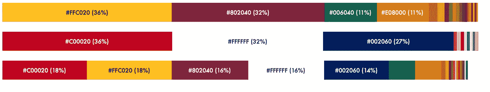
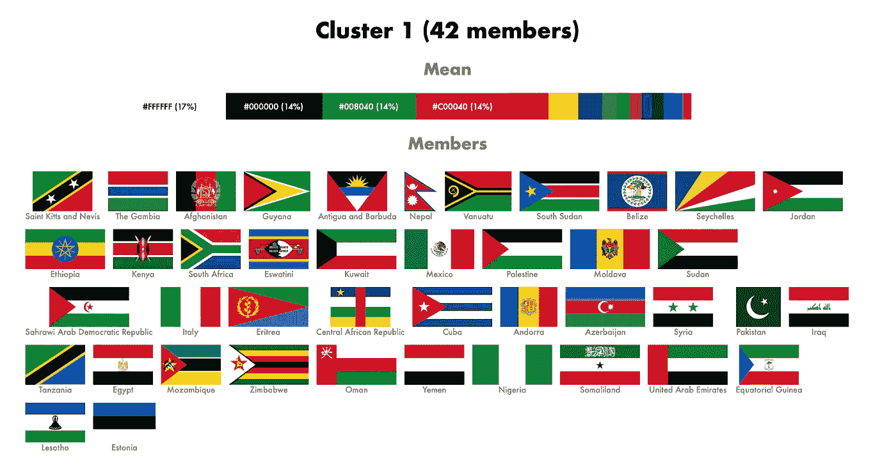
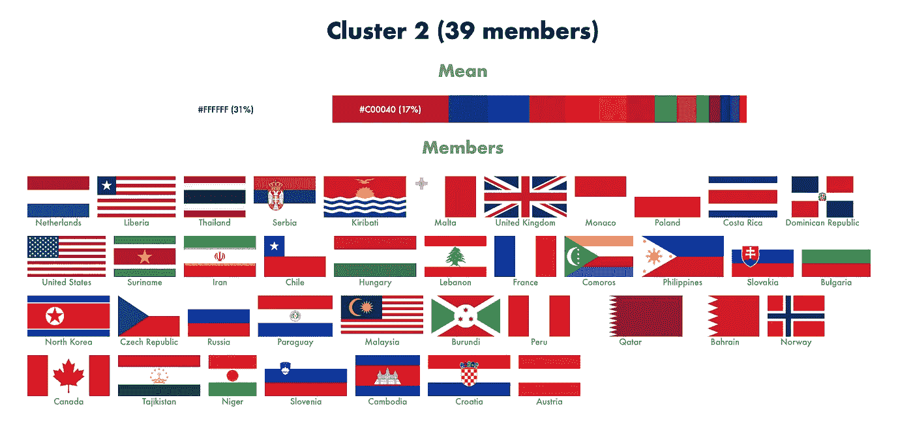
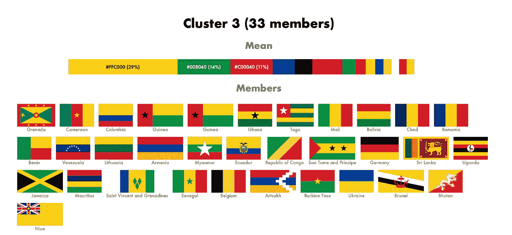
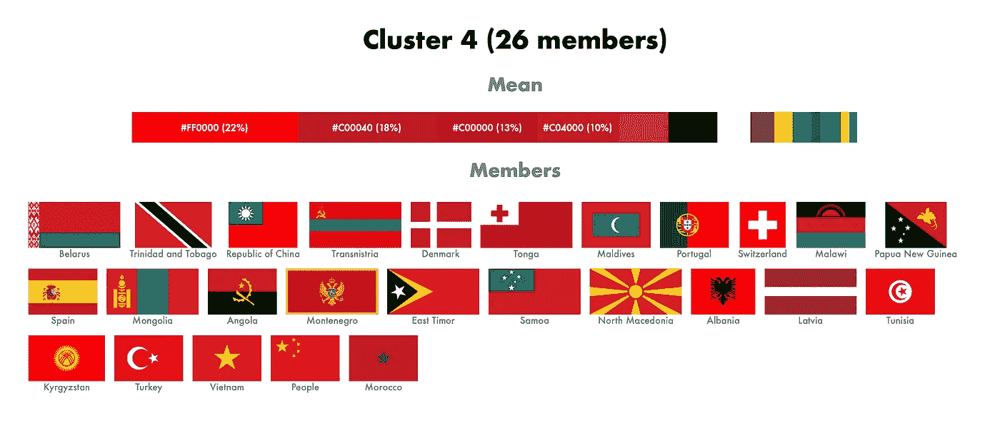
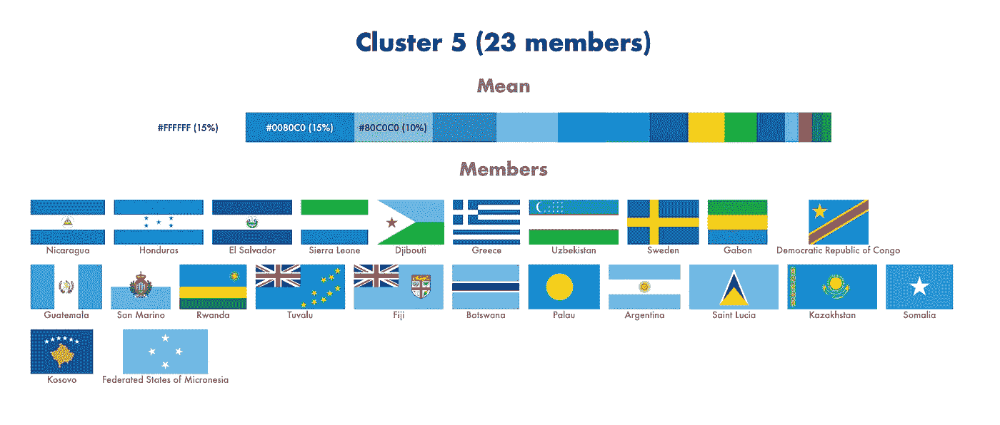
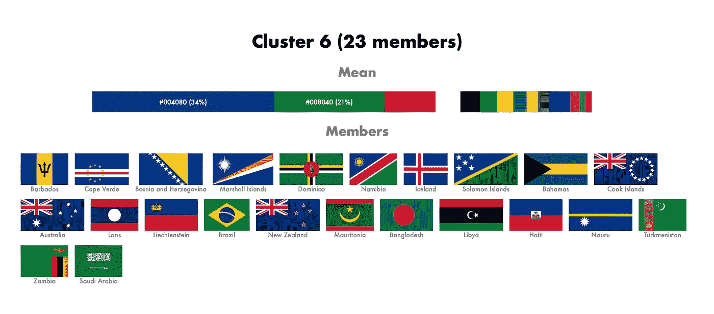
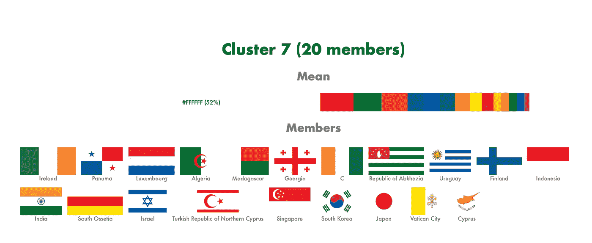

# 世界旗帜

> 原文：<https://medium.com/analytics-vidhya/flags-of-the-world-933ca3de85ed?source=collection_archive---------9----------------------->

## 问机器困难的问题

# 监督和非监督学习

> "世界上有多少种旗帜？"

你可能会说，

> “有些旗帜是红色、白色和蓝色的。有些是黄色、绿色和红色的。有些只有一种颜色。别人有很多颜色。”

但是如果我们问计算机这个问题会怎么样呢？问机器一个不寻常的问题，因为通常，我们会问机器其他问题。比如，

> “这里有一张脸。你能告诉我是谁吗？”

或者

> “这是这个人的一些数据，他出现在一个网站上。我们应该给他们看什么广告？”

或者

> “这里有一段来自前置摄像头的视频。我们前面是一辆卡车吗？”

所有这些问题都有一个共同点。计算机通过对以前的例子进行训练来学习回答问题。相似问题及正确答案。为了训练计算机识别人脸，我们将为它提供数百万张人脸图像，以及一个标签(例如“阿尔伯特·爱因斯坦”)。因此，当朋友上传艾伯特的照片时，脸书可以给他加标签。

这种基于例子的学习被称为[监督学习](https://en.wikipedia.org/wiki/Supervised_learning)。大部分人工智能由监督学习组成。

但是问一台电脑“世界上有多少种类的旗帜？”，不包括基于示例的学习。你可以给计算机提供旗帜的图像。但是你没有给它任何正确的答案。计算机将不得不关闭并为自己学习标志的类别。没有人类的帮助。

这种类型的学习，没有人类的帮助，被称为[无监督学习](https://en.wikipedia.org/wiki/Unsupervised_learning)。

# k 均值

所以我决定问我的电脑这个问题。

一种常见的无监督学习方法是[聚类](https://en.wikipedia.org/wiki/Cluster_analysis)。在我们的例子中，计算机将对相似的标志进行分组。每个群体都成为一种类型。一个简单的聚类算法是 k 均值聚类。

计算机从要聚类的项目开始。在我们的例子中，标志。它去维基百科，下载来自不同国家和地区的大约 200 面旗帜。

我决定让机器简单些，让它只根据颜色对旗帜进行分类。忽略旗帜的形状，动物等物体。因此，对于每一面旗帜，计算机都会记录下有哪些颜色，以及每种颜色所占的比例。

例如，斯里兰卡国旗由大约 36%的黄色、32%的褐红色、11%的橙色、11%的绿色和各种少量的其他颜色组成。

一旦标记准备好，计算机运行 k-means 算法。

我们必须首先指定计算机应该找到多少个类别。就说七类吧。

计算机随机挑选七面旗帜，然后找出其他旗帜与这些旗帜的相似之处。这些旗帜加入到前七个旗帜的组中。

对于每一组，我们找到了“平均标志”。“平均标志”是将所有标志进行平均后得到的标志。例如，下面是斯里兰卡国旗、英国国旗及其含义:

斯里兰卡国旗、英国国旗以及它们的含义

然后，计算机会发现其他标志与这些平均标志是如何相似的。每走一步，聚类都会改善。等等等等。当我们对分类满意时，我们就停下来。

我的电脑表现如何？

# 结果呢

## 1.泛阿拉伯色彩

第一组由白色、黑色、绿色和红色组成。也被称为[泛阿拉伯色](https://en.wikipedia.org/wiki/Pan-Arab_colors)。包括约旦、巴勒斯坦、科威特和阿联酋的国旗。

该集群也有一点黄色和蓝色，与红色相结合，以接纳安道尔和摩尔多瓦等国的国旗。

## 2.红色、白色和蓝色

第二组主要由红色、白色和蓝色组成。包括法国、英国、美国和荷兰。

## 3.泛非洲色彩

第三组由红色、黄色和绿色组成，也被称为[泛非色](https://en.wikipedia.org/wiki/Pan-African_colours)。这也包括一些非非洲国家的国旗，如斯里兰卡。

## 4.红色

第四组由红色为主的旗帜组成，包括中国、土耳其和越南。

## 5.浅蓝色

第五组由浅蓝色的旗帜组成，包括希腊和洪都拉斯。它也有一点黄色和绿色承认瑞典和加蓬。

## 6.深蓝色和绿色

第六组以深蓝色和绿色为主。包括新西兰和孟加拉国。

## 7.怀特（姓氏）

最后一簇以白色为主。它包括印度、日本、韩国、芬兰和以色列的国旗。

# 总结想法

显然，我的电脑没有听说过泛非联赛或红白蓝调。这些是我自己的注释。但奇怪的是，它是如何发现这些模式的。

另一方面，这些集群确实包含一些人类不会包含的噪声。例如，除了主色之外，每一簇都包括一些“少数”色，这就引入了一些“流氓”旗。

另一方面，我们可以选择将此视为计算机的“意见”。它设计了一种新的旗帜，人类可能不同意，或想出了。