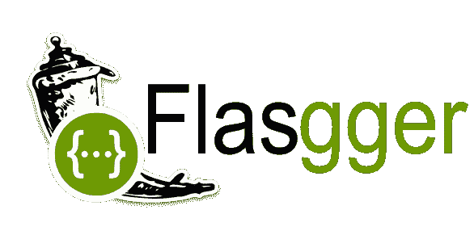
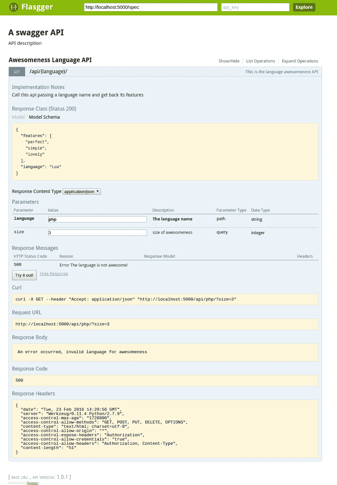

# Flask ger——一个带有 Flask 和 Swagger UI 的 API 平台

> 原文：<https://medium.com/analytics-vidhya/flasgger-an-api-playground-with-flask-and-swagger-ui-6b6806cf8884?source=collection_archive---------4----------------------->



# 什么是霸气？

Swagger 本质上是一种接口描述语言，用于描述使用 JSON 表达的 RESTful APIs。Swagger 与一组开源软件工具一起用于设计、构建、记录和使用 RESTful web 服务。Swagger 包括自动化文档、代码生成和测试用例生成。

# 什么是 Swagger UI？

**Swagger UI** 是一个开源项目，为 OpenAPI ( **Swagger** )规范定义的 API 可视化呈现文档。Swagger UI 允许您可视化 API 的资源并与之交互，而不需要任何实现逻辑，这使得后端实现和客户端消费变得容易。 **Swagger UI** 可以在 GitHub 资源库中下载，也可以在集成的 SwaggerHub 平台中为任何新的或现有的 OpenAPI 定义的 API 生成。

# 烧瓶是什么？

(duhhhh！！来吧，你已经知道这个哈哈！:P)

Flask 是一个用 Python 编写的微型 web 框架。它被归类为微框架，因为它不需要特殊的工具或库。它没有数据库抽象层、表单验证或任何其他组件，而现有的第三方库提供了通用功能。

为什么很牛逼？

因为它简单而强大，说话更便宜看看代码！

运行上面的脚本，然后你就可以开始发布到 API-

# 什么是弗拉斯克？

是一个 Flask extension，用于从 API 中注册的所有 Flask 视图中提取 OpenAPI 规范。 **Flasgger** 还带有嵌入的 SwaggerUI，因此您可以访问[http://localhost:5000/API docs](http://localhost:5000/apidocs)并可视化您的 API 资源并与之交互。Flasgger 是一个 Flask 扩展，通过文档和由 SwaggerUI 支持的 live playground 来帮助创建 Flask APIs。

# 安装它

```
pip install flasgger
```

# 创建您的应用

## 现在运行你的应用程序并访问[http://localhost:5000/API docs/index . html](http://localhost:5000/apidocs/index.html)你就可以玩 Swagger UI 了！



注意:所有默认的 URL 都可以在配置中更改。

**也可以为规格使用单独的文件**

# 在单独的 YML 文件中创建 api 规范

然后使用`*swag_from*` decorator 修改代码以从中读取

# 确认

如果您将规范放在一个单独的文件中，也可以使用相同的规范来验证输入！

希望你喜欢这篇博文！

尝试使用 Flasgger 和 Swagger UI 制作应用程序并运行，它是免费的，非常棒！

你也可以用同样的方式运行你的机器学习模型！

# 耶！

如果你有同感，请分享你的想法！

快乐的蟒蛇！

快乐大摇大摆！

下次见…！