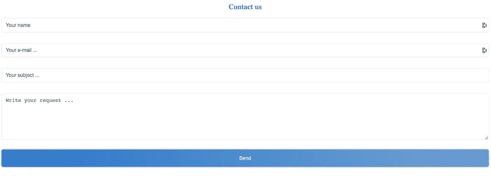

# 烧瓶:构建联系人表单

> 原文：<https://medium.com/analytics-vidhya/flask-build-contact-form-2689520adf23?source=collection_archive---------4----------------------->

在这篇文章中，我们将学习如何使用 Flask 创建一个联系表单。结果会是这样的:

# 一、建立联系方式

所有脚本均可从以下网站获取:[https://github.com/Faouzizi/flaskCreateContactForms](https://github.com/Faouzizi/flaskCreateContactForms)

首先你需要使用 pip 安装 flask 和 flask_wtf。