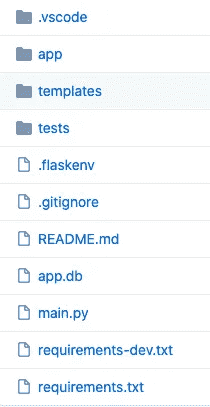
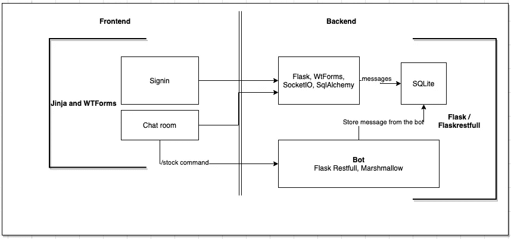
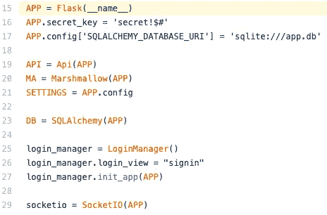
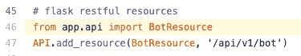
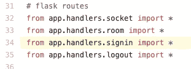
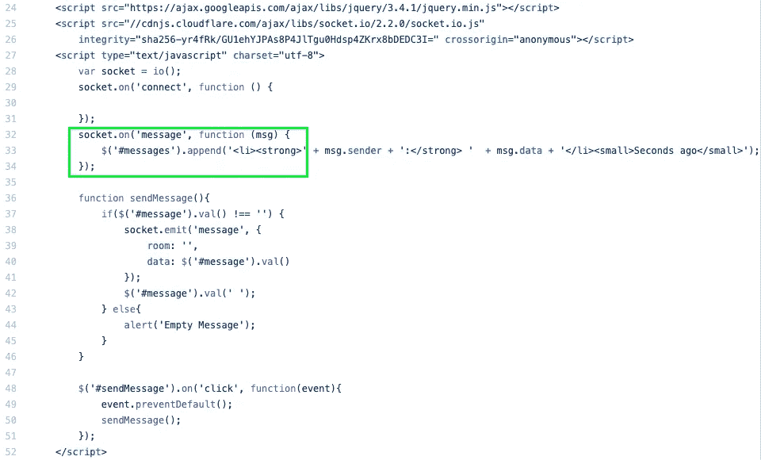
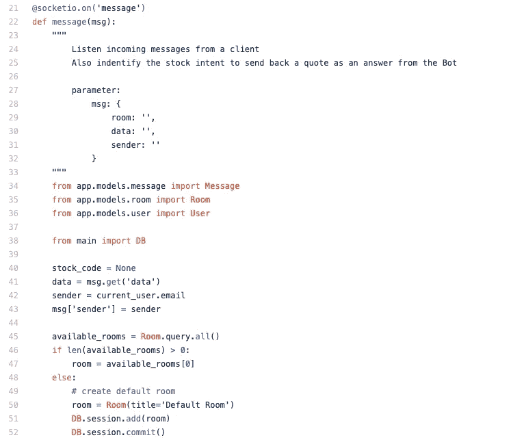

# 烧瓶-烧瓶-Restful-棉花糖- SqlAlchemy 套装

> 原文：<https://medium.com/analytics-vidhya/flask-flask-restful-marshmallow-sqlalchemy-suit-e3fb880064a8?source=collection_archive---------8----------------------->

姜戈的另一个选择。

如果你是 Python 爱好者，你可能已经听说过 Django 和 Flask。除了它的文档和社区之外，我喜欢 Django 的一点是它强大的 [**ORM**](https://en.wikipedia.org/wiki/Object-relational_mapping) **，**它允许你的代码与市场上几乎大多数流行的数据库进行交互，只需要做一些小的设置。所以，如果你需要从 MySql 转换到 ProgresSQl，Django 允许你只需要在 settings.py 文件中做一点小小的改变就可以了，如果没有 Django ORM，这需要做很多工作。

另一方面，我们有烧瓶。

与 Django 相比，Flask 是一个更小的框架，它没有本地 ORM，但我喜欢 Flask 的一点是，你可以快速地从零开始创建一个小应用程序，而不需要很多东西，很多时候你甚至不知道它们是干什么用的。

那么，再次使用 Flask 有什么好处呢 Django:

1.  速度
2.  简单
3.  易于部署
4.  许多预定义的模板用作容器
5.  如果你需要扩展应用程序，有一个大的社区为你能想到的几乎所有东西开发新的包。

我想和大家分享一个用 Flask 开发的关于聊天室的小应用:

**该应用程序包含以下功能:**

1.  一个简单的聊天室
2.  只需要用户名的简单登录
3.  每条消息都保存在一个 SQlite 数据库中(只是为了练习的效果，你可以很容易地用另一个数据库[来改变这个数据库)](https://github.com/handersonc/chatapi/blob/master/main.py#L17)
4.  浏览器只允许一个会话。
5.  有一个小机器人请求关于股票的报价，所以如果你写命令“/stock= <stock_code>”，你将得到一个股票报价。</stock_code>

现在，解释这个项目(下面提供了 github 链接):

1.代码的结构

[main.py](https://github.com/handersonc/chatapi/blob/master/main.py) 文件包含 flask 主应用程序。

app.db 是 SQlite 数据库

templates 文件夹是默认文件夹，当你使用 [Jinja](https://jinja.palletsprojects.com/en/2.11.x/) 时，Flask 在这里寻找 html 模板非常有用。

## **APP 的架构:**

**烧瓶 APP:**

这个项目中有四个重要的包。其中一些是我几乎在每个项目中使用的:

**Flask-Resful(第 46 行):**这是我最喜欢的创建 API 的包。在下面的代码行中有一个这样的例子，为 bot 创建请求股票报价的 API。

**Marshmallow(第 20 行):**这在创建 restful API 时非常重要，因为它允许序列化和反序列化 json 格式输入和输出。我喜欢这个包，因为它加快了验证输入的过程。要了解更多信息，请点击[这里](https://marshmallow.readthedocs.io/en/stable/)

**SQLAlchemy(第 17 和 23 行):**这是基本的设置。然后 [**DB**](https://github.com/handersonc/chatapi/blob/master/main.py#L15) 对象将允许您连接到数据库。

**LoginManager(第 25 行到第 27 行):**这个包提供了登录，您将在文件的第 34 行和第 35 行看到，这里我们有在应用程序中登录和注销的路径。

**SocketIO(第 29 行):** Socketio 通过使用套接字在前端和后端之间创建一个通道，帮助实时查看聊天室中的消息。因此，这个库为后端提供了一组函数，并提供了一个 javascript SDK 来从前端发出事件。

在前端你会看到 socket.on 函数，它向后端的 flask 路由“消息”通道发送消息。

*SocketIo 后端:*

[https://github . com/handersonc/chatapi/blob/master/templates/chat . html](https://github.com/handersonc/chatapi/blob/master/templates/chat.html)

SocketIo 后端:

[https://github . com/handersonc/chatapi/blob/master/app/handlers/socket . py](https://github.com/handersonc/chatapi/blob/master/app/handlers/socket.py)

## **运行项目:**

按照自述文件中的说明进行操作:

 [## handersonc/chatapi

### 在 GitHub 上创建一个帐户，为 handersonc/chatapi 的开发做出贡献。

github.com](https://github.com/handersonc/chatapi) 

## **概要:**

如果您刚开始使用 python。我建议选择市场上的一个框架。Flask 和 Django 提供并实现了很多好的实践，帮助你加速开发过程。

如果你正在开发一个小的后台系统，开发团队很小(一到三个)，你需要从零开始开发，不需要太多的设置，减少学习曲线，我推荐 Flask，Jinja 和 WTform，它们是一个很好的组合。如果你正在开发一个 restfull API，我强烈推荐 Flask、Flask-restful 和 Marshmallow 来将数据序列化和反序列化到 JSON 并返回。

如果你正在开始的项目，它将是一个大系统，开发团队会更多，我建议使用 Django，它也有一个大的社区，也许学习曲线比 Flask 稍大，但会强加一组更明确的最佳实践，最终会提高代码的质量。

## 参考资料:

 [## 欢迎使用 Flask - Flask 文档(1.1.x)

### 欢迎阅读 Flask 的文档。开始安装，然后了解快速入门概述。有…

flask.palletsprojects.com](https://flask.palletsprojects.com/en/1.1.x/)  [## 棉花糖:简化的对象序列化-棉花糖 3.6.1 文档

### marshmallow 是一个 ORM/ODM/framework 无关的库，用于转换复杂的数据类型，例如…

棉花糖. readthedocs.io](https://marshmallow.readthedocs.io/en/stable/)  [## SQLAlchemy——Python 的数据库工具包

### SQLAlchemy 是 Python SQL 工具包和对象关系映射器，它为应用程序开发人员提供了全部的能力和…

www.sqlalchemy.org](https://www.sqlalchemy.org/)  [## 姜戈

### Django 软件基金会非常重视我们开发人员、用户和社区的多样性。我们心烦意乱…

www.djangoproject.com](https://www.djangoproject.com/)