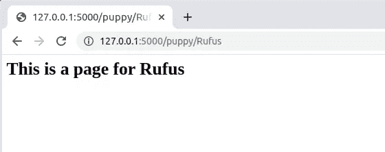

# (绝对)初学者用的烧瓶！

> 原文：<https://medium.com/analytics-vidhya/flask-for-absolute-beginners-64ed0d81f19a?source=collection_archive---------14----------------------->


如果你是一个像我一样的初学者，在学习了 HTML、CSS & JavaScript 甚至 Bootstrap 等前端技术之后，不知道该去哪里，并且想给你的网站添加一些交互性，并且一直在谷歌搜索***【Flask 教程】*** ，，那么这篇文章可能是一个很好的开始:)


**#什么是烧瓶？Flask 比 Django 好吗？怎么会？**

我相信你在探索**烧瓶**的过程中一定遇到过*姜戈*。Flask 和 Django 本质上都是 web 框架。

> Django 是 Python 的全栈 web 框架，而 Flask 是轻量级的、可扩展的基于 WSGI 的 Python web 框架。


Flask 非常容易学习，因此它是最常用的 Python web 框架。它有一个非常简约的方法，不像 Django 那样装满电池(这对大型项目很有好处)！

这真的取决于你在构建什么，但是对于简单的应用程序，考虑一下 Flask :D

因此，没有任何进一步的麻烦，让我们开始吧！！

# 要求和设置

1.  命令行或终端
2.  文本编辑器(Atom、Sublime 等..)
3.  安装 [Python](https://www.python.org/downloads/)
4.  使用以下工具安装烧瓶:`pip install flask`

# 我们第一个带 Flask 的网络应用

让我们通过写出第一个 flask 应用程序来检查我们的设置是否正常。在您各自 IDE 的项目文件夹中创建一个 app.py 文件(或者您可以将它命名为其他名称，除了 flask.py，因为它会产生冲突)。

默认情况下，flask 运行本地服务器 127.0.0.1:5000，端口号为 5000。

```
**python app.py**
```


从你的浏览器打开这个网址，你将会看到你的第一个 hello world 程序在 flask 上运行！


恭喜你。！您的第一个 flask web 应用程序启动并运行:)


Ofc，你可以用 flask 做更多的事情！喜欢..

# 基本路线

我们刚刚看到了如何创建一个只有一个页面的 web 应用程序(以字符串的形式返回)

让我们看看如何用 routing 添加多个路由(多个页面)。

这里的关键是在 **@app.route decorator** 中，传递给 decorator 的字符串参数决定了将链接到函数的 URL 扩展(也称为**视图**)。

目前，我们的网页或域名在本地表示为[**http://127 . 0 . 0 . 1:5000/**](http://127.0.0.1:5000/)**。我们用装饰者来增加这一点**

**@ app . route("/some _ page ")**最终会对应[**http://127 . 0 . 0 . 1:5000/**](http://127.0.0.1:5000/)**some _ page**

我们来看一个例子！

让我们在应用程序中编写以下代码:

再次运行我们的 app.py，我们发现…


还有…Tada！


你甚至可以给你的路线增加一些动态..例如

这将动态改变你的小狗的每个名字…就像



好吧，如果你做到了这一步，给自己一个鼓励吧！这并不是结束，你还可以用 Flask 做更多的事情，但是这只是一个开始，:D


你喜欢你读到的东西吗？

按住**拍拍**按钮，请随意分享你的想法和创意。