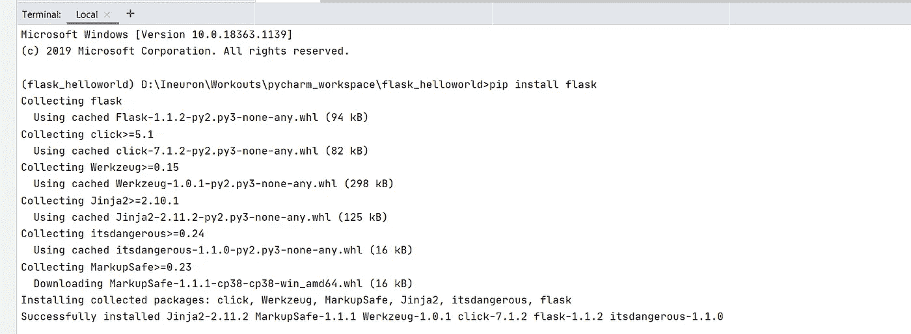
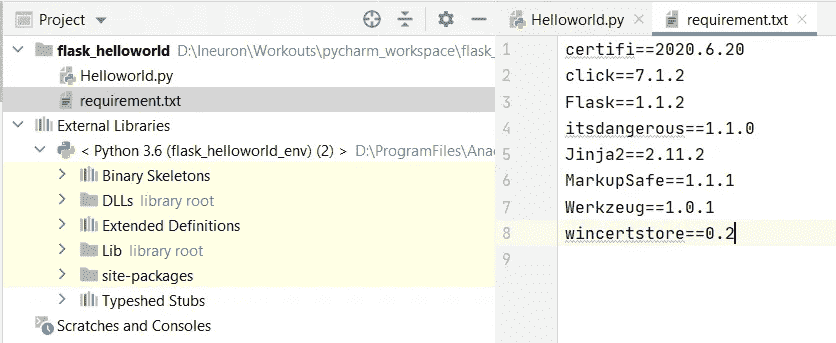
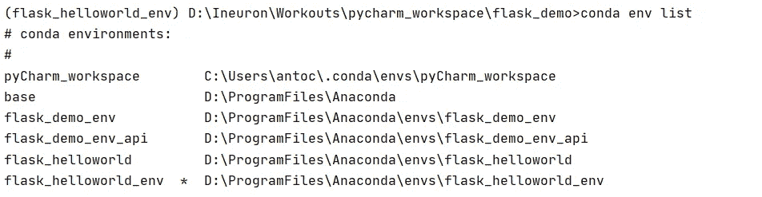

# 新手专用烧瓶

> 原文：<https://medium.com/analytics-vidhya/flask-for-newbies-427ffae88d50?source=collection_archive---------9----------------------->

Flask 是一个用 Python 编写的微型 web 框架


什么是 web 框架？

Web 应用程序框架代表库和模块的集合，使 web 应用程序开发人员能够编写应用程序，而不必担心诸如协议、线程管理等底层细节。

使用 web 框架，我们可以开发动态网站、web 服务和 web 应用程序。每个 web 框架都有自己的开发和部署标准。在当今世界，有很多 web 框架起着至关重要的作用。我们将在烧瓶上讨论这一部分。一般新手用的烧瓶介绍。

**什么是 web API？**

API 代表应用程序编程接口。“网络应用编程接口”是指网络上的应用编程接口。

*详细解释一下 web API 是如何工作的？*

想想大型零售行业拥有自己的 ERP 网站。他们开发了新的 API 来发现最新的产品需求/销售预测/预测本年度的产品总销售额。该行业需要在整个特许经营中实现 ERP 站点的 API。下一件事将会在你的脑海中浮现，是的，我们可以将应用程序代码和 API 集成在一起。应用程序的可伸缩性有多有用？这方面的成本效益如何？

这些都是这里的因素。如果我们只创建一个 web-API 调用，并以 JSON、XML 或任何足以让接收方处理响应的格式接收响应。这个 API 可以与部署的 N 个应用程序共享。每个应用程序的功能都不同，并且部署在不同的服务器上。根据资源可用性，这里只需要一台服务器。成本效益降低。

让我们开始摇烧瓶…


让我们使用 pyCharm 中的 Flask 创建一个简单的 python 项目，如下所示。


**安装砂箱**

在终端窗口中尝试命令' **pip install flask** '，如下所示。



烧瓶安装 _PyCharm

安装 flask 的另一种方法可以在 Anaconda 提示符下完成。这里尝试与' **pip 安装烧瓶**'相同的命令。


烧瓶安装 _Anaconda

**Python 有必要有多个环境吗？**

是的，确实如此。我们能够在我们的项目中拥有多种环境。我们来看一个实时场景。考虑 project_1 支持 python 版本 2.7。project_2 支持 python 版本。在这两个项目中，版本有所不同。如果我们根据下面的项目指定环境，

*   项目 _ 1--python _ env _ 2.7
*   项目 _ 2--python _ env _ 3.7

先说如何营造环境。

打开 Anaconda 提示符，将目录指向项目文件夹。


Anaconda 提示符指向基本目录

下面的语法用于创建我们自己的自定义环境。<<version>>说明了项目中需要配置的 python 版本。</version>

**康达 create-n<<environment name>>python = =<<版本> >**

正如我们前面讨论的有两个 Python 项目的例子，这两个环境需要创建如下:

**conda create-n project _ 1 _ 2.7 python = = 2.7**

**conda create-n project _ 2 _ 3.7 python = = 3.7**

```
(base) D:\Ineuron\Workouts\pycharm_workspace\flask_helloworld>conda create -n flask_helloworld_env python==3.6.9
Collecting package metadata (current_repodata.json): doneCollecting package metadata (repodata.json): done
Solving environment: done## Package Plan ## environment location: D:\ProgramFiles\Anaconda\envs\flask_helloworld_env added / updated specs:
    - python==3.6.9 The following packages will be downloaded: package                    |            build
    ---------------------------|-----------------
    pip-20.2.4                 |           py36_0         1.8 MB
    ------------------------------------------------------------
                                           Total:         1.8 MBThe following NEW packages will be INSTALLED: certifi            pkgs/main/win-64::certifi-2020.6.20-py36_0
  pip                pkgs/main/win-64::pip-20.2.4-py36_0
  python             pkgs/main/win-64::python-3.6.9-h5500b2f_0
  setuptools         pkgs/main/win-64::setuptools-50.3.0-py36h9490d1a_1
  sqlite             pkgs/main/win-64::sqlite-3.33.0-h2a8f88b_0
  vc                 pkgs/main/win-64::vc-14.1-h0510ff6_4
  vs2015_runtime     pkgs/main/win-64::vs2015_runtime-14.16.27012-hf0eaf9b_3
  wheel              pkgs/main/noarch::wheel-0.35.1-py_0
  wincertstore       pkgs/main/win-64::wincertstore-0.2-py36h7fe50ca_0
  zlib               pkgs/main/win-64::zlib-1.2.11-h62dcd97_4 Proceed ([y]/n)? y Downloading and Extracting Packages
pip-20.2.4           | 1.8 MB    | ############################################################################ | 100%
Preparing transaction: done
Verifying transaction: done
Executing transaction: done
#
# To activate this environment, use
#
#     $ conda activate flask_helloworld_env
#
# To deactivate an active environment, use
#
#     $ conda deactivate (base) D:\Ineuron\Workouts\pycharm_workspace\flask_helloworld>
```

最后，在这个环境被创造出来之后。进一步需要激活项目结构中的环境。它实际存在的地方。

**激活环境**

用于激活环境**的命令“conda activate<<environment name>>”。**执行该命令后，您可以看到 Python 环境从基础版本更改为新激活的环境名称，如下所示。


使活动

**停用环境**

要取消激活，尝试如下命令**‘conda deactivate’**。停用完成后，活动环境将更改为基本版本，如下所示。


复员

**在 Python 项目中配置活动环境**

浏览 File->Settings 并在项目名称中选择 Python 解释器(比如 flask_helloworld)。在右侧，您可以看到设置图标，然后单击添加。


之后，选择现有环境的解释器，作为实际创建新环境的地方。


要在终端窗口中验证应用的 python 解释器，如下所示:


终端窗口

太好了！现在一切都安装好了，你可以创建你的第一个 Flask 应用程序了。

使用下面的代码行在 Python 中导入 Flask。

```
**from** flask **import** Flask
```

创建托管应用程序的应用程序

```
app = Flask(__name__)
```

然后你需要一个调用 Python 函数的路由。路径将您在浏览器中输入的内容(url)映射到 Python 函数。

```
@app.route('/')
**def** **display**():
  **return** 'HelloWorld'
```

你应该知道的是，当脚本被执行时，Python 给脚本分配了**名** `**"__main__"**`。如果该脚本是从另一个脚本导入的，该脚本将保留其给定的名称(例如 hello.py)。在我们的例子中，我们正在执行脚本。因此，`__name__`将等于`"__main__"`。这意味着如果满足条件语句，将执行 app.run()方法。这种技术允许程序员控制脚本的行为。

快好了，需要启动服务器了。这将在端口 81 启动 web 应用程序。

```
**if __name__ == '__main__':
 app**.run(host='localhost', port=81, debug=True)
```

在 web 浏览器中输入 URL[http://localhost:81/](http://localhost:81/)。


代码摘要:

```
**from** flask **import** Flaskapp = Flask(__name__)app.route('/')
**def** **display**():
  **print** 'HelloWorld'**if** __name__ == '__main__':
  app.run(host='localhost', port=81, debug=True)
```

**构建需求文件**

我们可以生成一个 requirement.txt 文件来说明项目所需的先决条件库。

一般来说，如果项目需要转移到另一个服务器/从测试转移到生产。我们需要图书馆被复制到那里。在 python 中没有必要复制，因为 requirements.txt 会倾向于在新的系统/服务器中安装库。让我们看看如何实现它。

这里使用的命令是 **pip 冻结> requirement.txt**


生成需求文件

最后，您可以验证创建 requirement.txt 文件的项目工作区，如下所示。



Requirement.txt

**通过 requirement.txt 安装库**

我们创建了一个 requirement.txt 文件，它包含了与项目相关的库列表。同一项目被移动到另一台服务器上。通过在终端提供命令**' pip install-r requirements . txt '**。该命令旨在安装 python 项目中支持的库。


安装库

最后一个！查看在 Python 项目中创建的环境列表。这可以使用命令' **conda env list** 轻松实现



环境列表

希望你们都学习了环境设置和基本 Flask 应用的基础知识。

快乐学习。

**参考文献**

[康达备忘单](https://docs.conda.io/projects/conda/en/4.6.0/_downloads/52a95608c49671267e40c689e0bc00ca/conda-cheatsheet.pdf)