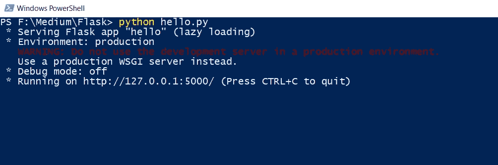

# 烧瓶—你好，世界

> 原文：<https://medium.com/analytics-vidhya/flask-hello-world-47ca1ccd0d30?source=collection_archive---------11----------------------->

这是**万物你好世界**系列的第一篇文章。
# hello world fever thing

Flask 是一个 Python 微型 web 框架。它不需要任何其他库来开始，它是非常轻量级的，因为它没有内置的组件，如数据库，表单验证等。在开发任何 API 时，Flask 总是我的首选，因为它简单，我们不必担心其他任何事情。

在本文中，我们将首先看到基本的 **Hello world** web 应用程序，除了在浏览器中打印一个简单的“Hello world”消息之外，它不会做任何其他事情。然后我们将会看到一些关于烧瓶的更酷的事情。

首先，我们需要在我们的系统中安装 Flask。由于这是一个 python 框架，你必须在你的系统中安装 python。
执行 pip 命令将安装烧瓶。

```
pip install Flask
```

现在让我们创建一个新的 python 文件 say hello.py

```
from flask import Flaskapp = Flask(__name__)[@app](http://twitter.com/app).route("/")
def helloworld():
    return "Hello World!"if __name__ == "__main__":
    app.run()
```

现在让我们来理解代码。首先，我们在代码中导入 flask。现在，在下一行中，我们将创建 flask 应用程序的一个实例。

现在让我们转到最后一行，当我们调用 app.run()时，它将启动 flask 应用服务器，服务器将开始监听传入的请求。

让我们来看看 helloworld()函数，你可以看到上面有一行@app.route("/")，这意味着当我们点击"/"的 URL 时，它将调用 helloworld 函数，运行代码并返回函数的结果。
在我们的 helloworld 函数中，我们只是返回一个普通的字符串“Hello World ”,当我们转到“/”时，它将被打印出来

让我们运行这段代码，我相信你会得到一个清晰的画面。

```
python hello.py
```



运行我们刚刚创建的 python 文件

正如您在最后一行中看到的，这意味着 flask 应用程序正在您的本地主机上成功运行。现在你只需要到 127.0.0.1:5000/就可以看到结果了。


现在让我们检查一下我们的 helloworld 函数，在那里我们有 app.route("/")
这意味着当你转到你的< BASE_URL > /它将调用 helloworld 函数并执行该操作。

让我们创建另一个函数。我们称之为**获取数据**

```
[@app](http://twitter.com/app).route("/get_data")
def getdata():
    return "Your data"
```


hello.py

现在，如果我们想运行 getdata()函数，我们需要转到 127.0.0.1:500/get_data


沃拉。！！很有趣，对吧？

现在，如果你想返回一些 JSON 字符串。让我们修改我们的代码

```
[@app](http://twitter.com/app).route("/get_data")
def getdata():
    data = {
        'name' : 'My Name',
        'url' : 'My URL'
    }
    return json.dumps(data)
```


我们修改 getdata()函数

现在，让我们回到浏览器来检查结果。


你可以在这里看到 JSON 数据

这应该能让你对瓶子有个初步的想法。我将写另一篇文章，介绍如何使用 HTML 页面显示数据。然后我们将看到如何将 MySQL 数据与 flask 应用程序连接起来。

如果你觉得这篇文章有帮助，请考虑关注我。我正试图获得 100 名追随者。干杯！