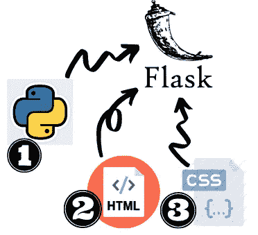
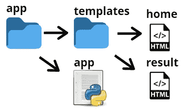
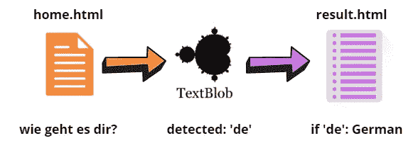
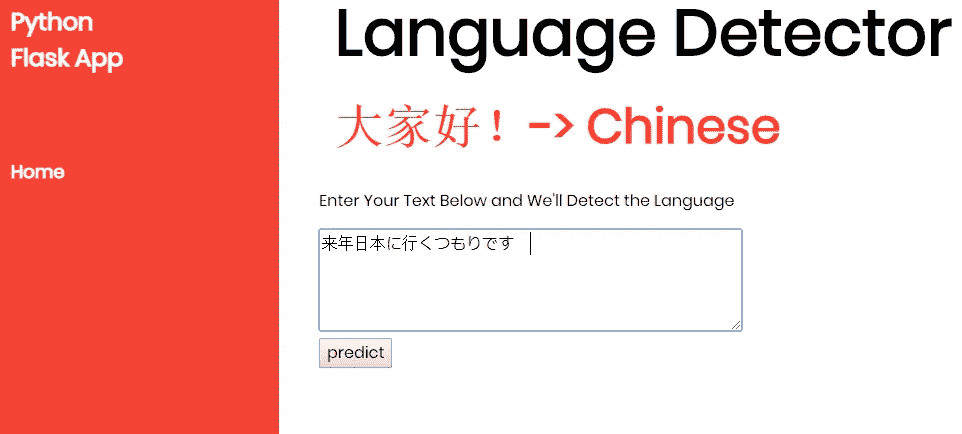
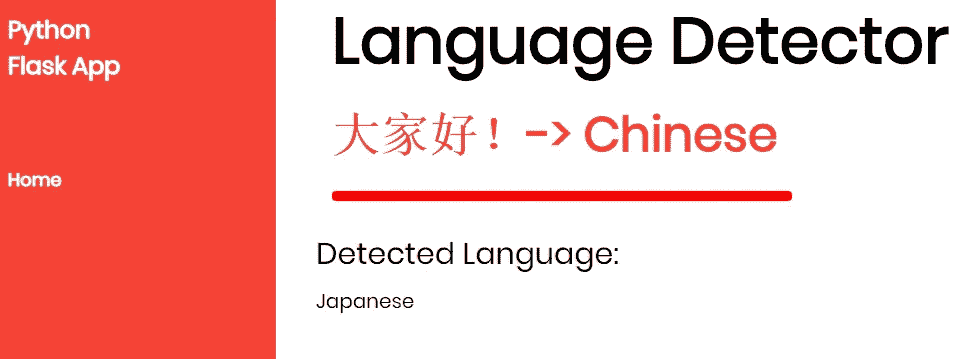

# 烧瓶语言检测应用程序

> 原文：<https://medium.com/analytics-vidhya/flask-language-detector-app-2ee28bfaea4e?source=collection_archive---------4----------------------->


乔尔·那仁在 [Unsplash](https://unsplash.com?utm_source=medium&utm_medium=referral) 上的照片

正如你们许多人从我以前的媒体文章中注意到的，我喜欢学习语言、语言学和数据科学。

在本文中，我将放下我的数据科学帽子，戴上我的*时尚*前端帽子。我将使用 flask 构建一个简单的语言检测器应用程序并服务于它。Flask 是一个轻量级的 web 框架，由于它的灵活性和易用性，这些年来获得了很大的流行。为了提高我的前端游戏，我已经开始学习 flask。



Python、HTML 和 CSS 是我们 Flask 应用程序的关键部分…还有 JavaScript

# 我们开始吧！

这是我们的文件目录目前的样子:



文件目录

我们要确保我们的文件目录组织得当。大多数项目还会包含一个包含一个`style.css`文件的`static`文件夹。因为我使用了一个预先构建的 HTML/CSS 模板，所以没有必要构建应用程序的这些组件。

# 游戏计划

让我们来分解一下语言检测器应用程序的各个部分:



1.  文本输入是通过 home.html 上的表单捕获的
2.  TextBlob 检测文本输入的语言
3.  result.html 破译了文本块结果

# 我们来看看 app.py

*   我们可以从加载包和创建 flask 实例开始。

```
from flask import Flask, render_template, url_for, request
from textblob import TextBlobapp = Flask(__name__)
```

*   为我们的主页设置`route`装饰。`route`装饰器用于创建一个 URL 并将其分配给一个函数。在我们的例子中，`('/')` URL 被分配给了`home():`函数。

```
@app.route('/')
def home(): 
        return render_template('home.html')
```

*   我们可以为预测页面设置另一个`route`装饰器。通过设置`method=['POST']`，文本输入将在我们的预测页面上被处理和更新，使我们能够看到我们的语言检测器的结果。
*   我们还将在`predict()`函数中设置我们的语言检测器。除了情感分析和解析， [TextBlob](https://textblob.readthedocs.io/en/dev/quickstart.html#parsing) 还可以用于语言检测。它易于使用，并由谷歌翻译 API 提供支持。我们将在我们的`predict()`函数中插入 TextBlob 来识别消息的语言。

```
@app.route('/predict',methods=['POST'])def predict(): 
           if request.method == ‘POST’: 
             message = request.form[‘message’] 
             blobline = TextBlob(message) 
             detect = blobline.detect_language() 
           return render_template(‘result.html’,prediction = detect)
```

我们可以完成代码并设置`debug=True`，这样我们就可以识别并解决任何潜在的 Python 错误。

```
if __name__ == ‘__main__’: 
         app.run(debug=True)
```

现在，我们可以继续我们的 HTML 页面。因为本文的重点主要是语言检测组件，所以我不会深入研究 HTML 和 CSS 领域。

我选择利用 [W3 Schools 的](https://www.w3schools.com/w3css/w3css_templates.asp)免费 CSS 模板来设计应用程序。主要目标是找到一个好的、简单的设计来补充语言检测器组件。希望我做了一个好的 UI 选择。

# 让我们来看看*home.html*

*   这是我们的用户将输入他们的语言检测文本的地方。我们将创建一个表单框架来捕获文本输入，并添加我们的`post`方法来更新我们的预测页面。

```
<!-- Text Input --><div class="sub-container">
<form action="{{ url_for('predict')}}" method="POST">
<p>Enter Your Text Below and We'll Detect the Language</p>
<!-- <input type="text" name="comment"/> -->
<textarea name="message" rows="4" cols="50"></textarea>
<br/>
<input type="submit" value="predict">
</form>
```

# 现在，让我们来看看*result.html*

*   如前所述，result.html 将破译 TextBlob 的检测结果。我在下面列出了许多条件语句来处理它们。在现实世界中，这种手动方法不是最佳解决方案，因为它需要更多的条件语句来处理任何请求。如果我用**匈牙利语**写了一条消息，该函数将返回`Sorry, I'm not sure`消息。也就是说，它符合这个简单教程的要求。

```
<div class="results">
<h2>Detected Language:</h2>            
</div>    

        
<h4 style="color:black;">German</h4>        
        
<h4 style="color:black;">Spanish</h4>        
        
<h4 style="color:black;">Chinese</h4>        
        
<h4 style="color:black;">French</h4>        
        
<h4 style="color:black;">English</h4>        
        
<h4 style="color:black;">Japanese</h4>        
        
<h4 style="color:black;">Russian</h4>        
        
<h4 style="color:black;">Italian</h4>        
        
<h4 style="color:black;">Sorry I'm not sure - Try Again</h4>            

</div>
```

现在我们已经完成了所有的编码，请在您的终端上键入:

`python app.py`

如果您看到类似这样的消息，请点按它。

```
Running on http://127.0.0.1:5000/ (Press CTRL+C to quit)
```

现在，让我们用不同的语言输入一些文本，然后点击`predict`



这就是我们预测页面应该看起来的样子:



## 耶！有效:)成功！

感谢阅读我的文章！如果你觉得它有点好笑，鼓掌或者查看我的 [GitHub](https://github.com/melozap/Flask-Language-Detector-App) 仓库中剩余的代码。

参考资料:

[](https://blog.miguelgrinberg.com/post/the-flask-mega-tutorial-part-i-hello-world) [## 烧瓶超级教程第一部分:你好，世界！

### 欢迎光临！您将开始一段旅程，学习如何使用 Python 和 Flask 创建 web 应用程序…

blog.miguelgrinberg.com](https://blog.miguelgrinberg.com/post/the-flask-mega-tutorial-part-i-hello-world) [](https://towardsdatascience.com/develop-a-nlp-model-in-python-deploy-it-with-flask-step-by-step-744f3bdd7776) [## 用 Python 开发一个 NLP 模型&用 Flask 逐步部署它

### Flask API，文档分类，垃圾邮件过滤器

towardsdatascience.com](https://towardsdatascience.com/develop-a-nlp-model-in-python-deploy-it-with-flask-step-by-step-744f3bdd7776) [](https://www.w3schools.com/) [## W3Schools 在线网络教程

### 世界上最大的 WEB 开发人员站点世界上最大的 WEB 开发人员站点正文{ background-color:light blue；} h1 {…

www.w3schools.com](https://www.w3schools.com/)