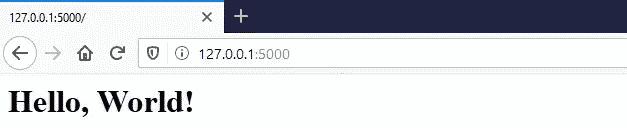
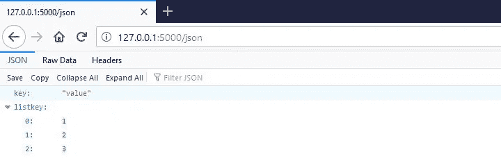
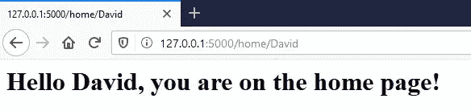
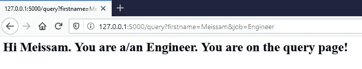
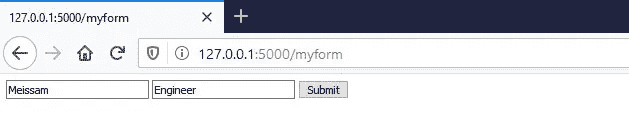
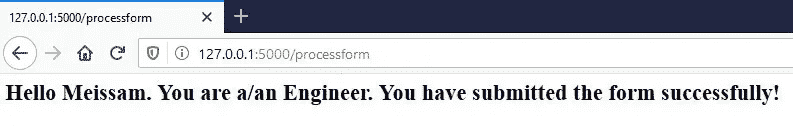
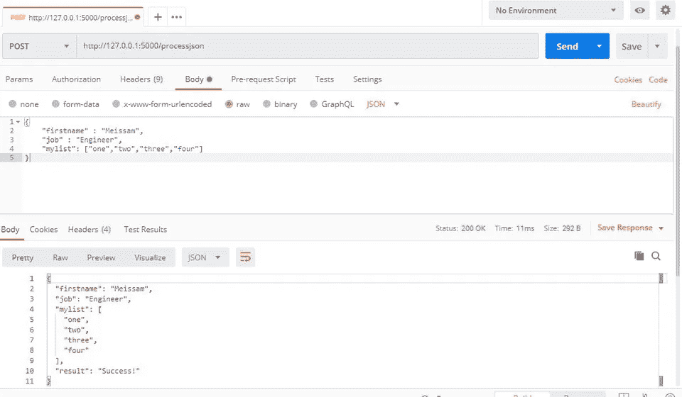
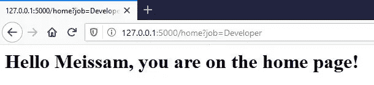

# 烧瓶路线—完整概述

> 原文：<https://medium.com/analytics-vidhya/flask-route-a-complete-overview-d66065bfa867?source=collection_archive---------9----------------------->


现在有各种各样的 [Python web 框架](https://wiki.python.org/moin/WebFrameworks)，而 [Flask](https://flask.palletsprojects.com/en/1.1.x/) 就是其中之一，但是我们应该考虑到它不是一个完整的 web 框架。它是基于[*Werkzeug*](https://werkzeug.palletsprojects.com/en/1.0.x/)*，*[*Jinja 2*](https://jinja.palletsprojects.com/en/2.11.x/)*的一个用于 Python 的微框架。“T20”包括一个内置的开发服务器，单元测试支持，并且完全支持 Unicode，具有 [RESTful](https://en.wikipedia.org/wiki/Representational_state_transfer) 请求调度和 [WSGI 兼容性](https://en.wikipedia.org/wiki/Web_Server_Gateway_Interface)。*

在这篇文章中，我将有一个 Flask routes 模块的概述，我假设你已经在你的计算机上安装了 Python 和 Flask。如果没有，请按照本说明中的[操作。](https://flask.palletsprojects.com/en/1.1.x/installation/)

# 路线介绍

首先，我们应该进口烧瓶。`app`将等于 flask，你传入模块的名称，然后你使用 decorator 应用程序来指定你想要为哪个路径编写代码。所以在这种情况下，我想为索引编写代码。我只需要指定斜线，然后在装饰器下面添加一个函数。我们通常以路线命名函数，如果路线被满足，该函数负责执行期望的任务。

```
from flask import Flask
app = Flask(__name__)@app.route('/')
def index():
    return '<h1>Hello, World!</h1>'if __name__ == '__main__':
    app.run(debug=True)
```

结果将是这样的:



通过这种方法，我们可以创建自定义路线。例如，回家的路线将是这样的:

```
from flask import Flask
app = Flask(__name__)@app.route('/')
def index():
    return '<h1>Hello, World!</h1>'@app.route('/home')
def home():
    return '<h1>You are on the home page!</h1>'if __name__ == '__main__':
    app.run(debug=True)
```

在上面两个例子中，我们都在函数中返回了字符串。我们也能够返回`Json`。为此，我们应该导入`jsonify`，并传递一个字典作为它的参数。像这样:

```
from flask import Flask
app = Flask(__name__)@app.route('/')
def index():
    return '<h1>Hello, World!</h1>'@app.route('/home')
def home():
    return '<h1>You are on the home page!</h1>'@app.route('/json')
def json():
    return jsonify({'key' : 'value', 'listkey' : [1,2,3]})if __name__ == '__main__':
    app.run(debug=True)
```

输出会是这样的:



# 路由方法

默认情况下，由 app route decorator 创建的端点仅用于 GET 请求。为了支持 POST 请求，我们应该在路由参数中定义它:

```
@app.route('/home', methods=['POST', 'GET'])
def home():
    return '<h1>You are on the home page!</h1>'
```

# 路线变量

web 应用程序的一个典型特征是允许用户传递自定义信息，为此，方法之一是在 URL 本身中传递变量。例如，我将向 home route 添加一个名称变量，并通过 format 方法打印它。需要注意的是，home route 旁边的变量名和函数的自变量应该相等:

```
@app.route('/home/<firstname>', methods=['POST', 'GET'])
def home(firstname):
    return '<h1>Hello {}, you are on the home page!</h1>'.format(firstname)
```

我们还应该为变量定义另一个具有默认值的路由，以防用户不输入任何值而只请求 home URL。我们也可以在我为`firstname`设置字符串时定义变量的类型。这意味着名字应该是字符串，否则将出现错误:

```
@app.route('/home', methods=['POST', 'GET'], defaults={'firstname' : 'Meissam'})
@app.route('/home/<string:firstname>', methods=['POST', 'GET'])
def home(name):
    return '<h1>Hello {}, you are on the home page!</h1>'.format(name)
```

输出是:



# 请求 Flask 路由中的查询字符串

除了构建 URL，还有其他方法将数据传入应用程序。接下来，我们将看看如何使用查询字符串传递数据。首先，我们应该从 Flask 导入请求组件:

```
from flask import Flask, jsonify, request
```

然后我将创建一个路由来处理从带有`request.args`的查询字符串中获取数据:

```
@app.route('/query')
def query():
    firstname = request.args.get('firstname')
    job = request.args.get('job')
    return '<h1>Hi {}. You are a/an {}. You are on the query page!</h1>'.format(firstname, job)
```

输出将是:



# 请求 Flask Route 中的表单数据

我将向您展示如何创建一个表单，以及如何将其数据发送到另一个路径。为此，我将创建一个名为`myform`的路由，然后将其数据提交给`processform`路由。请考虑，就像我们在上面学到的处理查询字符串一样，这一部分也需要导入“请求”组件并使用`request.form`:

```
@app.route('/myform')
def myform():
    return '''<form method="POST" action="/processform">
              <input type="text" name="firstname">
              <input type="text" name="job">
              <input type="submit" value="Submit">
              </form>'''@app.route('/processform', methods=['POST'])
def processform():
    firstname = request.form['firstname']
    job = request.form['job']
    return '<h1>Hello {}. You are a/an {}. You have submitted the form successfully!<h1>'.format(firstname, job)
```

结果将是:



在上面的例子中，我们使用`processform`来处理我们的数据。我们可以对表单表示和处理数据使用相同的方法。我们可以通过改变`myform`功能并使用一个简单的条件来实现:

```
@app.route('/myform', methods=['GET', 'POST'])
def myform():
    if request.method == 'GET':
        return '''<form method="POST" action="/myform">
              <input type="text" name="firstname">
              <input type="text" name="job">
              <input type="submit" value="Submit">
              </form>'''
    else:
         firstname = request.form['firstname']
         job = request.form['job']
         return '<h1>Hello {}. You are a/an {}. You have submitted the form successfully!<h1>'.format(firstname, job)
```

请考虑我们将表单中`action`属性的值更改为`myform`。虽然提到的模式是方便的，另一种模式是用不同的方法使用相同的路线，我不演示它。

# 请求 Flask 路由中的 JSON 数据

还有一种方法可以将请求数据传递给 flask 应用程序，那就是使用 Json 对象。我要再次使用`jsonify`和`request`组件。首先，我将使用 POST 方法创建一个名为`processjson`的新路径。那么我们应该使用`get_json`方法请求对象:

```
@app.route('/processjson', methods=['POST'])
def processjson():
    data = request.get_json()
    firstname = data['firstname']
    job = data['job']
    mylist = data['mylist']
    return jsonify({'result' : 'Success!',
                    'firstname' : firstname,
                    'job' : job,
                    'mylist' : mylist})
```

为了演示输出，我将使用 Postman 向我的应用程序创建一个请求:



# Flask 路由中的重定向和 url_for

在 web 应用程序中，一旦用户做了某件事，您经常会希望将用户重定向到另一个位置。一个例子是用户登录后。您可以将他们重定向到他们登录之前所在的页面。您可以将他们重定向到主页，也可以将他们重定向到帐户仪表板。为此，我们应该首先从烧瓶中导入`redirect`和`url_for`组件:

```
from flask import Flask, jsonify, request, url_for, redirect
```

为了展示这些组件的应用，我将对我们的表单示例做一点修改:

```
@app.route('/myform', methods=['GET', 'POST'])
def myform():
    if request.method == 'GET':
        return '''<form method="POST" action="/myform">
              <input type="text" name="firstname">
              <input type="text" name="job">
              <input type="submit" value="Submit">
              </form>'''
    else:
         firstname = request.form['firstname']
         job = request.form['job']
         *## return '<h1>Hello {}. You are a/an {}. You have submitted the form successfully!<h1>'.format(firstname, job)* return redirect(url_for('home', firstname=firstname, job=job))
```

提交表单后，它将被重定向到主页并传递`firstname`给它。如果你注意 home route，你会发现 home route 只是接受`firstname`作为一个变量，而 job 没有任何变量。所以它作为查询字符串传递。输出如下所示:



# 概述

在本教程中，我试图概述所有必要的烧瓶路线的概念。我希望这将有助于您开始创建更复杂的应用程序和 API。这是我们上面写的所有代码的最终版本:

```
from flask import Flask, jsonify, request, url_for, redirect
app = Flask(__name__)@app.route('/')
def index():
    return '<h1>Hello, World!</h1>' @app.route('/home', methods=['POST', 'GET'], defaults={'firstname' : 'Meissam'})
@app.route('/home/<string:firstname>', methods=['POST', 'GET'])
def home(firstname):
    return '<h1>Hello {}, you are on the home page!</h1>'.format(firstname)@app.route('/json')
def json():
    return jsonify({'key' : 'value', 'listkey' : [1,2,3]}) @app.route('/query')
def query():
    firstname = request.args.get('firstname')
    job = request.args.get('job')
    return '<h1>Hi {}. You are a/an {}. You are on the query page!</h1>'.format(firstname, job)@app.route('/myform', methods=['GET', 'POST'])
def myform():
    if request.method == 'GET':
        return '''<form method="POST" action="/myform">
              <input type="text" name="firstname">
              <input type="text" name="job">
              <input type="submit" value="Submit">
              </form>'''
    else:
         firstname = request.form['firstname']
         job = request.form['job']
         *## return '<h1>Hello {}. You are a/an {}. You have submitted the form successfully!<h1>'.format(firstname, job)* return redirect(url_for('home', firstname=firstname, job=job))""" # we commented process form and used condition in myform route
@app.route('/processform', methods=['POST'])
def processform():
    firstname = request.form['firstname']
    job = request.form['job']
    return '<h1>Hello {}. You are a/an {}. You have submitted the form successfully!<h1>'.format(firstname, job)"""@app.route('/processjson', methods=['POST'])
def processjson():
    data = request.get_json()
    firstname = data['firstname']
    job = data['job']
    mylist = data['mylist']
    return jsonify({'result' : 'Success!',
                    'firstname' : firstname,
                    'job' : job,
                    'mylist' : mylist}) if __name__ == '__main__':
app.run(debug=True)
```

本文原载于 2020 年 4 月 10 日星期五的 meissam.net。