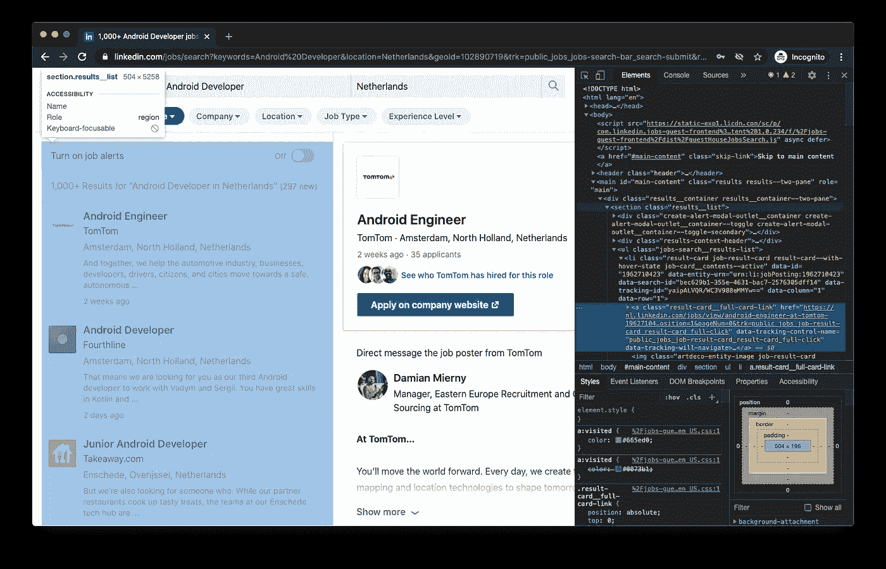
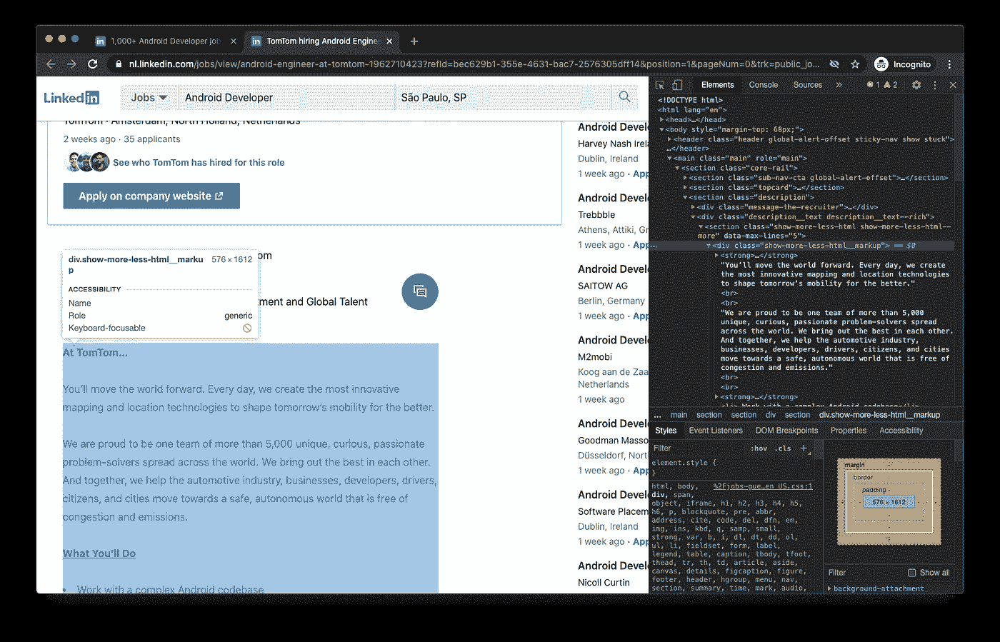
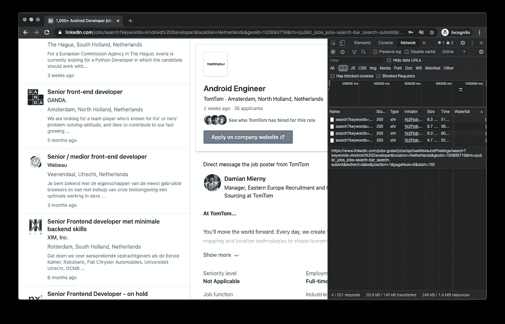
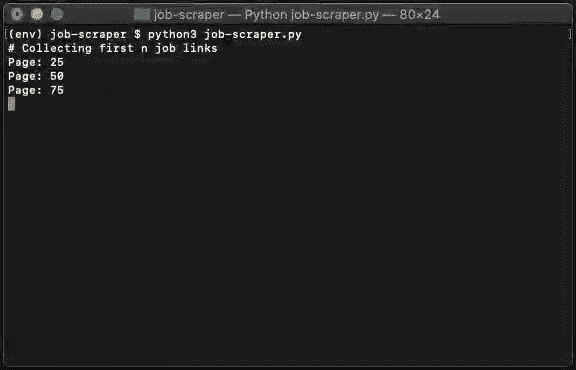

# 使用 Python 在 LinkedIn 找到最好的工作机会，逃离你的国家

> 原文：<https://medium.com/analytics-vidhya/flee-your-country-by-using-python-to-find-the-best-job-offers-at-linkedin-43ae2e506d99?source=collection_archive---------14----------------------->


## 构建一个搜索 LinkedIn 招聘信息的网络抓取应用程序，其中包含与搬迁相关的关键词

所以，如果你是一个非常害怕生活在一个[追捕记者](https://congressoemfoco.uol.com.br/governo/governo-vai-investigar-jornalista-que-publicou-charge-de-bolsonaro/)和[政敌](https://g1.globo.com/politica/noticia/2020/07/30/ministerio-da-justica-monitorou-579-opositores-de-bolsonaro-diz-site.ghtml)的国家的开发者，当这个国家因新冠肺炎死亡人数超过**[**100.000**-马克](https://en.wikipedia.org/wiki/Atomic_bombings_of_Hiroshima_and_Nagasaki#:~:text=Over%20the%20next%20two%20to,occurred%20on%20the%20first%20day.)与一个[军事伞兵](https://www.correiobraziliense.com.br/politica/2020/08/4867277-pazuello--o-interino-que-segue-no-cargo.html)担任卫生部长，同时提高合法杀虫剂[的数量](https://noticias.uol.com.br/meio-ambiente/ultimas-noticias/redacao/2019/11/28/com-novas-aprovacoes-liberacao-de-agrotoxicos-ja-e-o-maior-da-historia.htm)然后[再](https://cultura.uol.com.br/noticias/9031_liberacao-de-agrotoxicos-proibidos-no-exterior-e-cada-vez-mais-rapida-no-brasil.html)在其他国家被禁止，随着的确，这似乎是一个疯狂的居住地。**

**让我们利用从[上一篇文章](/swlh/web-scraping-mql5-signals-with-python-e2eb9bebe0f0)中学到的网络报废技巧来**在** LinkedIn 上搜索全球各地的开发者职位，这些职位在职位描述中包含 *visa* 关键词，并将其保存到一个带有职位链接的 csv 文件中，这样你就可以在以后**申请、被录用**并最终**离开** **那个颠倒的国家**。我们开始吧！**

> **由于之前的帖子，现在我们是 web 报废的专家了，我们将跳过安装说明，直接动手操作。**

## **🕵️‍♀️探索地面**

**打开一个匿名窗口，访问 LinkedIn [网站](https://www.linkedin.com/jobs/search?keywords=Android%20Developer&location=Netherlands)。开始搜索一些作业，打开**检查工具** ( **Cmd + Option + C)。**你会很快意识到左边所有的卡片都是' *a'* 元素，它们的类是' *result-card__full-card-link '。所有这些元素都有一个链接，如果你看到那边的' *href'* 属性。另外，请注意，该链接实际上是您在页面右侧看到的工作页面。***

****

**在荷兰寻找一个 Android 开发者的角色。**

**如果你很好奇，点击那个链接，你会看到如下页面。包含作业描述的作业描述页面位于“ *div* 下，其类为“*show-more-less-html _ _ markup*”。**

****

**作业的描述页面。**

## **🎯定义目标**

**我们的目标是迭代这些工作卡以访问每个描述，以便过滤是否包含关键字' [**visa**](https://www.google.com/search?q=what+is+visa&oq=what+is+visa&aqs=chrome..69i57j0l7.2436j0j7&sourceid=chrome&ie=UTF-8) '，以便每个工作的名称和链接都进入一个 csv 文件。**

**为了做到这一点，我们必须找到一种方法，以无限滚动分页的方式迭代工作卡，以获取它们的链接和名称。最后，我们将遍历该列表，过滤出所有描述与' *visa* '关键字匹配的人，并将列表写入一个 csv 文件。**

## **⛏分解无限卷轴**

**因此，只有当用户向下滚动页面时，数据才会被加载，我们可以使用一个很好的技巧来查找滚动时正在进行的请求。进入**开发者工具**并点击**网络**选项卡。在这个选项卡中，当您与负责 [ajax](https://en.wikipedia.org/wiki/Ajax_(programming)) 请求的名为 *XHR* 的子选项卡下的网页进行交互时，您可以监控正在进行的所有请求。**

**使用左上角的 clear 按钮来清除日志，并开始向下滚动页面，您会注意到出现了一些请求。**

****

**请求显示在网络选项卡中。**

**请注意，请求的参数如下所示。顺便去掉其他所有参数也没问题。**

```
[/search?keywords=Android%20Developer&location=Netherlands&start=50](https://www.linkedin.com/jobs-guest/jobs/api/seeMoreJobPostings/search?keywords=Android%20Developer&location=Netherlands&geoId=102890719&trk=public_jobs_jobs-search-bar_search-submit&redirect=false&position=1&pageNum=0&start=50)
```

**如果你继续向下滚动，你会注意到:**

```
[/search?keywords=Android%20Developer&location=Netherlands&start=75](https://www.linkedin.com/jobs-guest/jobs/api/seeMoreJobPostings/search?keywords=Android%20Developer&location=Netherlands&geoId=102890719&trk=public_jobs_jobs-search-bar_search-submit&redirect=false&position=1&pageNum=0&start=50)[/search?keywords=Android%20Developer&location=Netherlands&start=100](https://www.linkedin.com/jobs-guest/jobs/api/seeMoreJobPostings/search?keywords=Android%20Developer&location=Netherlands&geoId=102890719&trk=public_jobs_jobs-search-bar_search-submit&redirect=false&position=1&pageNum=0&start=50)[/search?keywords=Android%20Developer&location=Netherlands&start=125](https://www.linkedin.com/jobs-guest/jobs/api/seeMoreJobPostings/search?keywords=Android%20Developer&location=Netherlands&geoId=102890719&trk=public_jobs_jobs-search-bar_search-submit&redirect=false&position=1&pageNum=0&start=50)
```

**当*开始*参数增加 25 倍时，新的工作就来了。**

## **👩‍💻编码时间**

**让我们首先创建我们的 CSV 文件。**

**让我们向刚刚发现的 LinkedIn 地址发出一些请求。**

```
https://www.linkedin.com/jobs/search?**keywords**=jobName&**location**=locationName&**start**=25’
```

**我们将得到第一个 100 个工作过滤，因为我们说之前增加了 25 倍。**

> **如果你试图过滤超过 100 个工作，你会得到很多过时的数据。**

**我们在这里发出几个请求，从 LinkedIn 网站获取 100 个工作结果。正如本文开头所说，通过查看 HTML。**

> **左边所有的卡片都是**‘a’**元素，其类别为**‘结果-卡片 _ _ 全卡-链接’***。*所有这些元素都有一个链接，如果你看到那边的' *href'* 属性。另外，请注意，该链接实际上是您在页面右侧看到的工作页面。**

**所以我们首先找到包含我们要寻找的所有工作卡的 div。**

```
soup.find(class_='jobs-search__results-list')
```

**然后我们找到所有' *a'* 元素，它们的*类*是'*result-card _ _ full-card-link*'。它们实际上是我们的工作卡。**

```
.findAll(‘a’, { ‘class’ : ‘result-card__full-card-link’ })
```

**最后，我们将每次迭代的结果添加到一个名为 *joblist* 的数组中。**

**这样，我们的变量 **joblist** 保存了一个包含一百个*‘a’*元素的列表。😱**

**下一步是迭代这些作业，以获得作业页面的名称和链接。获得链接后，我们将发出 get 请求来获得作业的描述，正如前面指出的，这就像获得一个 *div* 一样简单，它的*类*是*show-more-less-html _ _ markup。***

**为了在描述中找到关键字 ***visa*** ，我们将使用正则表达式。**

```
description.**findAll**(string=re.**compile**(r”\bvisa\b”,re.I))
```

**所以在上面的代码中，函数 *re.compile* 接收正则表达式 *"\bvisa\b"* 作为参数以及常量 *re。I* ，表示忽略区分大小写。**

> **你可以使用其他关键词，如“搬迁”或“赞助”。请在评论中告诉我们什么对你最合适。**

**现在运行您的代码，并开始练习代码面试。🤓**

****