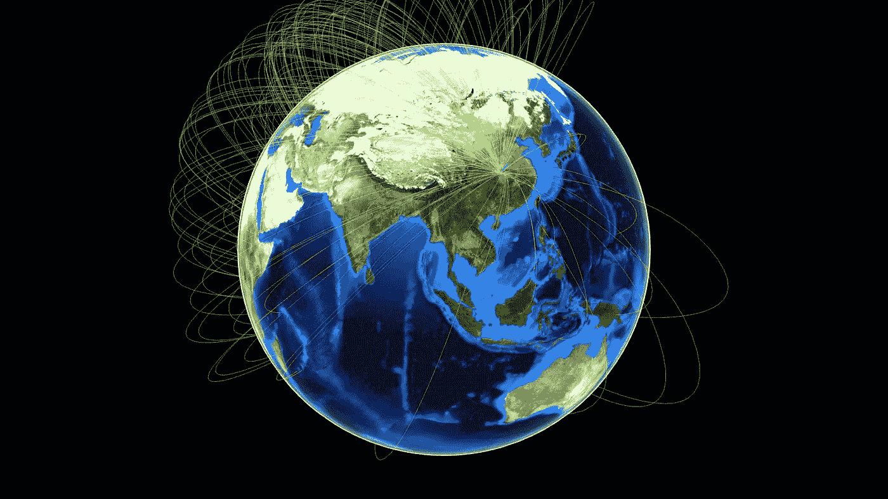
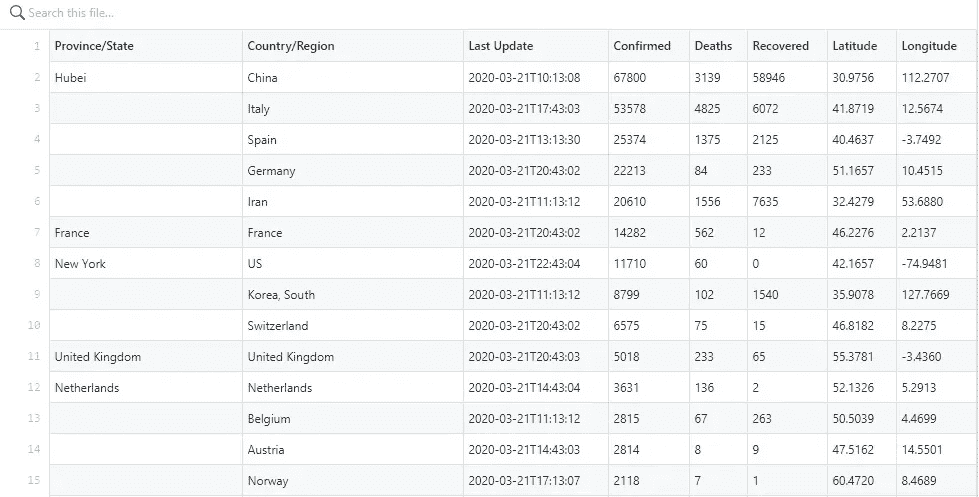
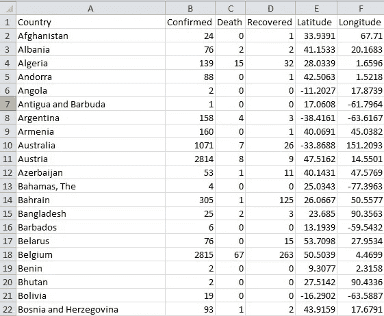
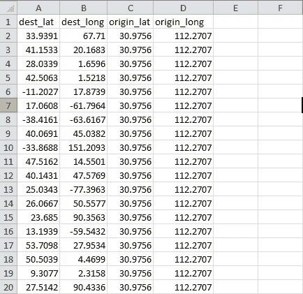
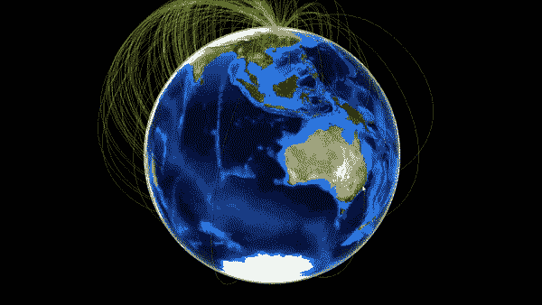
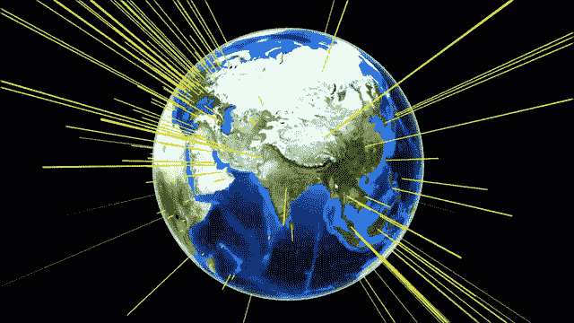
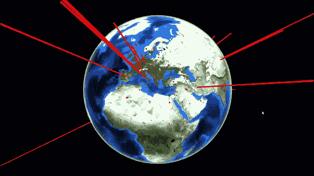
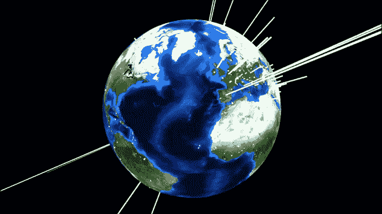

# 日冕的飞行——R 中环绕地球的可视化之旅

> 原文：<https://medium.com/analytics-vidhya/flight-of-corona-a-visualization-journey-around-the-earth-in-r-fe7d82a41b1?source=collection_archive---------16----------------------->



科罗娜环球之旅从中国开始

2019 年 12 月 31 日，中国当局确认了一种新型肺炎的存在。源头被追踪到了电晕中心武汉的一个肉市场。

后来中国当局将其命名为 nCov 或新型冠状病毒。自一月份被发现以来，它已经像野火一样蔓延到世界各地，截至 2020 年 3 月 24 日，全球已有超过 36 万人感染，超过 16000 人死亡。

这是迄今为止隐形病毒对人类最致命的攻击，到目前为止，医学科学家正在一天 24 小时工作，寻找治愈它的疫苗。

在这篇文章中，我试图形象化科罗纳的旅程，以及它是如何通过可视化成为全球疫情的。

我使用 R 和 three.js 包来可视化 Corona 旅程和在全球的传播。

根据 cran.r wesite，threejs 包支持交互式 3D 图形，包括使用 three.js 和 htmlwidgets 的点云和球体。点击此处查看全部详情。我在这里使用了来自[的代码](https://cran.r-project.org/web/packages/threejs/threejs.pdf)，并将 Corona 数据集放入相同的代码中。所以这篇文章归功于 cran.r-project.org。

数据取自 2020 年 3 月 21 日的 GitHub。所有的经度和纬度也取自同一数据。该数据每天更新，被认为是最可信的数据。在这里找到数据[的链接](https://github.com/CSSEGISandData/COVID-19/tree/master/csse_covid_19_data)。数据以汇总数据和时间序列数据的形式出现。在这篇文章中，我使用的是汇总数据。这是数据的第一张图片



GitHub 网站的初始数据

该数据包含每天的确诊、死亡和恢复病例。可以找到传播的国家/地区和省份/州。

在使用这些数据时，我必须首先清理它们。对于一些国家，数据是以州为单位显示的，如美国、中国、英国等。所以我不得不手动汇总数据，然后把它放在一个单独的文件中。对于一些国家，我必须手动添加纬度和经度。对于一些地区，我发现纬度和经度指向大海(可能是游轮的位置)。

这是清理后的数据。



由于日冕的起点是武汉，我们需要以这样一种方式转换数据，即我们应该将中国的纬度和经度作为起点，将其他国家作为纬度和经度的目的地。

所以我进一步处理了我的数据，这是最终的数据，可以显示为航班数据。你可以在 C 列和 D 列看到相同的经度和纬度。



显示日冕在全球飞行的最终数据集

# 可视化 1

让我们加载数据集，阅读上述文件，看看数据。

```
library(threejs)CoronaFlight <- read.csv(“D:/Harish/R practice projects/Corona/22March2020/21032020Data_Corona_Flight.csv”)CoronaFlight> CoronaFlight
 dest_lat dest_long origin_lat origin_long
1 33.9391 67.7100 30.9756 112.2707
2 41.1533 20.1683 30.9756 112.2707
3 28.0339 1.6596 30.9756 112.2707
4 42.5063 1.5218 30.9756 112.2707
5 -11.2027 17.8739 30.9756 112.2707
6 17.0608 -61.7964 30.9756 112.2707
7 -38.4161 -63.6167 30.9756 112.2707
8 40.0691 45.0382 30.9756 112.2707
9 -33.8688 151.2093 30.9756 112.2707
10 47.5162 14.5501 30.9756 112.2707
```

加载地球图像。我用了美国宇航局的图像。你也可以使用 threejs 软件包中的地球图像。

```
earth <- “[http://eoimages.gsfc.nasa.gov/images/imagerecords/73000/73909/world.topo.bathy.200412.3x5400x2700.jpg](http://eoimages.gsfc.nasa.gov/images/imagerecords/73000/73909/world.topo.bathy.200412.3x5400x2700.jpg)"
```

所以这之后的代码非常简单。只需将数据集放入代码中，就能看到神奇之处。arcs 参数将自动获取目的地并像航班一样显示它们。

```
FlightOfCorona <- globejs(img=earth, lat=CoronaFlight[,3], long=CoronaFlight[,4], arcs=CoronaFlight,
 arcsHeight=0.5, arcsLwd=1, arcsColor=”#ffff00", arcsOpacity=0.50,
 atmosphere=TRUE)FlightOfCorona
```

一旦我得到了输出，我就把它保存为一个 html 页面，记录下那个页面，制作一个 mp4 文件，然后在一个在线工具的帮助下把它制作成一个 gif。这是最终的输出。你可以清楚地看到电晕是如何从中国传播到所有国家的。使用相同的代码，您可以绘制不同出发地和目的地的航班数据。



# 可视化 2

现在，使用与我在前面部分中向您展示的已清理数据相同的数据，我将向您展示已确认、死亡和已恢复病例的可视化效果。包装也是一样的。

```
 #load the package
library(threejs)#set working directory
setwd(“D:/Harish/R practice projects/Corona/22March2020”)#read the file
final = read.csv(“21032020Data_2.csv”)
```

查看列名

```
#look at the column names
colnames(final)> colnames(final)
[1] “Country” “Confirmed” “Death” “Recovered” “Latitude” “Longitude”
```

国家的数量是 178 个。

```
nrow(final)> nrow(final)[1] 178
```

看数据。

```
head(final, n = 10)> head(final, n = 10)
 Country Confirmed Death Recovered Latitude Longitude
1 Afghanistan 24 0 1 33.9391 67.7100
2 Albania 76 2 2 41.1533 20.1683
3 Algeria 139 15 32 28.0339 1.6596
4 Andorra 88 0 1 42.5063 1.5218
5 Angola 2 0 0 -11.2027 17.8739
6 Antigua and Barbuda 1 0 0 17.0608 -61.7964
7 Argentina 158 4 3 -38.4161 -63.6167
8 Armenia 160 0 1 40.0691 45.0382
9 Australia 1071 7 26 -33.8688 151.2093
10 Austria 2814 8 9 47.5162 14.5501
```

现在从[这里](http://eoimages.gsfc.nasa.gov/images/imagerecords/73000/73909/world.topo.bathy.200412.3x5400x2700.jpg)载入地球的图像。

```
#find the earth image
earth <- “[http://eoimages.gsfc.nasa.gov/images/imagerecords/73000/73909/world.topo.bathy.200412.3x5400x2700.jpg](http://eoimages.gsfc.nasa.gov/images/imagerecords/73000/73909/world.topo.bathy.200412.3x5400x2700.jpg)"
```

让我们用下面的代码来可视化确认的案例。在这里，你需要考虑确诊病例。将纬度和经度分别放在 lat 和 long 参数中。你可以通过输入不同的值来玩代码，比如颜色、点的大小或者不同的地球图像。

```
confirmed <- globejs( img=earth, lat = final$Latitude, long = final$Longitude,
 value = final$Confirmed,col = ‘#FFFF00’,
 pointsize = 1.0,
 atmosphere = TRUE)confirmed
```

这是最终的输出。我在飞行示例中使用了与上面提到的相同的过程。条形表示确诊病例数。查看中国、欧洲国家和伊朗的酒吧长度。



电晕确诊病例

让我们得到相同数据的死亡案例。红色条表示死亡病例的数量。

```
Death <- globejs( img=earth, lat = final$Latitude, long = final$Longitude,
 value = final$Death, col = ‘#FF00001’,
 pointsize = 2.0,
 atmosphere = FALSE)
Death
```



电晕死亡案例

让我们用相同的数据绘制恢复的案例。白条表示死亡病例的数量。

```
Recovered <- globejs( img=earth, lat = final$Latitude, long = final$Longitude,
 value = final$Recovered, col = ‘#FFFFFF’,
 pointsize = 2.0,
 atmosphere = FALSE)
Recovered
```



电晕恢复案例

就这样，我完成了我的文章。感谢阅读全文。很快会遇到一篇新文章。

请随时给我留言或给我发邮件到 harnagpal@gmail.com。在 [Linkedin](https://www.linkedin.com/in/harish-nagpal-8696529/) 和我联系。

看看我其他关于 Medium.com 的文章

[](/analytics-vidhya/data-science-use-cases-in-life-insurance-8cfbfd8b2fff) [## 人寿保险中的数据科学用例

### 数据科学是当今科技界的一个新现象。随着计算能力的增加，它已经改变了世界…

medium.com](/analytics-vidhya/data-science-use-cases-in-life-insurance-8cfbfd8b2fff) 

[选举可视化带 R](/analytics-vidhya/create-beautiful-visualization-of-data-in-trelliscopejs-package-in-r-c67879c55864)

c[trelliscope js-package-in-r-](/analytics-vidhya/create-beautiful-visualization-of-data-in-trelliscopejs-package-in-r-c67879c55864)

在这里看我的数据科学数学艺术[。](https://www.instagram.com/artofhary/)

# 参考

[地球图像](http://eoimages.gsfc.nasa.gov/images/imagerecords/73000/73909/world.topo.bathy.200412.3x5400x2700.jpg)

[R 三合一包装](https://cran.r-project.org/web/packages/threejs/threejs.pdf)

[数据来源](https://github.com/CSSEGISandData/COVID-19/blob/master/csse_covid_19_data)

[起重机-](http://cran.r-project.org) r