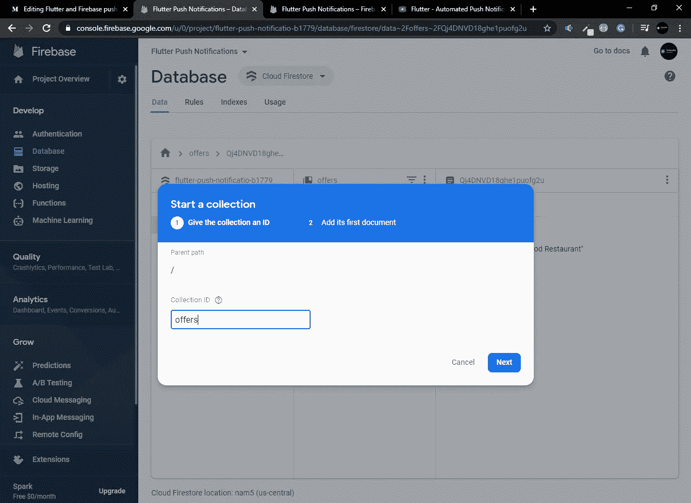
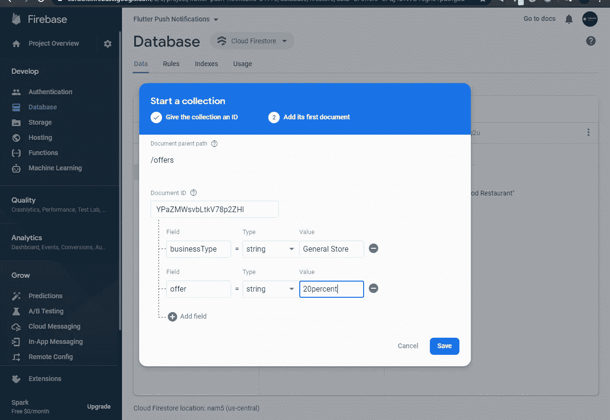
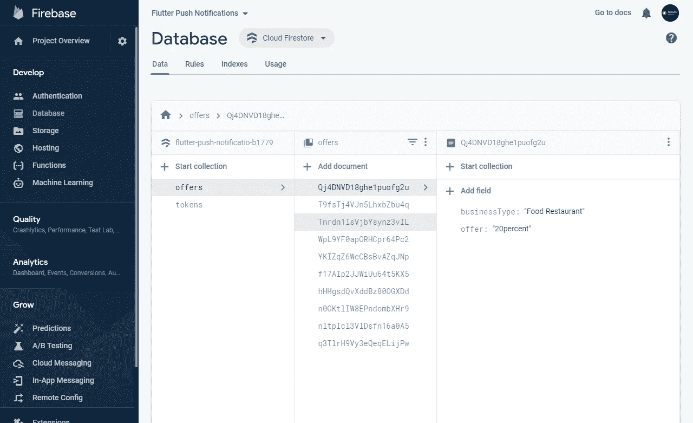
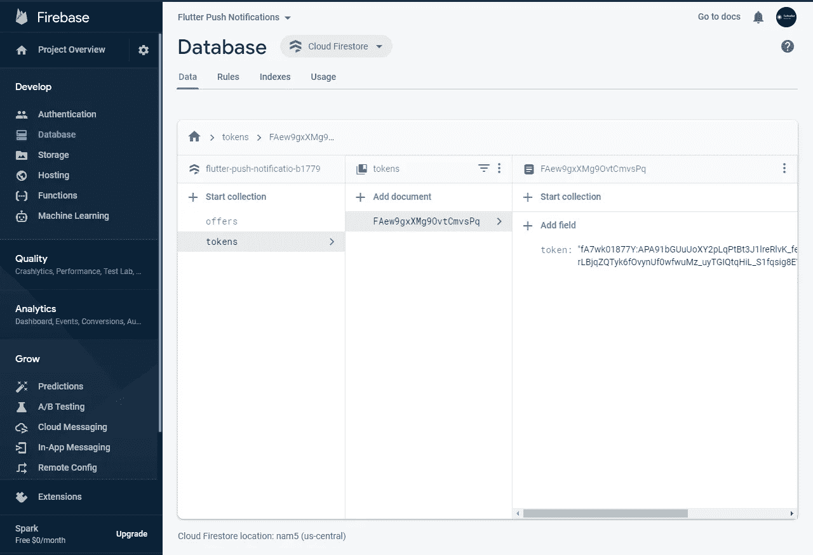

# Flutter 和自动化 Firebase 推送通知完全集成。

> 原文：<https://medium.com/analytics-vidhya/flutter-and-automated-firebase-push-notification-complete-integration-8377b4fc928b?source=collection_archive---------1----------------------->


大家好，今天我们将讨论 flutter 和 firebase 推送通知。

因为我一直在做像优步这样的应用程序，所以我遇到了关于推送通知的问题，向可用的司机发送关于位置等的通知。

你需要做的是首先建立一个带有云消息和云 firestore 的 firebase 的 flutter 项目。

第一步:首先，我们将在电脑中安装 firebase 功能:

1.  转到命令提示符，写下:' npm install -g firebase-tools '，并等待它完成。
2.  然后写“firebase 登录”,你会被提示登录谷歌浏览器，然后从你与 firebase 关联的账户登录。如果你想从不同的 id 登录，那么使用:' firebase log in-re auth '其中'—'是双破折号。
3.  现在用命令创建一个目录:mkdir firebasefunctions
4.  现在转到那个目录:“cd firebasefunctions”
5.  现在编写“firebase init 函数”并按 y 键。
6.  现在选择默认的项目，要么新建，要么选择一个现有的项目，在其中集成 firebase 功能
7.  选择项目后，您会得到两个选项 javascript 或 typescript，选择 javascript。
8.  然后，它会要求通过 npm 安装依赖项，按 y。这将需要几分钟的时间
9.  现在输入“代码”在 visual studio 代码或您拥有的任何其他 ide 中打开项目。

你已经成功地在你的电脑上为一个特定的项目安装了 firebase 函数。

步骤 2:现在，从 firebase 数据库选项中启用云 firestore 并创建一个集合，因为我们正在使用虚拟数据进行此操作。您也可以根据需要进行集成，让我们使用虚拟数据来完成此操作:

转到 firebase 控制台，转到数据库，在测试模式下创建 firestore DB，然后执行我正在执行的操作:

1.  点击“开始收藏”并为收藏命名，报价如下:



2)在文档 id 字段中，按下 auto-id，然后给出如下字段名，所有字段名都应该相同，以便正确工作并保存，请始终记住字段名应该相同。



3)现在点击“添加文档”,再次对文档 id 执行相同的操作，按下 auto-id，相同的名称使用不同的数据，始终记住字段名应该相同。


步骤 2:现在转到安装 firebase 的 visual studio 代码，在 firebase 文件夹中转到 index.js，删除所有代码并复制粘贴以下代码:

```
**const** functions = require(**'firebase-functions'**);

**const** admin = require(**'firebase-admin'**);

admin.initializeApp(functions.config().firebase);
**var** msgData;

exports.offerTrigger = functions.firestore.document(
**'offers/{offerId}'** ).onCreate((snapshot,context)=>{

msgData = snapshot.data();

admin.firestore().collection(**'tokens'**).**get**().then((snapshots)=>{
**var** tokens = [];
**if**(snapshots.empty)
{
console.log(**'No Devices Found'**);
}
**else**{
**for**(**var** pushTokens **of** snapshots.docs){
tokens.push(pushTokens.data().token);
}

**var** payload ={
   **'notification'**:{
         **'title'**: **'From '** + msgData.businessType,
         **'body'**: **'Offer is : '** + msgData.offer,
         **'sound'**: **'default'**,
       },
**'data'**:{
        **'sendername'**: msgData.businessType,
        **'message'**: msgData.offer,
      }
    };

**return** admin.messaging().sendToDevice(tokens,    payload).then((response) => {
       console.log(**'pushed them all'**)
     }).**catch**((err) => {
           console.log(err);
       });
     }
   });
});
```

现在让我们了解一下这里发生了什么，因为这是设置您的通知系统的主要部分:

1.  首先，我们已经初始化了 firebase 应用程序。

```
exports.offerTrigger = functions.firestore.document(
**'offers/{offerId}'** )
```

每当我们添加一个新的文档或数据到我们的 offers 集合中时，这个方法总是会调用。在集成到您的项目中时，请记住，您必须将集合名称放在这里，集合中的微小变化都会向用户发送通知。

```
admin.firestore().collection(**'tokens'**).**get**().then((snapshots)=>{
**var** tokens = [];
**if**(snapshots.empty)
{
console.log(**'No Devices Found'**);
}
**else**{
**for**(**var** pushTokens **of** snapshots.docs){
tokens.push(pushTokens.data().token);
}

**var** payload ={
   **'notification'**:{
         **'title'**: **'From '** + msgData.businessType,
         **'body'**: **'Offer is : '** + msgData.offer,
         **'sound'**: **'default'**,
       },
**'data'**:{
        **'sendername'**: msgData.businessType,
        **'message'**: msgData.offer,
      }
    };

**return** admin.messaging().sendToDevice(tokens,    payload).then((response) => {
       console.log(**'pushed them all'**)
     }).**catch**((err) => {
           console.log(err);
       });
     }
   });
});
```

现在，此集合将在令牌节点上工作，不要担心，我们将动态生成令牌，但首先，我们可能会理解此代码，此代码将进入令牌集合并获取所有令牌，如果没有令牌，则不会找到任何设备，否则，如果它找到一个令牌，则它将遍历文档并从中取出一个令牌，现在请理解:

业务类型和报价将从我们创建的报价集合中获取，如下所示:



如您所见，business-type 和 offer 与我们的 index.js 文件中所写的相同。

```
**for**(**var** pushTokens **of** snapshots.docs){
tokens.push(pushTokens.data().token);
}
```

Tokens.push 正在将数据添加到令牌数组中。

```
pushTokens.data().token
```

现在，这里写的“令牌”是文档的字段名，即如果您将令牌密钥保存为 MyToken，那么“令牌”将被替换为“MyToken”。

```
**var** payload ={
   **'notification'**:{
         **'title'**: **'From '** + msgData.businessType,
         **'body'**: **'Offer is : '** + msgData.offer,
         **'sound'**: **'default'**,
       },
**'data'**:{
        **'sendername'**: msgData.businessType,
        **'message'**: msgData.offer,
      }
    };

**return** admin.messaging().sendToDevice(tokens,    payload).then((response) => {
       console.log(**'pushed them all'**)
     }).**catch**((err) => {
           console.log(err);
       });
     }
   });
});
```

现在，有效负载是我们希望发送给用户的通知设置数据。

通知:也应该是一样的，通知将带有标题和正文，它们将在通知上显示给用户。

数据:这需要谁发送数据以及消息是什么。

```
**return** admin.messaging().sendToDevice(tokens,    payload).then((response) => {
       console.log(**'pushed them all'**)
     }).**catch**((err) => {
           console.log(err);
       });
     }
   });
});
```

这部分告诉我们将这个通知推送给集合中所有可用令牌。

现在打开 cmd，在那里你有你的 firebase 函数，例如，你已经保存了你的 firebase 函数在 D 驱动器，然后去 D 驱动器和内部地址栏删除所有和写 cmd 和按下回车键，然后光盘 firebase 函数后，你在你的地址部署你的 firebase 函数运行这个命令:

firebase deploy-only functions ' where-表示两个破折号，如果您得到一个身份验证错误，则编写此命令' firebase log in-re auth ' where-表示两个破折号。

然后转到 firebase，检查开发层级下的功能，你会看到一个触发器出现在那里。如果你没有看到，那么你可能已经忘记了上面的步骤。

现在，让我们转向我们的应用程序，转到 main.dart，删除所有代码，并复制粘贴以下代码:

```
**import 'package:cloud_firestore/cloud_firestore.dart'**;
**import 'package:firebase_messaging/firebase_messaging.dart'**;
**import 'package:flutter/material.dart'**;

**void** main() {
  runApp(MyApp());
}

**class** MyApp **extends** StatelessWidget {
  *// This widget is the root of your application.* @override
  Widget build(BuildContext context) {
    **return** MaterialApp(
      title: **'Flutter Demo'**,
      theme: ThemeData(
        primarySwatch: Colors.*blue*,
        visualDensity: VisualDensity.*adaptivePlatformDensity*,
      ),
      home: MyHomePage(),
    );
  }
}

**class** MyHomePage **extends** StatefulWidget {
  @override
  _MyHomePageState createState() => _MyHomePageState();
}

**class** _MyHomePageState **extends** State<MyHomePage> {
  **final** FirebaseMessaging **firebaseMessaging** = FirebaseMessaging();
  **final _firestore** = Firestore.*instance*;
  **final key** = GlobalKey<ScaffoldState>();

  @override
  **void** initState() {
    **super**.initState();
    **firebaseMessaging**.getToken().then((token) {
      saveTokens(token);
    });

  }

  Future<**void**> saveTokens(**var** token) **async** {
    **try** {
      **await _firestore**.collection(**'tokens'**).add({
        **'token'**: token,
      });
    } **catch** (e) {
      print(e);
    }
  }

  @override
  Widget build(BuildContext context) {
    **return** Scaffold(
      key: **key**,
      appBar: AppBar(
        title: Text(**'Push Notification'**),
      ),
      body: Center(
        child: Column(
          mainAxisAlignment: MainAxisAlignment.**center**,
          children: <Widget>[],
        ),
      ),
    );
  }
}
```

现在，在 init 状态下，我们获取令牌并将其保存到 firestore 中，同时保存一个新的集合，您只需执行一次即可将您的设备 id 保存到 firestore 中。

让我们运行应用程序，您将看到如下的 firestore:



令牌集合是用一个与 index.js 字段相同的令牌字段生成的。

现在复制粘贴初始状态下的代码:

```
@override
  **void** initState() {
    **super**.initState();
*//    firebaseMessaging.getToken().then((token) {
//      saveTokens(token);
//    });* **firebaseMessaging**.configure(
      *//called when app is in foreground* onMessage: (Map<String, **dynamic**> message) **async** {
        print(**'init called onMessage'**);
        **final** snackBar = SnackBar(
          content: Text(message[**'notification'**][**'body'**]),
          action: SnackBarAction(label: **'GO'**, onPressed: () {}),
        );
        **key**.**currentState**.showSnackBar(snackBar);
      },
      *//called when app is completely closed and open from push notification* onLaunch: (Map<String, **dynamic**> message) **async** {
        print(**'init called onLaunch'**);
      },
      *//called when app is in background  and open from push notification* onResume: (Map<String, **dynamic**> message) **async** {
        print(**'init called onResume'**);
      },
    );

  }
```

我们已经注释掉了令牌代码，因为我们已经保存了一个令牌，不再需要它了。

让我们了解一下配置部分:

1.  OnMessage:当应用程序在前台时，即用户正在使用应用程序时，调用该方法，因此我们向用户显示某种类型的弹出通知，例如小吃店或对话框或烤面包等。
2.  onLaunch:当应用程序被完全销毁时，即它不在后台或完全关闭时，调用该方法，每当通知出现时，应用程序将随之打开。
3.  onResume:当应用程序没有被完全破坏时调用这个方法，也就是说，它在后台，用户没有使用这个应用程序，每当有通知出现时，应用程序就会打开。

Map <string>消息是我们在 index.js 文件上返回的 JSON，即:</string>

```
**var** payload ={
  **'notification'**:{
    **'title'**: **'From '** + msgData.businessType,
    **'body'**: **'Offer is : '** + msgData.offer,
    **'sound'**: **'default'**,
  },
  **'data'**:{
    **'sendername'**: msgData.businessType,
    **'message'**: msgData.offer,
  }
};
```

这是我们在“Map <string dynamic="">message”参数中得到的 JSON。</string>

现在转到 android 文件夹，然后是 app，然后是 src，然后是 main，然后是 manifest 文件，将这个意图过滤器复制粘贴到 activity 标签中:

```
<**intent-filter**>
    <**action android:name="FLUTTER_NOTIFICATION_CLICK"** />
    <**category android:name="android.intent.category.DEFAULT"** />
</**intent-filter**>
```

现在，让我们运行应用程序，看看通知的魔力:

1.  让我们首先检查我们的应用程序的 onMessage 状态，即不要退出应用程序并等待收到通知，现在转到 Firestore 并在 offers 节点中添加一个新文档。你可能会看到，在你保存文件后的几分钟内，你会收到一个通知，作为你的应用程序中的一个小吃店。
2.  现在，让我们让我们的应用程序处于后台状态，以测试我们的 onResume 方法是否有效，因此按下手机上的 home 按钮，并在 offers collection 中再次创建一个文档。你可能会看到，在你保存文件内提供节点，一个通知会出现在你的手机通知栏，当你按下通知，它会去应用程序。
3.  现在，让我们让我们的应用程序处于完全销毁或关闭的状态，以测试我们的 on launch 方法是否工作，在 offers 集合中再次创建一个文档。您可能会看到，当您在“优惠”节点中保存文档后，手机的通知栏上会出现一个通知。当您按下通知时，它会转到应用程序。

请记住，在令牌过程中，当您在应用程序中注册用户时，您会保存每个用户的令牌。

今天就到这里，我们今天已经学习了如何使用 firebase 推送通知在 flutter 上发送自动通知。你可以根据自己的需要定制它，它将在 uber 类型的应用程序或电子商务或用户对用户的聊天应用程序中有用。

这是如何使用此类通知的基本设置。我还没有在 GitHub 中添加 index.js，所以从上面我解释 index.js 代码的地方复制粘贴。

留下掌声，如果对你有帮助的话，也跟着我上 medium。

谢谢你。

Github 回购链接:

[](https://github.com/Mashood97/flutter_push_notification) [## mashood 97/flutter _ push _ notification

### 新的颤振应用。这个项目是颤振应用的起点。一些资源让你…

github.com](https://github.com/Mashood97/flutter_push_notification) 

留下一颗星星，在 GitHub ❤上跟随我

再次感谢你❤