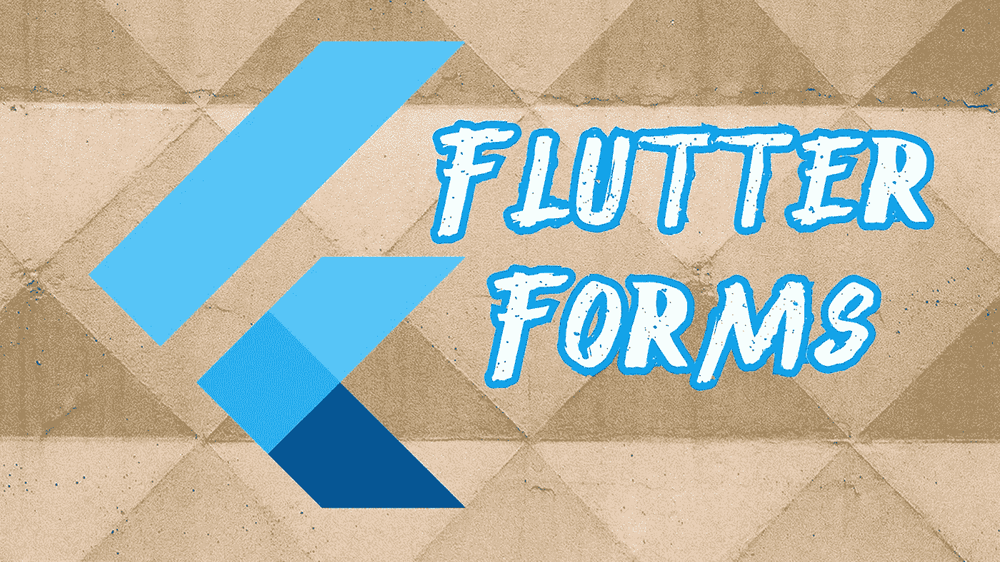
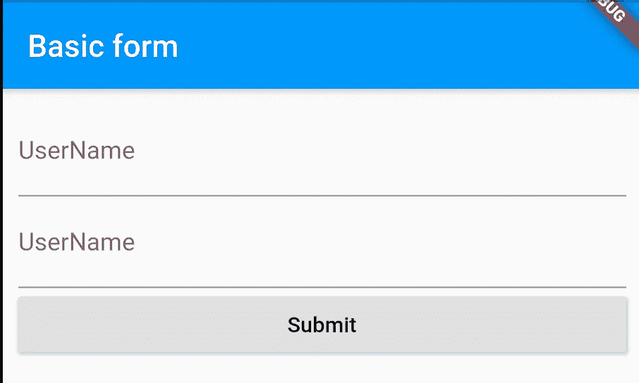
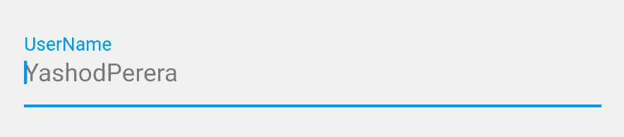
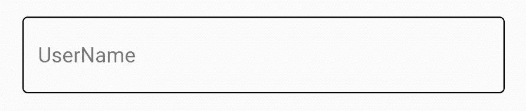
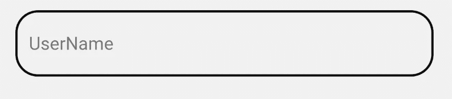
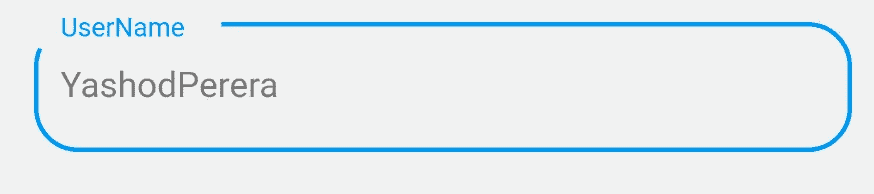
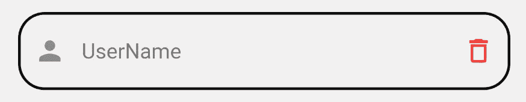
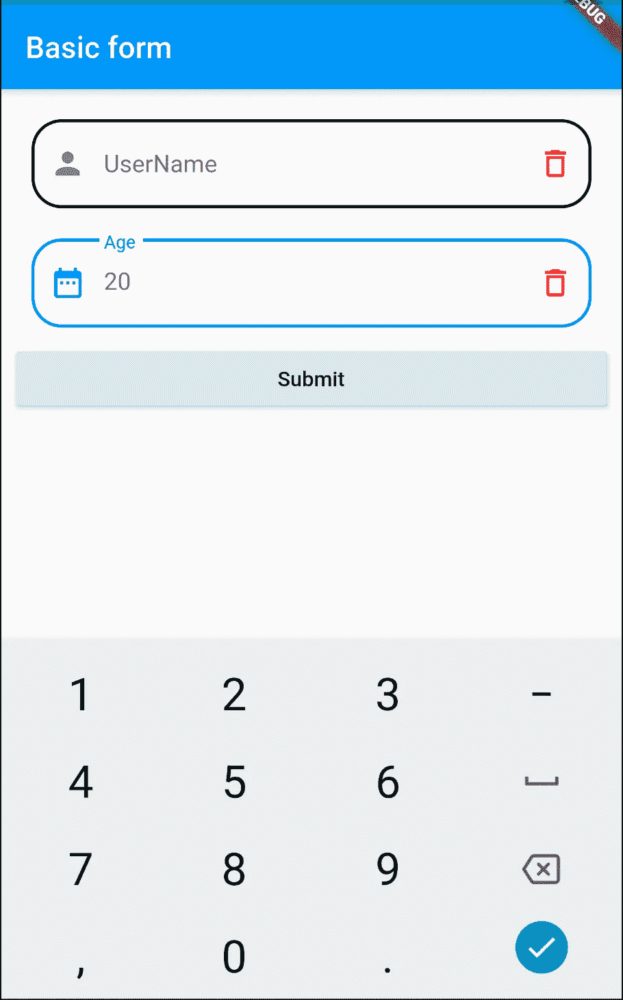
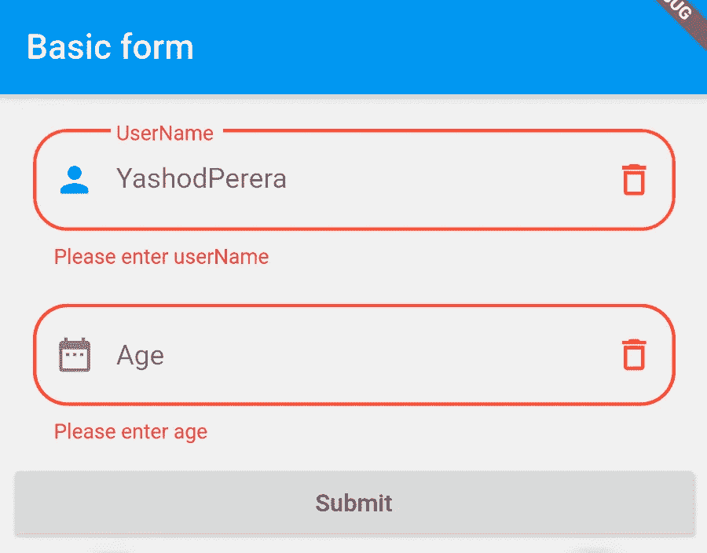

# 颤动形式

> 原文：<https://medium.com/analytics-vidhya/flutter-forms-50b9a8569914?source=collection_archive---------6----------------------->



在这个环节中，我将制作一个包含两个字段的表格，并给出一个基本的理解，

*   如何向表单中添加字段
*   如何添加基本造型
*   如何根据字段更改键盘布局
*   如何从表单域中获取值
*   如何验证表单

好的，让我们从颤动的形式开始，在这节课的最后，你会学到所有你需要知道的关于建立一个基本的形式。

## 表单的字段

有两种类型的字段可用于表单。它们是 TextField 小部件和 TextFormField 小部件。所有的小部件都应该包装在一个表单小部件中，如示例所示。

```
Widget build(BuildContext context) {
  **return** Scaffold(
    appBar: AppBar(
      title: Text("Basic form"),
    ),
    body: **Form(
      child: ListView(
        padding: EdgeInsets.all(10.0),
        children: <Widget>[
          TextField(
            decoration: InputDecoration(labelText: 'Username'),
          ),
          TextFormField(
            decoration: InputDecoration(labelText: 'UserName'),
          ),
          RaisedButton(
            onPressed: () {},
            child: Text("Submit"),
          )
        ],
      ),**
    ),
  );
}
```



上面代码的预览

正如你所看到的，TextField 窗口小部件和 TextFormField 窗口小部件显示相同，但没有。这两者略有不同。例如，验证在 TextFiled 小部件上不可用，但在 TextFormField 小部件上可用。

## 给表单添加一些样式

在这一部分，我们将学习一些基本的样式，比如边框、前缀图标、后缀图标、提示文本。

**添加提示文本**

```
TextField(
  decoration: InputDecoration(
    labelText: 'UserName',
    **hintText: "YashodPerera",**
  ),
),
```



**增加寄宿生**

有几种类型的寄宿生，如错误寄宿生，重点寄宿生，启用寄宿生，禁用寄宿生等。在这一部分中，我们将讨论焦点边界和使能边界。一旦你能设计出一种类型的寄宿生，你就能设计出任何类型的寄宿生。

**添加已启用的寄宿生**

启用的边界是当它不聚焦时出现的边界。让我们添加一个黑色启用寄宿生。

```
decoration: InputDecoration(
  labelText: 'UserName',
  hintText: "YashodPerera",
  **enabledBorder: OutlineInputBorder(
    borderSide: BorderSide(color: Colors.*black*),
  ),**
),
```



上面代码的预览

然后将一些样式添加到边界，得到一个圆形，并增加边界宽度如下。

```
enabledBorder: OutlineInputBorder(
  borderRadius: BorderRadius.all(Radius.circular(20.0)),  
  borderSide: BorderSide(color: Colors.*black*, width: 2.0),
),
```



上面代码的预览

**添加焦点边框**

焦点边界是场激活时出现的边界。让我们给焦点边框添加一些样式，如下所示。

```
child: TextField(
  decoration: InputDecoration(
    labelText: 'UserName',
    hintText: "YashodPerera",    
    **focusedBorder: OutlineInputBorder(
      borderRadius: BorderRadius.all(Radius.circular(20.0)),
      borderSide: BorderSide(color: Colors.*blue*, width: 2.0),
    ),**
  ),
),
```



上面代码的预览

**添加前缀图标和后缀图标**

在表单字段中，前缀图标被广泛用于让用户更好地理解字段，后缀图标用于不同的目的，如编辑字段、清除字段等。让我们向该字段添加前缀图标和后缀图标。

```
TextField(
  decoration: InputDecoration(
    labelText: 'UserName',
    **prefixIcon: Icon(Icons.*person*),
    suffixIcon: Icon(
      Icons.*delete_outline*,
      color: Colors.*red*,
    ),**
    hintText: "YashodPerera",
    enabledBorder: OutlineInputBorder(
      borderRadius: BorderRadius.all(Radius.circular(20.0)),
      borderSide: BorderSide(color: Colors.*black*, width: 2.0),
    ),
  ),
),
```



上面代码的预览

## **更改字段的键盘布局。**

在移动应用中，我们必须根据领域改变键盘布局。举例来说，给数字字段全键盘是没有用的。在 TextFormField widget 和 TextField widget 中，有一个要添加的字段是 **keyboardType** 。让我们看看如何改变键盘布局。

```
TextFormField(
  **keyboardType: TextInputType.*number*,**
  decoration: InputDecoration(
    labelText: 'Age',
    hintText: "20",
    prefixIcon: Icon(Icons.*date_range*),
    suffixIcon: Icon(
      Icons.*delete_outline*,
      color: Colors.*red*,
    ),
    enabledBorder: OutlineInputBorder(
      borderRadius: BorderRadius.all(Radius.circular(20.0)),
      borderSide: BorderSide(color: Colors.*black*, width: 2.0),
    ),
    focusedBorder: OutlineInputBorder(
      borderRadius: BorderRadius.all(Radius.circular(20.0)),
      borderSide: BorderSide(color: Colors.*blue*, width: 2.0),
    ),
  ),
),
```



上面代码的预览

## **从字段中获取值**

控制器可以访问字段值。让我们做一些编码，并在用户点击提交时在终端上打印值。

```
**TextEditingController nameController = TextEditingController();**

@override
Widget build(BuildContext context) {
  **return** Scaffold(
    appBar: AppBar(
      title: Text("Basic form"),
    ),
    body: Form(
      child: ListView(
        children: <Widget>[
          TextField(
            **controller: nameController,**
            decoration: InputDecoration(
              labelText: 'UserName',
              hintText: "YashodPerera",
            ),
          ),
          RaisedButton(
            onPressed: () {
              debugPrint("${**nameController.text**}");
            },
            child: Text("Submit"),
          ),
        ],
      ),
    ),
  );
}
```

正如您在上面的代码中看到的，TextEditingController 用于获取值。使用 TextEditingController 对象用户名可通过 **nameController.text** 访问。

## 验证表单

让我们完成本教程的最后一部分，即验证表单。为了在提交时验证表单，您必须使用表单的一个键(标识符),并且必须使用 TextFormField 小部件中的 validator 属性。您不能使用 TextField widget 进行验证。好的，让我们开始编码。

```
**GlobalKey<FormState> _formKey = GlobalKey<FormState>();** 
@override
Widget build(BuildContext context) {
  **return** Scaffold(
    appBar: AppBar(
      title: Text("Basic form"),
    ),
    body: Form(
      key: _formKey,
      child: ListView(
        children: <Widget>[
          TextFormField(
            **validator: (value) {
              if (value.isEmpty) {
                return 'Please enter userName';
              }
              return null;
            },**
            decoration: InputDecoration(
              labelText: 'UserName',
              prefixIcon: Icon(Icons.*person*),
              suffixIcon: Icon(
                Icons.*delete_outline*,
                color: Colors.*red*,
              ),
              hintText: "YashodPerera",
            ),
          ),
          TextFormField(
            **validator: (value) {
              if (value.isEmpty) {
                return 'Please enter age';
              }
              return null;
            },**
            keyboardType: TextInputType.*number*,
            decoration: InputDecoration(
              labelText: 'Age',
              hintText: "20",
              prefixIcon: Icon(Icons.*date_range*),
              suffixIcon: Icon(
                Icons.*delete_outline*,
                color: Colors.*red*,
              ),
            ),
          ),
          RaisedButton(
            **onPressed: () {
              if (_formKey.currentState.validate()) {
                debugPrint("Valid");
              }
            },**
            child: Text("Submit"),
          ),
        ],
      ),
    ),
  );
}
```

要进行验证，您必须遵循以下顺序

*   指定表单的键

```
**GlobalKey<FormState> _formKey = GlobalKey<FormState>();** Form(
      key: _formKey,
      child: //child
),
```

*   向字段添加验证器

这些验证器检查函数内部的条件，如果无效，它输出适当的错误。

```
TextFormField(
    **validator: (value) {
         if (value.isEmpty) {
             return 'Please enter userName';
         }
         return null;
     },
)**
```

*   提交时或任何时候使用表单密钥检查有效性。

```
**onPressed: () {
     if (_formKey.currentState.validate()) {
          debugPrint("Valid");
     }
},**
```

上面的代码所做的是，当按钮被按下时，它检查指定表单键下的所有字段验证器(在本例中为***_formKey*** )，并检查所有内容是否有效。如果没有，它将返回如下错误。



你可以在这个[链接](https://github.com/yashodgayashan/flutter-tutorial/tree/form)中找到代码。

如果你觉得这有帮助，请点击那个👏并分享到社交媒体上:)