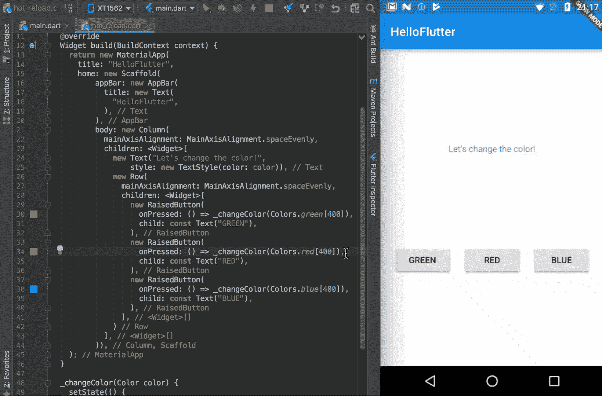
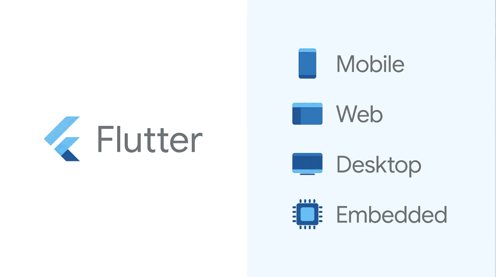
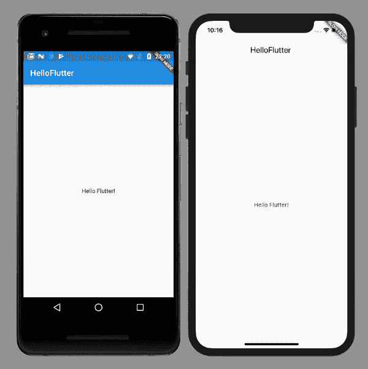

# 移动应用程序开发中的难题

> 原文：<https://medium.com/analytics-vidhya/flutter-in-mobile-app-development-c8e0a510a222?source=collection_archive---------19----------------------->

# 什么是颤振？

Flutter 是谷歌的移动应用 SDK，包括一个框架、小部件和工具，让开发人员可以轻松地在 Android 和 iOS 平台上构建和部署视觉上有吸引力的快速移动应用([官方流感](https://flutter.io/) [泰特](https://flutter.io/faq/#what-is-flutter) [网站)](https://flutter.io/)。

# 为什么颤动？

> 热重新加载和更快的代码编写

它允许您立即重建您的项目，就像它只是一个网页。

热重新加载不仅**快速**而且**智能**——如果你已经显示了一些数据(如本例中文本的颜色)，你可以**在应用运行时改变 UI** ，如果你热重新加载应用:它们将保持**不变**！

> 一个代码用于不同主题的多个平台

开发者只需为你的应用编写一个代码库，涵盖 Android 和 iOS 平台。Flutter 不依赖于平台，因为它有自己的小部件和设计。这意味着你在两个平台上有相同的应用。

通常，我们希望我们的 Android 应用程序看起来与 iOS 应用程序不同。差异不仅在于颜色，还在于部件的尺寸和样式。我们可以通过主题来实现这一点:

> **Flutter 支持多种 ide。**

当使用 Flutter 编码时，您可以从许多集成开发环境中进行选择。起初我从 Android Studio 开始，但后来我看到 Flutter Live 使用 VS 代码。这让我很好奇，我发现很多 Flutter 开发者使用可视化代码。当我尝试后，我明白了为什么这么多人喜欢它。VS 代码是轻量级的，速度更快，并且拥有 Android Studio 和 IntelliJ 中的大部分特性。就我个人而言，我已经转向了 VS 代码，但是你也可以使用许多其他的 ide，你不需要为了开始在 Flutter 中工作而切换。

> **高性能**

Flutter 不需要 Javascript 桥，速度快很多。

> **作为编程语言的 Dart**

*   Dart 是 AOT(提前)编译成的快速、可预测的原生代码，这使得几乎所有的 Flutter 都可以用 Dart 编写。这不仅使 Flutter 速度更快，几乎所有东西(包括所有的小部件)都可以定制。
*   Dart 还可以进行 JIT (Just In Time)编译，以实现异常快速的开发周期和改变游戏规则的工作流(包括 Flutter 流行的亚秒级有状态热重装)。
*   Dart 使创建以 60fps 运行的平滑动画和过渡更加容易。Dart 可以在没有锁的情况下进行对象分配和垃圾收集。和 JavaScript 一样，Dart 避免了抢占式调度和共享内存(以及锁)。因为 Flutter 应用被编译成本机代码，所以它们不需要领域之间的慢速桥(例如，JavaScript 到本机)。他们也启动得更快。
*   Dart 允许 Flutter 避免使用独立的声明式布局语言，如 JSX 或 XML，或者独立的可视化界面构建器，因为 Dart 的声明式、编程式布局易于阅读和可视化。而且所有的布局都在一种语言和一个地方，很容易让 Flutter 提供先进的工具，使布局变得轻而易举。
*   开发人员发现 Dart 特别容易学习，因为它具有静态和动态语言用户都熟悉的特性。

# 用 Flutter 制作的一些应用程序示例

1.  网络社交

*   [KlasterMe —用于内容发现&创作的应用](https://www.thedroidsonroids.com/blog/apps-made-with-flutter#klasterme)
*   [配对——app 连接单身](https://www.thedroidsonroids.com/blog/apps-made-with-flutter#pairing)
*   [Meeve——连接离线用户的应用](https://www.thedroidsonroids.com/blog/apps-made-with-flutter#meeve)
*   [n8 —用于查找事件的应用](https://www.thedroidsonroids.com/blog/apps-made-with-flutter#n8)

2.照片和视频

*   [PostMuse — Instagram story &图片编辑 app](https://www.thedroidsonroids.com/blog/apps-made-with-flutter#postmuse)

3.健康与健身

*   [反思——正念 app](https://www.thedroidsonroids.com/blog/apps-made-with-flutter#reflectly)
*   [water maniac——追踪饮用水的 app](https://www.thedroidsonroids.com/blog/apps-made-with-flutter#watermaniac)

4.购物

*   [阿里巴巴旗下的仙寓——移动商务 app](https://www.thedroidsonroids.com/blog/apps-made-with-flutter#xianyu)
*   [虎鱼—付费调查 app&奖励](https://www.thedroidsonroids.com/blog/apps-made-with-flutter#huyu)

5.音乐

*   [Topline —音乐录制 app](https://www.thedroidsonroids.com/blog/apps-made-with-flutter#topline)
*   [音乐导师——学看音乐 app](https://www.thedroidsonroids.com/blog/apps-made-with-flutter#musictutor)
*   [汉密尔顿音乐剧](https://hamiltonmusical.com/app/)
*   [腾讯](https://now.qq.com/)
*   [艾比路影城](https://www.abbeyroad.com/apps)

6.娱乐

*   [汉密尔顿——汉密尔顿音乐迷应用](https://www.thedroidsonroids.com/blog/apps-made-with-flutter#hamilton)
*   [因基诺—芬兰基诺剧院的放映时间浏览器](https://www.thedroidsonroids.com/blog/apps-made-with-flutter#inkino)

7.运动

*   [顶级目标——足球迷应用](https://www.thedroidsonroids.com/blog/apps-made-with-flutter#topgoals)
*   [entranapro——寻找教练和运动中心的应用程序](https://www.thedroidsonroids.com/blog/apps-made-with-flutter#entrenapro)

8.金融

*   [Cryptomaniac Pro —加密货币信号应用](https://www.thedroidsonroids.com/blog/apps-made-with-flutter#cryptomaniacpro)
*   [京东金融](https://jr.jd.com/)

9.教育

*   [学校规划师——学生应用&教师](https://www.thedroidsonroids.com/blog/apps-made-with-flutter#schoolplanner)

10.地图和导航

*   [拉默因斯凯尔站—燃油价格应用](https://www.thedroidsonroids.com/blog/apps-made-with-flutter#slmc)

11.生活方式

*   [p 完美匹配——动物领养 app](https://www.thedroidsonroids.com/blog/apps-made-with-flutter#pawfectmatch)

12.旅行

*   [Flydirekt——为待机旅行者准备的应用](https://www.thedroidsonroids.com/blog/apps-made-with-flutter#flydirekt)

13.商业

*   [谷歌广告—广告管理器应用](https://www.thedroidsonroids.com/blog/apps-made-with-flutter#googleads)
*   [应用树—企业应用客户端](https://www.thedroidsonroids.com/blog/apps-made-with-flutter#apptree)
*   [Google green tea——用 Flutter 构建的应用程序开放列表](https://itsallwidgets.com/)