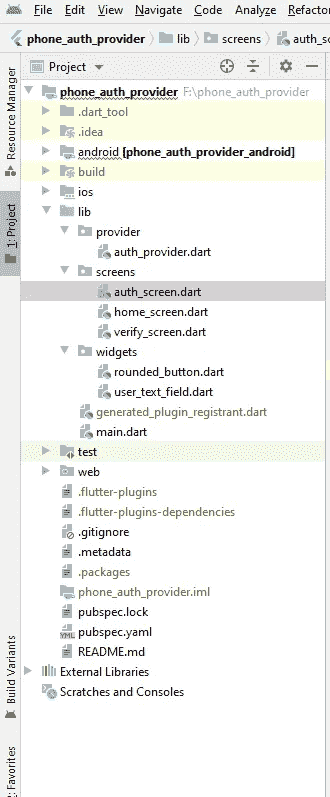

# 使用提供商包的 firebase 的 Flutter 电话认证。

> 原文：<https://medium.com/analytics-vidhya/flutter-phone-authentication-with-firebase-using-provider-package-55ffbce7c361?source=collection_archive---------2----------------------->

你好，今天我将讨论使用 firebase 和提供商包进行电话认证。因为我发现很难与供应商沟通，所以我会用我理解的最简单的方式来解释，尽管我尝试了很多次。这篇文章将包含 13 个步骤，让你们明白。

第一步:

*   将您的应用程序连接到 firebase
*   设置电话授权
*   导入 **firebase_auth** 插件
*   在你的应用中设置身份验证功能
*   将你的颤振 app 迁移到 [**Android X**](https://flutter.dev/docs/development/packages-and-plugins/androidx-compatibility) **。**

步骤 2:在 pubspec.yaml 文件中导入提供者包，并运行 flutter pub get 来升级依赖项。

步骤 3:在 lib 文件夹中创建一个 provider 目录，并创建一个名为 auth_provider 的文件。



步骤 4:导入 foundation.dart 类。

步骤 5:创建一个名为 AuthProvider 的类:

具有 ChangeNotifier{}的类 AuthProvider

1.  ChangeNotifier: Change notifier 在应用程序中发生变化时使用，应用程序的逻辑是在 provider 类中定义的，它会通知那些 subscribe 侦听器，是的，我有一个值需要更改。

步骤 6:现在让我们先回到我们的 provider 类，然后我们将来到 auth_screen 的 UI，在 AuthProvider 类中:

1.  首先导入 firebaseAuth.dart 即:**导入' package:firebase _ auth/firebase _ auth . dart '**；
2.  现在在 AuthProvider 类内部创建一个 FirebaseAuth 实例:**final _ firebase auth**= firebase auth。*实例*；
3.  创建一个字符串类型的验证 id 变量。
4.  现在为 verifyPhoneNumber 创建一个方法，该方法有参数国家代码和字符串类型的手机号码，返回类型为 Future <void>并带有 async 关键字，因为我们不想在执行电话身份验证时停止其他任务，这就是为什么我们使用 async 关键字，所以完整的函数定义为:</void>

```
Future<**void**> verifyPhone(String countryCode, String mobile) **async** {
  **var** mobileToSend = mobile;
  **final** PhoneCodeSent smsOTPSent = (String verId, [int forceCodeResend]) {
    **this**.**verificationId** = verId;
  };
  **try** {
    **await _firebaseAuth**.verifyPhoneNumber(
        phoneNumber: mobileToSend,
        codeAutoRetrievalTimeout: (String verId) {
          *//Starts the phone number verification process for the given phone number.
          //Either sends an SMS with a 6 digit code to the phone number specified, or sign's the user in and [verificationCompleted] is called.* **this**.**verificationId** = verId;
        },
        codeSent: smsOTPSent,
        timeout: **const** Duration(
          seconds: 120,
        ),
        verificationCompleted: (AuthCredential phoneAuthCredential) {
          print(phoneAuthCredential);
        },
        verificationFailed: (AuthException exceptio) {
          **throw** exceptio;
        });
  } **catch** (e) {
    **throw** e;
  }
}
```

在上面的方法中，我们使用 firebase 发送给用户电话号码的 OTP 来验证电话号码。

步骤 7:创建另一种方法来验证 OTP 代码:下面是定义的方法:

```
Future<**void**> verifyOTP(String otp) **async** {
  **try** {
    **final** AuthCredential credential = PhoneAuthProvider.*getCredential*(
      verificationId: **verificationId**,
      smsCode: otp,
    );
    **final** AuthResult user =
        **await _firebaseAuth**.signInWithCredential(credential);
    **final** FirebaseUser currentUser = **await _firebaseAuth**.currentUser();
    print(user);

    **if** (currentUser.**uid** != **""**) {
      print(currentUser.**uid**);
    }
  } **catch** (e) {
    **throw** e;
  }
}

showError(error) {
  **throw** error.toString();
}
```

在上面的方法中，我们用 firebase 提供的代码来验证用户输入的代码。

第八步:在你的 pubspec.yaml 文件中添加 country_code_picker。

步骤 9:在 main.dart 文件中注册你的 provider，就像我定义的那样，基本上你在你想使用 provider 的窗口部件/屏幕的父级上面注册 provider。它必须是该小部件的父级。返回 main.dart 文件中的代码注册 authprovider:

```
**import 'package:country_code_picker/country_localizations.dart'**;
**import 'package:flutter/material.dart'**;

**import 'package:phone_auth_provider/provider/auth_provider.dart'**;
**import 'package:phone_auth_provider/screens/auth_screen.dart'**;
**import 'package:phone_auth_provider/screens/home_screen.dart'**;
**import 'package:phone_auth_provider/screens/verify_screen.dart'**;
**import 'package:provider/provider.dart'**;

**void** main() {
  runApp(MyApp());
}

**class** MyApp **extends** StatelessWidget {
  @override
  Widget build(BuildContext context) {
    **return** ChangeNotifierProvider.value(
      value: AuthProvider(),
      child: MaterialApp(
        supportedLocales: [
          Locale(**'en'**),
          Locale(**'it'**),
          Locale(**'fr'**),
          Locale(**'es'**),
        ],
        localizationsDelegates: [
          CountryLocalizations.*delegate*,
        ],
        title: **'Flutter Demo'**,
        debugShowCheckedModeBanner: **false**,
        theme: ThemeData(
          fontFamily: **'oswald'**,
          primaryColor: Colors.*black*,
          canvasColor: Colors.*white*,
          appBarTheme: AppBarTheme(
              actionsIconTheme: IconThemeData(
                color: Colors.*black*,
              ),
              iconTheme: IconThemeData(color: Colors.*black*)),
          textTheme: TextTheme(
            headline6: TextStyle(
              color: Colors.*black*,
              fontSize: 24,
              fontWeight: FontWeight.*w600*,
            ),
          ),
          visualDensity: VisualDensity.*adaptivePlatformDensity*,
        ),
        home: AuthScreen(),
        routes: {
          VerifyScreen.*routeArgs*: (ctx) => VerifyScreen(),
          HomeScreen.*routeArgs*: (ctx) => HomeScreen(),
        },
      ),
    );
  }
}
```

步骤 10:在 lib 中创建一个小部件文件夹，创建一个文件名 user_text_field，并将以下代码复制粘贴到 user_text_field 类中:

```
**import 'package:flutter/material.dart'**;**class** UserTextField **extends** StatelessWidget {
  **final titleLabel**;
  **final maxLength**;
  **final icon**;
  **final controller**;
  **final inputType**;
  UserTextField({@required **this**.**titleLabel**,@required **this**.**maxLength**,@required **this**.**icon**,@required **this**.**controller**,@required **this**.**inputType**});
  @override
  Widget build(BuildContext context) {
    **return** Padding(
      padding: **const** EdgeInsets.all(10.0),
      child: TextField(
        maxLength: **maxLength**,
        controller: **controller**,
        keyboardType: **inputType**,
        decoration: InputDecoration( labelText: **titleLabel**,
          suffixIcon: Icon(**icon**,color: Colors.*black*,),
          border: OutlineInputBorder(
            borderRadius: BorderRadius.circular(10),
            borderSide: BorderSide(color: Colors.*black*),
          ),
        ),
      ),
    );
  }
}
```

步骤 11:在 widgets 文件夹中创建另一个名为 rounded_button 的类，然后将以下代码复制粘贴到其中:

```
**import 'package:flutter/material.dart'**;**class** RoundedButton **extends** StatelessWidget {
 **final title**;
 **final** Function **onpressed**; RoundedButton({@required **this**.**title**,@required **this**.**onpressed**});
  @override
  Widget build(BuildContext context) {
    **return** Padding(
      padding: EdgeInsets.all(10),
      child: RaisedButton(
        elevation: 3,
        shape: RoundedRectangleBorder(
          borderRadius: BorderRadius.circular(10),
        ),
        onPressed: **onpressed**,
        child: Text(
          **title**,
          style: Theme.*of*(context).**textTheme**.**headline6**.copyWith(
                color: Colors.*white*,
            fontSize: 14
              ),
        ),
        color: Theme.*of*(context).**primaryColor**,
        splashColor: Colors.*green*,
      ),
    );
  }
}
```

步骤 12:为 PhoneAuthScreen 创建一个 UI，即在 lib 中创建一个文件夹，即 screens，并在名为 auth_screen 的 screens 文件夹中创建一个类，然后复制粘贴以下代码:

```
**import 'package:country_code_picker/country_code_picker.dart'**;
**import 'package:flutter/cupertino.dart'**;
**import 'package:flutter/material.dart'**;
**import 'package:flutter/services.dart'**;
**import 'package:flutter_uber_clone/screens/verify_screen.dart'**;
**import '../widgets/user_text_field.dart'**;
**import '../widgets/rounded_button.dart'**;
**import '../provider/auth_provider.dart'**;
**import 'package:provider/provider.dart'**;

**class** AuthScreen **extends** StatelessWidget {
  **final controller** = TextEditingController();

  String **selectedCountryCode** = **''**;

  showSnackBar(msg, color, context) {
    Scaffold.*of*(context).showSnackBar(
      **new** SnackBar(
        content: **new** Text(
          msg,
          style: TextStyle(
            color: Colors.*white*,
          ),
        ),
        duration: **new** Duration(seconds: 2),
        behavior: SnackBarBehavior.**floating**,
        elevation: 3.0,
        backgroundColor: color,
      ),
    );
  }

  **void** _showErrorDialog(BuildContext context, String message) {
    showDialog(
      context: context,
      builder: (ctx) => AlertDialog(
        title: Text(**'Error Occured'**),
        content: Text(message),
        actions: <Widget>[
          FlatButton(
            onPressed: () {
              Navigator.*of*(ctx).pop();
            },
            child: Text(**'OK!'**),
          )
        ],
      ),
    );
  }

  verifyPhone(BuildContext context){
    **try** {
      Provider.*of*<AuthProvider>(context, listen: **false**)
          .verifyPhone(
          **selectedCountryCode**,
          **selectedCountryCode** +
              **controller**.**text**.toString())
          .then((value) {
        Navigator.*of*(context)
            .pushNamed(VerifyScreen.*routeArgs*);
      }).catchError((e) {
        String errorMsg =
            **'Cant Authenticate you, Try Again Later'**;
        **if** (e.toString().contains(
            **'We have blocked all requests from this device due to unusual activity. Try again later.'**)) {
          errorMsg =
          **'Please wait as you have used limited number request'**;
        }
        _showErrorDialog(context, errorMsg);
      });
    } **catch** (e) {
      _showErrorDialog(context, e.toString());
    }
  }

  **void** _onCountryChange(CountryCode countryCode) {
    **selectedCountryCode** = countryCode.toString();
    print(**"New Country selected: "** + countryCode.toString());
  }

  @override
  Widget build(BuildContext context) {
    SystemChrome.*setSystemUIOverlayStyle*(
        SystemUiOverlayStyle(statusBarColor: Colors.*transparent*));
    **return** Scaffold(
      backgroundColor: Colors.*white*,
      body: SafeArea(
        child: Center(
          child: SingleChildScrollView(
            child: Column(
              mainAxisAlignment: MainAxisAlignment.**center**,
              children: [
                Align(
                    alignment: Alignment.*centerLeft*,
                    child: Padding(
                      padding: **const** EdgeInsets.all(10.0),
                      child: Text(
                        **'PickUp'**,
                        style: Theme.*of*(context).**textTheme**.**headline6**,
                      ),
                    )),
                Align(
                    alignment: Alignment.*center*,
                    child: Padding(
                      padding: **const** EdgeInsets.all(10.0),
                      child: Text(
                        **'Please enter your number below'**,
                        style: Theme.*of*(context).**textTheme**.**headline6**,
                      ),
                    )),
                CountryCodePicker(
                  initialSelection: **selectedCountryCode**,
                  onChanged: _onCountryChange,
                  showCountryOnly: **false**,
                  showOnlyCountryWhenClosed: **false**,
                ),
                UserTextField(
                  titleLabel: **'Enter your number'**,
                  maxLength: 10,
                  icon: Icons.*smartphone*,
                  controller: **controller**,
                  inputType: TextInputType.*phone*,
                ),
                Align(
                  alignment: Alignment.*centerRight*,
                  child: RoundedButton(
                    title: **'Send OTP'**,
                    onpressed: () {
                      verifyPhone(context);
                    },
                  ),
                ),

              ],
            ),
          ),
        ),
      ),
    );
  }
}
```

现在，这也是上面定义的 auth 屏幕的主要部分，所以不要担心，我只是再次复制这个方法来让你们理解它。

```
verifyPhone(BuildContext context){
    **try** {
      Provider.*of*<AuthProvider>(context, listen: **false**)
          .verifyPhone(
          **selectedCountryCode**,
          **selectedCountryCode** +
              **controller**.**text**.toString())
          .then((value) {
        Navigator.*of*(context)
            .pushNamed(VerifyScreen.*routeArgs*);
      }).catchError((e) {
        String errorMsg =
            **'Cant Authenticate you, Try Again Later'**;
        **if** (e.toString().contains(
            **'We have blocked all requests from this device due to unusual activity. Try again later.'**)) {
          errorMsg =
          **'Please wait as you have used limited number request'**;
        }
        _showErrorDialog(context, errorMsg);
      });
    } **catch** (e) {
      _showErrorDialog(context, e.toString());
    }
  }
```

在上面的方法中，我们使用 provider 通过 firebase 验证电话号码，在构造函数中，我们通常传递小部件的上下文，但是当我们谈到 listen: false 时，就好像我们只希望数据在那个小部件中出现一次，我们不希望从这个提供程序连续获得数据，在我们希望数据出现在提供程序中一次而不订阅通知的情况下，我们将 listen: false 传递给构造函数的提供程序。Then()是在将来某个值返回后运行的方法，例如:当号码发送了 otp 后，我们想导航到另一个屏幕。

步骤 13:现在在 screens 文件夹中创建另一个名为 verify_screen 的屏幕，并复制粘贴以下代码:

```
**import 'package:flutter/material.dart'**;
**import 'package:flutter/services.dart'**;
**import 'package:phone_auth_provider/provider/auth_provider.dart'**;
**import 'package:phone_auth_provider/screens/home_screen.dart'**;
**import 'package:phone_auth_provider/widgets/rounded_button.dart'**;
**import 'package:phone_auth_provider/widgets/user_text_field.dart'**;

**import 'package:provider/provider.dart'**;

**class** VerifyScreen **extends** StatelessWidget {
  **static const** *routeArgs* = **'/verify-screen'**;
  **final controller** = TextEditingController();

  showSnackBar(msg, color, context) {
    Scaffold.*of*(context).showSnackBar(
      **new** SnackBar(
        content: **new** Text(
          msg,
          style: TextStyle(
            color: Colors.*white*,
          ),
        ),
        duration: **new** Duration(seconds: 2),
        behavior: SnackBarBehavior.**floating**,
        elevation: 3.0,
        backgroundColor: color,
      ),
    );
  }

  **void** _showErrorDialog(BuildContext context, String message) {
    showDialog(
      context: context,
      builder: (ctx) => AlertDialog(
        title: Text(**'Error Occured'**),
        content: Text(message),
        actions: <Widget>[
          FlatButton(
            onPressed: () {
              Navigator.*of*(ctx).pop();
            },
            child: Text(**'OK!'**),
          )
        ],
      ),
    );
  }

  verifyOTP(BuildContext context){
    **try** {
      Provider.*of*<AuthProvider>(context, listen: **false**)
          .verifyOTP(**controller**.**text**.toString())
          .then((_) {
        Navigator.*of*(context)
            .pushReplacementNamed(HomeScreen.*routeArgs*);
      }).catchError((e) {
        String errorMsg =
            **'Cant authentiate you Right now, Try again later!'**;
        **if** (e.toString().contains(**"ERROR_SESSION_EXPIRED"**)) {
          errorMsg = **"Session expired, please resend OTP!"**;
        } **else if** (e
            .toString()
            .contains(**"ERROR_INVALID_VERIFICATION_CODE"**)) {
          errorMsg = **"You have entered wrong OTP!"**;
        }
        _showErrorDialog(context, errorMsg);
      });
    } **catch** (e) {
      _showErrorDialog(context, e.toString());
    }
  }

  @override
  Widget build(BuildContext context) {
    SystemChrome.*setSystemUIOverlayStyle*(
        SystemUiOverlayStyle(statusBarColor: Colors.*transparent*));
    **return** Scaffold(
      body: SafeArea(
        child: Center(
          child: SingleChildScrollView(
            child: Column(
              children: [
                Align(
                    alignment: Alignment.*centerLeft*,
                    child: Padding(
                      padding: **const** EdgeInsets.all(10.0),
                      child: Text(
                        **'PickUp'**,
                        style: Theme.*of*(context).**textTheme**.**headline6**,
                      ),
                    )),
                Align(
                  alignment: Alignment.*center*,
                  child: Padding(
                    padding: **const** EdgeInsets.all(10.0),
                    child: Text(
                      **'Please enter code sent to your number'**,
                      style: Theme.*of*(context).**textTheme**.**headline6**,
                    ),
                  ),
                ),
                UserTextField(
                  titleLabel: **'Enter 6 digit Code'**,
                  maxLength: 6,
                  icon: Icons.*dialpad*,
                  controller: **controller**,
                  inputType: TextInputType.*phone*,
                ),
                Align(
                  alignment: Alignment.*centerRight*,
                  child: RoundedButton(
                    title: **'Verify Code'**,
                    onpressed: () {
                     verifyOTP(context);
                    },
                  ),
                ),

              ],
            ),
          ),
        ),
      ),
    );
  }
}
```

我希望你对提供商的一切都很清楚，因为我认为这是一个非常基本的逐步处理电话认证和提供商的方法。

现在运行你的应用程序，看看使用 firebase 的提供商和电话认证的魔力，也根据你的需要定制 UI，因为我的目标是让你们了解它。

感谢您阅读这篇长文，但我希望您能清楚如何使用电话认证服务提供商。

Github Repo 的代码在这里:

[](https://github.com/Mashood97/phone_auth_provider) [## ma hood 97/phone _ auth _ provider

### 一个新的颤振项目。这个项目是颤振应用的起点。一些帮助您入门的资源…

github.com](https://github.com/Mashood97/phone_auth_provider) 

如果你们喜欢这篇文章并想要更多的文章，不要忘记关注并留下一颗星。