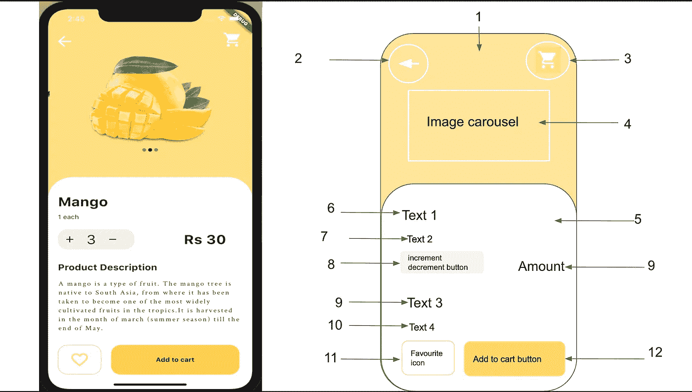
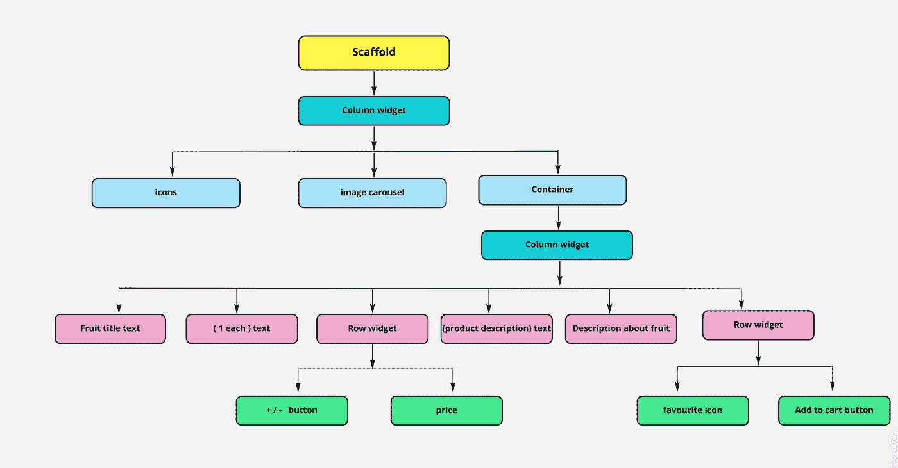
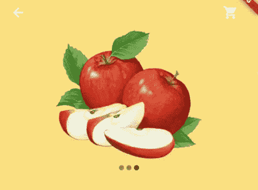
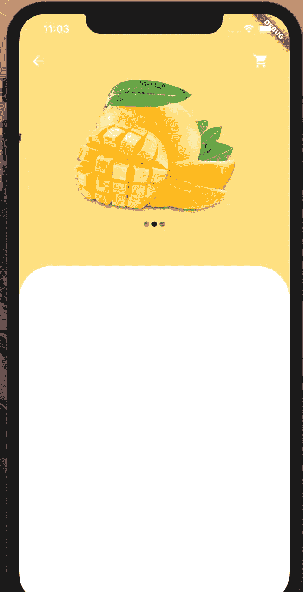
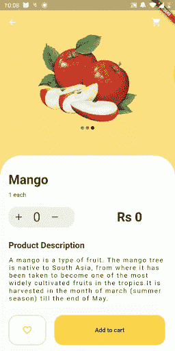

# 水果 App 的 Flutter UI 实现

> 原文：<https://medium.com/analytics-vidhya/flutter-ui-challenge-1-196c71705473?source=collection_archive---------11----------------------->



嘿，傻瓜们！怎么了？这是我们第一篇关于虚拟颤振的文章，我们将为应用程序构建一些令人惊叹的用户界面。嗯，你可能太懒了，没有读完所有那些长文档，对吗？所以，我们是来把你的懒人版升级成智能假人的。听起来更有趣，对吗？但是相信我，你会非常喜欢的。

因此..让我们开始我们的挑战#1。在这个挑战中，我们将建立一个与我们的水果应用程序相关的简单用户界面，它只是在顶部有一些图标，一个计数器来计算水果的数量，还有一个最喜欢的图标和一个按钮，可以选择添加到购物车。

每当涉及到设计某样东西的时候，设计的方式就因人而异。同样，您设计这个 UI 的角度也可能不同。只是为了有一个简单的开始，我在上图中给我的设计计划编号。开始之前，我希望你能在脑海中大致勾勒出这个设计计划。



设计计划

这张图片展示了我们的最终设计方案，其中有一些 flutter 小部件和它们的孩子。

最后，我们现在准备用一些代码来弄脏我们的手。因此..让我们开始吧。

```
**import** 'package:flutter/material.dart';
```

文件 **main.dart** 内导入包 **material.dart** 。

```
**void** main() {
  runApp(FirstScreen());
} **class** FirstScreen **extends** StatefulWidget {
  @override
  State<StatefulWidget> createState() {
    **return** _FirstScreen();
  }
} **class** _FirstScreen **extends** State<FirstScreen> { 
 @override 
 Widget build(BuildContext context) {
  **return** MaterialApp(
    home: Scaffold(
      appBar: AppBar(
        elevation: 0,
        backgroundColor: Colors.*amber*[200],
        leading: Row(
          children: <Widget>[
            SizedBox(
              width: 5.0,
            ),
            IconButton(
              color: Colors.*white*,
              icon: **const** Icon(
                Icons.*arrow_back*,
              ),
              onPressed: () {},
            ),
          ],
        ),
        actions: <Widget>[
          IconButton(
            icon: **const** Icon(
              Icons.*shopping_cart*,
              color: Colors.*white*,
            ),
            onPressed: () {},
          ),
          SizedBox(
            width: 20.0,
          ),
        ],
      ),
      backgroundColor: Colors.*amber*[200], 
    ),
  );
}}
```

成功执行这些代码块后，应用程序的用户界面应该是这样的:


应该有一个返回箭头图标和一个添加到购物车图标以及黄色脚手架。

因此..这背后的简单逻辑是，在 Scaffold 内部，我创建了一个高度为零的 AppBar。在 AppBar 中，你会看到两个术语**引导**和**动作**。以**开头的**为界的小部件将被放置在你的 AppBar 的左上角，所有被创建来执行你的应用上的特定动作的小部件被放置在**动作**下。这两个图标需要水平排列，所以我把它们都放在了**行**小部件中。为了增加图标之间的空间，添加小部件 **SizedBox** 。

现在是时候给我们的用户界面添加一些水果图片了。因此..我们将创建一个图像旋转木马，使这看起来有点花哨。

为此，您只需创建一个新的。dart 文件，我将其命名为 image_carousel.dart

在此之后，将`carousel_slider: ^2.0.0`添加到您的`pubspec.yaml`依赖项中。

```
**import** 'package:carousel_slider/carousel_slider.dart';
```

然后导入它。

因为我们要在我们的应用程序 UI 上传递下载的图像，所以为了渲染所有这些图像，现在你必须在你的项目上创建一个新的**图像**目录，并将以下部分添加到你的`pubspec.yaml` 文件中。

```
**flutter**:
  **assets**:
    - images/
```

现在让我们添加一些代码块来生成我们的图像轮播:

```
**final** List<String> imgList = [
  "images/mango1.png",
  "images/mango2.png",
  "images/mango3.png"
];
```

这就是我们如何传递要在 carousel 上显示的图像列表。

```
**class** CarouselWithIndicatorDemo **extends** StatefulWidget {
  @override
  State<StatefulWidget> createState() {
    **return** _CarouselWithIndicatorState();
  }
}
```

这将创建一个名为**carousewithindicatordemo**的包含有状态小部件的类。

```
**class** _CarouselWithIndicatorState **extends** State<CarouselWithIndicatorDemo> {   int _current = 0;

  @override
  Widget build(BuildContext context) {
    **return 
}**
```

现在，在我们的有状态窗口小部件中，我们将创建一个变量， **_current** ，并将值初始化为 0，以从第一幅图像开始我们的轮播。

此后，我们将返回一个列小部件，它将有两个子部件:

1.  传送带滑块

```
**return** Column(children: [
  CarouselSlider(
    items: imgList
        .map((item) => Container(
              child: Center(child: Image.asset(item.toString())),
            ))
        .toList(),
    options: CarouselOptions(
        autoPlay: **true**,
        enlargeCenterPage: **true**,
        aspectRatio: 2.0,
        onPageChanged: (index, reason) {
          setState(() {
            _current = index;
          });
        }),
  ),
```

这段代码将简单地 [**映射**](https://bezkoder.com/dart-map/) 我们在顶部声明的 **imgList** 中的所有图像到一个容器中。变量的值取决于传递给列表的图像数量。该功能**。toList( )** 用于映射列表项。您可以通过使用**carouse options()**小部件来添加转盘选项。

2.排

```
Row(
  mainAxisAlignment: MainAxisAlignment.center,
  children: imgList.map((url) {
    int index = imgList.indexOf(url);
    **return** Container(
      width: 8.0,
      height: 8.0,
      margin: EdgeInsets.symmetric(vertical: 10.0, horizontal: 2.0),
      decoration: BoxDecoration(
        shape: BoxShape.circle,
        color: _current == index
            ? Color.fromRGBO(0, 0, 0, 0.9)
            : Color.fromRGBO(0, 0, 0, 0.4),
      ),
    );
  }).toList(),
),
```

这段代码将向 carousel 添加一个指示器。简单地说，我们想要一些随着画面变化而变化的圆点，所以这里的变量 **index** 保存的值等于 **imgList** 的索引。当变量 **_current** 的值等于变量 **index** 时，圆形容器将被填充黑色。

```
body: ListView(
  children: <Widget>[
    Column(
      children: <Widget>[
        CarouselWithIndicatorDemo(), }
```

之后，将文件 **image_carousel** 链接到 **main.dart** ，然后在 MaterialApp()的 body 部分内部，创建一个列小部件，并传递**carouswithindicatordemo()**，作为它的子部件。用 **ListView** 包装列小部件，以获得小部件的实际大小。

正确实现所有这些代码后，我们的图像轮播现在就可以闪现出来了，看起来应该是这样的:



在这之后，所有我们想要的是一个容器，有一些文本和一些按钮..首先，我们将创建一个容器

```
Container(
  decoration: BoxDecoration(
      color: Colors.*white*,
      borderRadius: **new** BorderRadius.only(
        topLeft: **const** Radius.circular(50.0),
        topRight: **const** Radius.circular(50.0),
      )),
  height: 500.0,
  width: 500.0,
```

这个模块将创建一个顶部有两个弯曲角的容器。

到目前为止，我们的输出应该是这样的:



耶！🎉我们正处于挑战的中期，再过一段时间，我们将会到达终点😎

现在容器将有一个**列**小部件作为它的子部件，它将进一步有一些按钮和文本作为它的子部件。

```
child: Align(
  alignment: Alignment.*bottomLeft*,
  child: Padding(
    padding: EdgeInsets.all(20.0),
    child: Column(
      crossAxisAlignment: CrossAxisAlignment.start,
      children: <Widget>[
        SizedBox(
          height: 20.0,
        ),
        Text(
          'Mango',
          style: TextStyle(
              fontSize: 30.0, fontWeight: FontWeight.*bold*),
        ),
        SizedBox(
          height: 10.0,
        ),
        Text('1 each'),
        SizedBox(
          height: 20.0,
        ),
```

要从左侧开始放置 children 小部件，请使用 Align 小部件将其包裹起来，并使用 Padding 小部件添加空间。

现在，我们正处于 UI 的最佳阶段，即柜台设计。为此，我们将创建一个新的**。镖文件**我已经把它命名为 **counter.dart** 。

```
**class** CounterDesign **extends** StatefulWidget {
  @override
  State<StatefulWidget> createState() {
    **return** _CounterDesign();
  }
}
```

用 StatefulWidget 创建一个类 **CounterDesign** 。

```
**class** _CounterDesign **extends** State<CounterDesign> {  
 int _n = 0;
 int _amt = 0;}
```

声明两个变量， **_n** 用于计数， **_amt** 用于计算金额。

```
**void** add() {
  setState(() {
    _n++;
    _amt = _amt + 10;
  });
}
```

声明一个函数 **add ( )** ，当 **+** 图标被按下时，我们将调用这个函数。

```
**void** minus() {
  setState(() {
    **if** (_n != 0) _n--;
    _amt = _amt - 10;
  });
}
```

而我们会在按下 **-** 图标时调用这个 **minus ( )** 函数。

现在让我们设计我们的计数器容器。

```
@override
Widget build(BuildContext context) {
  **return** Row(
    children: <Widget>[
      Container(
        width: 155.0,
        decoration: BoxDecoration(
          color: Colors.*blueGrey*[50],
          borderRadius: BorderRadius.circular(20.0),
        ),
```

这将创建一个带有圆形边框的容器。

```
child: Row(
  children: <Widget>[
    **new** IconButton(
      icon: **const** Icon(
        Icons.*add*,
        color: Colors.*black*,
      ),
      onPressed: () {
        add();
      },
    ),
```

因此..上面的容器现在将有一个**行**小部件作为它的子部件，它将进一步有一些 IconButton 作为它的子部件。当按下+图标时，将调用 add()函数。

```
**new** Text('$_n', style: **new** TextStyle(fontSize: 30.0)),
```

这里的这段代码只是简单地提到了术语字符串插值。 **$_n** 将变量 **_n** 的值作为文本传递。

```
**new** IconButton(
  icon: **const** Icon(
    Icons.*remove*,
    color: Colors.*black*,
  ),
  onPressed: () {
    minus();
  },
),
```

当按下 **-** 图标时，调用减号()。

```
Container(
    child: Text(
  'Rs $_amt',
  style: TextStyle(
    fontWeight: FontWeight.*bold*,
    fontSize: 30.0,
  ),
)),
```

这段代码将创建一个显示水果数量的容器。

```
int _amt = 0;
```

首先声明一个变量 _amt。

```
_amt = _amt + 10;
```

将这段代码传递给 add()。

```
_amt = _amt - 10;
```

并将这段代码传递给减号()。

现在，调用我们的 **main.dart** 文件的**列**小部件内的 **CounterDesign( )** ，将文件 **counter.dart** 链接到 **main.dart** 文件。

```
Text(
  'Product Description',
  style: TextStyle(
      fontSize: 20.0, fontWeight: FontWeight.*bold*),
),
SizedBox(
  height: 15.0,
),
Text(
  'A mango is a type of fruit. '
  'The mango tree is native to South Asia, '
  'from where it has been taken to become one of the most widely cultivated fruits in the tropics.'
  'It is harvested in the month of march (summer season) till the end of May.',
  style:
      TextStyle(letterSpacing: 2.0, fontSize: 15.0),
),
```

在 **main.dart** 文件的**列**小部件中添加上述**文本**小部件，用于添加一些关于水果的描述。

之后，让我们创建一个按钮来收藏我们的水果。为此

```
bool _isFavorited = **true**;
```

声明一个 bool 变量，并在 FirtstScreen()内部将 true 值传递给它。

```
Row(
  children: <Widget>[
    ButtonTheme(
      shape: RoundedRectangleBorder(
        borderRadius: BorderRadius.circular(20.0),
        side: BorderSide(color: Colors.*amber*[200]),
      ),
      height: 70.0,
      child: RaisedButton(
        color: Colors.*white*,
        elevation: 0.0,
        child: IconButton(
            icon: _isFavorited
                ? Icon(
                    Icons.*favorite_border*,
                    color: Colors.*amber*[300],
                  )
                : Icon(
                    Icons.*favorite*,
                    color: Colors.*amber*[300],
                  )),
        onPressed: _toggleFavorite,
      ),
    ),
```

这段代码将设计我们最喜欢的按钮，在上面的代码中你可以看到我们正在调用函数**_ toggle favorite**on pressed，以这种方式定义函数👇👇

```
**void** _toggleFavorite() {
  setState(() {
    _isFavorited = !_isFavorited;
  });
}
```

现在让我们创建添加到购物车按钮。

```
ButtonTheme(
  shape: RoundedRectangleBorder(
      borderRadius: BorderRadius.circular(20.0)),
  height: 70.0,
  minWidth: 260.0,
  child: RaisedButton(
    elevation: 0.0,
    color: Colors.*amber*[300],
    onPressed: () {},
    child: Text(
      'Add to cart',
      style:
          TextStyle(fontWeight: FontWeight.*bold*),
    ),
  ),
)
```

成功执行以下所有代码后，您的最终输出应该如下所示👇👇



用户界面的最终视图

干杯🍻为了承载我们！

如果你想看到完整的代码，然后签出这个:[https://github.com/khadkabindu/Fruit-App/tree/day1](https://github.com/khadkabindu/Fruit-App/tree/day1)