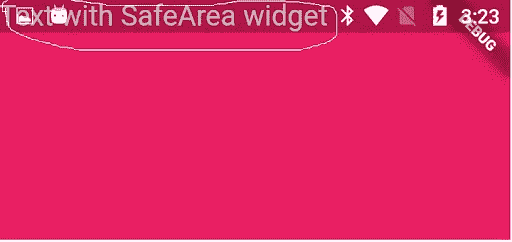
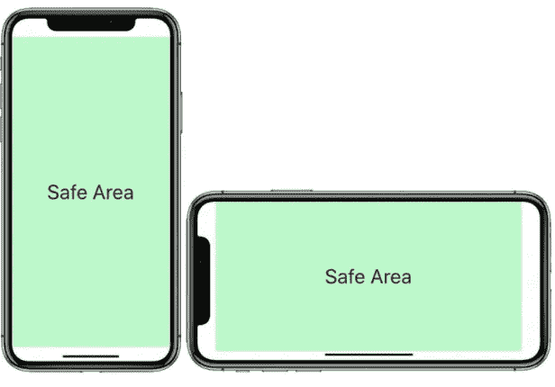

# Flutter Widget -安全区。

> 原文：<https://medium.com/analytics-vidhya/flutter-widget-safearea-43d33870749e?source=collection_archive---------15----------------------->

目前，在这样一个行业中，你可以看到智能手机行业的许多创新。智能手机行业正在经历从边框到无边框显示屏的转变，而 **Notch** 技术就是这一转变的产物。Notch 只是实现完全无边框显示屏的一个尝试性步骤。

谈到这项技术的优势，智能手机显示屏的屏幕与机身比例有所改善。他们试图在现有的机身上安装更多的屏幕。iPhone 8 Plus 的屏幕与机身比例为 67.7%(无凹口)，iPhone X 为 81.49%。有了泪珠形凹槽，智能手机显示屏的屏幕与机身比例进一步增加。

谈到这项技术的缺点，最初，当这项技术用于智能手机时，并不是所有的应用程序都与 notch 兼容，并且应用程序的内容有所删减。看视频也是一样。

作为开发者，我们必须围绕硬件来设计我们的应用。圆角和凹口使我们的应用程序布局变得复杂。

颤振有一个有趣的解决这个缺口问题。

# 没有安全区

想象一下，我们正在构建一个没有应用程序栏的应用程序**。该应用程序的目的是在一半的可用空间上显示一条消息。首先，我们可能会开发下面的代码，但是它在屏幕上看起来不太对。**



```
class MyApp extends StatelessWidget {@overrideWidget build(BuildContext context) { return MaterialApp( home: Scaffold( body: Builder( builder: (context) { return Container( child: Column( children: <Widget>[ Text("Text with Safearea widget",
         style:Theme.of(context).textTheme.display1,), ],), );}, ),), );} }
```

# 添加安全区域

```
class BodyWidget extends StatelessWidget {
  @override
  Widget build(BuildContext context) {
    return Align(
      alignment: Alignment.topLeft,
      child: SafeArea(
        left: true,
        top: true,
        right: true,
        bottom: true,
        minimum: const EdgeInsets.all(16.0),
        child: Text(
            'Safe Area'),
      ),
    );
  }
}
```



# 你如何能有所贡献？

*   在 [Twitter](https://twitter.com/jayeshpatel1995) 或 [Linkedin](https://in.linkedin.com/in/jayeshpansheriya) 或 [Instagram](https://www.instagram.com/jay_pansheriya) 上与我联系。
*   在 Github 上关注我。

# 表示你的支持

如果你喜欢看这篇文章，请在下面评论。你的反馈激励我写得更好！