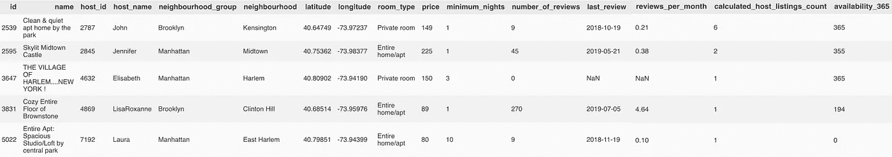

# 叶和茎。奇怪的名字，很酷的图表。

> 原文：<https://medium.com/analytics-vidhya/folium-and-choropleth-weird-names-cool-graph-4f9b99b99190?source=collection_archive---------34----------------------->

我们就做点酷的，然后收工吧。


曼哈顿哈德逊码头的船只

我是一名数据科学家。我是一名数据科学家，目前正在开发一个时间序列异常检测工具。我是一名数据科学家，也很怀念为 sh 摆弄数据集的日子！ts 和笑声。因此，我在 [Kaggle](https://www.kaggle.com/dgomonov/new-york-city-airbnb-open-data) 上找到了一个相对较小的数据集，其中包含(呵呵，机器学习双关语)2019 年以来纽约市(NYC)的一些 Airbnb 房源和指标。我完全打算花上几个小时来分析数据集，并提供非常详细的答案来回答 Kaggle 提出的问题。大约一个小时后，我没有抽出时间来回答一个问题……**相反，我做了一个看起来很酷的图表！**

对你们中的一些人来说，choropleth 图可能看起来有点“嗯”。但我个人认为这是一件很酷的事情。事实上，这太酷了，以至于我决定推迟对 Airbnb 数据集的分析，并创建一个教程，介绍我如何使用一个名为 Folium 的 Python 模块制作 choropleth 图。

我知道你在想什么。Choropleth 和 leav？什么鬼东西？尽管听起来像草类型的口袋妖怪，但它们实际上是 Python/数据科学相关的。Choropleth 是一种表示地理空间的图表，其中子区域以与一些总体统计数据成比例的方式进行着色，如旧金山湾区不同区域的着色，基于有多少人在玩《动物穿越:新视野》(请随意给我发送一些铁木家具)。Folium 是一个 Python 包，可以让您轻松地创建交互式地图，恰好具有内置的 choropleth 功能。

Kaggle 页面问道:“我们可以从不同的领域了解到什么？”。好吧，让我们看看纽约不同社区的 Airbnb 平均价格/住宿的图表能告诉我们什么！

闲聊结束了。我们开始吧，好吗？

# 数据

从这个 [Kaggle](https://www.kaggle.com/dgomonov/new-york-city-airbnb-open-data) 链接下载‘AB _ NYC _ 2019 . CSV’。

从 [BetaNYC 的](https://data.beta.nyc/dataset/pediacities-nyc-neighborhoods/resource/35dd04fb-81b3-479b-a074-a27a37888ce7)网站下载 GeoJSON 文件。

# 代码

让我们导入我们的包

```
import numpy as np
import pandas as pd
import folium
```

然后导入并查看我们的 csv 文件:

```
path = <path_to_csv_file>
raw_df = pd.read_csv(path)
raw_df.head()
```



我们想要的是一个给出每个邻域平均价格的数据框架，这可以使用“groupby”命令轻松实现:

```
choro_df = raw_df.copy()
choro_df = choro_df[['price','neighbourhood']].groupby('neighbourhood').mean().reset_index()
choro_df = choro_df.dropna(subset=['price'])
choro_df.rename(columns={'price':'avg_price'}, inplace=True)
choro_df.head()
```


完美。现在，在我们开始绘制图表之前，我们必须绑定“avg_price”列。每个箱子代表一种不同的颜色，这种颜色将会出现在 choropleth 上！此外，在这篇文章发表时(2020 年 4 月 24 日)，follow 最多只接受 6 个 bin 值。

```
bins = list(choro_df['avg_price'].quantile([0, 0.25, 0.50, 0.75, 1.0]))
```

很简单，对吧？现在我们可以开始编写教程的图形部分了。首先定义一个简单的函数来创建一个默认的叶子贴图对象:

```
def get_base_map(default_location, default_zoom_start=11):
    """
        default_location: [latitude, longitude]
    """
    base_map = folium.Map(width=800, 
                          height=600, 
                          location=default_location, 
                          control_scale=True, 
                          zoom_start=default_zoom_start)
    return base_map
```

我们需要为我们的地图计算一个默认的开始位置，所以让我们简单地计算数据集中提供给我们的 Airbnb 的所有坐标的质心:

```
avg_lat = raw_df['latitude'].mean()
avg_long = raw_df['longitude'].mean()
```

最后，我们可以创建默认的 Map 对象，并在其上添加一个 choropleth！

```
base_map = get_base_map(default_location=[avg_lat, avg_long])
folium.Choropleth(geo_data=<location_of_geoJSON_file>,
                 name='choropleth',
                 data=choro_df,
                 columns=['neighbourhood', 'avg_price'],
                 key_on='feature.properties.neighborhood',
                 fill_opacity=0.5,
                 fill_color='Spectral',
                 line_opacity=1,
                 bins=bins,
                 nan_fill_color='white',
                 nan_fill_opacity=0,
                 legend_name='Price/Night [$]').add_to(base_map)
base_map
```

除了“key_on”参数的之外，所有参数都很简单**。它接受 JavaScript 对象符号，该符号表示在关联我们的“choro_df”数据帧中的值和我们下载的 geoJSON 文件中包含的对象时要键入哪一列。由于我们希望将每个邻域的坐标链接到特定的价格，因此我们使用“feature . properties . neighborhood”对象作为我们的“key_on”值。**


当您在 Jupyter 笔记本中运行代码时，地图实际上是交互式的！

作为一个完美主义者，我立刻意识到这个图例的色标并没有以一种非常用户友好的方式显示出来。我还没有完全弄清楚如何改变图例的比例，但是如果你在评论里有，请让我知道(拜托…真是要命…)。

但是，就是这样！很简单吧？

请在评论部分随意提及其他存在于普通 EDA 领域之外的很酷的图表，如箱线图和直方图…我很乐意听到您在剖析数据集时使用的那些图表！

直到下一次，和平！