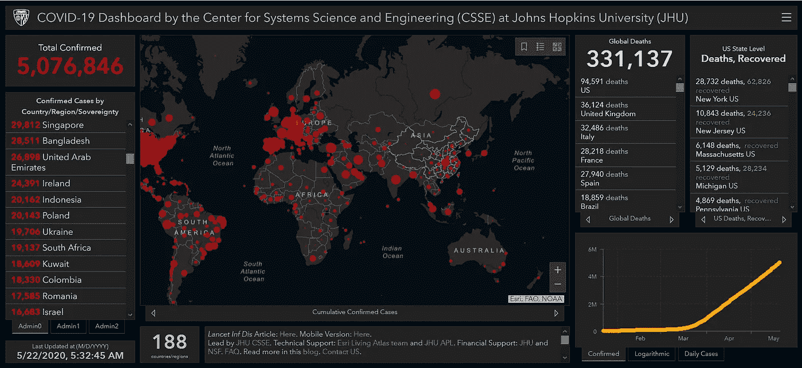
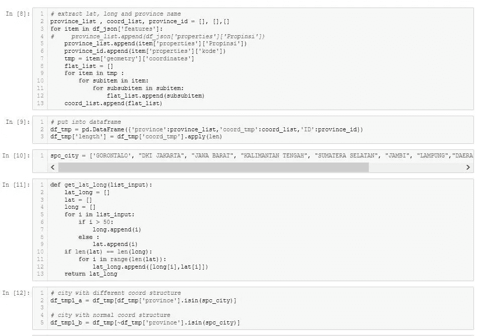

# follow Python 交互式地图

> 原文：<https://medium.com/analytics-vidhya/folium-python-interactive-maps-82e854337902?source=collection_archive---------11----------------------->

自从电晕爆发快两个月了，所以我决定学点新东西。

这个故事背后的灵感来自 arcgis 制作的 corona dashboard，我想知道 python 是否也能做到这一点。

[https://gisanddata . maps . ArcGIS . com/apps/ops dashboard/index . html #/BDA 7594740 FD 40299423467 b48e 9 ECF 6](https://gisanddata.maps.arcgis.com/apps/opsdashboard/index.html#/bda7594740fd40299423467b48e9ecf6)

是的，我发现了作为交互式图书馆地图的叶子。

 [## 快速入门-0 . 11 . 0 文档

### 有许多标记类型，从带有弹出窗口和工具提示的简单样式位置标记开始。这里建有…

python-visualization.github.io](https://python-visualization.github.io/folium/quickstart.html) 

它可以做很多事情，例如创建针点，改变彩色地图，设置针点周围的半径，加载 topojson 文件等。

因此，在这种情况下，我将向您展示如何使用 leav 创建简单的 corona *仪表板。印度尼西亚的案例研究。

*仅地图部分

配料(数据):

1.  [topojson](https://github.com/topojson/topojson/wiki) 文件。
2.  电晕统计。

[topojson](https://github.com/topojson/topojson/wiki) 文件或形状文件是包含一个区域的边界(纬度或经度)的文件。

逐步地

1.  加载拓扑结构文件和电晕统计文件

加载 topojson 和 corona 文件

topojson 文件应该有 corona 文件的密钥。在这种情况下，两者都有省 id。

**topojson 不是最新更新，缺几个省。

该图显示 covid19 的阳性患者。红色区域比橙色区域有更多的 covid19 阳性患者。我把 covid19 的数字是对数，所以它使颜色范围更容易。

然而，颜色代码是不够的，有些人想看到确切的数字。因此，您需要从 topojson 文件中提取经度和纬度。

2.从 topojson 文件中提取纬度和经度。

你需要把手弄脏。

提取经度和纬度

一个省有多个经度和纬度，因此为了简单起见，我使用平均值，并结合 corona 数据来获得 covid19 阳性患者的数量。

最后的结果呢

现在你可以点击针点查看某省的总阳性 covid19。

完整代码[https://github.com/adamaulia/folium_corona](https://github.com/adamaulia/folium_corona)