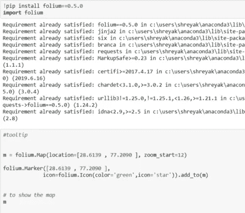
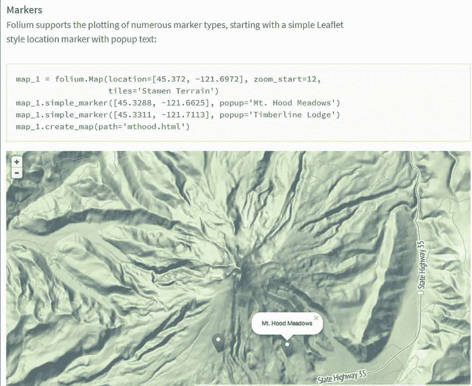
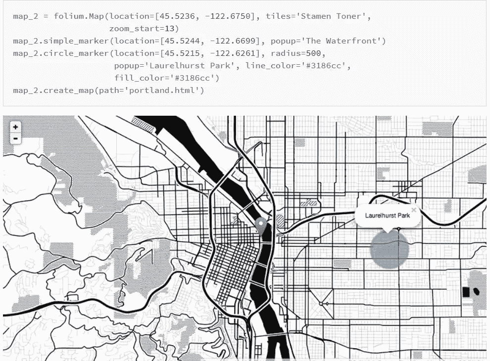

# 用于在地图中绘制位置的 Python 库

> 原文：<https://medium.com/analytics-vidhya/folium-python-library-for-plotting-locations-in-map-8ddc95a3e6fd?source=collection_archive---------12----------------------->

在这篇博客中，我们将讨论一下 lyum Python 库。

follow 构建在 Python 生态系统的数据优势和 fleet . js 库的映射优势之上。在 Python 中处理您的数据，然后通过 leav 在活页地图上将其可视化

follow 使数据可视化变得有趣，并且是在地图上绘制和标记经度和纬度数据的简单方法。我们可以使用经度和纬度点，以便在地图上标记位置，甚至找到位置。

**安装和导入库，并使用经度和纬度点在地图上绘制位置。**

**输出**(这里我用了新德里的经度和纬度点)

我分享一些截图是为了在你的系统和语法中安装 follow 库以便于理解

为了让你更清楚，我又分享了 2 张截图。

我希望你喜欢这个博客。请随意分享您的想法，您可以通过以下方式与我联系

LinkedIn—【https://www.linkedin.com/in/shreyak007/
Github—[https://github.com/Shreyakkk](https://github.com/Shreyakkk)
insta gram—[https://www.instagram.com/shreyakkk/](https://www.instagram.com/shreyakkk/)
Snapchat—shreyak 001
脸书—[https://www.facebook.com/007shreyak](https://www.facebook.com/007shreyak)

谢谢你…