# 遵循这些简单的步骤来有效地解决 ML 回归问题。

> 原文：<https://medium.com/analytics-vidhya/follow-these-simple-steps-to-solve-ml-regression-problems-effectively-5b92250773ab?source=collection_archive---------11----------------------->

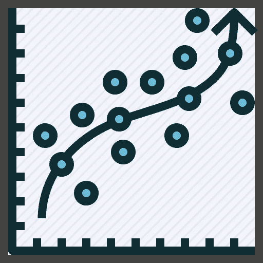

来源:谷歌

分类问题很简单，因为我们可以依靠类的概率来分类。但是，当涉及到回归时，我们必须预测精确的值。当维数增加时，这个问题变得更加明显。为了预测准确的值，我们需要选择正确的属性和预测值。

因此，拥有解决这些问题的标准方法变得非常方便。在这篇文章中，我将解释我解决回归问题的标准方法。

我将使用[ka ggle 房价](https://www.kaggle.com/c/house-prices-advanced-regression-techniques/data?select=train.csv)数据集。这是[一个完整项目的链接](https://github.com/narsym/House-Price-Prediction-Advanced-Regression-Techniques)，我建议你下载它并按照你的方式阅读这篇文章。

当使用 pandas 读取时，数据集如下所示。

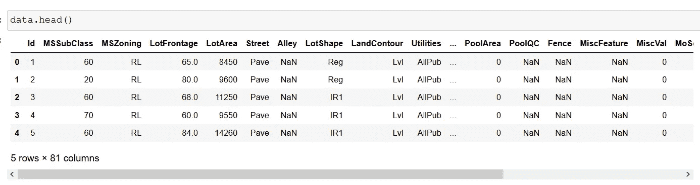

加载的数据集

正如我们所观察到的，有空值、多维度、分类属性。因此，在应用机器学习算法之前，需要清理数据、降低维度并对分类变量进行编码。

我们可以通过遵循一系列步骤来解决所有这些问题。

**1。数据清理。**

在这一步中，目标是消除空值。我们可以通过多种方式做到这一点，用平均值填充缺失值，或者删除缺失值的行，或者删除缺失值的列。

为了简单起见，我删除了所有缺少值的列。

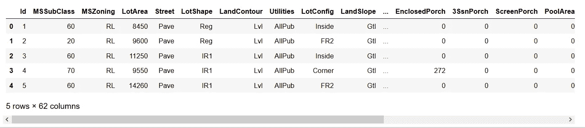

清理的数据

**2。分离定性和定量属性。**

这一步有助于简化特征选择。数字属性很容易输入到特征选择算法中，但是当涉及到分类属性时，我们需要首先对它们进行编码，然后在这些编码的属性上选择特征。那么，当我们可以分别对它们进行手术时，为什么要一起处理呢？

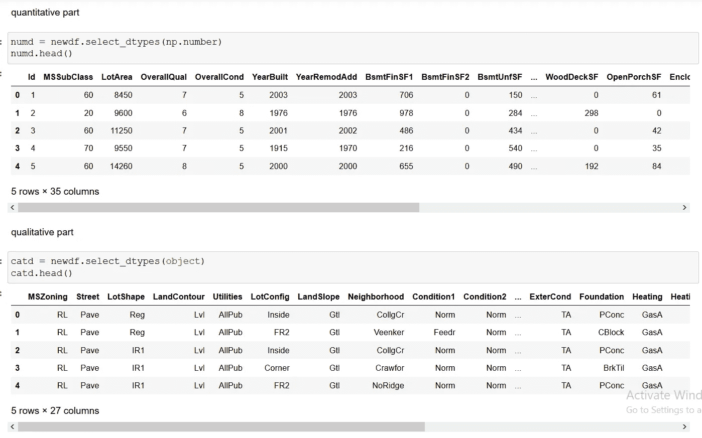

分离定性和定量属性

**3。数量属性的特征选择。**

我已经使用 ExtraTreesRegressor 进行了特征选择，但是您可以从 sklearn.feature_selection 类中选择任何模型。Chi2，SelectKBest 模型在特性选择方面非常有效，如果您使用笔记本阅读本文，可以尝试使用它们。

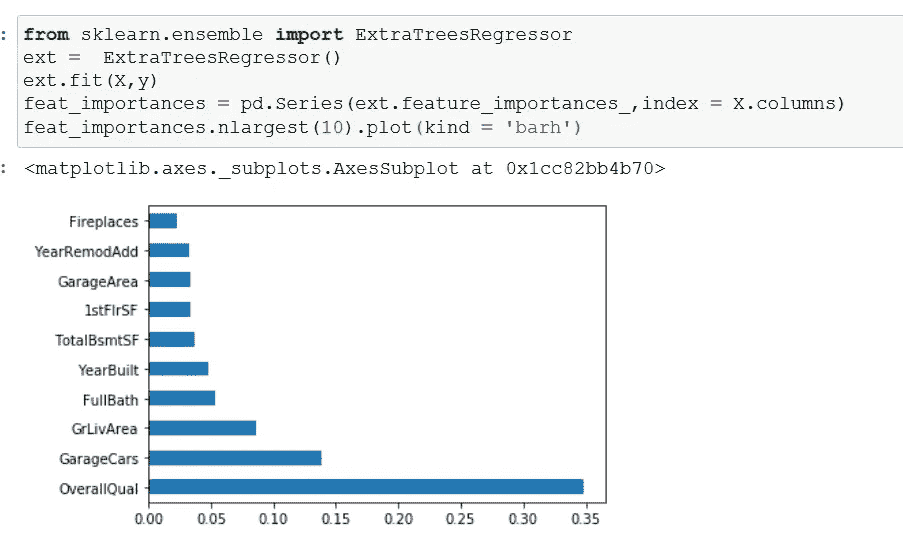

定性属性中的 10 大特征

从图中可以看出，我们可以使用 OverallQual、GarageCars、GrLivArea 进行预测。所以，我给他们存储了一个新的数据帧。

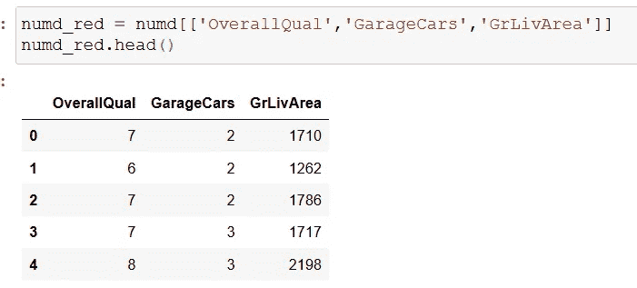

有用的数量属性

**4。对定性属性进行编码并执行特征选择。**

在这里对定性属性进行编码，我使用了 sklearn.preprocessing 中可用的 OrdinalEncoder，如果你想使用另一个编码器，你可以使用 LabelEncoder，OneHotEncoder，BinaryEncoder 等。

对于特征选择，我使用了基于树的 RandomForestClassifier。

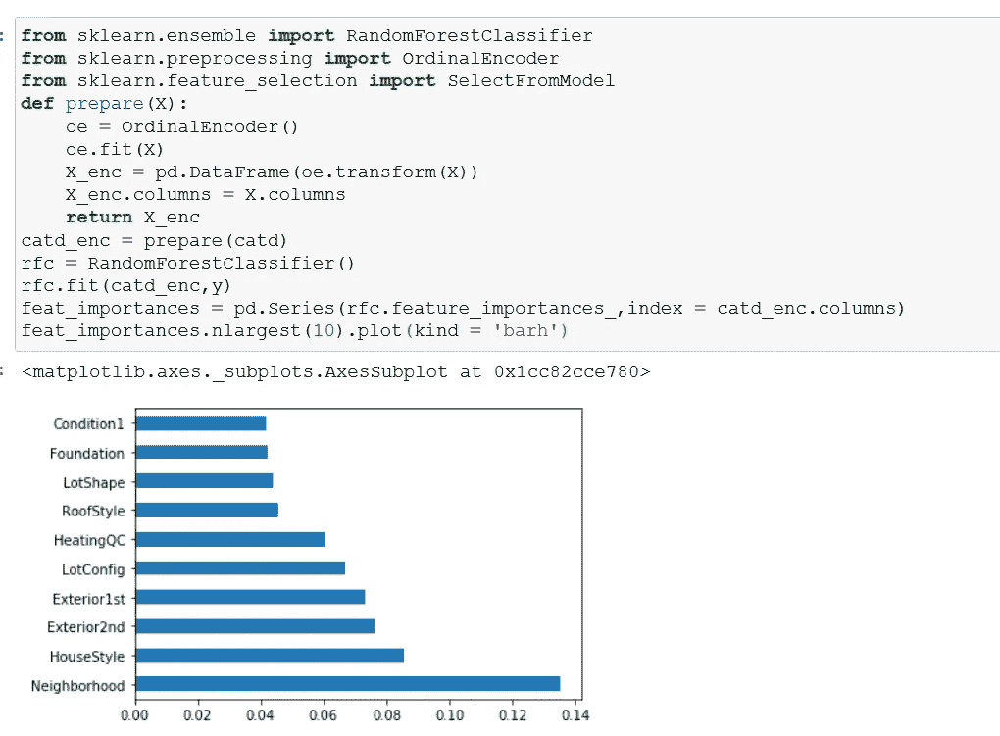

有用的定性属性

从柱状图来看，我们可以使用邻居、房屋风格、外部第二。但是为了方便起见，我们只使用邻居和房子风格。

**5。绘制定量属性的相关矩阵，并删除高度相关的属性。**

在这里，您可以执行一些探索性的数据分析。这是一个简单的散点图，用于检查更大的居住面积和房屋风格销售价格之间的关系。

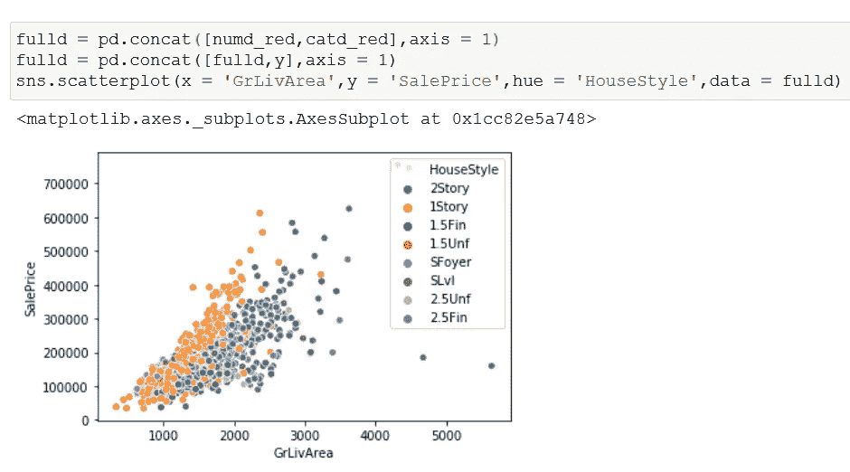

散点图

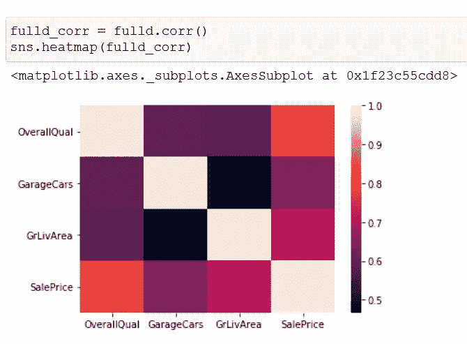

相关矩阵

我们可以看到没有属性是高度相关的。所以不需要丢弃任何属性。

**即使在这一步之后，如果你得到的是高维数据，你也可以使用降维技术，比如主成分分析。**这里我们有 6 个属性，所以我们跳过主成分分析。

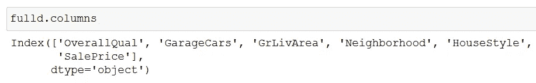

**6。编码分类属性。**

这是将分类数据输入机器学习算法的预处理步骤。

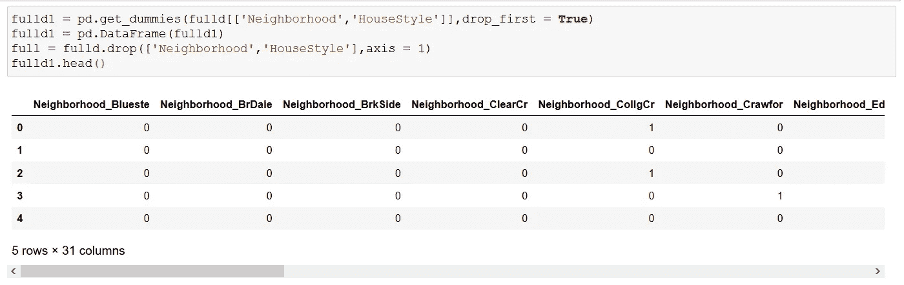

编码分类属性

我使用了虚拟变量，因为这种类型的编码比顺序编码和标签编码等编码类型更有效。

**7。通过连接我们的定性和定量属性创建新的数据框架。**

在此步骤中，将所有定性和定量属性连接成一个数据框。这个数据帧被输入到机器学习算法中。

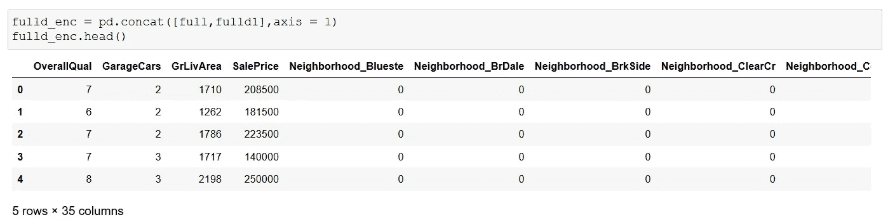

准备接受训练

现在，我们的数据可以输入到机器学习算法中了。但是首先让我们分成训练集和测试集。

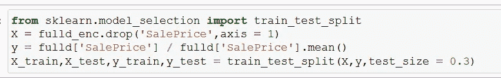

训练、测试、分割

**8。应用机器学习算法。**

我选择了线性支持向量回归机。我选择了这种算法，因为它比其他支持向量算法更快，并且需要调整的参数更少。我对它做了一些调整，发现对于这些参数，它给出了最好的分数。

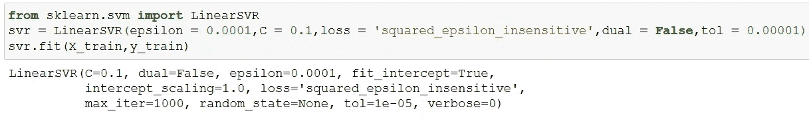

支持向量机

我们的测试有 80%的准确率。

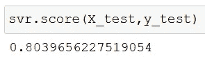

准确(性)

80%的准确率是非常好的，即使我们已经跳过了许多步骤，如填充空值，操作不同的算法等。让我们绘制一个直方图，看看我们的预测是如何随着测试集而变化的。

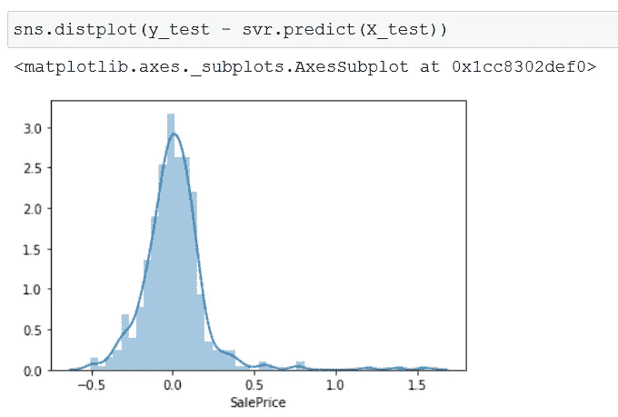

检查差异的直方图

我们可以看到我们的预测非常接近原始值。让我们看看均方误差。

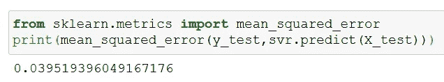

均方误差

我们得到 0.039 非常好的 MSE。

因此，按照这些简单的步骤，我们能够获得 80%的准确度和 0.039 MSE。所以我们可以看到，这些步骤，如果按照顺序来做，是相当有效的。

如果你有什么想法，请在评论中告诉我。

希望这篇文章不要太长太无聊。

感谢阅读。