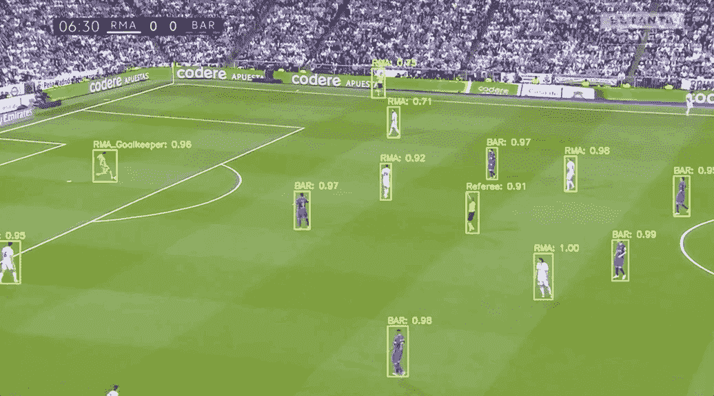
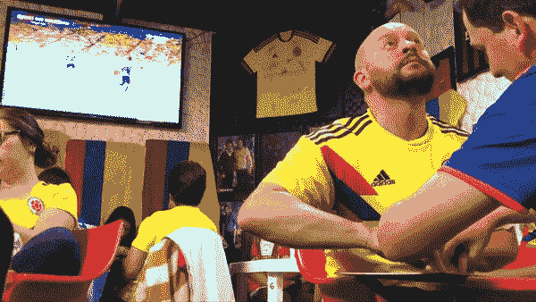
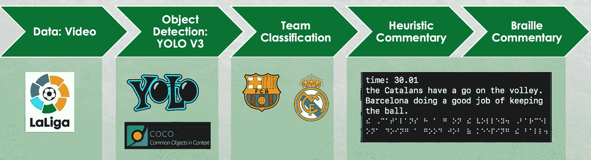
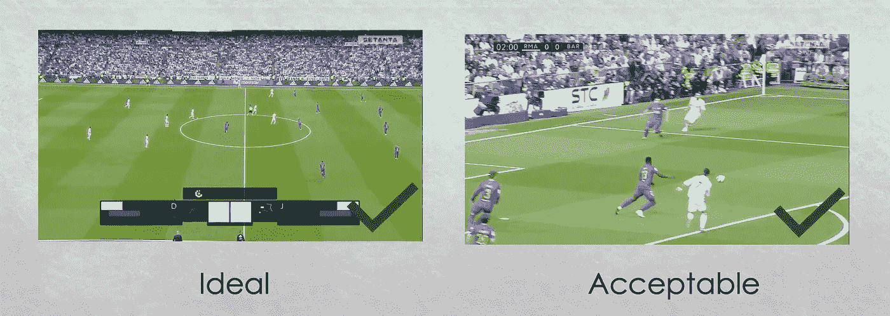
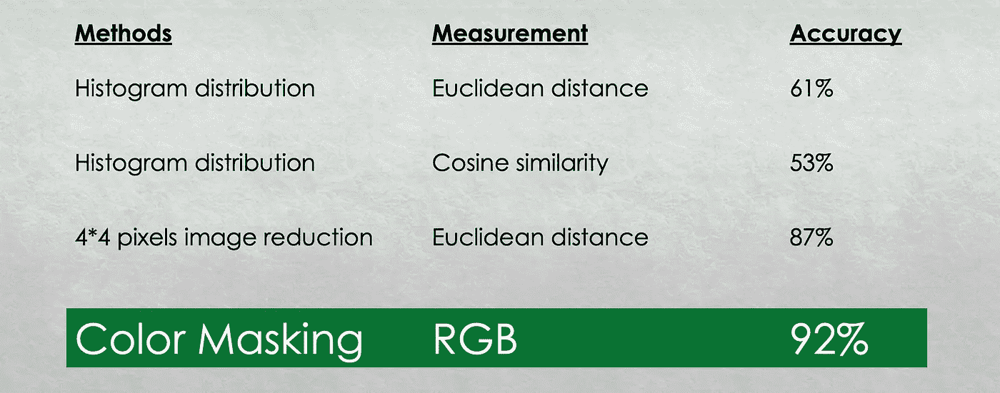
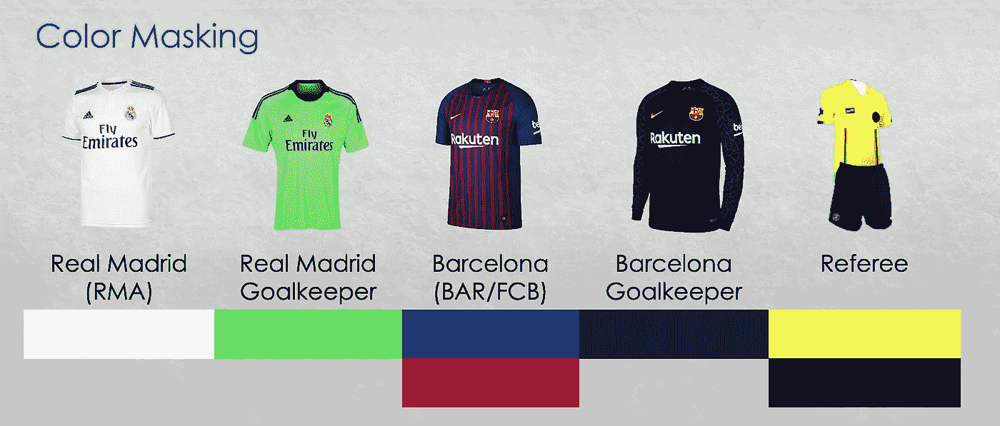
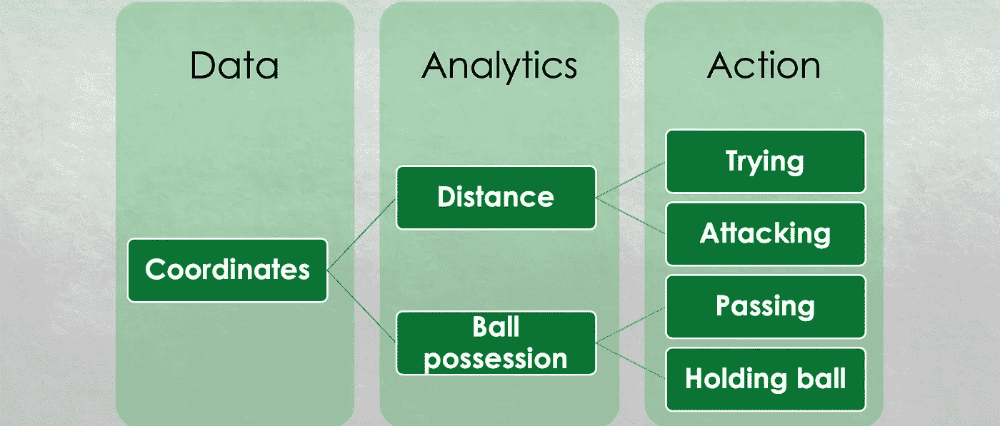
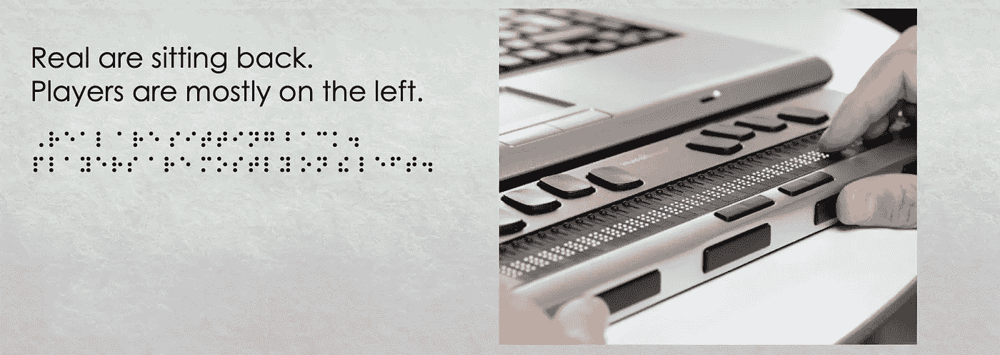
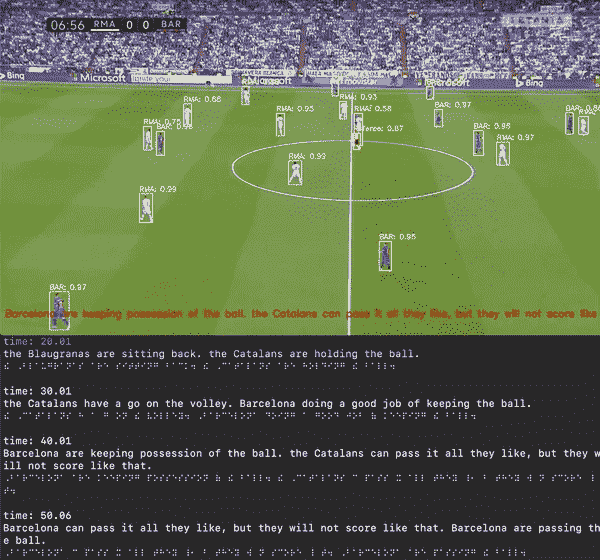

# 视障人士足球解说

> 原文：<https://medium.com/analytics-vidhya/football-commentaries-for-the-visually-impaired-4995dff653b0?source=collection_archive---------12----------------------->

根据世界卫生组织的数据，全球有 2.17 亿人患有中度至重度视力障碍，另有 3600 万人失明，这意味着这些人甚至无法享受我们认为理所当然的小事，如在没有他人帮助的情况下在笔记本电脑上观看足球比赛。

在这个视频中，哥伦比亚有人在一个小足球板上为他的盲人朋友创造了一种交流足球比赛情况的方法。但是，这只是一个人，那么多其他人呢？我们如何扩大帮助范围？你可能认为翻译传统评论。然而，这些评论往往集中在球员身上。我想用深度学习和计算机视觉来解释一场比赛中的大致情况。这是我在梅蒂斯训练营的最后一个项目。让我们从方法论开始。

# 方法学

首先，我获得了一个足球比赛的视频。这里我用一场 2017 年皇马对巴萨的足球比赛。然后我需要检测我们感兴趣的物体。我使用最先进的 YOLO，你只看一次，第 3 版深度学习模型，它是在微软 COCO 数据集上训练的。该数据集包含日常生活中的 80 件日常物品。检测后，我们需要找到一种方法来分类这个人属于哪个团队。然后，提取数据生成启发式评论，并将其翻译成盲文。

我是怎么做到的？我主要用这三个工具。

# 图像预处理和目标检测

解释完方法后，让我们来看看具体的操作。我们知道，视频是由图像或帧组成的。就我的目的而言，我只对描绘至少五到六名球员比赛概况的画面感兴趣，比如这两个。现在我知道我要用什么框架了。

我需要检测我感兴趣的对象。在一场足球比赛中，最突出的利益群体是球员和足球。使用 YOLO 版本 3 和 40%的置信度阈值，该模型可以检测场上的大多数球员。

# 团队球员分类

现在让我们看得更近一些。我们怎么知道那个人属于哪个团队？我测试了四种方法。前两种使用直方图分布，用欧氏距离或余弦相似度来度量相似度，但结果都不理想。所以我试着把每张图片缩小到 4x 4 像素大小，然后用欧几里德距离进行分类。结果还行。但是，我们还能再改进吗？然后我使用颜色掩蔽，这产生了一个更好的结果，92%的准确性。

分享更多关于颜色遮罩的信息。有五组感兴趣的人，球队，他们各自的守门员和裁判。使用样本中的 RGB 颜色，我可以计算出这个人属于哪个组。

# 评论生成

最后，我可以生成一些数据。利用这些数据，我计算了更多的分析，比如球队之间的距离和控球率。然后我推断比赛的情况，包括哪个队在进攻，哪个队在持球。基于动作生成英语评论。

一旦我有了评论，我就可以按照这些步骤处理它们，并把它们翻译成盲文。视力受损的用户可以使用可刷新的盲文显示器来感受盲文。

# 最终演示

这是最终产品的演示。正如我们所看到的，随着比赛的进行，球队球员和足球被识别出来，评论也随之产生。我选择在终端上显示盲文注释以及英语和注释时间。

# 需要改进的地方

*   有了更强大的 GPU，我们可以实现实时评论。
*   此外，我可以训练模型检测更多的项目，如大门，以确定目标。
*   最后但并非最不重要的是，如果我可以使用一个固定的摄像机来捕捉大部分足球场，我就可以生成更多的分析来获得更好的评论。

一旦我有了评论，我就可以按照这些步骤处理它们，并把它们翻译成盲文。视力受损的用户可以使用可刷新的盲文显示器来感受盲文。