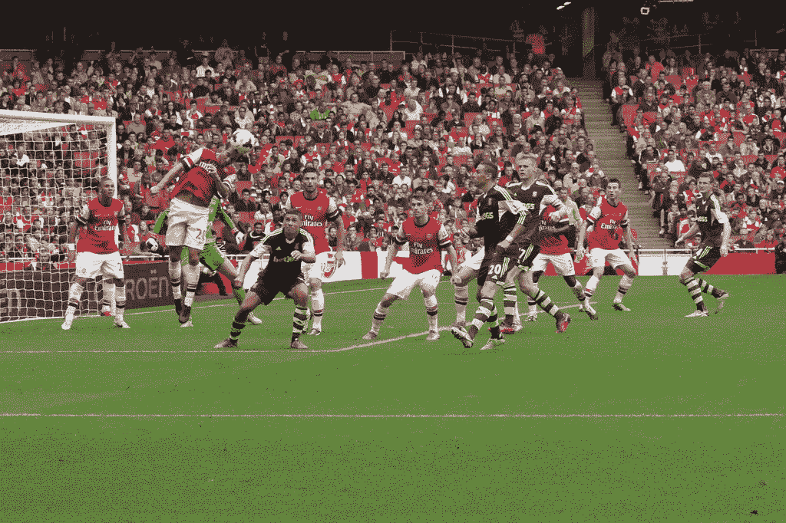
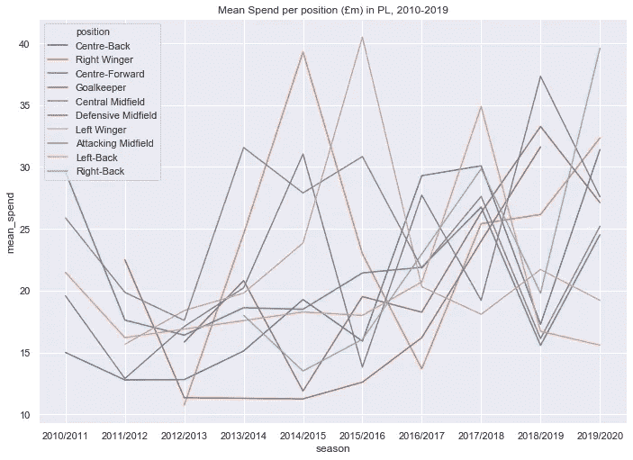
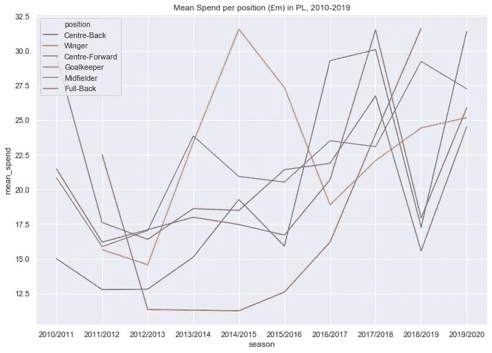
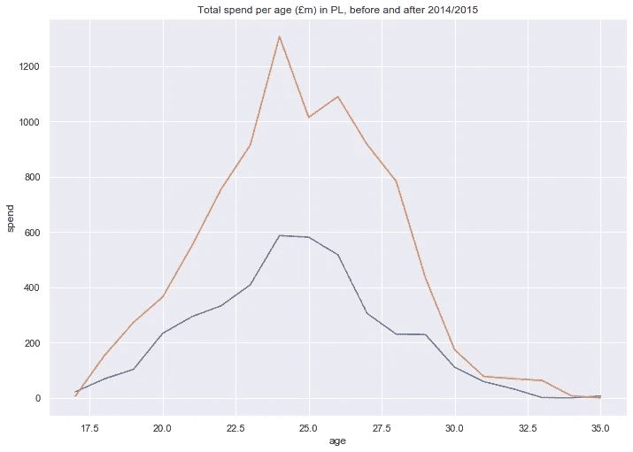
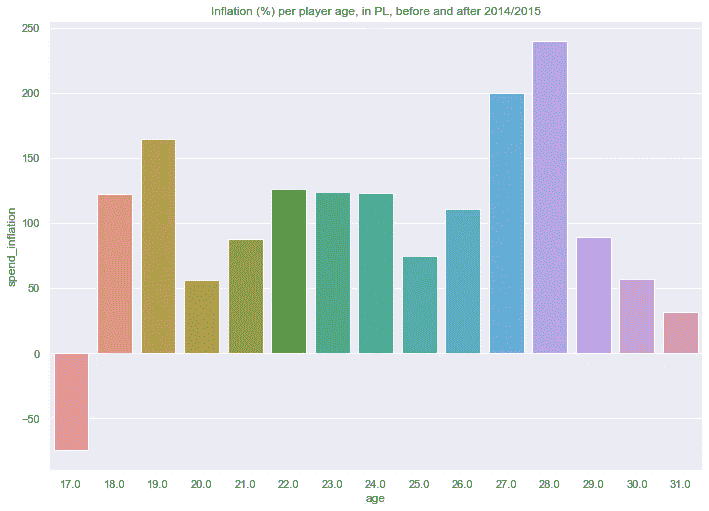
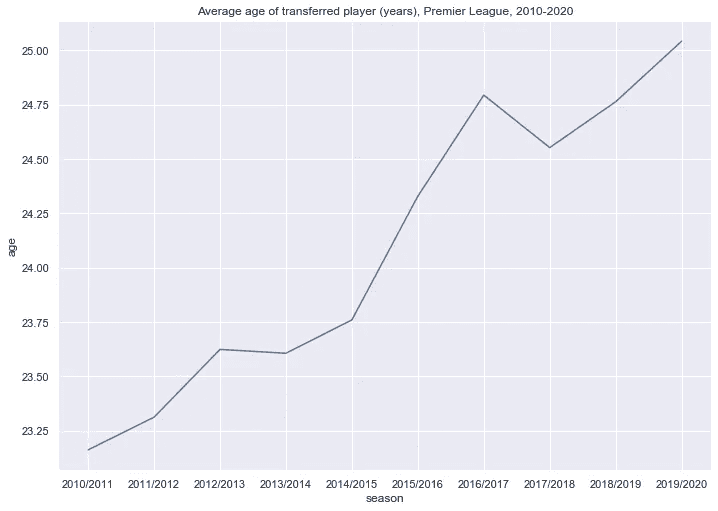
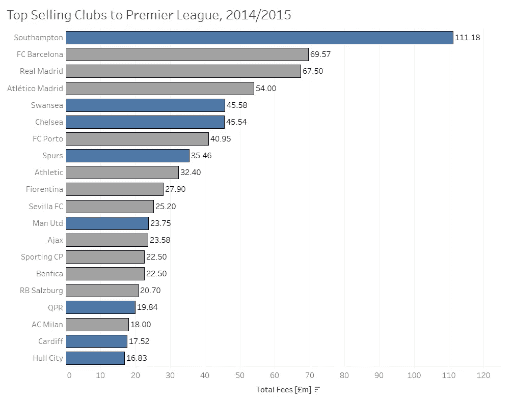
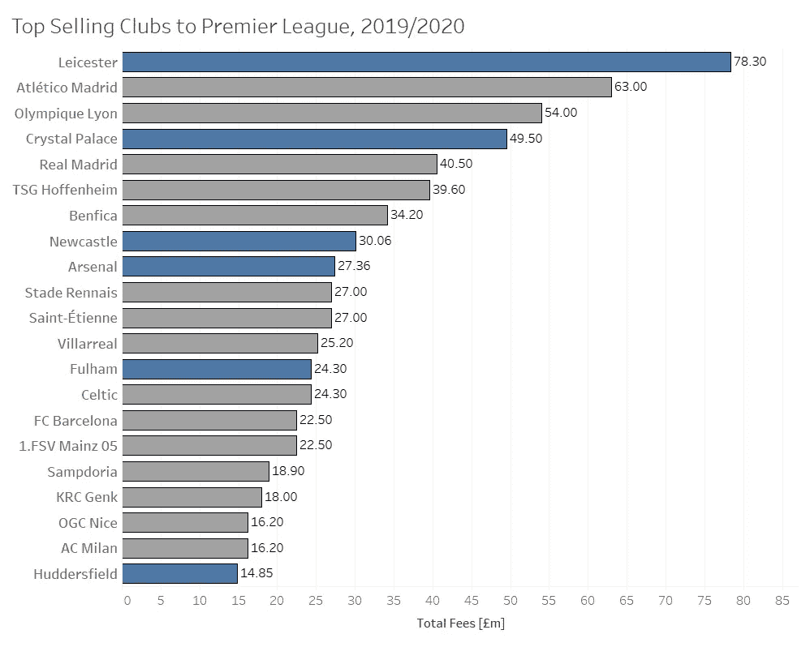

# #足球数据科学:分析英超联赛支出

> 原文：<https://medium.com/analytics-vidhya/footballdatascience-analyzing-premier-league-spending-565b19f01f58?source=collection_archive---------17----------------------->

马蒂厄·弗拉米尼，英超联赛中最精明的商人之一(根据福布斯报道，目前身价 140 亿美元)

## 介绍

许多人试图调查过去英超联赛的支出，尤其是不同俱乐部的球迷试图攻击竞争对手最近的支出，或者只是为自己辩护。

然而，这篇文章将尝试使用数据分析来确定整个英超联赛*的关键支出趋势。*由于英超联赛是世界上收视率最高的联赛之一，英超俱乐部的电视收入使得他们的支出一直超过欧洲所有其他足球联赛。因此，在许多方面，英超联赛的消费习惯可以被视为当今足球市场中观察到的更广泛消费趋势的症状和趋势设定。

我使用了从[转会市场](https://www.transfermarkt.co.uk/)获得的数据，这些数据是在[公共 GitHub 知识库](https://github.com/ewenme/transfers)中找到的，目的是检查和分析英超联赛的转会支出。除非另有说明，所有转让价值均通过 Transfermarkt 获得。我使用 Python 来处理和可视化数据(熊猫，海牛)，以及可视化消费俱乐部的 Tableau。相关的 Jupyter 笔记本可以在我的 [Github](https://github.com/clementbriens/FootballDataScience--Analyzing-Premier-League-Spending) 上找到。

## 防守队员，防守队员，防守队员

随着时间的推移，哪些职位是 PL 俱乐部最看重的？下面的图表试图将每个职位的平均花费(m)的演变可视化。2014/2015 和 2015/2016 赛季在边锋上花费巨大(左右边锋平均近 4000 万)，世界级的边锋如迪马利亚、马塔、阿莱克西斯·桑切斯、马夏尔和帕耶特都转会到了 PL 俱乐部。攻击球员以吸引更高的转会费而闻名，因为俱乐部倾向于将进球球员的价值远远高于中场球员或后卫。根据 Transfermarkt 的数据，10 次创世界纪录的转会中有 9 次确实是边锋或前锋(最后一次是保罗·博格巴，一名进攻型中场)。

然而，英超俱乐部最近的签约显示了他们在支出策略上的明显变化。俱乐部已经迅速增加了他们在防守球员上的支出，最近购买中后卫维吉尔·范迪克(7600 万英镑)和哈里·马奎尔(7800 万英镑)，曼城购买的大量后卫(基尔·沃克(4700 万英镑)，达尼洛(3300 万英镑)，若奥·坎塞洛(5800 万英镑)和本杰明·门迪(5200 万英镑)，以及诸如阿里森(5600 万英镑)，帕克(7200 万英镑)和埃德松(3500 万英镑)等守门员就是证明。

像利物浦的 Trent Alexander-Arnold 和最近拜仁慕尼黑的 Alphonso Davies 这样的球员的出现，他们都出现在最近公布的 CIES 足球观察价值排行榜的前 10 名中，证明了对完整后卫的需求增加，因为他们成为现代比赛的重要组成部分。除了技术和定位球能力之外，这两名球员在进攻和防守方面都很有能力。

阿方索·戴维斯在最近的一批年轻后卫中表现出巨大的潜力

有些人可能会感到惊讶，像特伦特·亚力山大-阿诺德(€1.711 亿英镑)这样的边后卫比马库斯·拉什福德(€1.523 亿英镑)、默罕默德·萨拉赫(€1.449 亿英镑)和萨迪奥·马内(€1.392 亿英镑)这样的明星攻击球员更有价值。然而，在辩护人上的 PL 支出的长期趋势可能表明并非如此，如下图所示。

## 寻找下一个哈兰

PL 俱乐部在什么类型的球员上花费？

职业联赛俱乐部更愿意在进入巅峰时期的球员(据说大约 25-27 岁)、更有经验的联赛老将还是年轻人身上投入巨资？

Erling Haaland，这位 19 岁的挪威天才最近转会到多特蒙德

普遍的看法表明，俱乐部正在转向后者，因为显示出巨大潜力的年轻球员越来越多地在欧洲各地被高价出售(如 Mbappe，20 岁时以 1.3 亿英镑出售，或 Joao Felix，19 岁时以 1.13 亿英镑出售)。**然而，数据趋势表明，情况未必如此。**下图显示了 2010 年至 2014 年(蓝色)和 2015 年至 2020 年(橙色)的支出差异。

我们从这些可视化数据中获得的第一个洞见是，这两个时期之间的通胀率为 116.9%，支出从 41.2 亿英镑增长到 89.5 亿英镑，这可以用英超联赛电视收入的稳步增长来解释。

然而，我们可以看到不同年龄的通货膨胀是不同的——通货膨胀似乎在 24 岁和 28 岁时最高，在 17 岁和 35 岁时最低。

下图显示了 2010 年至 2014 年期间和 2015 年至 2020 年期间每个年龄的每个球员的支出通胀。32 岁及以上的通胀水平被排除在外，因为 2010-2014 年的通胀水平接近于零，因此产生了极高的通胀水平，从而扭曲了可视化。

尽管我们最初的本能，似乎最高的通货膨胀实际上发生在 27 岁和 28 岁的球员身上。这表明俱乐部不一定在年轻人身上花费更多，因为主力球员似乎比年轻球员要价更高。尽管如此，对于 18 岁和 19 岁的球员以及 22 岁到 24 岁之间的球员来说，似乎也有显著和持续的通货膨胀。这是因为，虽然 18 岁和 19 岁的球员还很年轻，可以通过租借来发展(正如一些 PL 球队的商业模式)，但 22 岁至 24 岁的球员可能被认为已经足够成熟，可以对一线队产生直接影响，因此可以获得更高的费用，同时比年长的球员更好的投资。

威尔弗雷德·恩迪迪(莱斯特，22 岁)是这种招聘策略的一个很好的例子，他在 2017 年以 1500 万英镑的价格从 Genk 来到这里

然而，数据中出现了另一种模式，为这种对年轻球员的新投资提供了细微差别。尽管俱乐部现在在年轻球员身上花费了大量资金，但在 2010/2011 年和 2019/2020 年之间，加入 PL 俱乐部的球员的平均年龄已经从 23 岁上升到 25 岁以上。

这表明俱乐部不一定要在更多的年轻球员身上花钱，而是选择投资于高评级、高质量的年轻人，他们将能够很快融入一线队计划，就像亚伦·万-比斯卡和威尔弗雷德·恩迪迪这样的成功签约所证明的那样。在年轻球员上的花费也可能受到涉及国际青年的高调转会的影响，例如科帕·阿里萨巴拉加 23 岁以 7200 万英镑转会切尔西，或者克里斯蒂安·普利西奇 20 岁以 5800 万英镑转会同一家俱乐部。

## 本土人才？

当 PL 俱乐部寻求购买球员时，从哪里获得球员？哪些俱乐部和联盟从 PL 资金中获利最多？

询问人才供应链是理解英超联赛支出模式的一个重要方面，因为俱乐部将他们的球探和支出转移到英格兰金字塔之外的球员。以下两个图表显示了 2014/2015 和 2019/2020 赛季向英超联赛出售球员的前 20 名出售俱乐部。

在 2014/2015 赛季销售额排名前 20 的俱乐部中，有 8 家来自英超和英冠，对英超俱乐部的销售额总计为 3.157 亿英镑。除了英格兰俱乐部，西班牙俱乐部也很重要，5 家西班牙俱乐部(包括“三巨头”)的销售额总计为 2.4867 亿英镑。我们可以看到南安普顿开发和出售球员以获取利润的战略的成功，销售额包括卢克·肖(3375 万英镑)、亚当·拉拉纳(2790 万英镑)、德扬·洛夫伦(2790 万英镑)

在 2019/2020 赛季销售额排名前 20 的俱乐部中，只有 6 家来自英格兰联赛，销售额总计仅为 2.2437 亿英镑，这标志着 5 年来国内转会减少了***28.93%****。法国俱乐部的特点很明显，前 20 名中有 4 家俱乐部，总销售额为 1.242 亿英镑。莱斯特从英国俱乐部中获利最多，哈里·马奎尔以 7830 万英镑的价格卖给了曼联*

比较这两个排名表明，他们在投资策略上与 PL 俱乐部有着明显的不同，因为他们越来越多地关注外国人才，而不是已经在英格兰联赛中踢球的球员。这可能是因为英格兰球员的溢价增加，以及南安普顿等球队越来越不愿意向国内竞争对手出售球员，而是选择留住人才以提高他们的联赛地位。

## 预言

因此，我们能够证明过去十年中损益支出的关键变化。任何试图对此类数据进行探索性分析的文章，如果没有提供基于这种见解的预测，都是不完整的，因此，本结论的目的是基于我观察到的数据提供一些预测。让我们回顾一下我们迄今为止的见解:

*   随着球队寻求购买精英后卫来帮助他们使用高压战术，后卫的价值正在迅速增加
*   **尽管我们有原始的本能，球员价格的通货膨胀对 27 岁或 28 岁的球员来说比任何其他年龄组的球员都显著上升**，这提供了一个更加微妙的 PL 俱乐部转会策略的形象。
*   这些年来，转会的平均年龄稳步上升，这表明俱乐部越来越不愿意冒险。这表明俱乐部除了购买对一线队有直接影响的“主力”球员之外，更愿意在高质量的青年球员上投资
*   虽然职业联赛俱乐部更喜欢投资职业联赛证明有效的球员，但是**他们现在更喜欢投资海外，以获得更低的转会费**并避免英国的“溢价”税和俱乐部不愿出售给国内竞争对手
*   **随着法甲继续以较低的成本培养具有巨大潜力的年轻球员，法国俱乐部已经取代了西班牙俱乐部为 PL 提供人才**

利用这些见解，我将制定以下预测:

*   精英后卫的价格将继续上涨，因为球队正面临着对精英后卫越来越激烈的竞争，这使得他们能够发展现代战术
*   后卫将会是一个前所未有投资的特殊领域，因为进攻和防守的结合对于寻求进攻足球的俱乐部来说已经变得非常有价值
*   当前的新冠肺炎疫情及其相关的经济不确定性将意味着俱乐部在赌那些他们不能迅速融入一线队的年轻人时会更加不愿意冒险，并且会更喜欢购买那些能够迅速提高他们联赛地位的“一流”球员，即使这不是一项经济投资
*   尽管俱乐部增加了对外国球员的投资，但由于英国退出欧盟- **这可能会导致 2014/2015 赛季对国内球员的支出水平回落**，PL 俱乐部在签下欧洲人才时可能会遇到额外的障碍

***感谢您的阅读！如果你想看更多的足球分析文章，就赶紧订阅上*** [***中***](/@clmentbriens) ***吧，还有别忘了查看我在***[***Github***](https://github.com/clementbriens)***上的代码。***