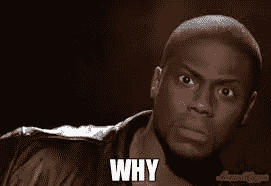
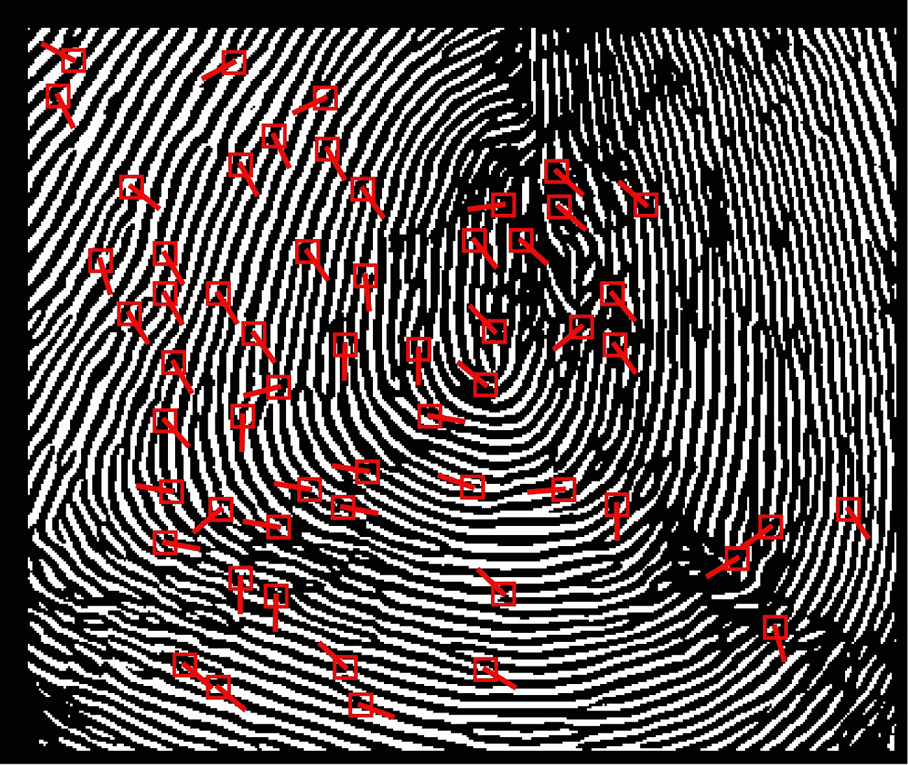
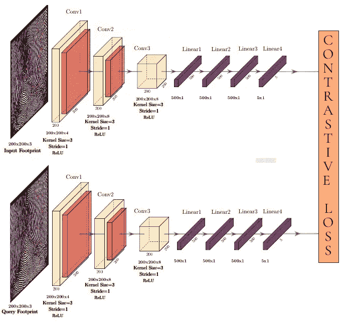

# 使用 PyTorch 的一次性足迹识别

> 原文：<https://medium.com/analytics-vidhya/footprint-recognition-using-one-shot-learning-using-pytorch-ed52062f75af?source=collection_archive---------20----------------------->

所以到目前为止，我们已经看到了使用手动脚本和使用艺术方法的指纹识别技术的进步。我们可以将足迹识别技术视为用于生物认证的新兴生物识别技术。

但是为什么是脚印呢？

因为足迹图像优于任何其他生物识别系统有几个原因

一些原因是:

*   与指纹识别相比，它具有更好的卫生性。
*   可以用来区分新生婴儿。
*   由于足迹欺骗的可能性较小，我们可以在高度安全的区域将它们用作生物特征参数。

增强型足迹图像

现在对于足迹识别，我们使用细节作为基本参数来匹配两个足迹的特征。因此，为了提取细节特征，我们使用细节网络来提取足迹图像中的细节点。

具有细节点的足迹图像

现在我们可以继续我们的主模型架构了。因此，我们的架构是基于连体神经网络，其中两个输入图像通过相同的 CNN 网络，并共享相同的权重。

所以基本上我们遵循这个架构:

模型架构

我们只是将图像通过卷积层和线性层，并以大小为 5×1 的特征向量的形式获得它。

这种神经网络结构的特点是损失函数，即对比损失函数。

对比损失函数基本上使用两个特征向量之间的欧几里德距离，并相应地返回损失值，最后我们反向传播该损失值以相应地更新权重。通过这种方法，我们能够找到两幅图像之间的相似之处。

并且使用这一点，我们训练我们的网络，并且因此找到任意两个图像之间的相似性，并且因此我们找到两个输入图像是属于相同的对象还是不同的对象。

最后，我们检查不同图像的准确性，为此，我们将欧几里德距离阈值设置为 0.10。欧几里德距离表示两个图像之间的不相似性，如果不相似性小于 0.10，则结果确定两个足迹图像属于同一个人，否则两个足迹图像属于不同的人。

通过使用这种方法，实现了 57.80%的准确度。

干杯！

参考资料:

1.  [https://www4 . comp . polyu . edu . hk/~ csajaykr/my home/papers/TIFS _ 2019 . pdf](https://www4.comp.polyu.edu.hk/~csajaykr/myhome/papers/TIFS_2019.pdf)
2.  https://github.com/luannd/MinutiaeNet
3.  【https://www.cs.cmu.edu/~rsalakhu/papers/oneshot1.pdf 
4.  [https://becoming human . ai/siamese-networks-algorithm-applications-and-py torch-implementation-4 FFA 3304 c 18？gi=49bd9e442475](https://becominghuman.ai/siamese-networks-algorithm-applications-and-pytorch-implementation-4ffa3304c18?gi=49bd9e442475)